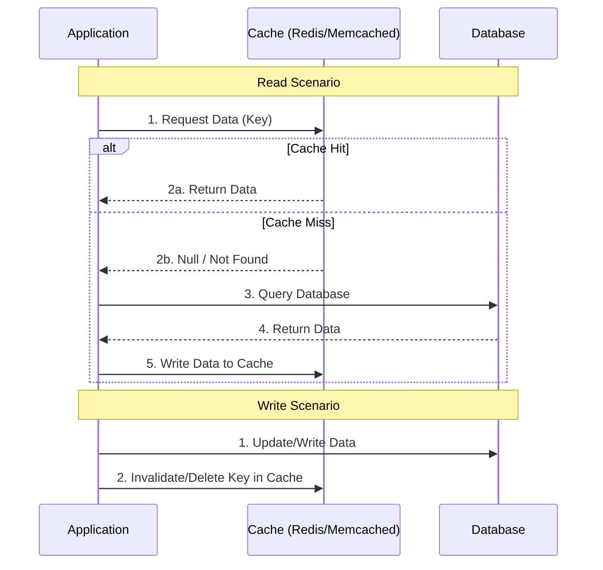

# Cache-Aside Pattern

## Introduction
The Cache-Aside pattern (also known as Lazy Loading) is the most common caching strategy. In this pattern, the application is responsible for managing the data in the cache. The cache sits *aside* the database, and the application talks to both independently.

## Problem Statement
When dealing with heavy read workloads, querying the database repeatedly for the same data causes high latency and database strain. We need a way to serve frequently requested data quickly.

## Why this exists
To offload read traffic from the primary database and reduce latency by keeping a copy of frequently accessed data in a fast, in-memory store.

## Real-world analogy
Think of studying for an exam.
1. You look for an answer in your quick notes (the **Cache**).
2. If it's there (Cache Hit), you use it immediately.
3. If it's not there (Cache Miss), you look it up in the heavy textbook (the **Database**).
4. Once you find it in the textbook, you write it down in your quick notes for next time.

## Definition
A caching pattern where the application first checks the cache for data. If the data is not found, the application retrieves it from the database, stores a copy in the cache, and then returns it to the user.

## Key concepts
- **Cache Hit:** The requested data is found in the cache.
- **Cache Miss:** The requested data is not found in the cache.
- **Lazy Loading:** Data is only loaded into the cache when it is explicitly requested (on a cache miss).
- **TTL (Time to Live):** A mechanism to expire cache entries to prevent stale data.

## Internal working / Mermaid diagram



## Python/Java implementation

### Python Implementation
```python
import redis
import json
import db_module # Hypothetical DB module

cache = redis.Redis(host='localhost', port=6379, db=0)

def get_user_profile(user_id):
    cache_key = f"user:{user_id}:profile"
    
    # 1. Check Cache
    cached_data = cache.get(cache_key)
    
    if cached_data:
        # Cache Hit
        return json.loads(cached_data)
        
    # 2. Cache Miss: Fetch from DB
    user_data = db_module.fetch_user(user_id)
    
    if user_data:
        # 3. Write to Cache (with TTL of 1 hour)
        cache.setex(cache_key, 3600, json.dumps(user_data))
        
    return user_data

def update_user_profile(user_id, new_data):
    # 1. Update DB directly
    db_module.update_user(user_id, new_data)
    
    # 2. Invalidate cache
    cache_key = f"user:{user_id}:profile"
    cache.delete(cache_key)
```

## Step-by-step explanation
**On Read:**
1. The application checks if the data exists in the cache.
2. If yes, return the data.
3. If no, query the database, write the result to the cache, and return the data.

**On Write:**
1. The application writes the new data directly to the database.
2. The application immediately invalidates (deletes) the corresponding entry in the cache. The next read will result in a cache miss and fetch the fresh data.

## Multiple real-world examples
1. **User Profiles:** Loading user profile data on a social media site where profiles are read frequently but updated rarely.
2. **Product Catalogs:** E-commerce stores caching product details.
3. **Configuration Settings:** Application configs that rarely change but are checked on every request.

## Pros
- **Resiliency:** If the cache goes down, the application can still function by querying the database directly (though slower).
- **Efficient Memory Use:** Only data that is actually requested is cached (no wasted space).
- **Simplicity:** Easy to understand and implement in application code.

## Cons
- **Cache Miss Penalty:** The first request for any piece of data is slower because it incurs a round trip to the cache, *then* the database, *then* back to the cache.
- **Staleness Risk:** Data can become stale if the cache invalidation fails during a write operation.
- **Complex Code:** The caching logic is heavily embedded inside the application code.

## Interview questions

### Beginner
- **Q: What happens in Cache-Aside when there is a cache miss?**
  - **A:** The application retrieves the data from the database, writes it to the cache, and returns it to the user.

### Intermediate
- **Q: How should you handle writes in a Cache-Aside pattern?**
  - **A:** Write to the database first, then delete (invalidate) the key from the cache. Do not try to update the cache directly, as concurrent writes can lead to race conditions and permanent inconsistency.

### Senior
- **Q: What is the "Thundering Herd" problem in Cache-Aside, and how do you prevent it?**
  - **A:** When a highly accessed cache key expires, thousands of requests might miss the cache simultaneously and hit the database at the exact same time, potentially crashing it. Solutions include:
    1. Implementing a mutex lock (only one thread fetches from DB, others wait).
    2. Soft TTL (refresh the cache asynchronously in the background before the hard TTL expires).

## Common mistakes
- **Updating the cache on writes instead of deleting:** This can cause race conditions where an older write overwrites a newer write in the cache. Always invalidate (delete) on write.
- **Missing TTLs:** Not setting a Time-To-Live means data will stay in the cache forever if not explicitly invalidated.

## Best practices
- Always use TTLs as a safety net against stale data.
- Ensure cache invalidation logic is robust, possibly tying it to database CDC (Change Data Capture) events for better reliability.

## When NOT to use
- For write-heavy applications (since constant invalidation makes the cache useless).
- When data consistency is strictly required at all times (there is always a small window of inconsistency).

## Comparison with similar concepts
- **Cache-Aside:** Application manages both cache and DB. Data is loaded lazily.
- **Write-Through / Read-Through:** Application talks *only* to the cache, and the cache manages the DB synchronization.

## Summary
Cache-Aside is the standard, most widely used caching pattern. By acting as a lazy-loading buffer between the application and database, it dramatically improves read performance while keeping architecture relatively simple.

## Related topics
- [Caching Strategies](../caching)
- [Write Through](../write-through)
- [Write Back](../write-back)
- [Redis](../redis)
