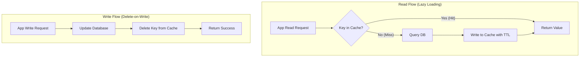

# Cache-Aside Pattern

## Introduction
The **Cache-Aside** pattern (also known as **Lazy Loading**) is the most widely adopted caching strategy in distributed systems. Under this pattern, the cache sits "aside" the primary database, and the application layer assumes full responsibility for coordinating reads and writes between the cache and the persistent storage.

---

## Problem Statement
High-volume read traffic directly targeting disk-based primary databases causes:
1.  **Resource Exhaustion:** Excessive CPU consumption and connection pool starvation.
2.  **Unpredictable Latency:** Disk read speed limits the response time of pages.
3.  **Redundant Computations:** The same complex queries (e.g., fetching a viral tweet) are parsed and executed repeatedly.

---

## Why This Exists
Cache-Aside separates the caching layer from the database engine. This decoupled approach is highly resilient: if the caching layer crashes, the application can fall back directly to the database. It is also memory-efficient, storing only the data that users actively request rather than preloading entire datasets.

---

## Real-world Analogy
Imagine a desk clerk in an archive office:
*   **The Database:** A massive, slow archive vault in the basement.
*   **The Cache:** A small physical tray on the clerk's desk.
*   **The Read Path:** A visitor asks for file "A". The clerk checks the tray (Cache Hit). If not there (Cache Miss), the clerk walks down to the basement vault, retrieves file "A", makes a copy for the desk tray, and hands the file to the visitor.
*   **The Write Path:** When file "A" is updated, the clerk destroys the copy in the desk tray (Invalidation) and updates the master file in the basement vault. The desk tray is only repopulated when the next request for file "A" arrives.

---

## Definition
**Cache-Aside** is a caching design pattern where the application orchestrates reads by querying the cache first, falling back to the database on a miss, and then populating the cache. Writes are sent directly to the database, followed by immediate eviction of the corresponding cache keys.

---

## Key Concepts

### 1. Lazy Loading
Data is only loaded into the cache when it is requested. If a key is never requested by a user, it is never stored in the cache, saving memory.

### 2. Cache Invalidation (Why Delete on Write?)
When data is updated, the application must choose between:
*   **Update-on-Write:** Overwriting the old value in the cache with the new value.
    *   *Risk:* Two concurrent writes could result in race conditions. If Write A and Write B execute, they might update the DB in order `A -> B`, but due to network jitter, they might update the cache in order `B -> A`. The cache would remain out of sync with the DB.
*   **Delete-on-Write (Invalidation):** Deleting the key from the cache.
    *   *Resilience:* This ensures that the next read will result in a cache miss, pulling the fresh, definitive state from the database. *This is the industry-standard recommendation.*

### 3. The Cold Start / Warm-Up Problem
Because data is loaded lazily, a freshly deployed cache has a hit ratio of 0%. The first wave of queries will bypass the cache and hit the database simultaneously, potentially causing a crash.
*   *Mitigation:* Pre-populate (warm up) the cache with the most popular keys (e.g., top 100 products) during the deployment process.

---

## Internal Working: Read & Write Flows



---

## Java Implementation

The following code provides a robust, thread-safe wrapper for the Cache-Aside pattern. It includes a **Single-Flight Lock (Mutex)** mechanism to prevent the Cache Stampede (Thundering Herd) problem.

```java
import java.util.Map;
import java.util.concurrent.ConcurrentHashMap;
import java.util.concurrent.locks.ReentrantLock;

public class CacheAsideWrapper<K, V> {
    private final Map<K, V> cacheStore = new ConcurrentHashMap<>();
    private final Map<K, V> databaseStore = new ConcurrentHashMap<>();
    
    // Lock map to manage concurrency per key
    private final Map<K, ReentrantLock> keyLocks = new ConcurrentHashMap<>();
    
    private static final int TTL_SECONDS = 3600;

    // Simulate Database Access
    public V getFromDatabase(K key) {
        System.out.println("Database Access for key: " + key);
        try { Thread.sleep(50); } catch (InterruptedException ignored) {} // Simulating delay
        return databaseStore.get(key);
    }

    public void writeToDatabase(K key, V value) {
        System.out.println("Database Write for key: " + key);
        databaseStore.put(key, value);
    }

    // ==========================================
    // SAFE READ PATH: Prevents Cache Stampede
    // ==========================================
    public V read(K key) {
        V value = cacheStore.get(key);
        if (value != null) {
            return value; // Cache Hit
        }

        // Cache Miss -> Acquire Lock per key to prevent Thundering Herd
        ReentrantLock lock = keyLocks.computeIfAbsent(key, k -> new ReentrantLock());
        lock.lock();
        try {
            // Double-check cache inside lock (Double-Checked Locking pattern)
            value = cacheStore.get(key);
            if (value != null) {
                return value;
            }

            // Fetch from database
            value = getFromDatabase(key);
            if (value != null) {
                // Populate Cache (simulate setting TTL)
                cacheStore.put(key, value);
            }
            return value;
        } finally {
            lock.unlock();
            keyLocks.remove(key, lock); // Clean up locks to avoid memory leaks
        }
    }

    // ==========================================
    // SAFE WRITE PATH: DB Update followed by Invalidation
    // ==========================================
    public void write(K key, V value) {
        // 1. Update Database
        writeToDatabase(key, value);

        // 2. Invalidate Cache
        cacheStore.remove(key);
        System.out.println("Cache Invalidation for key: " + key);
    }
}
```

---

## Step-by-Step Explanation: Single-Flight Read
How the Java implementation prevents a database crash when a hot key expires:

1.  **The Cache Miss:** 10,000 threads query `read("hot_key")` at the same time. The value is not in `cacheStore`.
2.  **Lock Acquisition:** All 10,000 threads attempt to acquire the lock for `"hot_key"`. Only **Thread 1** succeeds. The other 9,999 threads block.
3.  **Database Fetch:** Thread 1 executes `getFromDatabase("hot_key")` and writes the result to `cacheStore`.
4.  **Lock Release:** Thread 1 releases the lock.
5.  **Subsequent Queries:** Thread 2 is next in line. It acquires the lock, checks `cacheStore` (Double-Check), sees the value populated by Thread 1, and returns immediately without querying the database.
6.  **Massive Scale Preservation:** Instead of 10,000 queries hitting the database, only **one** query hits the database.

---

## Multiple Real-world Examples

1.  **Social Media Timelines:** The system checks Redis for a user's feed. On a miss, it generates the feed using SQL joins and caches it with a 15-minute TTL. When the user posts a new update, the system invalidates the cached feed.
2.  **User Session Caching:** Web servers read session tokens from Redis. On a miss (e.g., after a Redis restart), they verify the JWT signature against database keys and cache it.
3.  **Config & Feature Flags:** Application parameters are cached locally. When configs are updated in a central manager, it sends an invalidation webhook to all application servers.

---

## Pros & Cons

### Pros
*   **High Resilience:** The cache is non-blocking. If Redis fails, the application falls back to the database, ensuring system availability.
*   **Optimal Cache Density:** Caches only requested data, preventing the caching of unused records.
*   **Safe Write Model:** Deleting the cache on writes reduces the risk of data inconsistency due to race conditions.

### Cons
*   **High Miss Penalty:** Cache misses incur a multi-step cost: check cache $\to$ miss $\to$ check DB $\to$ write cache $\to$ return.
*   **Staleness Window:** If a database write succeeds but the subsequent cache invalidation fails (due to network failure), the cache serves old data until the TTL expires.
*   **Logic Pollution:** The application code is cluttered with caching logic (checking, DB fetching, and writing).

---

## Interview Questions

### Beginner
*   **Q:** What is the difference between Cache-Aside and eager pre-loading?
*   **A:** Cache-Aside loads data lazily only when a query misses the cache. Eager pre-loading populates the cache with all data (or a predicted subset) during application startup before any user query is made.

### Intermediate
*   **Q:** In Cache-Aside, why is it better to delete a cached key on update rather than updating it?
*   **A:** If you update the cache, concurrent writes can easily result in race conditions. For example, if update A and update B happen at the same time, the DB might commit B last (correct state), but due to network delays, the cache might write A last, resulting in a permanently stale cache. Deleting the key on write ensures that subsequent reads retrieve the correct state from the database.

### Senior
*   **Q:** What is the "Cache Stampede" (Thundering Herd) problem, and how does the Single-Flight/Double-Checked locking pattern prevent it?
*   **A:** Cache stampede occurs when a hot cache key expires and a burst of concurrent requests all experience a cache miss. They all query the database simultaneously, potentially overloading it. By using a per-key lock (Single-Flight), only the first thread gets to query the database, while other threads wait. Once the first thread writes the value to the cache, the waiting threads read from the cache without querying the database.

### Staff Engineer
*   **Q:** How do you handle cache invalidation in a multi-region deployment where reads are local but writes are global?
*   **A:** In a multi-region setup, writes are committed to the primary region database and replicated to read replicas. If you invalidate local caches instantly on write, the local reads might experience a cache miss and fetch *old* data from their local replica due to replication lag. To prevent this, you can use **delayed double invalidation** (evicting the cache immediately on write, and then evicting it again after a delay equal to the replica lag time), or use transactional CDC pipelines that emit invalidation events only after the write has been successfully committed to the local region's database replica.

---

## Common Mistakes
*   **Omitting TTLs:** Caching keys indefinitely. If invalidation fail, the cache remains stale forever.
*   **Unbounded Lock Maps:** In the Single-Flight pattern, forgetting to remove locks from the map, leading to memory leaks over time.
*   **Heavy Transaction Scopes:** Running DB updates and cache evictions in a single database transaction. If the cache is slow or unresponsive, it will delay the DB commit, holding locks open.

---

## Best Practices
*   **Perform DB Writes first:** Ensure database writes commit successfully before invoking cache invalidation.
*   **Use Bloom Filters:** For keys that are likely non-existent, use a Bloom Filter to prevent cache misses from querying the database.
*   **Stagger TTLs:** Add random jitter to TTLs to prevent Cache Avalanche.

---

## When NOT to Use
*   **Write-Heavy Systems:** If the database changes constantly, the cache will be invalidated frequently, resulting in low hit ratios and wasted overhead.
*   **Strict Monolithic Transactions:** If you need distributed transactions where cache and database must stay perfectly consistent at the same millisecond.

---

## Comparison with Similar Concepts

*   **Cache-Aside vs. Read-Through:** In Cache-Aside, the application coordinates the cache and DB. In Read-Through, the application only queries the cache; the cache provider's library handles DB fetching on a miss.
*   **Cache-Aside vs. Write-Through:** Cache-Aside invalidates the cache on writes (lazy read loading). Write-Through updates both the cache and DB synchronously on writes.

---

## Summary
The Cache-Aside pattern is the de-facto standard for read-heavy distributed architectures. By separating caching from database management and executing lazy-loading reads and delete-on-write invalidations, systems can scale to handle massive traffic spikes with high resilience.

---

## Related Topics
- [Caching Strategies](../caching)
- [Write Through](../write-through)
- [Write Back](../write-back)
- [Cache Invalidation](../cache-invalidation)
- [Redis](../redis)
- [CDN](../cdn)
