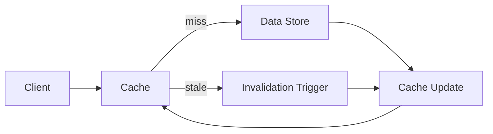

# Cache Invalidation

## Introduction
Cache invalidation is the process of removing or updating stale data from a cache.

## Problem Statement
Cached data can become out of sync with the underlying datastore, leading to stale results.

## Why this exists
Invalidation ensures cached values remain correct after updates and prevents serving outdated responses.

## Real-world analogy
A news website updates a cached headline when the story changes so readers see the latest version.

## Definition
Cache invalidation is a strategy that refreshes or removes cached entries when the source data changes.

## Key concepts
- **Time-to-live (TTL)**
- **Write-through**
- **Write-back**
- **Cache-aside**
- **Explicit invalidation**

## Internal working
A cache invalidation mechanism tracks updates and either evicts stale entries or refreshes them from the source.

### Mermaid flow diagram


## Python implementation

### Bad implementation
A naive cache that never invalidates stale entries.

```python
class BadCache:
    def __init__(self):
        self.store: dict[str, str] = {}

    def get(self, key: str) -> str | None:
        return self.store.get(key)

    def set(self, key: str, value: str) -> None:
        self.store[key] = value
```

### Better implementation
A TTL cache that expires entries after a fixed interval.

```python
import time

class TTLCache:
    def __init__(self, ttl: float):
        self.store: dict[str, tuple[str, float]] = {}
        self.ttl = ttl

    def get(self, key: str) -> str | None:
        entry = self.store.get(key)
        if not entry:
            return None
        value, expiration = entry
        if time.time() > expiration:
            self.store.pop(key, None)
            return None
        return value

    def set(self, key: str, value: str) -> None:
        self.store[key] = (value, time.time() + self.ttl)
```

### Best implementation
A cache-aside invalidation strategy with explicit write invalidation.

```python
class CacheAside:
    def __init__(self, cache: dict[str, str], datastore: dict[str, str]):
        self.cache = cache
        self.datastore = datastore

    def get(self, key: str) -> str | None:
        if key in self.cache:
            return self.cache[key]
        value = self.datastore.get(key)
        if value is not None:
            self.cache[key] = value
        return value

    def update(self, key: str, value: str) -> None:
        self.datastore[key] = value
        self.cache.pop(key, None)
```

## Step-by-step explanation
1. A stale cache returns old data.
2. TTL invalidation forces expiration after time.
3. Cache-aside invalidation removes entries on writes and repopulates them on reads.

## Multiple real-world examples
- Redis caches are invalidated when backend data changes.
- CDNs purge edge caches after content updates.
- Application servers use cache tags and invalidation events.

## Pros
- Improves cache correctness.
- Balances freshness and performance.
- Supports dynamic data.

## Cons
- Invalidation adds complexity.
- Over-aggressive invalidation reduces cache hit rates.
- Missing invalidation can lead to stale results.

## Interview Questions
### Beginner
- What is cache invalidation?
- Answer: The process of removing or refreshing outdated cached data.

### Intermediate
- What are the common cache invalidation strategies?
- Answer: TTL, cache-aside, write-through, write-back, and explicit invalidation.

### Senior
- When is cache-aside preferable to write-through?
- Answer: When you want control over when data is loaded into cache and avoid write overhead.

### Staff Engineer
- Architect a cache invalidation strategy for a global product catalog.
- Answer: Use short TTLs for dynamic content, explicit invalidation on writes, and event-based cache purge across regions.

## Common mistakes
- Assuming TTL alone solves all staleness.
- Failing to invalidate after updates.
- Caching mutable objects without deep copies.

## Best practices
- Use explicit invalidation for write-heavy data.
- Combine TTLs with write invalidation where needed.
- Monitor cache hit rate and stale data incidents.

## When NOT to use
- Static content that can be cached indefinitely.
- Cases where atomic cache updates are not feasible.

## Comparison with similar concepts
- **Cache Aside:** explicit invalidation on write.
- **Write Through:** writes update cache and datastore synchronously.
- **CDN:** edge cache invalidation uses purge and TTL.

## Summary
Cache invalidation is critical for reliable cached systems. The right strategy depends on data freshness requirements and write patterns.

## Related topics
- [Caching Strategies](../caching)
- [Consistency Models](../../fundamentals/consistency-models)
