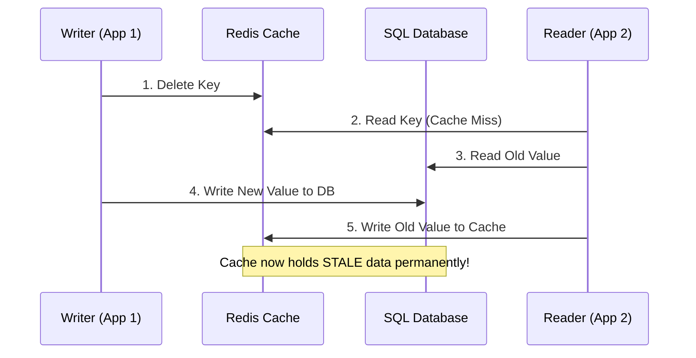

# Cache Invalidation

## Introduction
As the famous computer science proverb goes: *"There are only two hard things in Computer Science: cache invalidation and naming things."* (Phil Karlton). Cache invalidation is the process of declaring cached data obsolete and actively deleting or refreshing it, ensuring that clients do not receive stale or incorrect data when the underlying source of truth (the database) changes.

---

## Problem Statement
Keeping a cache and database synchronized is difficult because they are two separate distributed systems without a single shared transaction scope.
1.  **Stale Reads:** If a user updates their profile picture but the cache still serves the old image link, the user assumes the edit failed.
2.  **Race Conditions:** Under high concurrency, read and write operations can interleave, causing the cache to be permanently populated with stale data.
3.  **Out-of-Order Updates:** Network delays can cause cache updates to arrive out of order, overwriting a newer value with an older one.

---

## Why This Exists
Caching is only useful if the data it serves is correct. While a Time-to-Live (TTL) acts as a passive safety net, it allows data to remain stale until the TTL expires. High-consistency systems require **active invalidation** to guarantee that once a write transaction completes, subsequent reads immediately fetch the new value.

---

## Real-world Analogy
Imagine a restaurant menu.
*   **The Database:** The master recipe and pricing list maintained by the head chef.
*   **The Cache:** The printed menus handed out to customers.
*   **No Invalidation:** The price of steak rises from $20 to $25. If the restaurant continues handing out the old printed menus, customers will expect to pay $20, leading to disputes (stale reads).
*   **Active Invalidation (Purge):** The manager immediately goes around, collects all current printed menus, throws them away, and prints new ones with the updated price (Write-Through/Invalidation).
*   **TTL (Time-to-Live):** The restaurant prints menus that say "Valid for Today Only." If prices change mid-day, they accept the losses until tomorrow when new menus are printed.

---

## Definition
**Cache Invalidation** is the execution of a protocol or command that removes or updates cache entries immediately when the master data source changes, ensuring data consistency between the caching layer and persistent storage.

---

## Key Concepts

### 1. Invalidation Schemes
*   **Purge (Eviction/Delete-on-Write):** Removes the cache entry entirely. The next read request will result in a cache miss, pulling the latest data from the database. *This is the safest and most common approach.*
*   **Refresh (Update-on-Write):** Writes the new value directly into the cache when the database is updated. While this keeps reads fast (no cache misses), it is highly susceptible to race conditions.
*   **Ban (Tag-based Invalidation):** Groups cache keys under tags (e.g., tagging pages with `category:electronics`). When a product changes, the application invalidates the entire `category:electronics` tag, clearing all associated keys at once.

### 2. The Cache-Aside Invalidation Race Condition
When updating database rows under Cache-Aside, developers face a choice of ordering:
*   **Option A: Delete Cache, then Update DB**
    *   *The Bug:* If Client 1 deletes the cache, and before it updates the DB, Client 2 reads the key. Client 2 sees a cache miss, reads the *old* value from the DB, and writes it back to the cache. Client 1 then updates the DB. The cache now holds stale data indefinitely (until TTL).
*   **Option B: Update DB, then Delete Cache (Recommended)**
    *   *The Bug:* If the cache expires. Client 1 reads a cache miss, pulls the old value from the DB. Before Client 1 writes to the cache, Client 2 updates the DB and invalidates the cache. Client 1 then writes the old value to the cache.
    *   *Probability:* Extremely low, because writing to the cache in RAM is much faster than a database write. However, it is mitigated using short TTLs or locks.

---

## Internal Working: The Reader-Writer Race

The following diagram illustrates how option A ("Delete Cache, then Update DB") leads to permanent staleness.



---

## Java Implementation

The following Java class implements a thread-safe cache invalidation mechanism that supports tag-based invalidation and demonstrates how to handle write operations safely to avoid common race conditions.

```java
import java.util.*;
import java.util.concurrent.ConcurrentHashMap;

public class TaggedCacheSystem {
    // In-Memory Cache: Maps Key -> Value
    private final Map<String, String> cache = new ConcurrentHashMap<>();
    // Tags mapping: Maps Tag -> Set of Cache Keys
    private final Map<String, Set<String>> tagMap = new ConcurrentHashMap<>();
    // Database Mock
    private final Map<String, String> database = new ConcurrentHashMap<>();

    // Read operation using Cache-Aside
    public String get(String key) {
        String cachedValue = cache.get(key);
        if (cachedValue != null) {
            return cachedValue;
        }

        // Cache Miss -> Pull from DB
        String dbValue = database.get(key);
        if (dbValue != null) {
            cache.put(key, dbValue);
        }
        return dbValue;
    }

    // Safe Write Operation: Update DB first, then Invalidate Cache
    public void update(String key, String value, List<String> tags) {
        // 1. Update the database first
        database.put(key, value);

        // 2. Invalidate the specific cache key to prevent stale reads
        cache.remove(key);

        // 3. Register tags for future tag-based invalidation
        for (String tag : tags) {
            tagMap.computeIfAbsent(tag, k -> ConcurrentHashMap.newKeySet()).add(key);
        }
    }

    // Tag-Based Invalidation (Ban)
    public void invalidateTag(String tag) {
        Set<String> keysToInvalidate = tagMap.remove(tag);
        if (keysToInvalidate != null) {
            System.out.println("Invalidating tag '" + tag + "' -> Evicting keys: " + keysToInvalidate);
            for (String key : keysToInvalidate) {
                cache.remove(key);
            }
        }
    }

    // Setup helper for demonstration
    public void seedDatabase(String key, String value) {
        database.put(key, value);
    }
}
```

---

## Step-by-Step Invalidation Flow (Database-First Eviction)
To update a user profile and ensure cache consistency:

1.  **Application Write:** The user changes their display name to "Bob". The application starts a database transaction.
2.  **Database Commit:** The application updates the user row in the database: `UPDATE users SET name = 'Bob' WHERE id = 45`. The database transaction commits successfully.
3.  **Cache Eviction:** The application issues a delete command to Redis: `DEL user:45`.
4.  **Next Read:** Another client requests profile `45`. Since the key was deleted, the request misses the cache, reads "Bob" from the database, and writes "Bob" back to the cache. Consistency is maintained.

---

## Multiple Real-world Examples

1.  **Cloudflare CDN Purging:** Content creators update a blog post. The application makes an HTTP POST request to Cloudflare's API containing the URL to purge. Cloudflare evicts the file from its edge servers globally.
2.  **Varnish Cache Tags:** E-commerce stores use Varnish Cache for catalog pages. Responses include a HTTP header `X-Cache-Tags: product_105, category_electronics`. When product 105 is modified, the system sends a `YKEY PURGE product_105` ban command to Varnish, clearing all matching pages.
3.  **CDC (Change Data Capture) Invalidation:** A service writes updates exclusively to a Postgres DB. A database replication tool (like Debezium) streams write logs (WAL) to a Kafka topic. An invalidator consumer reads the Kafka events and issues `DEL` commands to Redis asynchronously, decoupling invalidation logic from the main application service.

---

## Pros & Cons

### Pros
*   **Guarantees Freshness:** Minimizes or eliminates data drift, ensuring clients see updated details.
*   **Saves Cache Memory:** Evicting obsolete keys frees up RAM for active keys, boosting hit ratios.
*   **Decouples Writes:** Delete-on-write avoids writing large, unread payloads to the cache during update spikes.

### Cons
*   **Complexity:** Managing invalidation code across distributed services can lead to synchronization bugs.
*   **Cache Miss Spikes:** Invalidation (especially tag-based bans) causes cache misses, temporarily increasing query load on the database.
*   **Race Conditions:** Incorrect ordering of database writes and cache deletes causes permanent cache corruption.

---

## Interview Questions

### Beginner
*   **Q:** Why is "Delete Cache then Update Database" considered an anti-pattern in Cache-Aside?
*   **A:** If you delete the cache first, a concurrent read query will hit a cache miss, read the old value from the database (since it hasn't been updated yet), and write that old value back to the cache. The database is then updated, leaving the cache with the old stale data indefinitely.

### Intermediate
*   **Q:** How does a Write-Through cache simplify invalidation?
*   **A:** A Write-Through cache acts as a single entry point. The application writes only to the cache, and the cache synchronously writes to the database. The cache is never stale because updates are written directly to it as part of the transaction.

### Senior
*   **Q:** How would you design a cache invalidation mechanism for an application that receives updates from multiple legacy services directly writing to the database?
*   **A:** Since application-level invalidation is impossible (legacy services bypass our app), you should use **Change Data Capture (CDC)**. A tool like Debezium monitors the database Transaction Logs (WAL) and publishes writes to a message broker (Kafka). An invalidator service consumes these events and deletes corresponding keys in Redis.

### Staff Engineer
*   **Q:** Discuss the trade-offs of using Cache Tags (or key grouping) vs. single key invalidations at scale.
*   **A:** Single-key invalidation is simple and lightweight but struggles when updates affect multiple views (e.g., updating a product changes search results, product details, and category listings). Cache tags solve this by mapping multiple views to a tag. However, at scale, maintaining tag-to-key mapping tables in memory consumes substantial RAM and requires clean-up. Additionally, purging a highly popular tag can trigger massive cache invalidation storms, overloading backend databases.

---

## Common Mistakes
*   **Updating Cache directly instead of Deleting:** Attempting to update cache entries on write, which causes race conditions under concurrent updates.
*   **Missing Exception Handling:** If the database write succeeds but the cache delete command fails due to a network timeout, the application ignores the error, leaving stale cache data.
*   **No Backup TTL:** Relying entirely on active invalidation without setting a TTL. If the invalidation event is lost, the data remains stale forever.

---

## Best Practices
*   **Write to DB, then Delete Cache:** This is the most resilient pattern for Cache-Aside systems.
*   **Always Set a Fallback TTL:** Even with active invalidation, set a safety TTL (e.g., 24 hours) as a backup to clear stale keys if invalidation fails.
*   **Use Transactional Invalidation:** Ensure that the cache invalidation happens *after* the database transaction successfully commits. If the DB transaction rolls back, do not invalidate the cache.

---

## When NOT to Use
*   **Static Content:** Assets like images, CSS, or JS which are versioned using cache-busting filenames (e.g., `style.v2.css`). Instead, cache them forever and deploy new versions under new names.
*   **Write-Only logs:** Datasets that are only appended to and never updated (e.g., telemetry logs).

---

## Comparison with Similar Concepts

*   **Cache Invalidation vs. Eviction:** Invalidation is the active removal of data because it is *stale*. Eviction is the automatic removal of data by the cache engine because it ran out of *memory* (e.g., LRU).
*   **Cache Invalidation vs. Expiration:** Expiration is passive (based on TTL/timer). Invalidation is active (based on data modification event).

---

## Summary
Cache invalidation is a critical mechanism for ensuring data consistency in high-performance applications. By using the "Write to DB, then Delete Cache" pattern, implementing tag-based purging, and relying on change data capture for decoupled environments, developers can enjoy low latency reads without serving stale records.

---

## Related Topics
- [Caching Strategies](../caching)
- [Cache Aside](../cache-aside)
- [Write Through](../write-through)
- [Write Back](../write-back)
- [Redis](../redis)
- [CDN](../cdn)
