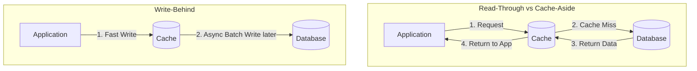

# Caching Strategies

## Introduction
Caching is the technique of storing copies of frequently accessed data in a fast, temporary storage location (usually in-memory) so that future requests for that data can be served much faster than querying the primary data store. A Caching Strategy dictates exactly *when* and *how* data is loaded into the cache and evicted from it.

## Problem Statement
Primary databases (like PostgreSQL, MySQL) store data on physical disks (SSD/HDD). Accessing this data requires disk I/O and network overhead, which is relatively slow. Under high traffic, querying the database repeatedly for the same data (e.g., a viral tweet or a trending product) will quickly overwhelm the database connections, causing massive latency spikes or server crashes.

## Why this exists
To drastically reduce latency and increase system throughput. By selecting the correct caching strategy based on your application's read/write profile, you can serve 99% of requests in under a millisecond while keeping your primary database perfectly safe from traffic spikes.

## Real-world analogy
Think of a library. 
- The **Database** is the massive archive in the basement. It holds every book ever written, but it takes 15 minutes to retrieve one.
- The **Cache** is the small "Trending Books" display near the front desk. It only holds 50 books, but it takes 10 seconds to grab one.
- The **Caching Strategy** is the rule the librarian uses: Do they only put books on the display *after* someone asks for it (Cache-Aside)? Or do they put every brand-new book on the display immediately when it arrives at the library (Write-Through)?

## Definition
A defined architectural pattern that manages the synchronization of data between the application, the cache, and the underlying primary datastore.

## Key concepts
- **Cache Hit:** The data was successfully found in the cache.
- **Cache Miss:** The data was not in the cache, requiring a slow database query.
- **Eviction Policy:** When the cache is full, how does it decide what to delete? (e.g., LRU - Least Recently Used, LFU - Least Frequently Used).
- **TTL (Time to Live):** An absolute time limit on how long data stays in the cache before automatically expiring to prevent staleness.

## Common Caching Strategies

### 1. Cache-Aside (Lazy Loading)
The application is fully responsible for managing the cache. 
- **Read:** Check cache -> If Miss, query DB -> Write to Cache -> Return.
- **Write:** Write to DB -> Delete (Invalidate) from Cache.
- **Use Case:** Heavy read workloads. It is the most common strategy.

### 2. Read-Through
Similar to Cache-Aside, but the application only talks to the Cache. The Cache itself is responsible for querying the database if there is a miss.
- **Read:** App asks Cache. If Cache misses, Cache queries DB, updates itself, and returns to App.
- **Use Case:** When you want to decouple caching logic from application code.

### 3. Write-Through
The application writes data to the cache, and the cache immediately and synchronously writes it to the database.
- **Write:** App -> Cache -> DB.
- **Use Case:** Environments where data consistency is absolutely critical, and you cannot afford the cache and DB to ever be out of sync. (Adds latency to writes).

### 4. Write-Back (Write-Behind)
The application writes data to the cache and receives an immediate "Success" response. The cache asynchronously batches these writes and flushes them to the database later.
- **Write:** App -> Cache (Success!) ... *background process* ... Cache -> DB.
- **Use Case:** Extremely heavy write workloads (e.g., tracking YouTube views or IoT sensor data). 
- **Risk:** If the cache server crashes before flushing to the DB, data is permanently lost.

## Internal working / Mermaid diagram

## Python/Java implementation

*Refer to the specific implementation pages for detailed code:*
- [Cache Aside Implementation](../cache-aside)
- [Write Through Implementation](../write-through)

## Pros & Cons Summary

| Strategy | Pros | Cons | Best For |
|----------|------|------|----------|
| **Cache-Aside** | Resilient to cache failure, caches only what is needed. | Inconsistency risk, slower on cache miss. | Read-heavy, general purpose. |
| **Write-Through**| Strict data consistency, fast reads. | Slower writes (2 hops). | Applications that write and immediately re-read data. |
| **Write-Back** | Incredible write performance, offloads DB strain. | High risk of data loss if cache dies. | High-volume writes where minor data loss is acceptable. |

## Interview questions

### Beginner
- **Q: What is a Cache Miss?**
  - **A:** It occurs when an application searches for a piece of data in the cache but it is not there. The application must then query the primary database, increasing latency.

### Intermediate
- **Q: Why would you choose Write-Back over Write-Through?**
  - **A:** If my application processes 10,000 writes per second (like a game server updating player coordinates), writing all of that synchronously to a SQL database (Write-Through) would crash the database. Write-Back allows me to store them instantly in RAM, and lazily write them to the DB in bulk every 5 seconds, massively saving DB resources.

### Senior
- **Q: How does the choice of Eviction Policy (LRU vs LFU) impact a CDN caching strategy?**
  - **A:** LRU (Least Recently Used) evicts data that hasn't been requested in a while. LFU (Least Frequently Used) evicts data with the lowest total request count. For a CDN hosting viral videos, LRU is usually better. A video might be viral for 1 day (High frequency) but completely dead the next day. Under LFU, that video might sit in the cache forever because its historical frequency is so high. LRU naturally phases it out when people stop watching it.

## Common mistakes
- **No TTL on Cache-Aside:** If you write to Cache-Aside but forget to set an expiration, and your invalidation logic has a bug, the stale data will sit in the cache forever, deeply confusing your users.
- **Using Write-Back for financial data:** Using Write-Back for processing payments is dangerous. If the cache node loses power before flushing the writes to the DB, the transaction is gone forever.

## Best practices
- **Measure Hit Rate:** A cache is only useful if its Hit Rate is high (e.g., > 80%). If your Hit Rate is 5%, you are just adding latency and infrastructure cost for no reason.
- **Cache Eviction Defaults:** Always configure an eviction policy (like `allkeys-lru` in Redis). If the cache fills up and has no eviction policy, it will start throwing `OOM (Out Of Memory)` errors and crash the application.

## Summary
Caching is the ultimate tool for scaling distributed systems. Understanding the different caching strategies—Cache-Aside for typical web workloads, Write-Through for strict consistency, and Write-Back for massive write ingestion—allows architects to perfectly balance latency, consistency, and database strain.

## Related topics
- [Redis](../redis)
- [Cache Invalidation](../cache-invalidation)
- [Content Delivery Network (CDN)](../cdn)
