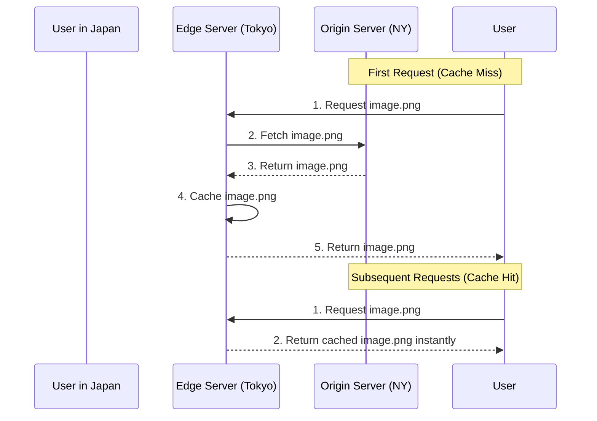

# Content Delivery Network (CDN)

## Introduction
A Content Delivery Network (CDN) is a geographically distributed group of servers that work together to provide fast delivery of Internet content. By caching content close to the user, CDNs reduce latency, decrease server load, and improve the overall user experience.

## Problem Statement
If a company hosts its servers in New York, users in Japan will experience high latency due to the physical distance the data must travel across oceanic cables. Furthermore, if millions of users try to download an image from the New York server simultaneously, the server will crash from the traffic load.

## Why this exists
To bring static assets (images, videos, CSS, JavaScript) geographically closer to users, thereby minimizing latency and offloading massive amounts of traffic from the origin servers.

## Real-world analogy
Imagine a popular bakery in Paris (Origin Server). If someone in Tokyo wants a croissant, shipping it directly takes days. Instead, the bakery opens franchise locations (Edge Servers/CDN) in Tokyo, New York, and London. The Tokyo branch bakes the same recipe and serves the local customer instantly.

## Definition
A network of Edge Servers distributed globally that cache static and dynamic content from an Origin Server to serve users from the location closest to them.

## Key concepts
- **Origin Server:** The original source of the content (your actual backend server/S3 bucket).
- **Edge Server (PoP - Point of Presence):** The CDN servers located all over the world that cache the content.
- **Push vs. Pull:**
  - **Pull CDN:** The CDN automatically fetches the content from the origin the first time a user requests it.
  - **Push CDN:** The application explicitly uploads content to the CDN whenever it changes.
- **TTL (Time to Live):** How long the edge server keeps the content before checking the origin for an update.

## Internal working / Mermaid diagram

## Step-by-step explanation (Pull CDN)
1. A user accesses a website and their browser requests an image (e.g., `cdn.example.com/image.png`).
2. DNS routes the request to the nearest CDN Edge Server based on the user's geographic location.
3. The Edge Server checks if it has the image in its cache.
4. **Cache Miss:** If not, the Edge Server requests the image from the Origin Server, caches it, and serves it to the user.
5. **Cache Hit:** If yes, the Edge Server serves the image directly from its cache, completely bypassing the Origin Server.

## Multiple real-world examples
1. **Netflix:** Uses their custom CDN (Open Connect) to place video files inside local Internet Service Providers, ensuring smooth streaming without buffering.
2. **E-commerce:** Serving product images and CSS/JS frameworks via Cloudflare or AWS CloudFront to ensure fast page loads.
3. **DDoS Protection:** CDNs act as a massive shield, absorbing malicious traffic spikes before they ever reach the origin server.

## Pros
- **Reduced Latency:** Content is served from a server physically close to the user.
- **Scalability:** Offloads 80-90% of traffic from the origin server, drastically reducing hosting costs.
- **High Availability:** If one edge server goes down, traffic is routed to the next closest server.
- **Security:** Built-in DDoS protection and Web Application Firewalls (WAF).

## Cons
- **Cost:** Premium CDNs can be expensive for massive bandwidth requirements.
- **Stale Content:** If TTLs are not configured correctly, users might see old versions of images or CSS files.
- **Complexity:** Adds another layer of infrastructure to manage, especially regarding cache invalidation.

## Interview questions

### Beginner
- **Q: What is the difference between an Origin Server and an Edge Server?**
  - **A:** The Origin Server is where the source of truth for your application lives. An Edge Server is a CDN node located close to the user that caches a copy of the origin's content.

### Intermediate
- **Q: What is the difference between a Push CDN and a Pull CDN?**
  - **A:** In a Pull CDN, the edge server fetches the file from the origin upon the first user request. In a Push CDN, the developer actively uploads files to the CDN, which then distributes them to edge nodes before users request them.

### Senior
- **Q: How does the internet know to route the user to the closest CDN node?**
  - **A:** Through Geo-DNS and Anycast routing. Geo-DNS resolves the domain to an IP address based on the user's geographic location. Anycast announces the same IP address from multiple locations, and the internet routing protocol (BGP) naturally routes the user to the topologically closest node.

### Staff Engineer
- **Q: How do you handle cache invalidation on a CDN when a CSS file is updated?**
  - **A:** Relying on CDN purge requests is slow and unreliable globally. The best practice is **Cache Busting** (or File Versioning). You append a hash to the filename (e.g., `style.v2.css` or `style.css?v=abcdef`). The CDN treats this as a completely new file, ensuring users instantly get the new version without waiting for TTLs to expire.

## Common mistakes
- **Caching sensitive data:** Accidentally caching user-specific API responses (like account details) on a public CDN node, exposing data to other users.
- **Forgetting Cache-Control headers:** Without proper HTTP headers, the CDN might cache content indefinitely or not cache it at all.

## Best practices
- Use file versioning (Cache Busting) for CSS and JS files instead of relying on CDN invalidation requests.
- Set high TTLs (e.g., 1 year) for static assets that never change (like historical images).
- Ensure your origin server is configured to only accept traffic from CDN IP ranges to prevent attackers from bypassing the CDN's security.

## When NOT to use
- Highly dynamic, user-specific data that changes every second (though modern CDNs do offer Edge Computing for dynamic delivery).
- Intranet applications where all users and the server are located in the exact same office building.

## Comparison with similar concepts
- **CDN vs Application Cache (Redis):** A CDN caches static files geographically across the internet. Redis caches dynamic database queries within the internal data center.

## Summary
A CDN is mandatory for any global application. By distributing static content to the edge of the network, CDNs drastically reduce latency, protect the origin server from traffic spikes, and provide critical security layers against DDoS attacks.

## Related topics
- [Caching Strategies](../caching)
- Load Balancing
