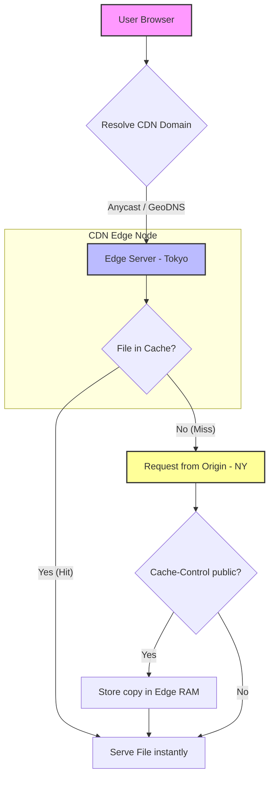

# Content Delivery Network (CDN)

## Introduction
A **Content Delivery Network (CDN)** is a globally distributed network of proxy servers (Edge Servers) and data centers (Points of Presence - PoPs) that work in harmony to deliver web content—such as images, videos, stylesheets, scripts, and API responses—rapidly to users. By caching content topologically closer to clients, a CDN minimizes latency and offloads massive traffic burdens from the origin server.

---

## Problem Statement
When static and dynamic web content is served from a single, centralized data center (Origin Server):
1.  **High Geographic Latency:** Light traveling through fiber-optic cables is bound by physical distance. A user in Tokyo accessing a server in London will experience $250\text{ms}+$ latency due to multiple network hops and geographic distance.
2.  **Origin Congestion:** Popular media files (e.g., video clips or images) can cause millions of requests to hit the origin server concurrently, exhausting bandwidth and crashing the server.
3.  **DDoS Vulnerability:** A centralized backend is an easy target for distributed denial-of-service (DDoS) attacks.

---

## Why This Exists
CDNs exist to push the "edge" of the internet closer to the end-user. By caching static files globally, a CDN intercepts traffic at the nearest PoP, serving up to 90% of requests without querying the origin server. It acts as a shield that absorbs traffic spikes and blocks malicious attacks before they ever reach the primary application servers.

---

## Real-world Analogy
Imagine a bestselling book published in New York:
*   **The Origin Server:** The printing press warehouse in New York.
*   **The Client:** A reader in Tokyo.
*   **Without a CDN:** Every time a reader in Tokyo wants to buy the book, they order it directly from New York. The book is shipped across the ocean, taking weeks to arrive (High Latency). If 10,000 Tokyo readers order the book on the same day, the warehouse runs out of shipping boxes (Congestion).
*   **With a CDN:** The publisher ships boxes of books to local bookstores in Tokyo, London, and Paris (Edge Servers). When a Tokyo reader wants the book, they walk to their local bookstore and buy it in minutes. The New York warehouse remains undisturbed.

---

## Definition
A **CDN** is a globally distributed system of proxy servers designed to optimize content delivery by caching static assets and accelerating dynamic routing using geographic DNS routing and Anycast protocols.

---

## Key Concepts

### 1. Points of Presence (PoPs) & Edge Nodes
*   **PoPs:** Geographically distributed data centers where the CDN maintains its servers.
*   **Edge Servers:** The actual proxy servers within a PoP that store cached content in high-speed RAM or NVMe storage.

### 2. Push vs. Pull CDNs
*   **Pull CDN (Lazy Cache):** The CDN edge server fetches assets from the origin only on the first request (Cache Miss). Subsequent requests are served from the edge cache until the TTL expires. *Best for websites with massive amounts of regularly updated media.*
*   **Push CDN (Eager Upload):** The developer actively uploads assets to the CDN's storage box. The CDN distributes these files to its edge nodes immediately. *Best for static releases like software updates or mobile app binaries.*

### 3. Routing Mechanisms
*   **Geo-DNS:** The DNS server detects the user's IP address, calculates their geographic region, and resolves the CDN domain (e.g., `cdn.site.com`) to the IP address of the closest PoP.
*   **Anycast Routing:** A network addressing method where multiple physical edge nodes share the *same* IP address. Border Gateway Protocol (BGP) naturally routes the client's network packets to the topologically closest node announcing that IP address.

### 4. HTTP Cache-Control Headers
The origin server instructs the CDN on how to handle caching using standard HTTP headers:
*   `Cache-Control: public` – Indicates that the response can be cached by any public cache (like the CDN) and the browser.
*   `Cache-Control: private` – Instructs the CDN *never* to cache this file; it is user-specific and can only be stored by the browser.
*   `Cache-Control: s-maxage=3600` – Overrides standard `max-age` specifically for shared caches (CDNs), instructing them to cache the file for 1 hour.
*   `ETag` – A unique version identifier (usually a file hash). The CDN uses it to perform **Conditional GETs** (`If-None-Match: "etag_val"`). If the file hasn't changed, the origin returns `304 Not Modified`, saving bandwidth.

---

## Internal Working: Edge Cache Hit/Miss Architecture



---

## Java Implementation

The following Java code simulates a CDN proxy server that resolves Anycast routing, handles HTTP Cache-Control headers (`s-maxage`, `public/private`), and executes Conditional GETs using `ETag` validators to minimize origin bandwidth.

```java
import java.util.*;
import java.util.concurrent.ConcurrentHashMap;

// Simulated Origin Server
class OriginServer {
    private final Map<String, String> files = new ConcurrentHashMap<>();
    private final Map<String, String> etags = new ConcurrentHashMap<>();

    public void addFile(String path, String content) {
        files.put(path, content);
        etags.put(path, "etag_" + content.hashCode());
    }

    public CDNResponse fetch(String path, String clientEtag) {
        System.out.println("Origin Server: Request received for: " + path);
        if (!files.containsKey(path)) {
            return new CDNResponse(404, "Not Found", null, null);
        }

        String currentEtag = etags.get(path);
        if (clientEtag != null && clientEtag.equals(currentEtag)) {
            // Conditional GET success: return 304 (no body)
            return new CDNResponse(304, null, currentEtag, "public, s-maxage=3600");
        }

        return new CDNResponse(200, files.get(path), currentEtag, "public, s-maxage=3600");
    }
}

// Struct for HTTP Responses
class CDNResponse {
    final int status;
    final String body;
    final String etag;
    final String cacheControl;

    public CDNResponse(int status, String body, String etag, String cacheControl) {
        this.status = status;
        this.body = body;
        this.etag = etag;
        this.cacheControl = cacheControl;
    }
}

// CDN Edge Server (Proxy Cache)
class EdgeServer {
    private final String locationName;
    private final Map<String, CacheEntry> cache = new ConcurrentHashMap<>();
    private final OriginServer origin;

    public EdgeServer(String locationName, OriginServer origin) {
        this.locationName = locationName;
        this.origin = origin;
    }

    public String serve(String path) {
        long now = System.currentTimeMillis();
        CacheEntry entry = cache.get(path);

        if (entry != null && entry.expirationTime > now) {
            System.out.println("[" + locationName + " Edge]: Cache HIT for: " + path);
            return entry.data;
        }

        // Cache Miss or Expired
        System.out.println("[" + locationName + " Edge]: Cache MISS/EXPIRED. Querying origin...");
        String existingEtag = (entry != null) ? entry.etag : null;

        // Perform Conditional GET to origin
        CDNResponse response = origin.fetch(path, existingEtag);

        if (response.status == 304) {
            System.out.println("[" + locationName + " Edge]: Origin returned 304. Re-validating cached entry...");
            entry.expirationTime = now + 3600 * 1000; // Extend lease
            return entry.data;
        } else if (response.status == 200) {
            // Inspect Cache-Control
            if (response.cacheControl != null && response.cacheControl.contains("public")) {
                System.out.println("[" + locationName + " Edge]: Caching response data...");
                long lease = now + 3600 * 1000; // Parse s-maxage in production
                cache.put(path, new CacheEntry(response.body, response.etag, lease));
            }
            return response.body;
        }
        return "404 Not Found";
    }

    private static class CacheEntry {
        final String data;
        final String etag;
        long expirationTime;

        public CacheEntry(String data, String etag, long expirationTime) {
            this.data = data;
            this.etag = etag;
            this.expirationTime = expirationTime;
        }
    }
}
```

---

## Step-by-Step Explanation: ETag Re-validation Flow
Using the Java implementation above:

1.  **Cache Expiry:** The cached asset `/logo.png` on the Tokyo Edge Node expires (the current time exceeds `expirationTime`).
2.  **Conditional Request:** A user requests `/logo.png`. The Tokyo Edge Node intercepts the request, notices it is expired, but retrieves the cached ETag: `"etag_12345"`.
3.  **Origin Re-validation:** The Edge Node makes a call to the Origin Server: `fetch("/logo.png", "etag_12345")`.
4.  **No-Change Detection:** The Origin checks the file's current hash. Since it still matches `"etag_12345"`, it returns a lightweight `304 Not Modified` header response without the file body.
5.  **Cache Refresh:** The Tokyo Edge Node updates the lease timer of `/logo.png` for another hour and serves the locally cached file body to the user, bypassing the payload transmission.

---

## Multiple Real-world Examples

1.  **Netflix Open Connect:** Netflix deploys custom physical appliances (Open Connect boxes) directly inside ISP partner networks. When a user streams a movie, it is pulled from a rack in their ISP's local building rather than across transit networks.
2.  **Cloudflare DDoS Shield:** When a website is attacked by a botnet sending millions of dummy requests, Cloudflare's Anycast nodes intercept the traffic globally and reject it using local WAF rules, ensuring the origin server never sees the attack.
3.  **Single Page Applications (SPAs):** Deploying React or Vue bundles to AWS S3 and serving them via AWS CloudFront. The static index.html and JS files load instantly from edge locations.

---

## Pros & Cons

### Pros
*   **Minimized Latency:** Serving bytes from close locations reduces TCP round-trip times (RTT) and accelerates page load speed.
*   **Drastic Bandwidth Savings:** Handles 80-90% of requests at the edge, cutting down on cloud origin egress fees.
*   **DDoS & Security Protection:** Edge nodes screen incoming requests, applying firewalls and SSL negotiation at the perimeter.
*   **Scalability:** Allows small servers to withstand massive traffic surges (e.g., flash sales).

### Cons
*   **Content Staleness:** If files are updated at the origin but have long TTLs, users see old versions until cache invalidation is triggered.
*   **Invalidation Lag:** Issuing a purge command to clear a key from all global nodes can take several seconds to minutes.
*   **Troubleshooting Complexity:** Debugging cache headers, routing rules, and local CDN behaviors is difficult.

---

## Interview Questions

### Beginner
*   **Q:** What is a CDN, and why do companies use it?
*   **A:** A CDN is a geographically distributed network of proxy servers that cache static assets (images, CSS, JS) close to users. Companies use it to reduce page load latency, save origin bandwidth, and protect their systems from traffic spikes.

### Intermediate
*   **Q:** Explain Anycast routing and how it helps in CDN design.
*   **A:** Anycast is a routing technique where multiple servers across different locations share the exact same IP address. Routers announce this IP using BGP, and the internet routing infrastructure naturally directs a user's packets to the topologically closest server, providing automatic geo-routing without complex DNS lookup logic.

### Senior
*   **Q:** What is the difference between `max-age` and `s-maxage` in Cache-Control headers?
*   **A:** `max-age` dictates how long a private client (e.g., the browser cache) can store the response. `s-maxage` is specifically designed for public/shared caches (like CDNs). A CDN will ignore `max-age` if `s-maxage` is present, allowing developers to set short cache times for browsers but long cache times for the CDN.

### Staff Engineer
*   **Q:** How would you design a CDN strategy for a global web application that requires both fast static asset delivery and highly dynamic, user-personalized API responses?
*   **A:** 
    1.  **Static Assets:** Cache images, JS, and CSS at the Edge with high TTLs, using cache-busting filenames (e.g., `bundle.a89f2.js`) for instant updates.
    2.  **Dynamic Routing Acceleration:** Use the CDN to terminate SSL connections at the Edge (reducing SSL handshake latency). The CDN then routes API requests back to the Origin using optimized backbone routes.
    3.  **Edge Compute / Edge Worker:** Use Edge scripting (e.g., Cloudflare Workers) to process user cookies and customize HTML headers, or block bot traffic before routing the query to the origin server.

---

## Common Mistakes
*   **Using CDN Purges for Deploys:** Purging the CDN cache when releasing new JS/CSS bundles. If the purge fails or is delayed in a specific region, users get broken layouts. Use cache-busting filenames instead.
*   **Caching Private APIs:** Forgetting to set `Cache-Control: private, no-store` on authenticated API endpoints, leading to user data exposure.
*   **Bypassing CDN Security:** Leaving the origin server's port open to the public internet, allowing attackers to scan the IP and attack it directly, bypassing the CDN.

---

## Best Practices
*   **Implement Cache Busting:** Append hashes to static asset filenames (e.g., `main.hash123.js`) so files are immutable and can be cached forever safely.
*   **Keep SSL Negotiation at the Edge:** Terminate SSL/TLS close to the user to reduce TCP handshake round-trip delays.
*   **White-list CDN IPs:** Configure origin firewalls to block all incoming traffic except for the CDN's IP range.

---

## When NOT to Use
*   **Strictly Local Applications:** Internal corporate tools where all users are on the same local office network.
*   **Purely Dynamic Databases:** Real-time data streams where values change on every click (e.g., financial stock tickers).

---

## Comparison with Similar Concepts

*   **CDN vs. Redis:** A CDN caches files globally at the edge of the internet (oriented towards static/client files). Redis caches database queries internally inside the origin data center.
*   **Anycast vs. Unicast:** Unicast routes packets to a single, specific server IP. Anycast routes packets to the closest server among a group of servers sharing the same IP.

---

## Summary
A CDN is a critical component for delivering fast, secure, and reliable web applications to a global audience. By caching static files close to the user, leveraging Anycast routing, and utilizing proper HTTP Cache-Control directives, developers can achieve sub-millisecond page loads and protect their systems from unexpected traffic spikes.

---

## Related Topics
- [Caching Strategies](../caching)
- [Cache Aside](../cache-aside)
- [Write Through](../write-through)
- [Write Back](../write-back)
- [Load Balancing](../../fundamentals/load-balancing)
