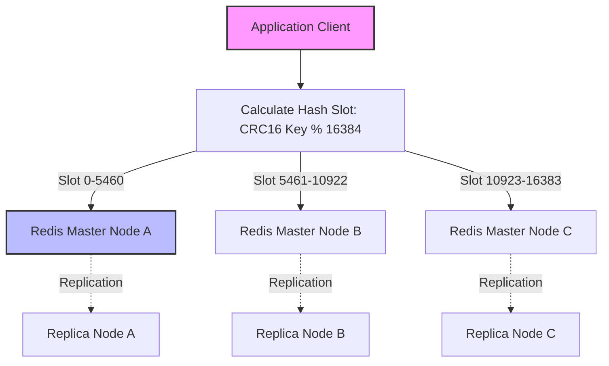

# Redis

## Introduction
Redis (Remote Dictionary Server) is an open-source, in-memory, key-value data structure store. It is widely used as a database, cache, message broker, and streaming engine. By keeping all data in RAM and executing operations on a single-threaded event loop, Redis provides predictable sub-millisecond latencies and high throughput, making it a cornerstone of modern high-scale system designs.

---

## Problem Statement
Traditional relational and non-relational databases store data on persistent disk media (HDDs or SSDs). Even with page caching, disk I/O, lock contention, and query parsing introduce latency bottlenecks. When applications experience traffic spikes requiring hundreds of thousands of read or write operations per second (e.g., real-time session tracking, gaming leaderboards, or API rate limiting), disk-backed systems cannot scale without significant hardware cost and architectural complexity.

---

## Why This Exists
Redis exists to provide ultra-low latency data access. By storing the primary dataset in random-access memory (RAM), it eliminates the disk seek overhead entirely. Additionally, its rich collection of specialized data structures allows developers to perform complex operations (like ranking elements or calculating set intersections) directly inside the database, avoiding the overhead of transferring large volumes of data to the application layer.

---

## Real-world Analogy
Imagine working at a fast-paced reception desk:
*   **Disk Database (SQL):** A giant archive room filled with filing cabinets. Whenever someone asks a question, you must walk to the back room, search folders, and return. This takes minutes.
*   **In-Memory Store (Redis):** A small notebook sitting directly on your desk. For the most common questions (e.g., today's visitor log), you look down and answer in milliseconds.
*   **Single-Threaded Loop:** There is only one receptionist (Redis's single thread) executing tasks. Because they work lightning-fast, and clients queue up in an orderly line, the receptionist handles thousands of queries without losing track or locking folders.

---

## Definition
**Redis** is a schema-less, in-memory key-value database that supports structured values like Strings, Hashes, Lists, Sets, Sorted Sets, Bitmaps, HyperLogLogs, Geospatial Indexes, and Streams.

---

## Key Concepts

### 1. The Single-Threaded Reactor Pattern
Redis is single-threaded for processing client commands. 
*   **Why single-threaded?** It avoids CPU context-switching, thread synchronization, and locking overhead. Since memory operations are fast, the CPU is rarely the bottleneck; network and memory bandwidth are.
*   **How it handles concurrency:** It uses **I/O Multiplexing** (via `epoll` in Linux, `kqueue` in BSD) to monitor thousands of client socket connections concurrently. Socket events are read and pushed to a single event loop queue, where they are executed sequentially.

```
[Client 1] ---\             [ Multiplexing ]             [ Queue ]            [ Event Loop ]
[Client 2] ----- [ Network ] -> [ Selector  ] -> [ Socket Events ] -> [ Single Thread Processor ]
[Client 3] ---/                 (epoll/kqueue)                                     |
                                                                           [ Memory Store ]
```

### 2. Supported Data Structures & Time Complexities
*   **Strings:** Binary-safe sequences of bytes up to 512MB. Used for basic caching. ($O(1)$)
*   **Lists:** Doubly-linked lists of strings, ordered by insertion. Good for queues. ($O(1)$ push/pop)
*   **Hashes:** Field-value pairs. Ideal for representing objects. ($O(1)$ lookups)
*   **Sets:** Unordered collections of unique strings. Supports unions, intersections, and differences. ($O(1)$ membership checks)
*   **Sorted Sets (ZSET):** Collections of unique members associated with a floating-point score. Internally implemented using a **Skip List** and a **Hash Map**. Great for leaderboards. ($O(\log N)$)
*   **HyperLogLogs:** Probabilistic data structure for estimating cardinality (unique items) of massive datasets with negligible memory (12KB). ($O(1)$)
*   **Streams:** Append-only log files designed for streaming messages. Supports consumer groups. ($O(1)$ append)

### 3. Persistence Options
To prevent data loss on restart, Redis offers two persistence strategies:
*   **RDB (Redis Database Snapshotting):** Periodically writes a point-in-time snapshot of the database to disk.
    *   *Mechanism:* Redis calls `fork()` to create a child process. The child writes the dataset to a temporary RDB file using Copy-On-Write (COW) memory management, preserving master performance.
*   **AOF (Append Only File):** Logs every write operation received by the server to an append-only file on disk.
    *   *Fsync Policies:* `always` (slowest, safest), `everysec` (industry standard, max 1s data loss), `no` (delegated to OS buffers).

### 4. High Availability & Scaling
*   **Redis Sentinel:** Manages master-replica setups. It monitors instances, performs automatic failover if the master dies, and notifies clients of configuration changes.
*   **Redis Cluster:** A distributed, sharded implementation of Redis. The keyspace is divided into **16,384 Hash Slots**. Nodes partition data by hashing keys (`CRC16(key) % 16384`) and assigning slot ranges to different master nodes.

---

## Internal Working & Cluster Routing

When a client queries a key in Redis Cluster, the client determines which slot owns the key and routes the request directly.



---

## Java Implementation

The following Java example demonstrates connection pooling, pipelining for bulk operations, and a distributed lock implementation using the `Jedis` client library.

```java
import redis.clients.jedis.Jedis;
import redis.clients.jedis.JedisPool;
import redis.clients.jedis.JedisPoolConfig;
import redis.clients.jedis.Pipeline;
import redis.clients.jedis.params.SetParams;

import java.util.Collections;
import java.util.List;

public class RedisClientManager {
    private final JedisPool jedisPool;

    public RedisClientManager(String host, int port) {
        JedisPoolConfig poolConfig = new JedisPoolConfig();
        poolConfig.setMaxTotal(50);
        poolConfig.setMaxIdle(10);
        poolConfig.setMinIdle(5);
        this.jedisPool = new JedisPool(poolConfig, host, port);
    }

    // ==========================================
    // 1. Basic Key-Value Operations
    // ==========================================
    public void cacheUserSession(String userId, String token, int ttlSeconds) {
        try (Jedis jedis = jedisPool.getResource()) {
            String key = "session:" + userId;
            jedis.setex(key, ttlSeconds, token);
        }
    }

    public String getUserSession(String userId) {
        try (Jedis jedis = jedisPool.getResource()) {
            return jedis.get("session:" + userId);
        }
    }

    // ==========================================
    // 2. Pipelining (Batching for performance)
    // ==========================================
    public void bulkInsertUsers(List<String> userIds, List<String> dataList) {
        try (Jedis jedis = jedisPool.getResource()) {
            Pipeline pipeline = jedis.pipelined();
            for (int i = 0; i < userIds.size(); i++) {
                pipeline.set("user:" + userIds.get(i), dataList.get(i));
            }
            // Execute all commands in a single network round-trip
            pipeline.sync();
        }
    }

    // ==========================================
    // 3. Distributed Lock (Redlock Pattern Primitive)
    // ==========================================
    public boolean acquireLock(String lockKey, String requestId, int expireTimeMs) {
        try (Jedis jedis = jedisPool.getResource()) {
            // NX: Set if not exists
            // PX: Expiry time in milliseconds
            SetParams params = SetParams.setParams().nx().px(expireTimeMs);
            String result = jedis.set(lockKey, requestId, params);
            return "OK".equals(result);
        }
    }

    public boolean releaseLock(String lockKey, String requestId) {
        try (Jedis jedis = jedisPool.getResource()) {
            // Use Lua script to ensure release is atomic and releases only our lock
            String script = "if redis.call('get', KEYS[1]) == ARGV[1] then " +
                            "return redis.call('del', KEYS[1]) " +
                            "else " +
                            "return 0 " +
                            "end";
            Object result = jedis.eval(script, 
                Collections.singletonList(lockKey), 
                Collections.singletonList(requestId));
            return Long.valueOf(1).equals(result);
        }
    }

    public void close() {
        if (jedisPool != null) {
            jedisPool.close();
        }
    }
}
```

---

## Step-by-Step Explanation: Distributed Lock Flow
Using the Java implementation above to coordinate a distributed lock:

1.  **Request Access:** An application worker wants to edit user profile `1001`. It calls `acquireLock("lock:user:1001", "worker_uuid_45", 5000)`.
2.  **Atomic Set:** The Redis engine evaluates `SET lock:user:1001 worker_uuid_45 NX PX 5000`.
    *   If the key does not exist, Redis creates it and sets the value to `worker_uuid_45` with a 5000ms TTL. The command returns `OK` (success).
    *   If the key exists, the write fails, returning `nil` (lock already held by another worker).
3.  **Perform Work:** The successful worker modifies the database profile safely.
4.  **Atomic Release:** Once done, the worker executes a Lua script to release the lock. The script checks if `GET lock:user:1001` equals `worker_uuid_45`.
    *   *If true:* It deletes the lock key.
    *   *If false (e.g., transaction timed out and another client acquired it):* It does not touch the key, avoiding deleting someone else's lock.

---

## Multiple Real-world Examples

1.  **Token Bucket Rate Limiter:** An API gateway maintains client IPs as keys. An incoming request checks if the value is $< 100$. If yes, it increments the key atomically (`INCR`) and sets an expiration (`EXPIRE`). If no, it rejects the request.
2.  **Gaming Leaderboards:** Using Sorted Sets (ZSET). Add user scores via `ZADD leaderboard 9850 player1`. Query top 10 rankings in $O(\log N)$ using `ZREVRANGE leaderboard 0 9 WITHSCORES`.
3.  **Distributed Session Storage:** Shared state across thousands of stateless microservices, ensuring user logins persist across load-balanced requests.
4.  **Pub/Sub Event Bus:** A chat application uses Redis `PUBLISH room1 "hello"` and `SUBSCRIBE room1` to route real-time messages between active web socket connections.

---

## Pros & Cons

### Pros
*   **Extremely Low Latency:** Serves data from memory in microseconds.
*   **Rich Data Model:** Developers can use built-in operations for queues, sets, and streams rather than simulating them.
*   **No Locking Overhead:** Single-threaded design guarantees command safety without transaction deadlocks.
*   **Low CPU Footprint:** Built on efficient I/O multiplexing.

### Cons
*   **Storage Cost:** RAM is more expensive than SSDs/NVMe disks.
*   **Scale Limits:** The entire dataset must fit in the collective memory of the cluster nodes.
*   **Single-Thread Blockers:** Heavy commands like `KEYS *`, `SMEMBERS`, or large `SUNION` execute in $O(N)$ and block all other requests.
*   **Eventual Consistency Replicas:** Master-replica replication is asynchronous, which can lead to stale reads or data loss during a master failover.

---

## Eviction Policies
When Redis memory usage exceeds `maxmemory`, it frees up space using one of the following strategies:
*   **noeviction (Default):** Returns errors on all write operations while continuing to serve reads.
*   **allkeys-lru:** Evicts the least recently used keys across the entire database.
*   **volatile-lru:** Evicts the least recently used keys, but only among those that have an expiration (TTL) set.
*   **allkeys-lfu:** Evicts the least frequently used keys (using an access counter).
*   **volatile-ttl:** Evicts keys with the shortest remaining Time-To-Live.

---

## Interview Questions

### Beginner
*   **Q:** Why is Redis single-threaded, and how does it execute operations so fast?
*   **A:** It is single-threaded to avoid context switching and locking overhead, which simplifies development. It is fast because all data is stored in memory (RAM), eliminating disk seek latencies, and it uses non-blocking I/O multiplexing (`epoll`) to manage concurrent connections.

### Intermediate
*   **Q:** Explain the differences between RDB and AOF persistence in Redis.
*   **A:** RDB takes point-in-time snapshots of the dataset and saves them to disk. It is fast to load and compact but can lose up to several minutes of data in a crash. AOF logs every write command sequentially. It is larger and slower to parse on startup but minimizes data loss (typically to $\le 1$ second).

### Senior
*   **Q:** How does a Redis Cluster handle partition tolerance? What happens if a node splits from the cluster?
*   **A:** Redis Cluster uses master-replica nodes. If Master Node A is partitioned out, the remaining nodes detect its absence. If the majority of masters can communicate, they elect Node A's replica to be the new master. If a split leaves Node A isolated in a minority partition, Node A will eventually reject write operations to protect against split-brain scenarios.

### Staff Engineer
*   **Q:** Describe the Cache Stampede (or Thundering Herd) problem with Redis and how you would prevent it at high scale.
*   **A:** Cache Stampede occurs when a highly popular key expires. If thousands of concurrent requests miss the cache at the same millisecond, they all query the underlying SQL database, overloading it. Prevention techniques include:
    1.  **Mutual Exclusion (Mutex):** Acquire a temporary distributed lock on cache miss. The first worker updates the cache, while others wait/retry.
    2.  **Probabilistic Early Expiration (XFetch):** The client calculates a probability to refresh the cache in the background *before* the key officially expires, ensuring the cache is refreshed before eviction.

---

## Common Mistakes
*   **Using `KEYS *`:** This scans the entire keyspace, blocking the single thread. Always use `SCAN`, which iterates through keys incrementally.
*   **Missing Expiration Times (TTLs):** Forgetting to set a TTL on temporary data causes memory leaks and eventually triggers unpredictable eviction events.
*   **Large Hash/Set Payloads:** Storing fields inside a single Hash key that grows to megabytes. This degrades serialization speed and blocks the event loop.

---

## Best Practices
*   **Set a Maxmemory Limit:** Always configure a `maxmemory` limit and choose an eviction policy (e.g., `allkeys-lru`) to avoid Out-Of-Memory system crashes.
*   **Leverage Connection Pools:** Re-use TCP connections instead of opening and closing them for every request.
*   **Group Writes with Pipelines:** Use pipelining to batch multiple operations together, bypassing network round-trip latencies.

---

## When NOT to Use
*   **Data Exceeds RAM Budget:** If your dataset size is multi-terabyte and can tolerate higher latencies, use disk-backed stores like MongoDB, DynamoDB, or PostgreSQL.
*   **Complex Multi-Table Joins:** Redis is not relational; simulating relational structures requires building complex, brittle custom models in your code.

---

## Comparison with Similar Concepts

*   **Redis vs. Memcached:** Redis supports advanced data structures, persistence, replication, and clustering. Memcached is multi-threaded but supports only strings and has no built-in persistence.
*   **Redis vs. Aerospike:** Aerospike is optimized to utilize NVMe/Flash storage directly alongside RAM (hybrid memory), making it better for multi-terabyte datasets, while Redis relies strictly on RAM.

---

## Summary
Redis is a highly efficient in-memory database that serves as the backbone for low-latency systems. By understanding its single-threaded Reactor pattern, utilizing the correct data structures, and configuring optimal persistence and eviction policies, you can build systems capable of handling millions of requests per second.

---

## Related Topics
- [Caching Strategies](../caching)
- [Cache Aside](../cache-aside)
- [Write Through](../write-through)
- [Write Back](../write-back)
- [CDN](../cdn)
