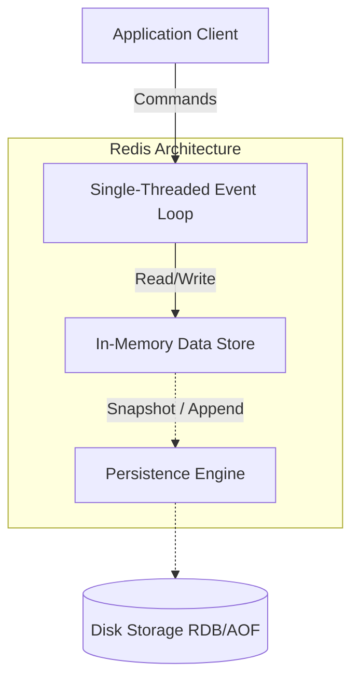

# Redis

## Introduction
Redis (Remote Dictionary Server) is an open-source, in-memory data structure store. It can be used as a database, cache, message broker, and streaming engine. Because it holds all data in memory, it delivers sub-millisecond response times.

## Problem Statement
Traditional relational databases rely on disk storage, which introduces latency due to disk I/O operations. When applications require millions of reads/writes per second (e.g., real-time analytics, session management, leaderboards), disk-backed databases become the bottleneck.

## Why this exists
To provide ultra-fast, predictable performance by serving data directly from memory, avoiding the latency overhead associated with disk-based storage.

## Real-world analogy
Think of your computer's RAM versus its Hard Drive. If you need a document right now while you are actively working, you keep it open on your desk (RAM/Redis). If you need it for long-term storage, you file it away in a cabinet (Hard Drive/SQL Database).

## Definition
Redis is an in-memory, key-value store that supports abstract data structures like strings, lists, maps, sets, sorted sets, HyperLogLogs, bitmaps, streams, and spatial indexes.

## Key concepts
- **In-Memory Store:** Data resides in RAM.
- **Single-Threaded Architecture:** Commands are executed sequentially, eliminating race conditions and complex locking mechanisms.
- **Data Structures:** Unlike simple key-value caches like Memcached, Redis supports complex data types.
- **Persistence:** Offers RDB (snapshots) and AOF (Append Only File) to persist data to disk.
- **Pub/Sub:** Allows message broadcasting to multiple subscribers.

## Internal working / Mermaid diagram



## Python/Java implementation

### Basic Implementation (Python)
```python
import redis

# Connect to Redis
r = redis.Redis(host='localhost', port=6379, db=0)

# Set a key-value pair with a 10-second expiration
r.setex('user:1001:session', 10, 'active')

# Get the value
session = r.get('user:1001:session')
print(session.decode('utf-8')) # Output: active
```

### Better implementation (Leaderboard with Sorted Sets)
```python
# Add players with their scores to a leaderboard
r.zadd('leaderboard', {'Alice': 150, 'Bob': 120, 'Charlie': 200})

# Get top 2 players
top_players = r.zrevrange('leaderboard', 0, 1, withscores=True)
print(top_players) # [(b'Charlie', 200.0), (b'Alice', 150.0)]
```

## Step-by-step explanation
1. The client sends a command over the network using the Redis serialization protocol (RESP).
2. The Redis server adds the command to its event loop queue.
3. Since Redis is single-threaded for command execution, it processes one command at a time.
4. It performs the operation directly on the memory structure.
5. If persistence is enabled, it asynchronously saves changes to disk.
6. The response is returned to the client.

## Multiple real-world examples
1. **Session Cache:** Storing user session tokens for fast authentication.
2. **Gaming Leaderboards:** Using Sorted Sets (ZSET) to maintain real-time rankings.
3. **Rate Limiting:** Using atomic increments and expirations to restrict API requests.
4. **Message Queues:** Using Lists or Pub/Sub for background job processing (e.g., Celery).
5. **Geospatial Indexing:** Finding nearby points of interest for ride-sharing apps.

## Pros
- **Speed:** Sub-millisecond latency.
- **Rich Data Types:** Simplifies complex operations (e.g., set intersections).
- **Simplicity:** Easy to set up and use.
- **Atomic Operations:** Built-in atomicity for complex data structure manipulations.

## Cons
- **Memory Cost:** RAM is significantly more expensive than SSDs/HDDs.
- **Data Size Limit:** Dataset cannot exceed available memory.
- **Single Thread Bottleneck:** CPU-bound operations (e.g., large sort or intersection) can block all other operations.

## Interview questions

### Beginner
- **Q: What is the main difference between Redis and Memcached?**
  - **A:** Redis supports rich data structures (Lists, Sets, Hashes) and persistence to disk, whereas Memcached is purely a string-based, volatile key-value store.

### Intermediate
- **Q: How does Redis handle persistence?**
  - **A:** It uses RDB (point-in-time snapshots) and AOF (Append Only File, logging every write operation). You can use either or both together.

### Senior
- **Q: Since Redis is single-threaded, how does it handle high concurrency?**
  - **A:** Redis uses I/O multiplexing (epoll/kqueue) to handle thousands of concurrent connections efficiently. Since operations are strictly in-memory and don't involve disk seeks, they execute in microseconds, allowing the single thread to process millions of requests per second.

### Staff Engineer
- **Q: What happens when Redis runs out of memory?**
  - **A:** Redis behaves based on its configured `maxmemory-policy`. It can return errors for write operations (`noeviction`), or it can evict keys using policies like `allkeys-lru` (Least Recently Used), `volatile-ttl` (keys with closest expiration), or LFU (Least Frequently Used).

## Common mistakes
- **Running long commands:** Executing `KEYS *` on a large dataset will block the single thread, causing all other requests to time out. Use `SCAN` instead.
- **Ignoring eviction policies:** Not setting a maxmemory limit or eviction policy can lead to Out-Of-Memory (OOM) crashes.

## Best practices
- Use connection pooling to avoid the overhead of TCP handshakes.
- Use pipelines to batch multiple commands into a single network round-trip.
- Prefix keys logically (e.g., `user:1001:profile`) for easier management.

## When NOT to use
- When the dataset size exceeds available RAM and cannot be sharded economically.
- For complex relational queries, joins, or ACID transactions across multiple keys.

## Comparison with similar concepts
- **Redis vs. Relational DB:** Redis is in-memory and unstructured; RDBMS is disk-based, structured, and ACID compliant.
- **Redis vs. Memcached:** Redis offers persistence and data structures; Memcached is simpler and multi-threaded for simple string caching.

## Summary
Redis is a blisteringly fast in-memory data store that excels at caching, session management, and real-time analytics. Its support for complex data structures and atomic operations makes it a versatile tool in modern system design, though it requires careful memory management.

## Related topics
- [Caching Strategies](../caching)
- [Cache Aside](../cache-aside)
- [Write Through](../write-through)
