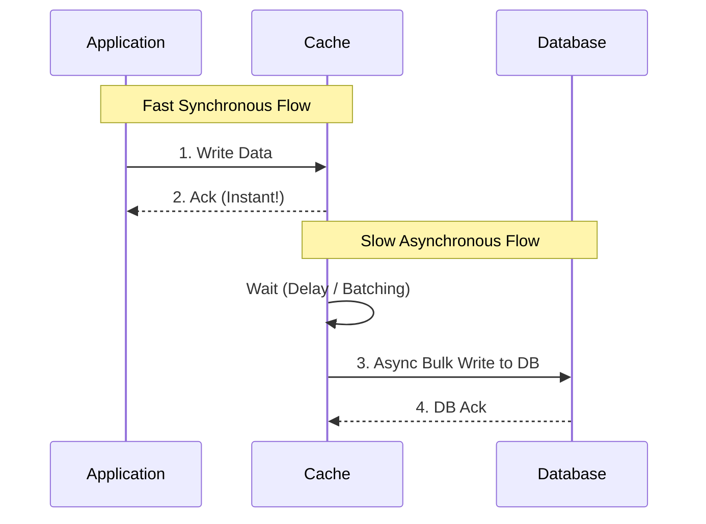

# Write-Back (Write-Behind) Cache

## Introduction
Write-Back (also known as Write-Behind) is a caching strategy where writes are directed only to the cache, and the application receives immediate success confirmation. The cache then asynchronously flushes (writes) the data to the underlying database at a later time.

## Problem Statement
In Write-Through caching, the application must wait for the database to acknowledge the write, resulting in high write latency. If an application is heavily write-bound and requires extreme write speed, waiting for disk I/O on every operation is unacceptable.

## Why this exists
To decouple the application's write speed from the database's write speed. By writing only to memory, the application experiences near-zero write latency, while the heavy lifting of database storage is batched and handled in the background.

## Real-world analogy
Think of a busy restaurant kitchen.
- **Write-Through:** A chef cooks a meal, walks it out to the customer's table, waits for them to confirm it looks good, and then goes back to cook the next meal. Slow.
- **Write-Back:** The chef places the finished meal on the pickup counter (Cache) and immediately starts cooking the next meal. A waiter asynchronously grabs a batch of meals from the counter and takes them to the tables (Database). Fast.

## Definition
A caching pattern where the application writes data to the cache, which instantly acknowledges the write. The cache then asynchronously updates the primary database, often batching multiple writes together.

## Key concepts
- **Asynchronous DB Write:** The database is updated in the background.
- **Batching:** The cache can group multiple writes together, executing them as a single bulk operation to the database.
- **Dirty Bit/Flag:** Cached data that has been modified but not yet synced to the DB is marked as "dirty."

## Internal working / Mermaid diagram



## Python/Java implementation

### Python Implementation (Concept using a message queue)
```python
import redis
import json
import threading

cache = redis.Redis(host='localhost', port=6379, db=0)
queue = redis.Redis(host='localhost', port=6379, db=1) # Acting as a queue

def write_back_update(user_id, data):
    cache_key = f"user:{user_id}:profile"
    
    # 1. Write to Cache (Instant)
    cache.set(cache_key, json.dumps(data))
    
    # 2. Push job to async queue
    job = {'user_id': user_id, 'data': data}
    queue.lpush('db_write_queue', json.dumps(job))
    
    # 3. Return immediately to user
    return True

# --- Background Worker Thread ---
def async_db_writer():
    while True:
        # Grab jobs in batches and write to DB
        job_data = queue.brpop('db_write_queue')
        job = json.loads(job_data[1])
        db_module.update_user(job['user_id'], job['data'])
```

## Step-by-step explanation
1. The application sends a write request to the cache.
2. The cache stores the data in memory and marks it as "dirty".
3. The cache immediately returns a success response to the application.
4. A background process periodically scans for "dirty" records or pulls from a queue.
5. The background process writes the data to the persistent database and marks the cache record as "clean".

## Multiple real-world examples
1. **Operating System Page Cache:** The OS writes to RAM and asynchronously flushes to the hard drive.
2. **Analytics/View Counters:** YouTube video views or website clicks are written to memory rapidly and synced to the DB every few seconds in a batch.
3. **IoT Sensor Data:** Ingesting millions of sensor readings per second into memory, and bulk-inserting them into a time-series database.

## Pros
- **Extremely Fast Writes:** Write latency is determined by RAM, not Disk I/O.
- **Reduced DB Load:** Multiple writes to the same key can be collapsed into a single DB write. High write traffic is absorbed by the cache.
- **Resilience to DB Spikes:** If the database slows down, the application isn't affected immediately.

## Cons
- **Data Loss Risk:** This is the critical flaw. If the cache server crashes before the background process writes the data to the DB, the data is permanently lost.
- **Complex Implementation:** Implementing reliable async background workers, handling retries, and managing queue backups is architecturally complex.
- **Inconsistency:** If another service queries the database directly (bypassing the cache), it will see stale data until the flush occurs.

## Interview questions

### Beginner
- **Q: Why is Write-Back faster than Write-Through?**
  - **A:** Because Write-Back only writes to memory and returns immediately, while Write-Through forces the application to wait until the data is safely written to the slow database on disk.

### Intermediate
- **Q: What is the biggest risk of using a Write-Back cache?**
  - **A:** Data loss. Since the database write happens later, a power failure or crash on the cache node will result in losing all un-synced "dirty" data.

### Senior
- **Q: How can you mitigate the data loss risk in a Write-Back architecture?**
  - **A:** 
    1. Replicate the cache node so memory writes exist on multiple machines.
    2. Use a highly durable message broker (like Kafka) as the buffer between the application and the database.

## Common mistakes
- **Using Write-Back for critical transactional data:** Never use Write-Back for financial transactions, payments, or orders where data loss is unacceptable.
- **Ignoring queue depth:** If the DB goes down, the async queue will fill up. If not monitored, the queue can consume all RAM, crashing the cache layer as well.

## Best practices
- Reserve Write-Back for high-volume, low-criticality data (analytics, likes, view counts).
- Implement robust monitoring on the lag between the cache and the database.

## When NOT to use
- Financial systems, banking, or any ACID-compliant requirement.
- When you cannot tolerate any data loss during a server crash.

## Comparison with similar concepts
- **Write-Back vs Write-Through:** Write-Back is Async (fast, risk of data loss). Write-Through is Sync (slow, safe).

## Summary
Write-Back caching provides unparalleled write performance and protects databases from extreme load spikes. However, it trades durability for speed, making it suitable only for specific use cases where slight data loss is acceptable in the event of a crash.

## Related topics
- [Caching Strategies](../caching)
- [Write Through](../write-through)
- [Cache Aside](../cache-aside)
