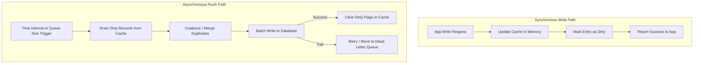

# Write-Back (Write-Behind) Cache

## Introduction
The **Write-Back** (also known as **Write-Behind**) caching pattern is an optimistic caching strategy designed for write-heavy applications. Under this pattern, the application writes data exclusively to the cache layer, which immediately acknowledges the write as successful. A separate background process asynchronously batches, aggregates, and flushes these dirty memory pages or updates to the persistent database at a later time.

---

## Problem Statement
In traditional architectures:
1.  **Write Bottlenecks:** Disk-based databases are slow to execute write transactions due to lock acquisition, transaction log writes (WAL), and index updates.
2.  **High Write Latency:** Forcing an application to wait for database confirmation (as in Write-Through) stalls execution threads, limiting the total requests-per-second a system can handle.
3.  **Database Thrashing:** Frequently updating the same record (e.g., updating a viral video's view count from 100 to 101, then 102, then 103) causes constant, redundant database I/O.

---

## Why This Exists
Write-Back exists to deliver maximum write performance by shifting database updates from the synchronous request path to an asynchronous background worker. Furthermore, it enables **Write-Coalescing** (or Write Merging): if a key is updated 10 times in memory within a 5-second window, the background worker only writes the final state to the database once, dramatically reducing database load.

---

## Real-world Analogy
Imagine a busy mailroom sorting packages:
*   **The Database:** The shipping carrier's truck that departs for the main airport.
*   **The Cache:** A shipping bin situated right next to the mailroom worker's table.
*   **Write-Through:** Every time a worker receives a package, they walk outside to the truck, load it, wait for the driver to sign a receipt, and then walk back to process the next package. The process is slow.
*   **Write-Back:** The worker tosses incoming packages into the shipping bin (Cache) and immediately signs the receipt for the customer. Once the bin fills up (Batching/Queue), a mail handler loads all 100 packages onto a cart and rolls them to the truck at once (Asynchronous Flush).

---

## Definition
**Write-Back** is a caching design pattern where writes are directed only to the cache, which acknowledges the operation instantly. The cache layer asynchronously propagates the updates to the persistent database, typically in batches or after a pre-defined delay.

---

## Key Concepts

### 1. Dirty Bit Tracking
The cache layer tracks which entries have been modified in memory but not yet persisted to the database. These records are marked with a **dirty bit** (or dirty flag). Once the background flusher writes them to disk, the dirty bit is cleared.

### 2. Write-Coalescing (Write Merging)
When multiple updates target the same key in a short time frame, only the latest version is written to the database.
```
Cache Writes (RAM):  Key:A=1  ->  Key:A=2  ->  Key:A=3  (Instant Ack)
                           \_________/
                                | (Coalesced)
Database Write (Disk):       Key:A=3                    (Single Disk Write)
```

### 3. Backpressure & Queue Limits
If the database goes down or experiences degradation, the memory queue in the cache layer begins to grow. If the queue is unbounded, the cache will exhaust system RAM and crash.
*   *Mitigation:* Implement **Backpressure**—if the queue exceeds a threshold, the application must slow down writes, block them, or temporarily drop non-critical updates.

---

## Internal Working: Read, Write, and Flush Paths



---

## Java Implementation

The following Java code provides a complete, thread-safe implementation of a Write-Back cache featuring **Write-Coalescing**, an asynchronous batch flusher daemon, and queue capacity controls.

```java
import java.util.Map;
import java.util.concurrent.*;
import java.util.concurrent.atomic.AtomicInteger;

// Mock persistent database
class SqlDatabase {
    public void bulkUpdate(Map<String, String> updates) {
        System.out.println("SQL DB: Persisting batch of " + updates.size() + " records to disk...");
        try { Thread.sleep(200); } catch (InterruptedException ignored) {} // Simulating slow I/O
        updates.forEach((k, v) -> System.out.println("  DB Saved -> " + k + " : " + v));
    }
}

public class WriteBackCacheManager {
    private final Map<String, String> cacheStore = new ConcurrentHashMap<>();
    
    // Concurrent map tracking dirty keys (value is redundant, we only need keys)
    private final Set<String> dirtyKeys = ConcurrentHashMap.newKeySet();
    private final SqlDatabase database = new SqlDatabase();
    
    // Capacity threshold to prevent Out-Of-Memory
    private final int maxQueueSize = 1000;
    private final ScheduledExecutorService flusherExecutor = Executors.newSingleThreadScheduledExecutor();

    public WriteBackCacheManager() {
        // Run background flusher every 2 seconds
        flusherExecutor.scheduleAtFixedRate(this::flush, 2, 2, TimeUnit.SECONDS);
    }

    public String read(String key) {
        return cacheStore.get(key); // Fast read including unpersisted writes
    }

    // ==========================================
    // ASYNCHRONOUS WRITE-BACK PATH
    // ==========================================
    public boolean write(String key, String value) {
        if (dirtyKeys.size() >= maxQueueSize) {
            System.err.println("Queue Full! Triggering backpressure. Rejecting write for: " + key);
            return false; // Backpressure limit reached
        }

        // 1. Update cache in memory instantly
        cacheStore.put(key, value);

        // 2. Mark key as dirty
        dirtyKeys.add(key);
        return true;
    }

    // ==========================================
    // BACKGROUND FLUSHER DEAMON (Async Flush)
    // ==========================================
    private synchronized void flush() {
        if (dirtyKeys.isEmpty()) {
            return;
        }

        // Collect all dirty records (Coalescing happens naturally since cacheStore holds only the latest values)
        Map<String, String> batchToPersist = new HashMap<>();
        
        // Safely extract dirty keys
        for (String key : dirtyKeys) {
            String value = cacheStore.get(key);
            if (value != null) {
                batchToPersist.put(key, value);
            }
        }

        try {
            // Perform batch write to SQL
            database.bulkUpdate(batchToPersist);
            
            // Clear dirty flags for successfully written keys
            dirtyKeys.removeAll(batchToPersist.keySet());
        } catch (Exception e) {
            System.err.println("Flush execution failed: " + e.getMessage());
            // In a production system, implement exponential backoff retry here
        }
    }

    public void shutdown() {
        flusherExecutor.shutdown();
    }
}
```

---

## Step-by-Step Explanation: Write-Coalescing Flow
Using the Java implementation above when a key is rapidly updated:

1.  **Incoming Updates:** A video receives 3 rapid play events in a 1-second window.
2.  **State Modification:**
    *   `write("video:105", "101")` is called. Key added to `dirtyKeys`. Cache updated.
    *   `write("video:105", "102")` is called. Key already exists in `dirtyKeys`. Cache overwritten.
    *   `write("video:105", "103")` is called. Key already exists in `dirtyKeys`. Cache overwritten.
3.  **Background Flush Trigger:** The executor fires the `flush()` method.
4.  **Batch Building:** The flusher loops over the `dirtyKeys` set, sees `"video:105"`, queries the latest value from `cacheStore` (which is `"103"`), and puts it in the `batchToPersist` map.
5.  **Single SQL Exec:** The database receives a single update command: `UPDATE video SET views = 103`. The updates for `101` and `102` are skipped, saving 2 disk writes.

---

## Multiple Real-world Examples

1.  **Operating System Page Cache:** When processes write to files using the `write()` system call, the OS writes the bytes to memory buffers (page cache) and marks the memory pages as "dirty". The OS `pdflush` or `flusher` daemon writes these pages to the physical disk asynchronously (usually every 30 seconds).
2.  **E-Commerce Shopping Carts:** High-traffic retailers store cart items in Redis. Updates (adding/removing items) write instantly to Redis. A background queue flushes the final cart state to Postgres only when the user transitions to checkout or stays idle.
3.  **High-Throughput Analytics:** Website click trackers (e.g., Google Analytics collectors) write counts to local memory buffers and flush them in 10-second batches to a clickstream database (e.g., ClickHouse).

---

## Pros & Cons

### Pros
*   **Near-Zero Write Latency:** Write performance is bounded by RAM speed, not disk access.
*   **Write-Coalescing:** Reduces database write I/O by collapsing multiple intermediate updates to the same record.
*   **Database Shock Absorber:** Absorbs extreme traffic spikes (e.g., Black Friday sales) by buffering writes in memory.

### Cons
*   **Durability Risk (Data Loss):** If the cache server crashes or loses power before the flush completes, all dirty un-synced writes are lost.
*   **Stale Database Reads:** If external reporting systems bypass the cache and query the database directly, they will read stale data until the next flush cycle.
*   **Complex Failure Recovery:** If the database rejects a flush batch (due to constraint violations or table locks), recovering or retry-syncing specific keys without blocking new incoming writes is complex.

---

## Interview Questions

### Beginner
*   **Q:** What is the primary advantage of Write-Back over Write-Through?
*   **A:** Write-Back has significantly lower write latency because it returns success immediately after writing to memory, whereas Write-Through forces the application to wait for the slow database disk write to complete.

### Intermediate
*   **Q:** What does "Write-Coalescing" mean in a Write-Back cache?
*   **A:** Write-Coalescing is the process of merging multiple writes to the same key into a single database update. If a counter is incremented from 1 to 5 in memory, only the final value of 5 is written to the database, reducing database write operations.

### Senior
*   **Q:** How do you prevent data loss in a Write-Back cache architecture during a sudden node crash?
*   **A:** To make Write-Back resilient:
    1.  **Replication:** Use a clustered cache (like Redis Cluster) with active replication to ensure memory writes exist on master and replica nodes.
    2.  **Durable Buffer:** Route all writes to a durable message log (like Kafka) first. The application writes to Kafka, which acts as the queue, and a worker consumes from Kafka to update both the cache and the database asynchronously.

### Staff Engineer
*   **Q:** How would you handle backpressure in a Write-Back cache system if the database goes offline for several hours?
*   **A:** When the database goes offline, the dirty queue will accumulate writes. To prevent memory exhaustion:
    1.  **Enforce Queue Limits:** Define a maximum queue size. Once breached, transition the system to backpressure mode.
    2.  **Graceful Degradation:** Reject non-critical writes (e.g., analytics updates) or return "System Busy" errors to the client.
    3.  **Persistent Spillover:** If memory is full, serialize older queued elements to local disk storage (e.g., RocksDB on local SSD) to free up RAM.
    4.  **Rate Limiting:** Throttle incoming client writes to match the database recovery speed once it comes online.

---

## Common Mistakes
*   **Using for Financial Data:** Storing ledger balances using Write-Back, where losing a single write during a crash violates accounting regulations.
*   **Unmonitored Queue Lag:** Failing to track the time lag between cache writes and database flushes. High lag indicates a database bottleneck.
*   **Ignoring Database Failures:** Assuming database writes will always succeed during flushes, resulting in discarded updates when failures occur.

---

## Best Practices
*   **Set Memory Limits:** Always specify a maximum queue/dirty-key limit to prevent Out-of-Memory crashes.
*   **Implement Dead Letter Queues (DLQ):** If a batch write fails repeatedly, isolate the corrupt records in a DLQ for manual analysis rather than blocking the flusher thread.
*   **Use Transaction Logs:** Pair memory queues with lightweight disk logging (like a Write-Ahead Log) on the cache server to guarantee durability.

---

## When NOT to Use
*   **High-Consistency Systems:** Financial transactions, user password updates, or medical records where data loss is unacceptable.
*   **Low-Volume, Read-Only Systems:** If writes are rare, the complexity of managing background worker threads outweighs any performance gains.

---

## Comparison with Similar Concepts

*   **Write-Back vs. Write-Through:** Write-Back is asynchronous (fast writes, data loss risk). Write-Through is synchronous (slower writes, highly durable).
*   **Write-Back vs. Saga Pattern:** Write-Back buffers writes to a single database. Sagas manage distributed transactions across multiple independent microservice databases.

---

## Summary
Write-Back caching is the ultimate tool for achieving high-performance writes and protecting databases from load spikes. By buffering writes in memory and asynchronously flushing coalesced updates to disk, systems can achieve incredible scale, provided they are architected to tolerate minor data loss during failures.

---

## Related Topics
- [Caching Strategies](../caching)
- [Write Through](../write-through)
- [Cache Aside](../cache-aside)
- [Cache Invalidation](../cache-invalidation)
- [Redis](../redis)
