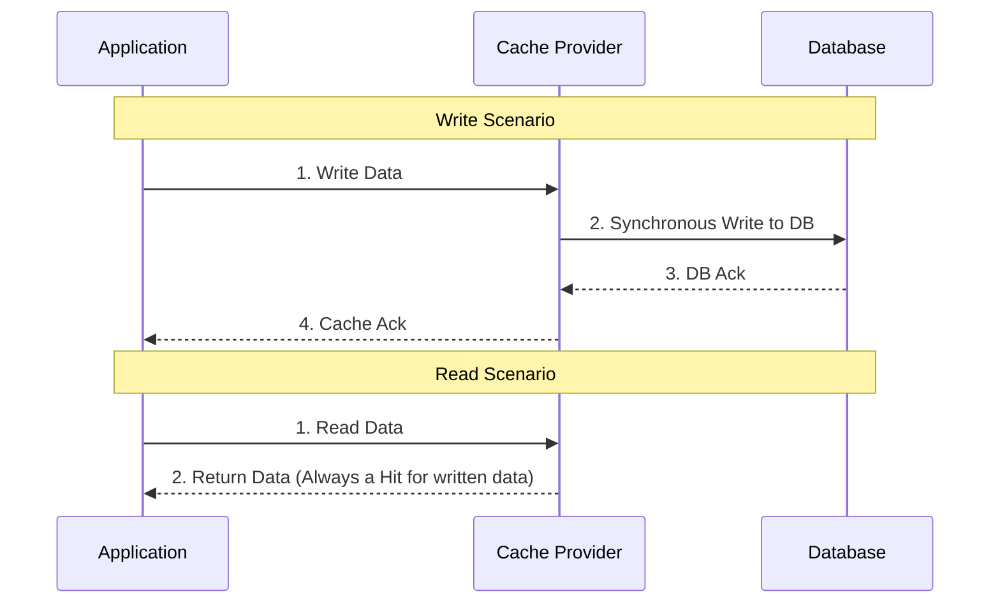

# Write-Through Cache

## Introduction
Write-Through is a caching strategy where the application treats the cache as the primary data store. Every write operation is directed to the cache, and the cache synchronously updates the underlying database before returning a success response to the application.

## Problem Statement
In the Cache-Aside pattern, data is written to the database first, and the cache is invalidated. This means the next read will experience a cache miss and latency. If an application needs strong consistency between the cache and the database and wants to ensure newly written data is immediately available for fast reads, Cache-Aside falls short.

## Why this exists
To ensure that the cache and the database are always perfectly in sync, and that newly written data is instantly available in the cache without the penalty of a subsequent cache miss.

## Real-world analogy
Imagine a retail store clerk logging a sale.
- **Cache-Aside:** The clerk writes the sale in the master ledger in the backroom (Database), and then erases the temporary clipboard up front (Cache). The next time someone asks about sales, the clerk has to run to the backroom.
- **Write-Through:** The clerk writes the sale on the temporary clipboard up front (Cache) AND a carbon copy instantly transfers the record to the master ledger in the backroom (Database). Both are updated simultaneously.

## Definition
A caching pattern where data is written into the cache and the corresponding database simultaneously. The application waits until both writes are confirmed before proceeding.

## Key concepts
- **Synchronous Write:** The write to the DB happens in the same execution thread as the write to the cache.
- **Read-Through:** Write-Through is almost always paired with Read-Through (where the application only asks the cache for data, and the cache fetches from the DB if there is a miss).
- **Strong Consistency:** The cache and database are guaranteed to have the exact same data.

## Internal working / Mermaid diagram



## Python/Java implementation

*Note: In true Write-Through, the caching middleware (like Redis Enterprise or AWS DAX) handles the DB write. If doing it in application code, it looks like this:*

### Python Implementation
```python
import redis
import db_module # Hypothetical DB

cache = redis.Redis(host='localhost', port=6379, db=0)

def write_through_update(user_id, user_data):
    cache_key = f"user:{user_id}:profile"
    
    # 1. Start a transaction (conceptual)
    try:
        # 2. Write to Database synchronously
        db_module.update_user(user_id, user_data)
        
        # 3. Write to Cache immediately
        cache.set(cache_key, user_data)
        
        return True
    except Exception as e:
        # Rollback logic if DB fails
        return False
```

## Step-by-step explanation
1. Application sends a write request to the Cache layer.
2. The Cache layer updates its in-memory data.
3. The Cache layer immediately and synchronously writes the same data to the underlying database.
4. Once the database confirms the write, the Cache layer returns success to the application.

## Multiple real-world examples
1. **Financial Systems:** Where the database must have the record for durability, but the application needs immediate, fast access to the updated balance.
2. **DynamoDB Accelerator (DAX):** AWS DAX operates as a fully managed write-through cache for DynamoDB.
3. **Gaming State:** Updating a player's inventory where the read must be instant immediately after a purchase.

## Pros
- **Consistency:** Cache and database are always in sync. No stale data.
- **No Cache Miss on Write:** Newly written data is already in the cache, making the very next read lightning fast.
- **Simplified Application Code:** The application only talks to the cache abstraction; it doesn't need complex invalidation logic.

## Cons
- **High Write Latency:** Every write incurs the latency of writing to the cache PLUS writing to the database.
- **Cache Churn / Wasted Memory:** Data is cached even if it is never read again. If you bulk-insert 10,000 records, they all sit in the cache taking up expensive memory.

## Interview questions

### Beginner
- **Q: In a Write-Through cache, what happens when you write data?**
  - **A:** The data is written to the cache and the database at the exact same time, and the application waits for both to finish.

### Intermediate
- **Q: What is the main disadvantage of a Write-Through cache?**
  - **A:** Write latency. Since the application must wait for the database write to complete, writes are slower than if you only wrote to memory.

### Senior
- **Q: Why is Write-Through rarely implemented in application code (like Cache-Aside) and mostly done by middleware?**
  - **A:** Implementing true Write-Through in application code is difficult because keeping the DB and Cache transactionally atomic in a distributed environment (handling partial failures) requires complex two-phase commits. Middleware (like AWS DAX) handles this atomicity natively.

## Common mistakes
- **Using Write-Through for Write-Heavy workloads:** The double-write penalty will severely degrade system performance.
- **Not pairing with an eviction policy:** Since every write goes to the cache, the cache will fill up quickly with data that might never be read.

## Best practices
- Only use when strong consistency is strictly required.
- Pair with a strong TTL/Eviction policy (like LRU) to ensure the cache isn't filled with write-heavy, read-rare data.

## When NOT to use
- Systems with massive write volumes (IoT sensor ingestion, logging).
- Systems where writes are frequent but subsequent reads are rare.

## Comparison with similar concepts
- **Write-Through vs Cache-Aside:** Write-Through updates cache on write; Cache-Aside invalidates cache on write.
- **Write-Through vs Write-Back:** Write-Through writes to DB synchronously; Write-Back writes to DB asynchronously.

## Summary
Write-Through caching provides excellent data consistency and fast read performance at the expense of higher write latency. It is ideal for systems where data is written once, read frequently, and must absolutely be consistent across the cache and database.

## Related topics
- [Caching Strategies](../caching)
- [Cache Aside](../cache-aside)
- [Write Back](../write-back)
