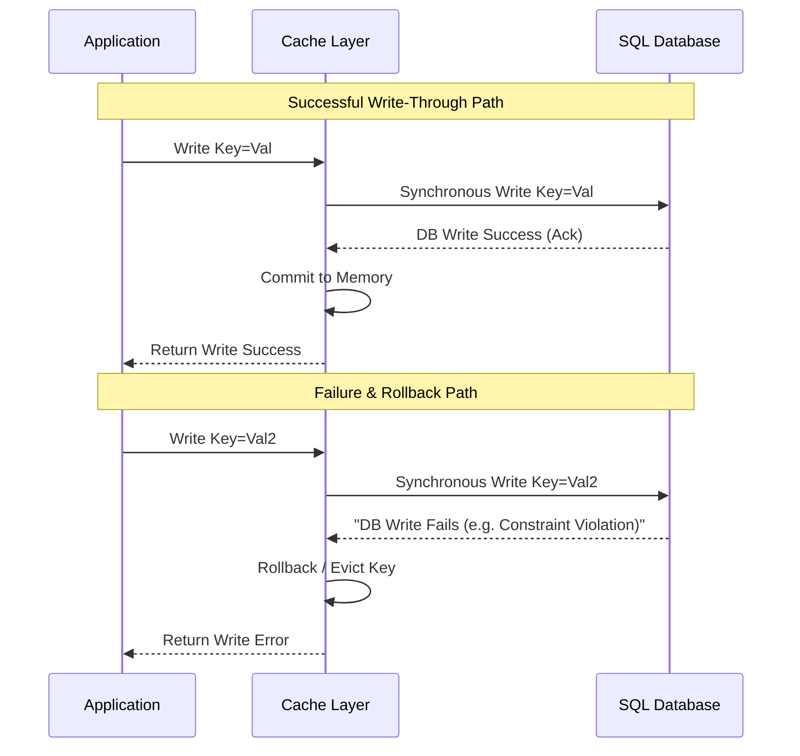

# Write-Through Cache

## Introduction
The **Write-Through** cache pattern is a high-consistency caching strategy where the application treats the caching layer as the primary interface for write operations. When the application writes or updates data, the cache layer intercepts the write, updates its in-memory store, and synchronously writes the same data to the underlying persistent database. The write operation is acknowledged to the application only after both stores are successfully updated.

---

## Problem Statement
In read-heavy applications using patterns like Cache-Aside, updating data requires invalidating (deleting) the corresponding cache keys. This introduces:
1.  **Read Latency Penalty:** The very next read for that data experiences a cache miss, forcing a slow round-trip query to the database.
2.  **Inconsistency Windows:** During the interval between the database write and the cache deletion, other clients read stale data from the cache.
3.  **Complex Client Logic:** The client application must manage dual-writing and eviction logic, raising the risk of implementation errors.

---

## Why This Exists
Write-Through exists to guarantee strict consistency between the cache and the database while keeping read performance consistently fast. Because new writes immediately populate the cache, reads never suffer from a "cold start" miss penalty. This pattern is typically integrated into database middleware or caching proxies (like AWS DAX) to decouple caching concerns from application code.

---

## Real-world Analogy
Imagine a clerk at a bank counter:
*   **The Database:** The physical security vault in the back room containing the safe boxes.
*   **The Cache:** A drawer under the clerk's counter.
*   **The Write-Through Operation:** When you deposit cash, the clerk writes the new balance on the slip in the desk drawer (Cache) and immediately signals a colleague to record the exact same balance in the main database vault (Database). You must wait at the counter until both the clerk's drawer and the vault records are updated. Once complete, if you immediately ask for your balance, the clerk reads it directly from the desk drawer in seconds.

---

## Definition
**Write-Through** is a caching design pattern where data is written to the cache and the underlying persistent database synchronously in a single write operation. The calling application waits for both writes to confirm before completing.

---

## Key Concepts

### 1. Synchronous Dual-Writing
Unlike asynchronous patterns, Write-Through requires a blocking synchronous call to the database. The total write latency is equal to:
$$\text{Latency} = \text{Latency}_{\text{Cache Write}} + \text{Latency}_{\text{Database Write}} + \text{Network Overhead}$$

### 2. Pairing with Read-Through
Write-Through is rarely used in isolation; it is almost always paired with **Read-Through**. Together, they form an abstraction layer: the application interacts *only* with the cache API for all CRUD operations, completely hiding the database from the business logic.

### 3. Cache Churn (Wasted Memory)
Because every write goes directly into the cache, the cache can quickly fill up with data that is rarely or never read (e.g., bulk uploads of historical data).
*   *Mitigation:* Use an aggressive **Least Recently Used (LRU)** eviction policy to quickly purge keys that do not receive subsequent reads.

---

## Internal Working: Successful and Rollback Flows

The following diagram illustrates the successful write-through path and the required rollback sequence if the database write fails.



---

## Java Implementation

The following Java code demonstrates a transaction-aware Write-Through cache manager. If the database write fails, the cache state is rolled back to prevent data inconsistency.

```java
import java.util.Map;
import java.util.concurrent.ConcurrentHashMap;

// Mock persistent database
class DatabaseEngine {
    private final Map<String, String> diskStore = new ConcurrentHashMap<>();

    public void persist(String key, String value) throws Exception {
        // Simulate potential database failures (e.g., database down, unique constraints)
        if ("invalid_key".equals(key)) {
            throw new Exception("Database Constraint Violation!");
        }
        try { Thread.sleep(50); } catch (InterruptedException ignored) {} // Disk write delay
        diskStore.put(key, value);
    }
}

// Transaction-Aware Write-Through Cache Manager
public class WriteThroughCacheManager {
    private final Map<String, String> cacheStore = new ConcurrentHashMap<>();
    private final DatabaseEngine database = new DatabaseEngine();

    // Read Path: Paired with Read-Through
    public String read(String key) {
        String val = cacheStore.get(key);
        if (val != null) {
            return val; // Cache Hit
        }
        // In real Read-Through, fetch from DB on miss (omitted for simplicity)
        return null;
    }

    // ==========================================
    // SYNCHRONOUS WRITE-THROUGH IMPLEMENTATION
    // ==========================================
    public boolean write(String key, String value) {
        String previousValue = cacheStore.get(key);

        // 1. Speculatively update the cache
        cacheStore.put(key, value);

        try {
            // 2. Synchronously write to the database
            database.persist(key, value);
            System.out.println("Write-Through success for Key: " + key);
            return true;
        } catch (Exception e) {
            System.err.println("Database write failed: " + e.getMessage() + ". Rolling back cache...");
            
            // 3. Rollback Cache to maintain consistency
            if (previousValue == null) {
                cacheStore.remove(key);
            } else {
                cacheStore.put(key, previousValue);
            }
            return false;
        }
    }
}
```

---

## Step-by-Step Explanation: Database Rollback Flow
Using the Java implementation above when a database write fails:

1.  **Write Interception:** The application executes `write("invalid_key", "secret_data")`.
2.  **Speculative Cache Update:** The Cache Manager immediately updates the cache in RAM with `{"invalid_key": "secret_data"}` to keep reads fast.
3.  **Database Invocation:** The Cache Manager makes a blocking call to `database.persist("invalid_key", "secret_data")`.
4.  **Database Failure:** The database engine throws a `"Database Constraint Violation!"` exception.
5.  **Cache Rollback:** The `catch` block catches the exception. Since the write failed in the persistent store, keeping it in the cache would cause a silent inconsistency. The manager evicts the speculative `"invalid_key"` from `cacheStore`.
6.  **Fail Acknowledgment:** The method returns `false` to the application, notifying it that the transaction failed.

---

## Multiple Real-world Examples

1.  **AWS DynamoDB Accelerator (DAX):** DAX is an inline, write-through cache for DynamoDB. Applications point their DynamoDB SDK clients directly to the DAX cluster endpoint. Writes sent to DAX are written to both DAX memory and DynamoDB tables synchronously.
2.  **CPU L1/L2 Caches:** CPU architectures can use write-through caching to write data to L1 cache and main system memory (RAM) at the same time, ensuring other CPU cores always read consistent values.
3.  **Enterprise Content Management (ECM):** Image and document management systems cache metadata in Redis for instant search and update MySQL records synchronously.

---

## Pros & Cons

### Pros
*   **Strong Consistency:** Eliminates the possibility of cache-database data drift.
*   **No Read Penalties:** Newly updated data is cached immediately, eliminating cache misses on subsequent reads.
*   **Decoupled Application Logic:** When paired with Read-Through, the application has no awareness of database transactions or caching structures.

### Cons
*   **Write Penalty:** Every write operation is limited by the speed of the disk-based database.
*   **Cache Churn:** Fills memory with write-heavy data that may never be read again, increasing caching hardware costs.
*   **Distributed Transaction Complexity:** Maintaining atomicity between the cache and the database during node failures requires complex distributed transaction protocols.

---

## Interview Questions

### Beginner
*   **Q:** What is the difference between Write-Through and Cache-Aside?
*   **A:** In Write-Through, the application writes directly to the cache, which synchronously updates the database (cache is populated *on write*). In Cache-Aside, the application updates the database directly and deletes the cache key (cache is populated lazily *on read*).

### Intermediate
*   **Q:** What is "Cache Churn" in Write-Through systems, and how do you mitigate it?
*   **A:** Cache churn occurs when an application writes large volumes of data that are rarely read, filling the cache with useless entries. It can be mitigated using an LRU (Least Recently Used) eviction policy or by implementing **Write-Around**, where writes bypass the cache entirely and go directly to the DB, leaving the cache to be populated on read misses.

### Senior
*   **Q:** How do you handle partial failures in a Write-Through cache implementation? (e.g., Cache write succeeds, but DB write fails).
*   **A:** If the database write fails, the cache write must be rolled back immediately. This can be done by restoring the previous cache value or evicting the key entirely. If the database write succeeds but the cache write fails, the database transaction must be aborted, or a background cleanup process must immediately evict the key from the cache to ensure consistency.

### Staff Engineer
*   **Q:** How would you design a Write-Through caching layer for an Active-Active multi-master database system spanning two global regions?
*   **A:** A global Write-Through cache must handle cross-region write latencies. Writing synchronously to both local and remote regions' databases before acknowledging a write causes prohibitive latencies. The design should utilize:
    1.  **Local Write-Through:** Write synchronously to the local cache and local master database.
    2.  **Asynchronous Replication:** Let the database replicate updates to the remote region.
    3.  **CDC-driven Invalidation:** A CDC agent (like Debezium) in the remote region monitors the incoming replication stream and invalidates or updates the remote region's cache, accepting a brief window of eventual consistency across regions.

---

## Common Mistakes
*   **Omitting Eviction Policies:** Running a Write-Through cache without a memory limit/LRU eviction policy, leading to Out-Of-Memory (OOM) crashes.
*   **Neglecting Failures:** Forgetting to implement rollback logic in the cache when the synchronous database write fails, resulting in permanent corruption.
*   **Using for Analytics/Log Ingestion:** Implementing Write-Through for systems with massive append-only logging writes.

---

## Best Practices
*   **Pair with Read-Through:** Ensure the application uses a single interface for all data access to prevent coding errors.
*   **Ensure Atomicity:** Wrap cache and DB writes in a transaction block or use robust middleware designed for write-through.
*   **Tune Cache Expiration:** Set a reasonable TTL to prevent inactive keys from permanently consuming memory.

---

## When NOT to Use
*   **Write-Heavy Workloads:** Ingestion platforms, IoT telemetry, or audit trails where write latency must be kept low.
*   **High-Volume Batch Processing:** Importing millions of records at once will wipe out the active read cache due to churn.

---

## Comparison with Similar Concepts

*   **Write-Through vs. Write-Back:** Write-Through writes to the database synchronously. Write-Back writes to the database asynchronously in batches, trading durability for write performance.
*   **Write-Through vs. Write-Around:** Write-Through populates the cache on every write. Write-Around writes directly to the DB, bypassing the cache, and populates the cache only on read misses.

---

## Summary
Write-Through caching provides strong data consistency and high read performance by synchronously updating both the cache and database on writes. While it introduces higher write latency and memory overhead, it is highly effective for systems that require consistent data availability without read miss penalties.

---

## Related Topics
- [Caching Strategies](../caching)
- [Cache Aside](../cache-aside)
- [Write Back](../write-back)
- [Cache Invalidation](../cache-invalidation)
- [Redis](../redis)
