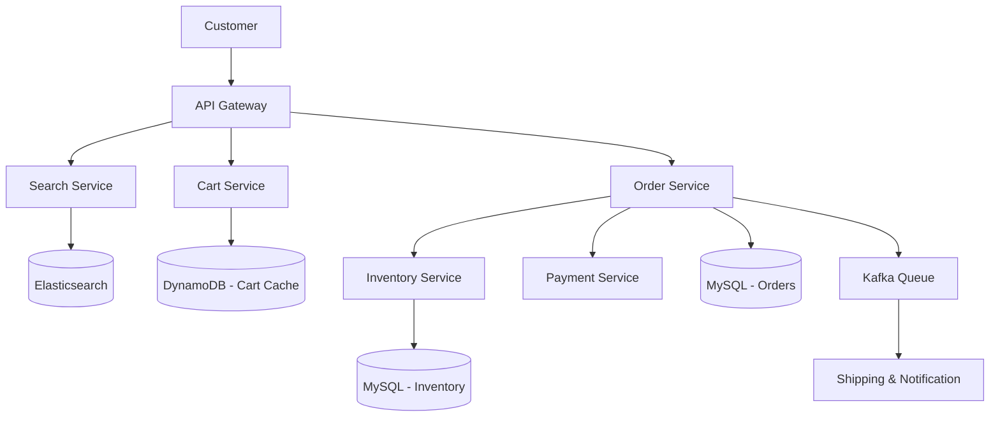

# Amazon (E-commerce System)

## Introduction
Amazon is the world's largest e-commerce platform. Designing an e-commerce platform requires solving complex problems around distributed inventory management, real-time pricing, shopping carts, and extremely high-availability payment processing during traffic spikes like Black Friday.

## Problem Statement
When millions of users try to buy limited-stock items simultaneously (like a new PlayStation release), the system must guarantee that we don't sell more items than we actually have in the warehouse, while simultaneously ensuring the checkout process is incredibly fast and never fails.

## Functional Requirements
1. Users can search for products.
2. Users can view product details, reviews, and inventory status.
3. Users can add items to a shopping cart.
4. Users can place an order and process payments.

## Non-Functional Requirements
1. **High Availability:** The search, product viewing, and Add to Cart functionality must never go down. (Amazon famously estimates that every 100ms of latency costs them 1% in sales).
2. **Consistency:** Checkout and Inventory deduction must be strictly consistent.
3. **Scalability:** Must handle massive traffic spikes (e.g., Prime Day).

## Capacity Estimation
- 300 Million active users.
- 500 Million products in the catalog.
- Thousands of orders placed per second during peak times.

## Core Architecture

An e-commerce platform is naturally split into dozens of microservices. The most critical are:
1. **Search & Catalog Service (Read-Heavy)**
2. **Shopping Cart Service (Write-Heavy)**
3. **Inventory Service (Strictly Consistent)**
4. **Order & Payment Service (Transactional)**

## Internal working / Mermaid diagram



## Service Details

### 1. Catalog & Search
- Users search using natural language. A standard relational DB is too slow for text search.
- **Solution:** All product metadata (title, description, price) is indexed in **Elasticsearch** (or Apache Solr). Elasticsearch is an optimized, distributed search engine capable of full-text search and faceted filtering in milliseconds.

### 2. Shopping Cart
- The cart must be highly available. If the cart goes down, users can't buy anything.
- **Solution:** Store cart data in a highly available, wide-column NoSQL database like **DynamoDB** or **Cassandra**.
- *Trade-off:* We prioritize Availability over Consistency here. If a user adds an item to their cart on their phone, and instantly opens their laptop, the cart might not be perfectly synced for a few seconds. This is acceptable. Amazon pioneered Dynamo precisely to solve the Shopping Cart availability problem.

### 3. Inventory Management (The Hard Part)
- You have 5 PlayStations in stock. 10,000 people click "Checkout" at the exact same millisecond. How do you prevent overselling?
- **Solution:** You MUST use a Relational Database (like PostgreSQL or MySQL) for inventory because you need strict **ACID** properties (specifically, Row-Level Locking).
- **The SQL Query:** 
  ```sql
  UPDATE inventory 
  SET quantity = quantity - 1 
  WHERE product_id = 'PS5' AND quantity >= 1;
  ```
- By using database row locks, the DB ensures that transactions execute sequentially, guaranteeing we never hit negative inventory.

### 4. Order & Payment (The Saga Pattern)
- When placing an order, we need to:
  1. Deduct Inventory.
  2. Charge the Credit Card.
  3. Create the Order Record.
- These operations span multiple microservices. If the payment fails, we MUST put the item back into inventory. Since we can't use a single database transaction across different microservices, we use the **Saga Pattern**.
- The Saga pattern coordinates a sequence of local transactions. If any step fails, it executes **Compensating Transactions** (e.g., sending a message to the Inventory service to add `+1` back to the stock).

## Caching Strategy
- Product Details (Images, Descriptions, Reviews) rarely change.
- They are aggressively cached in **Redis** and distributed globally via a **CDN**.
- Prices and Inventory status, however, are dynamic and cannot be heavily cached.

## Scaling Strategy
- **CQRS (Command Query Responsibility Segregation):** The database used to write new product listings (Command) is separate from the highly-optimized Elasticsearch cluster used to serve reads (Query) to customers.
- **Asynchronous Processing:** Once the payment clears, the user gets a "Success" screen. The actual work of notifying the warehouse, generating the shipping label, and sending the email is completely decoupled. The Order Service drops an event into Kafka, and downstream services process it at their own pace.

## Bottlenecks & Trade-offs
- **Flash Sales:** During a flash sale (e.g., Prime Day lightning deal), a million people hit the same MySQL inventory row simultaneously, causing massive lock contention and crashing the database.
- *Mitigation:* Place a **Redis** layer in front of the inventory database. Pre-load the 1,000 available items into Redis. Use Redis's atomic `DECR` command to handle the initial rush in memory. Only the 1,000 successful users are then passed to the slow MySQL database for final checkout. The other 999,000 are instantly rejected from memory.

## Summary
An E-commerce architecture is an exercise in choosing the right database for the right job. It uses Elasticsearch for fast catalog searching, DynamoDB/Cassandra for highly available shopping carts, and strict relational databases with Saga patterns for transactional consistency in orders and inventory.

## Related topics
- [Microservices / Saga Pattern](../../microservices/saga-pattern)
- [Databases (SQL vs NoSQL)](../../databases/nosql)
- [Elasticsearch / Full Text Search](../../databases/indexing)
