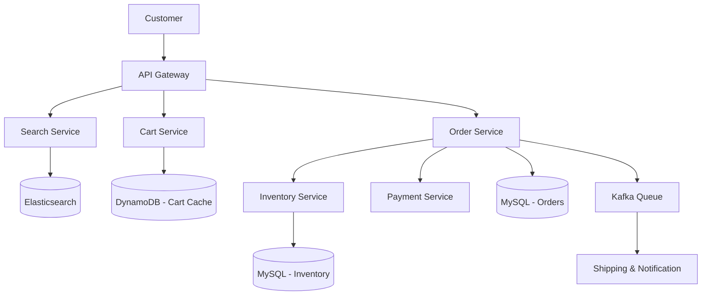

# Amazon (E-commerce System)

## Introduction
Amazon is the world's largest e-commerce platform. Designing an e-commerce platform requires solving complex problems around distributed inventory management, real-time pricing, shopping carts, and extremely high-availability payment processing during traffic spikes like Black Friday.

## Problem Statement
When millions of users try to buy limited-stock items simultaneously (like a new PlayStation release), the system must guarantee that we don't sell more items than we actually have in the warehouse, while simultaneously ensuring the checkout process is fast and never fails.

## Why this exists
To maintain transactional consistency across distributed systems, manage real-time inventory updates, and scale shopping cart access under high traffic volume.

## Real-world analogy
Imagine a popular shoe store. If the store let all 1,000 customers outside run into the backroom simultaneously to grab the last 5 pairs of shoes (Direct DB hits), chaos would erupt and the store would be trashed. Instead, the clerk stands at the counter, hands out 5 raffle tickets (Redis Pre-reservation) to the first 5 people in line, and tells the other 995 customers to go home. Only the 5 ticket holders are allowed to pay at the cash register (SQL DB).

## Definition
A distributed, multi-service e-commerce architecture utilizing full-text catalog search, highly available cart caches, and decoupled transactional order pipelines managed via saga coordination.

## Functional Requirements
1. Users can search for products.
2. Users can view product details, reviews, and inventory status.
3. Users can add items to a shopping cart.
4. Users can place an order and process payments.

## Non-Functional Requirements
1. **High Availability:** Search and catalog must never go down (every 100ms of latency costs 1% in sales).
2. **Consistency:** Checkout and inventory deduction must be strictly consistent (ACID).
3. **Scalability:** Must handle massive traffic spikes (e.g., Prime Day).

## Capacity Estimation
- **Users:** 300 Million active users.
- **Catalog:** 500 Million products.
- **Order Volume:** Thousands of orders placed per second during peak times.

---

## Python/Java implementation

Below is a Java simulation of the Inventory Reservation Engine.

### Java Implementation

#### Bad implementation
*Directly updating the SQL database with row-locking queries on every single request. Under high traffic (flash sales), this causes lock contention, connection timeouts, and database crashes.*

```java
import java.sql.Connection;
import java.sql.PreparedStatement;

// BAD: Direct database row-locking on every checkout hit.
// Causes connection pool exhaustion and database crashes under concurrent flash sale loads.
public class DirectInventoryUpdater {

    public boolean purchaseItem(String productId, Connection dbConn) throws Exception {
        // VULNERABILITY: Every thread attempts to lock and update the SQL row.
        // If 10,000 threads hit this simultaneously for 5 items, 9,995 threads block, waiting for locks.
        String query = "UPDATE inventory SET quantity = quantity - 1 WHERE product_id = ? AND quantity >= 1";
        try (PreparedStatement ps = dbConn.prepareStatement(query)) {
            ps.setString(1, productId);
            int rowsUpdated = ps.executeUpdate();
            return rowsUpdated > 0; // Returns true if stock was successfully deducted
        }
    }
}
```

#### Better implementation
*Using synchronized locks in application code to serialize access. While this prevents database locks, it cannot scale across multiple application servers and causes request timeouts.*

```java
// BETTER: Application-Level synchronized locking.
// Prevents database load, but limits throughput and does not work across multiple distributed server instances.
public class LocalLockedInventory {
    private int stockCount = 5;

    public synchronized boolean purchaseItem(String productId) {
        if (stockCount >= 1) {
            stockCount--;
            // Write to database...
            return true;
        }
        return false;
    }
}
```

#### Best implementation
*A simulation of Amazon's Flash Sale inventory mitigation. It uses an in-memory atomic cache (representing Redis) to pre-reserve stock using fast, lock-free decrements. Only successful reservations are placed in a database write queue, rejecting excess requests instantly in memory.*

```java
import java.util.concurrent.BlockingQueue;
import java.util.concurrent.ConcurrentHashMap;
import java.util.concurrent.LinkedBlockingQueue;
import java.util.concurrent.atomic.AtomicInteger;

// BEST: Redis-Style Pre-Reservation & Asynchronous Database Queue
public class FlashSaleInventoryManager {
    private final ConcurrentHashMap<String, AtomicInteger> redisStockCache = new ConcurrentHashMap<>();
    private final BlockingQueue<OrderRequest> dbWriteQueue = new LinkedBlockingQueue<>();
    private final SqlDatabaseMock sqlDatabase = new SqlDatabaseMock();

    public FlashSaleInventoryManager() {
        // Background worker executing database writes sequentially
        Thread dbWorker = new Thread(() -> {
            while (true) {
                try {
                    OrderRequest request = dbWriteQueue.take();
                    sqlDatabase.deductInventoryAndCreateOrder(request);
                } catch (InterruptedException e) {
                    Thread.currentThread().interrupt();
                    break;
                }
            }
        });
        dbWorker.setDaemon(true);
        dbWorker.start();
    }

    public void loadStockToCache(String productId, int quantity) {
        redisStockCache.put(productId, new AtomicInteger(quantity));
        sqlDatabase.initializeStock(productId, quantity);
    }

    // High-Throughput Write Path (Fast in-memory check)
    public boolean reserveStock(String userId, String productId) {
        AtomicInteger cachedStock = redisStockCache.get(productId);
        if (cachedStock == null) return false;

        // Atomic decrement (simulates Redis DECR)
        int remaining = cachedStock.decrementAndGet();
        if (remaining >= 0) {
            // SUCCESS: Stock reserved in cache. Queue DB write.
            System.out.println("Reserved in Cache: User [" + userId + "] reserved [" + productId + "]");
            dbWriteQueue.offer(new OrderRequest(userId, productId));
            return true;
        } else {
            // FAIL: Out of stock. Undo decrement and reject instantly.
            cachedStock.incrementAndGet();
            System.out.println("Rejected in Cache: Out of stock for [" + productId + "]");
            return false;
        }
    }

    static class OrderRequest {
        final String userId;
        final String productId;
        public OrderRequest(String userId, String productId) {
            this.userId = userId; this.productId = productId;
        }
    }

    static class SqlDatabaseMock {
        private final Map<String, Integer> dbStock = new HashMap<>();

        public synchronized void initializeStock(String id, int qty) { dbStock.put(id, qty); }

        public synchronized void deductInventoryAndCreateOrder(OrderRequest req) {
            int currentStock = dbStock.getOrDefault(req.productId, 0);
            if (currentStock > 0) {
                dbStock.put(req.productId, currentStock - 1);
                System.out.println("SQL DB -> Inventory deducted. Created order for User: " + req.userId);
            }
        }
    }
}
```

---

## Core Architecture

An e-commerce platform is naturally split into dozens of microservices:
1. **Search & Catalog Service (Read-Heavy)**
2. **Shopping Cart Service (Write-Heavy)**
3. **Inventory Service (Strictly Consistent)**
4. **Order & Payment Service (Transactional)**

## Internal working / Mermaid diagram



## Service Details

### 1. Catalog & Search
- Users search using natural language. A standard relational database is too slow for full-text searches.
- **Solution:** All product metadata is indexed in **Elasticsearch** (or Apache Solr), enabling text search and faceted filtering in milliseconds.

### 2. Shopping Cart
- The cart must be highly available. If the cart goes down, users cannot buy anything.
- **Solution:** Store cart data in a highly available, wide-column NoSQL database like **DynamoDB** or **Cassandra**.
- *Trade-off:* We prioritize Availability over Consistency (AP model). If a user adds an item to their cart on their phone and opens their laptop, a delay in sync is acceptable.

### 3. Inventory Management (The Hard Part)
- Preventing overselling (e.g. 10,000 users buying 5 items) requires row-level locking.
- **Solution:** Use a Relational Database (like PostgreSQL or MySQL) for inventory because we need strict **ACID** properties to prevent overselling.

### 4. Order & Payment (The Saga Pattern)
- Placing an order requires coordinating multiple steps across different microservices:
  1. Deduct Inventory.
  2. Charge the Credit Card.
  3. Create the Order Record.
- Because we cannot use a single database transaction across microservices, we use the **Saga Pattern**. If the payment fails, the system executes **Compensating Transactions** (e.g. adding the item back to the stock).

## Caching Strategy
- Product details (images, descriptions) are cached in **Redis** and distributed globally via a **CDN**.
- Prices and inventory status are dynamic and are queried directly from database layers.

## Scaling Strategy
- **CQRS (Command Query Responsibility Segregation):** The database used to write new product listings (Command) is separated from the Elasticsearch cluster used to serve reads (Query).
- **Asynchronous Processing:** Once payment clears, the order service drops an event into Kafka, and downstream services (shipping, notifications) process it asynchronously.

## Pros
- Strong consistency for inventory, preventing overselling.
- High availability for browsing and shopping carts.
- Decoupled, asynchronous downstream processing.

## Cons
- Saga coordination is complex to design and debug.
- Flash sales put high lock pressure on inventory databases.

## Interview questions

### Beginner
- **Q: Why does Amazon use NoSQL for shopping carts but SQL for inventory?**
  - **A:** Shopping carts must be highly available; if a cart fails to load, the sale is lost, making NoSQL (DynamoDB) ideal. Inventory requires strict consistency (ACID) to ensure we don't sell more items than we have in stock, which requires SQL row locking.
- **Q: What is the benefit of using Elasticsearch for product catalogs?**
  - **A:** Elasticsearch is optimized for full-text search, fuzzy matching, and faceted filtering, returning search results in milliseconds, which is faster than SQL `LIKE` queries.

### Intermediate
- **Q: What is the Saga Pattern, and why is it used in e-commerce?**
  - **A:** The Saga Pattern coordinates a sequence of local transactions across multiple microservices. It is used because distributed transactions (like 2PC) are slow and block resources. If one step in the Saga fails, compensating transactions are executed to undo the previous steps (e.g., returning stock to the warehouse if the payment fails).
- **Q: How does a CDN improve e-commerce sales?**
  - **A:** A CDN caches product images and static pages close to the user, reducing page load times. Studies show that every 100ms of latency reduction directly increases conversions and sales.

### Senior
- **Q: How would you design an inventory system to handle a flash sale where 100k requests hit the same product row?**
  - **A:** 
    1. **Redis Pre-allocation:** Load the available inventory count into Redis.
    2. **Atomic Decrement:** Use Redis's atomic `DECR` operation to decrement stock in memory. This handles the load at sub-millisecond speeds.
    3. **Queue Writes:** Only allow requests that successfully decremented the Redis stock to write to the MySQL database queue. Reject the other requests in memory, avoiding database row-locking contention.

### Staff Engineer
- **Q: Design a distributed transaction mitigation strategy for payment processing that guarantees exactly-once processing even if the client retries the request due to network timeouts.**
  - **A:** 
    1. **Idempotency Key:** Force the client to generate a unique UUID (Idempotency Key) for every order request.
    2. **Idempotency Registry:** Before processing, the Payment Service attempts to insert the key into a fast database table (e.g. Redis or SQL with a unique index constraint).
    3. **State Check:**
       - If the insert succeeds, the service processes the payment.
       - If the insert fails (key exists), the service checks the transaction state. If it is `Processing`, it tells the client to wait. If it is `Completed`, it returns the cached receipt instantly without charging the user again.

## Common mistakes
- **Using distributed two-phase commits (2PC) across microservices:** Causing blocking and lock contention.
- **Not separating read and write traffic on the catalog:** Slowing down checkout during peak browse hours.

## Best practices
- Mitigate flash sale db pressure using in-memory pre-reservations.
- Enforce idempotency keys on checkout endpoints.
- Decouple shipping and emails using Kafka queues.

## When NOT to use
- Do not build a complex microservices architecture or Saga pattern if building a small, local e-commerce store; a single monolithic Django or Rails application with a PostgreSQL database is sufficient.

## Comparison with similar concepts
- **2PC vs Saga:** Two-Phase Commit (2PC) is a synchronous, blocking protocol that guarantees ACID across databases but scale poorly. The Saga Pattern is asynchronous, non-blocking, and relies on compensating transactions, which scales better in microservices.

## Summary
An E-commerce architecture is an exercise in choosing the right database for the right job. It uses Elasticsearch for fast catalog searching, DynamoDB/Cassandra for highly available shopping carts, and strict relational databases with Saga patterns for transactional consistency in orders and inventory.

## Related topics
- [Microservices / Saga Pattern](../microservices/saga-pattern)
- [Databases (SQL vs NoSQL)](../databases/nosql)
- [Elasticsearch / Full Text Search](../databases/indexing)
