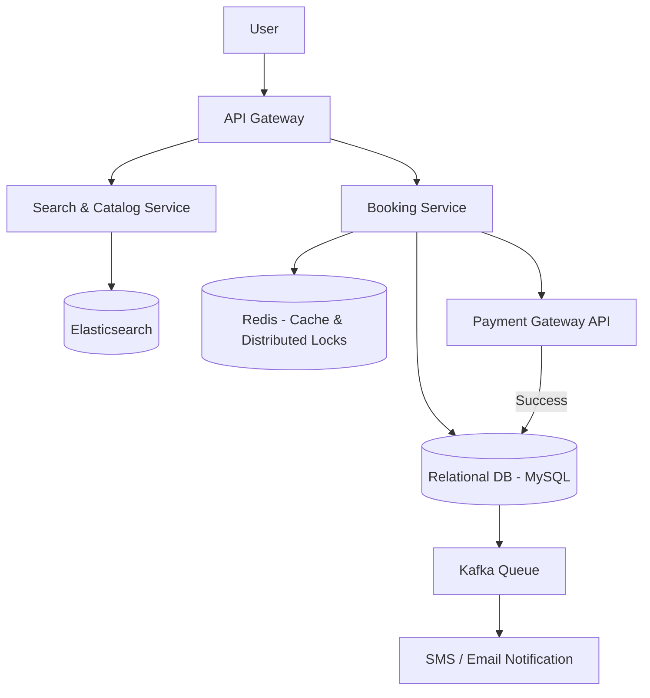

# BookMyShow (Ticket Booking System)

## Introduction
BookMyShow is a highly popular ticket booking platform for movies, concerts, and sports events. Designing a ticketing system requires solving strict concurrency challenges: thousands of users trying to book the exact same seat in a cinema or stadium at the exact same time.

## Problem Statement
In a general e-commerce system, if two people buy the same T-shirt, it doesn't matter *which* specific T-shirt from the warehouse they receive. In a ticketing system, inventory is highly specific. Users select exact seats (e.g., Row A, Seat 12). The system must guarantee that a specific seat is never double-booked, even if 100 people click "Book" simultaneously.

## Why this exists
To manage highly localized, specific inventories (seats) under high concurrency, allowing temporary reservation holds during payment processing without risking double-bookings.

## Real-world analogy
Imagine booking a room at a hotel. When you walk up to the receptionist and ask for Room 101, they don't immediately hand you the keys. First, they write your name in pencil next to "Room 101" in their ledger book (Temporary Lock) and give you 10 minutes to pull out your wallet and pay. If you pay, they overwrite your name in ink (Booked). If you walk away, they erase the pencil marking, making the room available to the next customer.

## Definition
A real-time transactional reservation engine utilizing optimistic concurrency, temporary lease locks, and geographical database sharding to prevent duplicate inventory allocations.

## Functional Requirements
1. Users can search for movies by city, date, and cinema.
2. Users can view available seats in a specific show.
3. Users can hold seats temporarily while they complete payment.
4. Users can book and pay for seats.

## Non-Functional Requirements
1. **Strict Consistency:** Double-booking a seat is catastrophic. ACID compliance is mandatory.
2. **High Concurrency:** Must handle massive spikes (e.g., concert opening sales).
3. **Low Latency:** Browsing seat layouts must load in milliseconds.

## Capacity Estimation
- **Events:** Large stadium concerts can attract 1 Million concurrent page hits for 50,000 seats.
- **Seat Locks:** The system must process thousands of seat lock transactions per second during major sales.

---

## Python/Java implementation

Below is a Java simulation of the Temporary Seat Locking & Reservation Manager.

### Java Implementation

#### Bad implementation
*Directly updating seat status without locks or validation. In concurrent environments, this leads to race conditions where two users book the same seat.*

```java
import java.util.HashMap;
import java.util.Map;

// BAD: Insecure direct status updating.
// Highly vulnerable to race conditions, leading to double-booked seats.
public class NaiveSeatBooker {
    private final Map<String, String> seatDb = new HashMap<>(); // SeatId -> Status

    public boolean bookSeat(String seatId, String userId) {
        String currentStatus = seatDb.getOrDefault(seatId, "AVAILABLE");
        
        // VULNERABILITY: Non-atomic check-then-act.
        // Two threads can read "AVAILABLE" at the same time, proceed, and overwrite each other.
        if ("AVAILABLE".equals(currentStatus)) {
            seatDb.put(seatId, "BOOKED_" + userId);
            return true;
        }
        return false;
    }
}
```

#### Better implementation
*Using basic synchronized locking to ensure thread safety, but lacking automatic lock expiration. If a user closes their browser mid-payment, the seat remains locked forever.*

```java
import java.util.concurrent.ConcurrentHashMap;

// BETTER: Thread-safe locking without automatic release.
// Prevents double-booking, but locked seats are orphaned permanently if payment fails or user abandons cart.
public class PermanentlyLockedSeatService {
    private final ConcurrentHashMap<String, String> locks = new ConcurrentHashMap<>();

    public synchronized boolean lockSeat(String seatId, String userId) {
        if (locks.containsKey(seatId)) {
            return false; // Seat already locked
        }
        locks.put(seatId, userId);
        return true;
    }

    public synchronized void releaseSeat(String seatId) {
        locks.remove(seatId);
    }
}
```

#### Best implementation
*A simulation of BookMyShow's Seat Locking Engine. It uses a concurrent map to hold seat states and a ScheduledExecutorService background thread to automatically expire locks after a configured timeout (reverting locked seats back to AVAILABLE).*

```java
import java.util.concurrent.ConcurrentHashMap;
import java.util.concurrent.Executors;
import java.util.concurrent.ScheduledExecutorService;
import java.util.concurrent.TimeUnit;

// BEST: Temporary Lease Locking Engine with Automatic Background Expiration
public class SeatReservationEngine {
    private final ConcurrentHashMap<String, SeatLock> seatLockMap = new ConcurrentHashMap<>();
    private final ScheduledExecutorService cleanUpScheduler = Executors.newSingleThreadScheduledExecutor();
    private static final long LOCK_TIMEOUT_MS = 5000; // 5 seconds for simulation (5 mins in production)

    public static class SeatLock {
        public final String seatId;
        public final String userId;
        public final long lockTime;
        public SeatStatus status;

        public SeatLock(String seatId, String userId, long lockTime, SeatStatus status) {
            this.seatId = seatId; this.userId = userId; this.lockTime = lockTime; this.status = status;
        }
    }

    public enum SeatStatus { AVAILABLE, LOCKED, BOOKED }

    public SeatReservationEngine() {
        // Start background cleaner thread running every 1 second
        cleanUpScheduler.scheduleAtFixedRate(this::releaseExpiredLocks, 1, 1, TimeUnit.SECONDS);
    }

    // 1. Temporary Seat Hold (Optimistic Concurrency)
    public boolean acquireTemporaryLock(String seatId, String userId) {
        long now = System.currentTimeMillis();
        
        // Atomically lock seat if not already locked/booked
        SeatLock newLock = new SeatLock(seatId, userId, now, SeatStatus.LOCKED);
        SeatLock existingLock = seatLockMap.putIfAbsent(seatId, newLock);

        if (existingLock == null) {
            System.out.println("Seat [" + seatId + "] temporarily locked for User [" + userId + "]");
            return true;
        }

        // Check if existing lock is expired
        synchronized (existingLock) {
            if (existingLock.status == SeatStatus.LOCKED && (now - existingLock.lockTime > LOCK_TIMEOUT_MS)) {
                // Lock expired, override it
                seatLockMap.put(seatId, newLock);
                System.out.println("Seat [" + seatId + "] expired. Re-locked for User [" + userId + "]");
                return true;
            }
        }
        return false; // Seat is active locked or booked
    }

    // 2. Finalize Booking (on payment success)
    public boolean finalizeBooking(String seatId, String userId) {
        SeatLock activeLock = seatLockMap.get(seatId);
        if (activeLock == null || !activeLock.userId.equals(userId)) {
            return false; // Lock lost or expired
        }

        synchronized (activeLock) {
            if (activeLock.status == SeatStatus.LOCKED && (System.currentTimeMillis() - activeLock.lockTime <= LOCK_TIMEOUT_MS)) {
                activeLock.status = SeatStatus.BOOKED;
                System.out.println("Seat [" + seatId + "] successfully BOOKED for User [" + userId + "]");
                return true;
            }
        }
        return false;
    }

    // 3. Background TTL Expire Monitor
    private void releaseExpiredLocks() {
        long now = System.currentTimeMillis();
        seatLockMap.forEach((seatId, lock) -> {
            synchronized (lock) {
                if (lock.status == SeatStatus.LOCKED && (now - lock.lockTime > LOCK_TIMEOUT_MS)) {
                    seatLockMap.remove(seatId);
                    System.out.println("Background Worker: Released expired lock on Seat [" + seatId + "]");
                }
            }
        });
    }

    public void shutdown() {
        cleanUpScheduler.shutdown();
    }
}
```

---

## Core Architecture: The Seat Booking Flow

### Step 1: Seating Layout
When a user opens a showtime, the system reads the seating layout from a read-replica database. Seats are color-coded: Available, Locked, or Booked.

### Step 2: Temporary Holds (The Lease Lock)
When a user selects seats and clicks "Proceed to Payment", the system acquires a database row lease:
```sql
UPDATE seats 
SET status = 'LOCKED', locked_by = 'UserA', lock_expiry = NOW() + INTERVAL 5 MINUTE 
WHERE seat_id = 'A12' AND status = 'AVAILABLE';
```
If this query returns `0` rows affected, the seat is already locked or booked, and the transaction is aborted.

### Step 3: Payment Loop
- If payment completes within 5 minutes, status changes to `BOOKED`.
- If the payment window expires, a background worker or TTL index deletes the lock, returning the status to `AVAILABLE`.

## Internal working / Mermaid diagram



## Database Design
We use a **Relational Database (MySQL/PostgreSQL)** to enforce ACID properties during checkout.

### Table: Shows
- `show_id` (Primary Key)
- `movie_id`
- `cinema_id`
- `start_time`

### Table: Seats
- `seat_id` (Primary Key)
- `show_id` (ForeignKey)
- `seat_number` (e.g. "A12")
- `status` (ENUM: 'AVAILABLE', 'LOCKED', 'BOOKED')
- `locked_by` (String)
- `lock_expiry` (Timestamp)

## Scaling Strategy
- **Search Scale:** Cache show schedules and cinema availability in **Elasticsearch** and **Redis** to offload read traffic.
- **Geographic Sharding:** Shard the database by City. A ticket booking spike in Delhi does not impact database shards in Bangalore.

## Bottlenecks & Trade-offs
- **Flash Sales (Concerts):** If 1 million users try to book seats in a 50,000-seat stadium simultaneously, MySQL row locking causes connection pool exhaustion.
  - *Waiting Room:* Place a Virtual Waiting Room queue in front of the server, only allowing a steady flow (e.g., 5,000 users at a time) onto the seat selection page.
  - *Redis Distributed Lock:* Enforce temporary holds in Redis (in-memory) instead of MySQL, writing to MySQL only when payment succeeds.

## Pros
- Guarantees zero seat double-bookings (strict consistency).
- Decouples static catalog traffic from checkout transactions.
- Automated release of abandoned locks.

## Cons
- Relational sharding by city makes cross-city recommendations difficult.
- High database connection overhead during popular concert releases.

## Interview questions

### Beginner
- **Q: What is the main difference between booking a seat on BookMyShow and buying a T-shirt on Amazon?**
  - **A:** Amazon T-shirt inventory is generic (any shirt of the same size works). BookMyShow inventory is specific; users select exact seats (e.g., Row B, Seat 14), which requires strict concurrency controls to prevent double-booking.
- **Q: What happens if a user locks a seat but closes their browser before paying?**
  - **A:** The seat is temporarily locked with an expiration time (e.g., 5 minutes). A background cleanup service or TTL database check automatically unlocks the seat once the timer expires, making it available again.

### Intermediate
- **Q: Why is a relational database preferred over a NoSQL database for ticket booking?**
  - **A:** Relational databases support strict ACID properties and row-level locking. This guarantees that only one transaction can successfully update a seat's status from `AVAILABLE` to `LOCKED` at a time.

### Senior
- **Q: How would you handle a flash sale for a high-demand concert where 1 million people try to book seats at the same time?**
  - **A:** 
    1. **Virtual Waiting Room:** Put a queue system (like AWS SQS or a token bucket rate limiter) in front of the seat selection API.
    2. **Token Allocation:** Only allow users into the selection portal at a rate the database can handle (e.g., 1,000 users/second).
    3. **Redis Locks:** Store temporary seat locks in a Redis cluster using distributed locking (e.g., Redlock) rather than SQL database row locks. Write to the SQL database only when the payment is confirmed.

### Staff Engineer
- **Q: Design a distributed seat-locking mechanism using Redis that ensures exactly-once seat allocation and survives Redis node crashes without losing lock state.**
  - **A:** 
    1. **Redlock Protocol:** Acquire locks using the Redlock algorithm across $N=5$ independent Redis master nodes. Set the key with a unique value: `SET seat:showId:seatId uniqueToken NX PX 300000` (5 minutes).
    2. **Quorum Acquisition:** A lock is considered acquired only if the client gets locks from at least 3 nodes in less time than the lock validity period.
    3. **Write-Ahead Log Replication:** Enforce Redis AOF (Append Only File) persistence with `fsync=always` to ensure lock states are written to disk instantly.
    4. **Database Verification:** When a user pays, check the lock value in Redis. If it matches, commit the SQL transaction and update the MySQL seat status to `BOOKED`.

## Common mistakes
- **Acquiring MySQL locks without timeouts:** Causing seats to remain locked indefinitely if a user abandons the booking page.
- **Lacking a virtual waiting room for high-demand concerts:** Allowing too many concurrent requests to overload database connection pools.

## Best practices
- Enforce strict time limits on temporary locks.
- Cache cinema metadata globally on CDNs.
- Shard databases geographically by city.

## When NOT to use
- Do not build a complex temporary lease lock engine for general e-commerce stock (like shoes or books); simple decrement queries are sufficient.

## Comparison with similar concepts
- **Pessimistic vs Optimistic Locking:** Pessimistic locking blocks access to the database row until the transaction finishes (used for seat locks). Optimistic locking allows multiple users to read the row but fails the write if the row version changed (used for metadata updates).

## Summary
BookMyShow is an architecture dominated by the need for strict ACID consistency. While the catalog and search can be scaled horizontally using Elasticsearch and CDN caching, the core booking engine relies heavily on Relational Database row-level locking, geographic sharding, and Redis caching to prevent the catastrophic failure of double-booking seats.

## Related topics
- [Amazon E-commerce](./amazon-ecommerce)
- [Distributed Locking](../distributed-systems/distributed-locking)
- [SQL Databases](../databases/sql)
