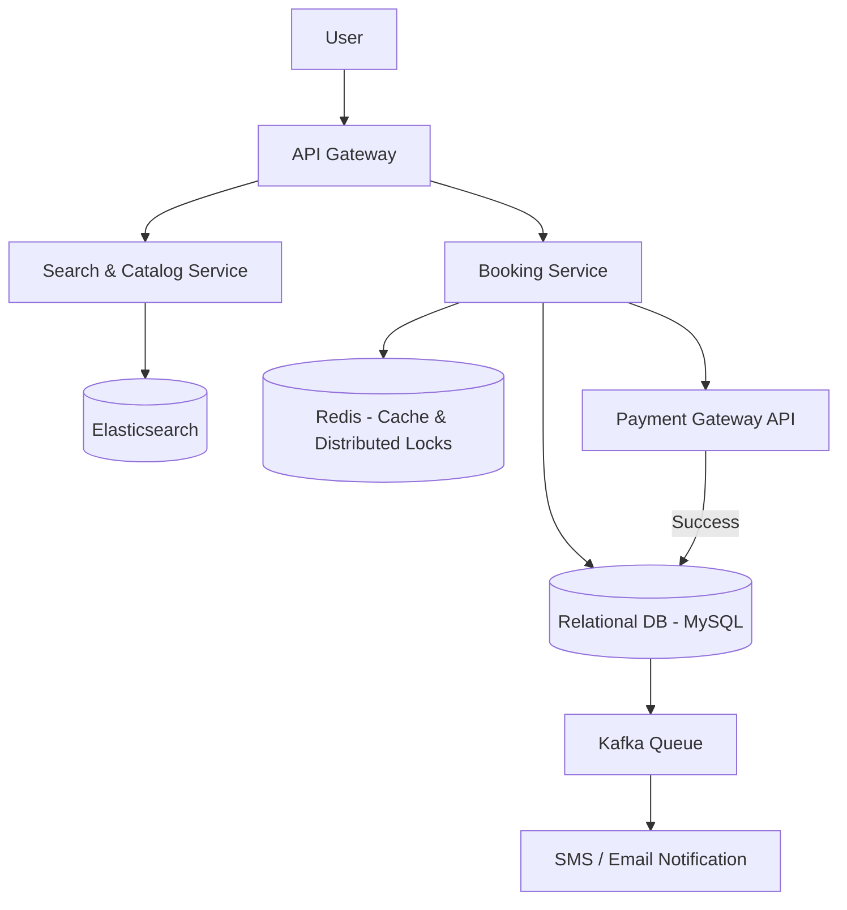

# BookMyShow (Ticket Booking System)

## Introduction
BookMyShow is a highly popular ticket booking platform for movies, concerts, and sports events. Designing a ticketing system is notorious for its strict concurrency requirements: thousands of people trying to book the exact same seat in a movie theater at the exact same time.

## Problem Statement
In a general e-commerce system, if two people buy the same T-shirt, it doesn't matter *which* specific T-shirt from the warehouse they get. 
In a ticketing system, the inventory is highly specific. Users select exact seats (e.g., Row A, Seat 12). The system must guarantee that a specific seat is never double-booked, even if 100 people click "Book" simultaneously.

## Functional Requirements
1. Users can search for movies by city, date, and cinema.
2. Users can view available seats in a specific show.
3. Users can hold seats temporarily while they complete payment.
4. Users can book and pay for seats.

## Non-Functional Requirements
1. **High Concurrency:** The system must handle massive spikes (e.g., Marvel movie opening weekend).
2. **Strict Consistency:** Double-booking a seat is catastrophic. ACID properties are mandatory.
3. **Low Latency:** Browsing and seat selection must be fast.

## Core Architecture: The Seat Booking Flow

The most critical part of this system is the **Seat Lock**.

### Step 1: Viewing Seats
When a user clicks on a showtime, the system fetches the current seating layout from the database. Seats are color-coded (Available, Booked, Locked).

### Step 2: The Temporary Hold (Locking)
When User A clicks on "A12" and proceeds to payment, the seat must be temporarily locked. 
If we don't lock it, User B might also select "A12", proceed to payment, and both users get charged for the same seat.
- **Solution:** We use an **Active-Active Row Lock** in the database with an expiration time (e.g., 5 minutes).
- `UPDATE seats SET status = 'LOCKED', locked_by = 'UserA', lock_expiry = NOW() + 5 MINS WHERE seat_id = 'A12' AND status = 'AVAILABLE';`
- If this query updates 0 rows, it means the seat was already locked or booked, and we show an error to User A.

### Step 3: Payment and Confirmation
- If User A completes the payment within 5 minutes, we update the database:
  `UPDATE seats SET status = 'BOOKED' WHERE seat_id = 'A12';`
- If User A takes longer than 5 minutes or abandons the page, a background Cron Job (or a TTL index) automatically reverts all `LOCKED` seats back to `AVAILABLE` once `lock_expiry` has passed.

## Internal working / Mermaid diagram

## Database Design
Because we are dealing with financial transactions and strict row-level locking to prevent double-booking, a **Relational Database (MySQL or PostgreSQL)** is an absolute requirement for the core booking engine.

**Table: Shows**
- `show_id`
- `movie_id`
- `cinema_id`
- `start_time`

**Table: Seats**
- `seat_id`
- `show_id`
- `seat_number` (e.g., "A12")
- `status` (ENUM: 'AVAILABLE', 'LOCKED', 'BOOKED')
- `locked_by_user_id`
- `lock_timestamp`

## Scaling Strategy
- **Read-Heavy Catalog:** Searching for movies and checking schedules is 99% of the traffic. All movie metadata and show schedules are indexed in **Elasticsearch** and heavily cached in **Redis**.
- **Geographic Sharding:** The database is naturally partitioned by City or Region. A user in New York booking a ticket has zero overlap with a user in London. We shard the databases geographically so that a massive traffic spike in one city doesn't bring down the global system.

## Bottlenecks & Trade-offs
### The "Flash Sale" Problem (Concerts)
For regular movies, database row-locking is fine. However, for a Taylor Swift concert, 1 million people might try to hit the "Seats" table for a 50,000-seat stadium in the same millisecond. 
- Locking rows in MySQL for 1 million concurrent users will result in massive connection pool exhaustion and DB crashes.
- **Mitigation (Virtual Waiting Room):** Instead of letting everyone hit the database, put an API Gateway rate limiter or a Virtual Waiting Room in front of the booking service. Only allow a steady stream of users (e.g., 5,000 at a time) into the actual seat-selection screen. The rest wait in an asynchronous queue.
- **Mitigation (Redis Distributed Locks):** Use Redis to manage the temporary 5-minute holds in memory (which is exponentially faster than MySQL locks), and only write to MySQL when the final payment is actually confirmed.

## Summary
BookMyShow is an architecture dominated by the need for strict ACID consistency. While the catalog and search can be scaled horizontally using Elasticsearch and CDN caching, the core booking engine relies heavily on Relational Database row-level locking, geographic sharding, and Redis caching to prevent the catastrophic failure of double-booking seats.

## Related topics
- [Amazon E-commerce](../amazon-ecommerce)
- [Distributed Locking](../../distributed-systems/distributed-locking)
- [SQL Databases](../../databases/sql)
