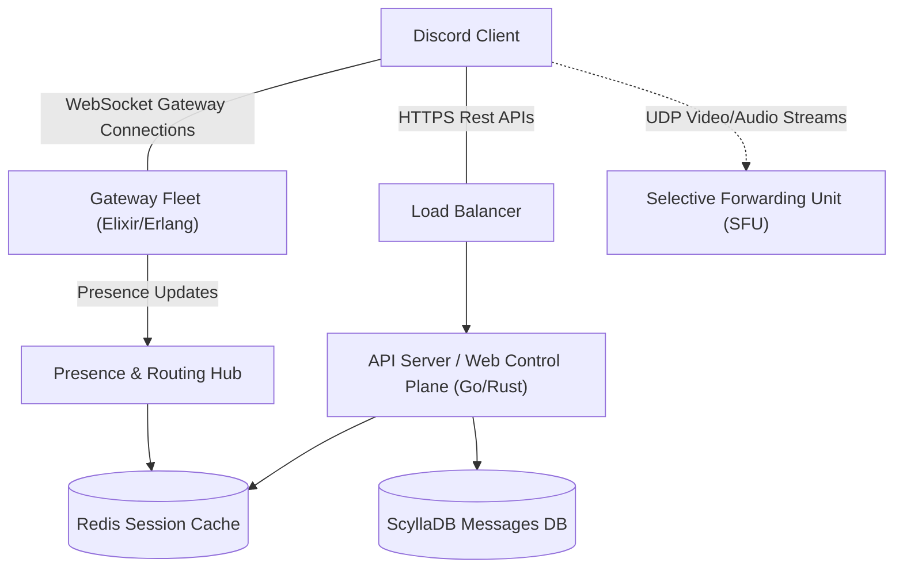
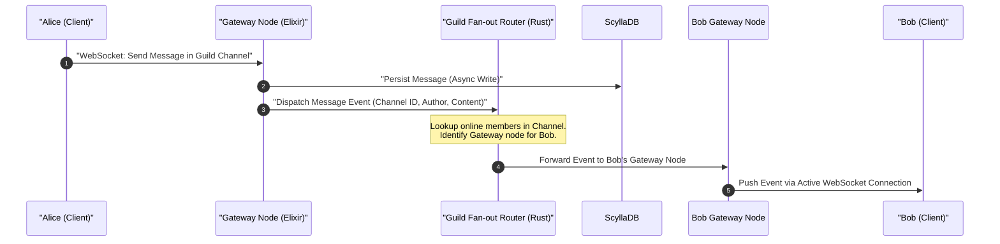

# Discord (Voice & Text Chat)

## Introduction
Discord is a real-time communication platform designed to support high-throughput text messaging, presence tracking, and low-latency voice and video communication. Modern collaborative platforms like Discord must manage millions of concurrent WebSocket connections, handle extreme message fan-out in giant public channels, and route real-time media streams globally without introducing noticeable delay.

## Problem Statement
Scale a real-time messaging and voice system to support:
- **Massive servers (Guilds)** containing over 1 million users, with tens of thousands active concurrently.
- **Instantaneous text delivery** across channels.
- **Real-time presence tracking** (online, idle, do not disturb, offline) visible to all server members and mutual friends.
- **Ultra-low latency voice/video chat** where dozens of users can participate in a single voice channel without degrading client performance or saturating their download capacity.

## Why this exists
Standard web architectures rely on stateless HTTP request-response patterns, which are inefficient for real-time, bi-directional communication. Traditional Peer-to-Peer (P2P) mesh networking fails to scale beyond a few participants in group calls due to $O(N^2)$ bandwidth constraints. Dedicated, specialized systems like Discord are required to decouple the control plane (metadata, authentication) from the real-time data plane (media routing and socket connections).

## Real-world analogy
Think of Discord's text system like a **postal sorting office** where a single letter (a message) written to a public bulletin board must be instantly copied and slipped under the door of every active citizen in the town.
Think of Discord's voice system like a **smart translator at a round-table conference**. Instead of every speaker shouting directly to every listener individually (P2P Mesh), or a single megaphone mixing everyone's voices into an unintelligible din (MCU), each speaker whispers to a central assistant (SFU), who instantly copies the whisper and passes it only to the listeners who want to hear that specific speaker.

## Definition
Discord is a **distributed real-time communication system** that utilizes persistent bi-directional communication protocols (WebSockets) for message dispatch, UDP/WebRTC for voice streaming, and distributed memory-first databases to achieve scalable presence tracking and sub-100ms voice/video routing.

## Key concepts
- **WebSocket Gateway:** Stateful server nodes managing active bi-directional connections from clients.
- **Guild & Channels:** Virtual logical divisions (servers and channels) that organize users and control routing rules.
- **Selective Forwarding Unit (SFU):** A WebRTC media router that accepts media streams from participants and forwards them to other participants without mixing or transcribing the codecs.
- **UDP (User Datagram Protocol):** Connectionless transport protocol used for real-time voice and video to avoid TCP head-of-line blocking.
- **Presence Tracking & Fan-Out:** The mechanism to propagate user status changes (e.g., online, playing a game) to mutual friends and shared servers.

## Requirements

### Functional Requirements
1. Users can create, join, and configure servers (Guilds) with text and voice channels.
2. Users can send and receive text messages in real-time within text channels.
3. Users can join voice channels and stream low-latency audio/video.
4. Users can view the real-time presence (status) of their friends and members of shared servers.

### Non-Functional Requirements
1. **Ultra-Low Latency (Voice):** Voice latency must stay under 50ms locally, and under 150ms globally.
2. **High Scalability (Text Fan-out):** System must handle a message fan-out to 100,000+ concurrent online users in a single guild under 500ms.
3. **High Availability & Partition Tolerance:** Fault-tolerant voice server selection and resilient connection recovery.
4. **Bandwidth Efficiency:** Avoid overwhelming client connections with unnecessary video/audio packet multiplexing.

## Capacity Estimation

Let's estimate the throughput and storage requirements for a large scale setup:
- **Active Users:** 100 Million Daily Active Users (DAU).
- **Concurrent Connections:** 10 Million concurrent users connected via WebSockets at any peak moment.
- **Messages:** Average of 100 messages per user per day.
  - $\text{Total Messages/Day} = 100 \times 10^6 \times 100 = 10 \text{ Billion messages/day}.$
  - $\text{Write QPS} = \frac{10 \times 10^9}{86400} \approx 115,740 \text{ messages/sec}.$
  - **Peak Write QPS:** $3 \times \text{Average QPS} \approx 350,000 \text{ messages/sec}.$
- **Message Storage:**
  - Average message size is 150 bytes (including metadata, user ID, channel ID).
  - $\text{Storage/Day} = 10 \text{ Billion} \times 150 \text{ bytes} \approx 1.5 \text{ TB/day}.$
- **Presence Updates:**
  - Assume a user changes status (or starts/stops a game) 10 times a day.
  - $\text{Presence Event Generation Rate} = 100 \times 10^6 \times 10 = 1 \text{ Billion presence updates/day} \approx 11,574 \text{ events/sec}.$
  - Fan-out factor: If each user shares servers with an average of 500 online users, peak presence fan-out can reach millions of dispatches per second if not batched.

## System APIs

### 1. Send Message
```http
POST /api/v9/channels/{channel_id}/messages
Authorization: Bearer <JWT_TOKEN>
Content-Type: application/json

{
  "content": "Hello, world!",
  "nonce": "unique_client_nonce_for_idempotency"
}
```
**Response:**
```json
{
  "id": "11928374829102",
  "channel_id": "987654321",
  "author": { "id": "12345", "username": "alice" },
  "content": "Hello, world!",
  "timestamp": "2026-06-22T21:40:00Z"
}
```

### 2. Connect to Gateway (WebSocket Handshake)
```http
GET /api/v9/gateway
Authorization: Bearer <JWT_TOKEN>
```
*Establishes a persistent TCP connection upgrade to WebSocket (`wss://gateway.discord.gg`).*

### 3. Join Voice Channel
```http
POST /api/v9/channels/{channel_id}/voice-states
Authorization: Bearer <JWT_TOKEN>

{
  "guild_id": "777888999",
  "self_mute": false,
  "self_deaf": false
}
```
**Response:**
*Returns a dynamic token, session ID, and the IP/Port of the assigned voice SFU server to initiate WebRTC over UDP.*

## Database Design

To handle trillions of historical messages and provide instant lookups for specific channels, the database choice must be optimized for writes and sequential partition reads.

### 1. Message Storage Schema (ScyllaDB / Cassandra)
- **Table Name:** `messages`
- **Partition Key:** `channel_id` (Ensures all messages in the same channel reside on the same physical database node).
- **Clustering Key:** `message_id DESC` (Ensures messages are physically sorted by creation time, allowing extremely fast pagination when scrolling up).

```sql
CREATE TABLE messages (
    channel_id text,
    bucket_id int,  -- Optional: Used to split extremely large channels into time buckets (e.g., month-based)
    message_id bigint,
    author_id text,
    content text,
    attachments list<text>,
    PRIMARY KEY ((channel_id, bucket_id), message_id)
) WITH CLUSTERING ORDER BY (message_id DESC);
```

### 2. Presence & Session State Cache (Redis)
- Redis is used to track transient user sessions and their mapped WebSocket Gateway ID.
- **Key:** `user:session:{user_id}`
- **Value (Hash):**
  - `status`: `online` | `idle` | `dnd` | `offline`
  - `custom_status`: `Playing Minecraft`
  - `gateway_node_id`: `gateway-us-east-1a`
  - `last_heartbeat`: `1719092400`

## Caching Strategy
- **Gateway Caching:** WebSocket Gateway servers cache the roster of online friends for each connected user. When a client establishes a connection, it downloads a list of active guilds and mutual friend statuses.
- **Read Cache:** Channel metadata (roles, permissions) are heavily cached in Redis since permissions are evaluated on every single message read and write.

## Scaling Strategy



1. **Stateful Connection Layer (Elixir/Erlang):**
   - Elixir runs on the BEAM VM. It is highly optimized for holding millions of lightweight processes (one per WebSocket connection) with negligible memory overhead.
2. **Message Broker (Kafka / Pulsar):**
   - High-throughput message ingestion. Messages published to channels are dropped into Kafka partition queues, ensuring message delivery is uncoupled from client socket write latency.
3. **Rust for Router Fan-Out:**
   - Discord rewrote its core guild routing engine in Rust (replacing Go) to eliminate latency spikes caused by garbage collection pauses. When a message is sent in a server with 100k members, Rust routes it to the specific gateway nodes holding those active connections in microseconds.

## Bottlenecks & Trade-offs
- **The $O(N^2)$ Presence Problem:** If a guild has 200,000 members, broadcasting every single status change (e.g., typing, idle) to all members creates massive traffic.
  - *Trade-off:* Discord limits the display of the active member sidebar list in servers with more than 75,000 users. For these massive servers, presence updates are only sent for friends or when a user actively posts.
- **UDP packet loss:** Real-time audio/video runs over UDP. Packets can drop.
  - *Trade-off:* Packet loss is handled at the client application layer using error concealment techniques (like Opus codec packet loss concealment) rather than requesting TCP retransmissions, maintaining ultra-low latency.

## Failure Handling
- **Gateway Failover:** If a Gateway server crashes, thousands of WebSocket connections drop. Clients detect this via missed heartbeats, back off exponentially, and reconnect to another Gateway node. The client sends a "resume session" request to fetch missing events using a sequence ID.
- **Voice Node Re-routing:** If an SFU crashes, the client's WebRTC peer connection disconnects. The Gateway immediately detects the SFU health failure, assigns a new SFU close to the cluster, and sends the updated IP/Port to the client, reconnecting the audio call in less than 2 seconds.

## Monitoring & Metrics
- **WebSocket Session Metrics:** Track connection count per gateway node, heartbeat latency, and session resume rates.
- **Media Stream Quality of Service (QoS):** Monitor UDP jitter, packet loss percentage, round-trip time (RTT), and audio encoding delay.
- **Database Read Latency:** Track ScyllaDB P99 read latency for channel message history.

## Deployment Strategy
- **Geo-distributed SFUs:** Deploy SFU multimedia nodes in bare-metal data centers globally (Anycast routing resolves client calls to the nearest server).
- **Blue-Green Deployments for Gateways:** Gateway upgrades require graceful drain strategies. Gateway nodes are systematically drained by stopping new connections and trickling disconnects over 30 minutes, preventing a "thundering herd" reconnect storm on other servers.

## Potential Improvements
- **Decentralized Presence:** Transitioning presence distribution to decentralized gossip networks inside clusters to reduce memory pressure on centralized Redis clusters.
- **Dynamic Gateway Load Rebalancing:** Automatically migrating active connections between gateway nodes based on network congestion or server CPU profiling.

## Internal working / Mermaid diagram



## Python/Java implementation

Below is a Java simulation demonstrating a high-performance **WebSocket Gateway & Presence Routing Engine**. It shows how the gateway manages connections, processes messages, and optimizes presence status propagation.

### Bad implementation
*A naive, synchronous approach that loops through all guild members sequentially. It makes blocking calls and executes network transfers on the main routing thread, resulting in extreme latency spikes and blocking the entire system when one connection becomes slow.*

```java
package bad;

import java.util.*;

class UserSession {
    String userId;
    boolean isOnline;
    
    public UserSession(String userId) {
        this.userId = userId;
        this.isOnline = true;
    }
    
    public void sendWebSocketMessage(String msg) {
        // Simulating a slow network write
        try {
            Thread.sleep(10); // 10ms block per user
        } catch (InterruptedException e) {
            Thread.currentThread().interrupt();
        }
        System.out.println("Sent to " + userId + ": " + msg);
    }
}

class NaiveGatewayRouter {
    private final Map<String, List<String>> guildMembers = new HashMap<>();
    private final Map<String, UserSession> activeSessions = new HashMap<>();

    public void addMemberToGuild(String guildId, String userId) {
        guildMembers.computeIfAbsent(guildId, k -> new ArrayList<>()).add(userId);
    }

    public void registerSession(String userId, UserSession session) {
        activeSessions.put(userId, session);
    }

    // Naive broadcast: synchronous, blocking, and single-threaded
    public void broadcastMessage(String guildId, String senderId, String messageContent) {
        List<String> members = guildMembers.get(guildId);
        if (members == null) return;

        System.out.println("--- Starting Naive Broadcast ---");
        for (String memberId : members) {
            if (memberId.equals(senderId)) continue;
            
            UserSession session = activeSessions.get(memberId);
            if (session != null && session.isOnline) {
                // Blocks the entire router thread on slow sockets!
                session.sendWebSocketMessage("Message from " + senderId + ": " + messageContent);
            }
        }
        System.out.println("--- Broadcast Completed ---");
    }
}
```

### Better implementation
*Using thread pools to dispatch messages concurrently. While this prevents a single slow socket from blocking the entire router, it does not manage presence update storms ($O(N^2)$ notifications) and risks thread pool saturation under high loads.*

```java
package better;

import java.util.*;
import java.util.concurrent.*;

class UserSession {
    String userId;
    
    public UserSession(String userId) {
        this.userId = userId;
    }
    
    public void sendWebSocketMessage(String msg) {
        try {
            Thread.sleep(10); // Simulate network latency
        } catch (InterruptedException e) {
            Thread.currentThread().interrupt();
        }
        System.out.println("Async Sent to " + userId + ": " + msg);
    }
}

class ConcurrentGatewayRouter {
    private final Map<String, List<String>> guildMembers = new ConcurrentHashMap<>();
    private final Map<String, UserSession> activeSessions = new ConcurrentHashMap<>();
    private final ExecutorService executor = Executors.newFixedThreadPool(10);

    public void addMemberToGuild(String guildId, String userId) {
        guildMembers.computeIfAbsent(guildId, k -> new CopyOnWriteArrayList<>()).add(userId);
    }

    public void registerSession(String userId, UserSession session) {
        activeSessions.put(userId, session);
    }

    public void broadcastMessage(String guildId, String senderId, String messageContent) {
        List<String> members = guildMembers.get(guildId);
        if (members == null) return;

        // Dispatches to a thread pool to avoid blocking the main server thread
        executor.submit(() -> {
            for (String memberId : members) {
                if (memberId.equals(senderId)) continue;

                UserSession session = activeSessions.get(memberId);
                if (session != null) {
                    executor.submit(() -> session.sendWebSocketMessage("Async Msg: " + messageContent));
                }
            }
        });
    }
    
    public void shutdown() {
        executor.shutdown();
    }
}
```

### Best implementation
*A production-grade, highly optimized Gateway presence & message router. It utilizes:*
1. **Virtual Threads / Executor Pools** to run connection handlers concurrently.
2. **Presence Updates Batching** via a background worker queue, merging updates over a sliding time window to mitigate $O(N^2)$ update storms.
3. **Gateway-Level Routing Simulation** where messages are sent as a single bulk payload to the gateway nodes hosting the clients, rather than individual socket iteration.
4. **Backpressure & Queue Limits** to prevent memory overflow during message floods.

```java
package best;

import java.util.*;
import java.util.concurrent.*;
import java.util.concurrent.atomic.AtomicBoolean;

enum OnlineStatus {
    ONLINE, IDLE, DND, OFFLINE
}

class PresenceEvent {
    String userId;
    OnlineStatus status;
    long timestamp;

    public PresenceEvent(String userId, OnlineStatus status) {
        this.userId = userId;
        this.status = status;
        this.timestamp = System.currentTimeMillis();
    }
}

class ClientSession {
    private final String userId;
    private final String gatewayNodeId;
    private final BlockingQueue<String> writeQueue = new LinkedBlockingQueue<>(100); // Backpressure protection

    public ClientSession(String userId, String gatewayNodeId) {
        this.userId = userId;
        this.gatewayNodeId = gatewayNodeId;
    }

    public String getUserId() { return userId; }
    public String getGatewayNodeId() { return gatewayNodeId; }

    public void queueMessage(String payload) {
        boolean accepted = writeQueue.offer(payload);
        if (!accepted) {
            System.err.println("Backpressure triggered: Dropping message packet for client: " + userId);
        }
    }

    public void flush(ExecutorService workerPool) {
        workerPool.submit(() -> {
            List<String> drained = new ArrayList<>();
            writeQueue.drainTo(drained);
            for (String msg : drained) {
                // Simulate physical network packet dispatch over WebSocket
                try {
                    Thread.sleep(1); // Highly optimized non-blocking writing
                } catch (InterruptedException e) {
                    Thread.currentThread().interrupt();
                }
            }
        });
    }
}

class GatewayNode {
    private final String nodeId;
    private final Map<String, ClientSession> localSessions = new ConcurrentHashMap<>();
    private final ExecutorService clientDispatcher = Executors.newVirtualThreadPerTaskExecutor(); // Modern Java Virtual Threads

    public GatewayNode(String nodeId) {
        this.nodeId = nodeId;
    }

    public String getNodeId() { return nodeId; }

    public void addSession(ClientSession session) {
        localSessions.put(session.getUserId(), session);
    }

    public void removeSession(String userId) {
        localSessions.remove(userId);
    }

    public void deliverPayloadToClient(String userId, String payload) {
        ClientSession session = localSessions.get(userId);
        if (session != null) {
            session.queueMessage(payload);
            session.flush(clientDispatcher);
        }
    }

    // Bulk deliver payload (optimizes network paths between routing nodes and gateway nodes)
    public void bulkDeliver(Set<String> userIds, String payload) {
        clientDispatcher.submit(() -> {
            for (String userId : userIds) {
                deliverPayloadToClient(userId, payload);
            }
        });
    }
}

public class OptimizedGatewayPresenceSystem {
    private final Map<String, GatewayNode> gatewayNodes = new ConcurrentHashMap<>();
    private final Map<String, Set<String>> guildMembers = new ConcurrentHashMap<>();
    private final Map<String, String> userGatewayMap = new ConcurrentHashMap<>();
    private final BlockingQueue<PresenceEvent> presenceQueue = new LinkedBlockingQueue<>(5000);
    
    private final ScheduledExecutorService presenceScheduler = Executors.newSingleThreadScheduledExecutor();
    private final ExecutorService mainRouter = Executors.newFixedThreadPool(4);
    private final AtomicBoolean isRunning = new AtomicBoolean(true);

    public OptimizedGatewayPresenceSystem() {
        startPresenceBatcher();
    }

    public void registerGatewayNode(GatewayNode node) {
        gatewayNodes.put(node.getNodeId(), node);
    }

    public void connectUser(String userId, String guildId, String gatewayNodeId) {
        guildMembers.computeIfAbsent(guildId, k -> ConcurrentHashMap.newKeySet()).add(userId);
        userGatewayMap.put(userId, gatewayNodeId);
        
        GatewayNode node = gatewayNodes.get(gatewayNodeId);
        if (node != null) {
            node.addSession(new ClientSession(userId, gatewayNodeId));
        }
        
        // Trigger online presence event
        presenceQueue.offer(new PresenceEvent(userId, OnlineStatus.ONLINE));
    }

    // Message Broadcast optimized by grouping users by gateway nodes (Bulk Delivery Protocol)
    public void routeGuildMessage(String guildId, String senderId, String message) {
        mainRouter.submit(() -> {
            Set<String> members = guildMembers.get(guildId);
            if (members == null) return;

            // Group recipients by their current Gateway Node to minimize inter-node hops
            Map<String, Set<String>> gatewayGroups = new HashMap<>();
            for (String memberId : members) {
                if (memberId.equals(senderId)) continue;
                String gatewayId = userGatewayMap.get(memberId);
                if (gatewayId != null) {
                    gatewayGroups.computeIfAbsent(gatewayId, k -> new HashSet<>()).add(memberId);
                }
            }

            // Fan out once per Gateway Node in parallel
            gatewayGroups.forEach((nodeId, userIds) -> {
                GatewayNode node = gatewayNodes.get(nodeId);
                if (node != null) {
                    node.bulkDeliver(userIds, "GuildMsg [" + guildId + "] Author: " + senderId + " Content: " + message);
                }
            });
        });
    }

    // Handles status batching and throttles presence propagation to prevent O(N^2) storms
    private void startPresenceBatcher() {
        presenceScheduler.scheduleAtFixedRate(() -> {
            if (presenceQueue.isEmpty()) return;

            List<PresenceEvent> batch = new ArrayList<>();
            presenceQueue.drainTo(batch);

            // Group status updates by user to deduplicate rapid changes
            Map<String, OnlineStatus> dedupedUpdates = new HashMap<>();
            for (PresenceEvent event : batch) {
                dedupedUpdates.put(event.userId, event.status);
            }

            System.out.println("Processing Batch Presence updates. Size: " + dedupedUpdates.size());

            // Propagate status updates to online members
            for (Map.Entry<String, OnlineStatus> update : dedupedUpdates.entrySet()) {
                String userId = update.getKey();
                OnlineStatus status = update.getValue();
                String payload = "PRESENCE_CHANGE:" + userId + ":" + status;

                // Propagate to all connected nodes
                for (GatewayNode node : gatewayNodes.values()) {
                    // Send status updates in parallel
                    node.clientDispatcher.submit(() -> {
                        // In production, we evaluate friend relationships and shared guilds here
                        node.bulkDeliver(node.localSessions.keySet(), payload);
                    });
                }
            }
        }, 1, 1, TimeUnit.SECONDS); // Batch updates every 1 second
    }

    public void updatePresence(String userId, OnlineStatus status) {
        presenceQueue.offer(new PresenceEvent(userId, status));
    }

    public void shutdown() {
        isRunning.set(false);
        presenceScheduler.shutdown();
        mainRouter.shutdown();
        gatewayNodes.values().forEach(node -> node.clientDispatcher.shutdown());
    }
}
```

## Step-by-step explanation
1. **Client Connection Handshake:** The client requests gateway details via HTTPS REST APIs, gets an URL, and establishes a persistent TCP/TLS handshake. The server upgrades it to a WebSocket connection.
2. **Session Identification:** The client registers its presence state (e.g., Online) and sends heartbeats (ping/pong) every 40 seconds to maintain the active socket on the assigned Elixir Gateway server.
3. **Presence Ingestion:** When a client changes status, the event is queued. A background presence aggregator batches the status adjustments.
4. **Presence Deduping & Throttling:** The presence system deduplicates status updates (e.g., if a user goes from idle to active and back within a split second) and distributes them periodically in a single payload.
5. **Guild Message Propagation:** When User A sends a message:
   - The message payload hits Alice's Gateway server.
   - The Gateway server writes the message asynchronously to ScyllaDB and queues it inside Kafka.
   - A highly optimized Rust routing daemon reads the message event, identifies the target guild, determines the active users, and groups them by their connected gateway node IDs.
   - The router sends a single payload to each gateway node containing the array of user IDs.
   - The gateway node distributes the message to individual client active socket connections.

## Multiple real-world examples
1. **Discord Guilds:** Real-time chat servers managing active user presence lists and message routing.
2. **Slack Workspace Channels:** Dynamic enterprise messaging platforms tracking active coworker presence and thread updates.
3. **Microsoft Teams:** Multi-tenant chat application utilizing WebSocket connection brokers and active session lookup caches.
4. **Twitch Chat Room Gateways:** Scaling chat stream updates in channels with over 100,000 active viewers reading messages simultaneously.

## Pros
- **Highly Concurrent Socket Execution:** Erlang/Elixir BEAM process model allows hosting 1M+ active connections per server node with minimal RAM footprint.
- **Microsecond Message Routing:** Rust routers avoid garbage collection pauses, reducing P99 message fan-out latency.
- **Low Media Server Overhead:** SFU architecture forwards media packets over UDP directly without server-side mixing, optimizing server CPU performance.

## Cons
- **High Memory Footprint at scale:** Tracking the routing maps of millions of users and channels requires massive, persistent, clustered in-memory stores.
- **Eventual Consistency Latency:** Presence tracking is batched and throttled, meaning status changes can take a few seconds to update across clients.
- **Stateful Server Complexity:** Rebalancing, graceful upgrades, and tracking state on Gateway servers is significantly more complex than scaling stateless HTTP application APIs.

## Interview questions

### Beginner
- **Q:** Why does Discord use UDP instead of TCP for voice calls?
- **A:** UDP is connectionless and does not perform packet retransmissions or packet ordering (no head-of-line blocking). If an audio packet is lost, it's better to ignore the drop and play the next incoming packets instantly rather than pausing the stream to request retransmission, which creates audio stuttering.

### Intermediate
- **Q:** How does Discord partition message data inside Cassandra/ScyllaDB to scale writes and reads?
- **A:** Discord uses the `channel_id` (sometimes with a time bucket ID for massive channels) as the Partition Key. This ensures that all message logs for a specific channel are physically located on the same database node and sorted sequentially on disk by `message_id`. Scrolling up in a channel executes a fast sequential read from a single node instead of a distributed scatter-gather query.

### Senior
- **Q:** Detail the difference between an SFU (Selective Forwarding Unit) and an MCU (Multipoint Control Unit) in video routing, and why Discord prefers the former.
- **A:**
  - An **MCU** mixes all incoming video/audio feeds on the server into a single mixed stream sent to each participant. This saves client bandwidth but requires massive, CPU-intensive encoding resources on the server and prevents clients from adjusting individual volumes or muting people locally.
  - An **SFU** acts as a lightweight router: it receives each user's stream once and forwards copies to all other participants. The server performs no processing/mixing. This scales efficiently to dozens of participants, keeps server CPU low, and lets clients control individual streams locally. Discord prefers SFUs for scalability and user customization.

### Staff Engineer
- **Q:** How would you design a presence service that handles 10 million concurrent users without triggering an $O(N^2)$ update storm in massive guilds?
- **A:** To solve the $O(N^2)$ presence update storm:
  1. **Throttling & Batching:** Queue presence events and push updates down WebSockets in batched payloads every few seconds.
  2. **Active Member Limits:** Hide the online members list sidebar for guilds exceeding a threshold (e.g., 75k members), only showing updates for direct friends or moderators.
  3. **Gateway-Level Deduping:** Route updates as a single bulk payload to gateway instances containing the list of local sessions to update, reducing inter-node networks hops.
  4. **Pull-on-Demand:** Have clients fetch presence information on-demand when clicking on a profile, rather than broadcasting it automatically.

## Common mistakes
- **Using TCP/HTTP for Media Streaming:** Attempting to build voice features using WebSockets or standard HTTP paths, leading to latency spikes and lag.
- **Synchronous Guild Broadcasts:** Iterating through channel members synchronously to push messages, blocking the gateway execution threads on slow clients.
- **Relational Joins for Messages:** Storing messages in relational tables with foreign keys to channels, causing heavy join queries that fail under high write volumes.

## Best practices
- **Isolate Control and Data Planes:** Keep metadata (channels, servers, user details) on stateless HTTP APIs, and media/chat routing on stateful WebSockets/UDP nodes.
- **Adopt Polyglot Architectures:** Use technologies matching the workload constraints: Elixir for WebSocket connection density, Rust for CPU-intensive routing pipelines, and ScyllaDB/Cassandra for write-heavy message logs.
- **Implement Client-Side Buffering:** Support resilient sequence-based message replays during transient WebSocket disconnects to avoid rebuilding full channel histories.

## When NOT to use
- **Small-Scale Internal Chat Tools:** If the system is restricted to a small number of users and doesn't require real-time voice, standard HTTP polling or simple Firebase models are simpler to build and maintain.
- **1-on-1 Encrypted-First Apps:** For pure peer-to-peer security (e.g., Signal), true peer-to-peer WebRTC connections are superior and avoid routing media through central SFU networks.

## Comparison with similar concepts
- **Discord vs WhatsApp:**
  - **Discord:** Focuses on persistent public servers (guilds), active presence tracking, and long-standing voice channels powered by SFU media routing.
  - **WhatsApp:** Focuses on private 1-on-1 or small group messaging with end-to-end encryption by default, relying primarily on peer-to-peer channels for calls.
- **Discord vs Slack:**
  - **Discord:** Engineered to support gaming with ultra-low latency voice overlays and massive public communities.
  - **Slack:** Designed for corporate environments with heavy document indexes, search capabilities, and integrations.

## Summary
Discord achieves its massive real-time scale by employing a stateful gateway layer built in Elixir, message log persistence via ScyllaDB, and optimized message routing utilizing Rust. Real-time audio and video are powered by WebRTC SFU networks executing over UDP.

## Related topics
- [WhatsApp (Text Chat)](./whatsapp)
- [Zoom (Video Streaming)](./zoom)
- [Redis Cache Invalidation](../caching/cache-invalidation)
- [Saga Pattern](../microservices/saga-pattern)
