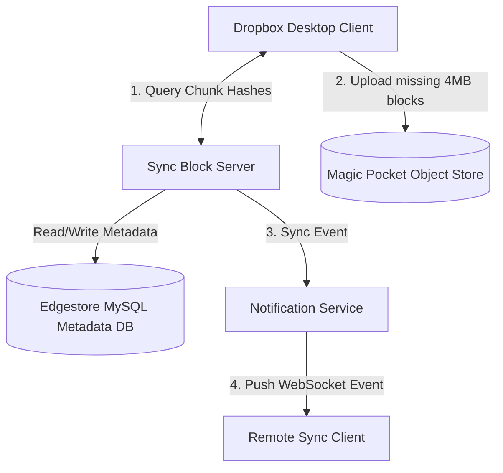

# Dropbox (Cloud File Storage & Sync)

## Introduction
Dropbox is a cloud file storage and synchronization service. It allows users to store files, synchronize them across multiple devices, and share them. While similar to Google Drive, Dropbox's engineering is famous for its custom Exabyte-scale object storage layer ("Magic Pocket") and its client-side bandwidth optimizations.

## Problem Statement
Moving large files over public networks is slow and expensive. If a user edits a single line in a 5 GB database file, uploading the entire 5 GB file again to sync the change consumes massive bandwidth, takes hours, and is highly prone to network failure. The system must optimize synchronization (delta syncs), prevent duplicate uploads (deduplication), and handle offline editing conflicts gracefully.

## Why this exists
To enable instant, low-bandwidth file synchronization across multiple user devices while maintaining strict data integrity, revision history, and cost-effective storage scales.

## Real-world analogy
Imagine a group of builders constructing a house. Instead of buying a completely new blueprint booklet every time the architect changes the kitchen cabinet design (Monolithic Upload), the architect simply prints a single replacement page for the kitchen layout and tells the builders to swap that page in their folders (Delta Sync).

## Definition
A distributed cloud synchronization service utilizing block-level file chunking, optimistic metadata versioning, and custom object stores to optimize file distribution.

## Functional Requirements
1. Users can upload, download, and delete files.
2. Files must sync automatically across all active devices.
3. Support file versioning (revision history) and offline edits.
4. Support sharing files and folders with other users.

## Non-Functional Requirements
1. **High Durability:** Files must never be lost (99.999999999% durability).
2. **High Availability:** Files must remain accessible globally.
3. **Bandwidth Optimization:** Minimize data transfers using delta synchronization.
4. **Consistency:** Strong consistency for file metadata to prevent folder tree corruption.

## Capacity Estimation
- **Users:** 500 Million registered users.
- **Storage:** If average active storage is 10 GB per user: 500M * 10 GB = **5 Exabytes** of total raw storage.
- **Deduplication:** Dynamic deduplication reduces raw block storage requirements by up to 30-40%.

---

## Python/Java implementation

Below is a Java simulation of the Sync Coordinator with Conflict Resolution.

### Java Implementation

#### Bad implementation
*Overwriting files blindly without checking the base version. This is the classic "lost update" problem where Client B's upload silently overwrites and deletes Client A's concurrent edits.*

```java
import java.util.HashMap;
import java.util.Map;

// BAD: Blind Overwrite model.
// Causes the "Lost Update" problem where concurrent edits erase previous writes.
public class BlindOverwriteUploader {
    private final Map<String, byte[]> fileStorage = new HashMap<>();

    public void saveFile(String filePath, byte[] content) {
        // VULNERABILITY: Blindly putting content into the map.
        // If Client A and Client B edit concurrently, whoever uploads last wipes out the other's changes.
        fileStorage.put(filePath, content);
        System.out.println("Saved file: " + filePath + " | Size: " + content.length);
    }
}
```

#### Better implementation
*Pessimistic File Locking. This prevents concurrent overwrites by locking the file for exclusive edit, but prevents collaboration, bottlenecks the system, and leaves files permanently locked if a client crashes.*

```java
import java.util.HashSet;
import java.util.Set;

// BETTER: Pessimistic File Locking.
// Prevents lost updates, but creates lock bottlenecks and leaves files locked if a client disconnects.
public class LockedFileUploader {
    private final Set<String> lockedFiles = new HashSet<>();

    public synchronized boolean acquireLock(String filePath, String clientId) {
        if (lockedFiles.contains(filePath)) {
            return false; // File is locked, edit blocked!
        }
        lockedFiles.add(filePath);
        return true;
    }

    public synchronized void releaseLock(String filePath) {
        lockedFiles.remove(filePath);
    }

    public void saveFile(String filePath, byte[] content, String clientId) {
        if (!lockedFiles.contains(filePath)) {
            throw new SecurityException("File is not locked by you!");
        }
        // Save logic...
        System.out.println("Saved file: " + filePath + " by client: " + clientId);
    }
}
```

#### Best implementation
*A simulation of Dropbox's Sync Coordinator using Optimistic Concurrency Control. The server tracks a monotonic version number for file metadata. If a client attempts to commit an update with an outdated base version, the server flags a conflict and forks the update into a separate "Conflicted Copy" file.*

```java
import java.util.HashMap;
import java.util.Map;
import java.util.concurrent.ConcurrentHashMap;

// BEST: Sync Coordinator with Optimistic Concurrency Control
public class DropboxSyncCoordinator {
    private final ConcurrentHashMap<String, FileMetadata> fileMetadataDb = new ConcurrentHashMap<>();
    private final ConcurrentHashMap<String, byte[]> blockStore = new ConcurrentHashMap<>(); // Chunks S3

    public static class FileMetadata {
        public final String filePath;
        public final int version;
        public final String chunkHash;

        public FileMetadata(String filePath, int version, String chunkHash) {
            this.filePath = filePath; this.version = version; this.chunkHash = chunkHash;
        }
    }

    // High-Throughput Write Path
    public synchronized CommitResult commitChanges(String filePath, int baseVersion, byte[] newContent, String clientId) {
        FileMetadata currentMetadata = fileMetadataDb.get(filePath);

        // Calculate hash of new content chunk
        String newHash = "hash_" + newContent.length + "_" + System.currentTimeMillis();

        if (currentMetadata == null) {
            // First time upload
            FileMetadata initial = new FileMetadata(filePath, 1, newHash);
            fileMetadataDb.put(filePath, initial);
            blockStore.put(newHash, newContent);
            return new CommitResult(CommitStatus.SUCCESS, 1, filePath);
        }

        // OPTIMISTIC CONCURRENCY CHECK
        if (currentMetadata.version != baseVersion) {
            // Conflict Detected: Base version mismatch (someone else updated the file in the meantime)
            String conflictedPath = forkConflictedFile(filePath, clientId);
            
            // Commit as a separate conflicted copy
            FileMetadata conflictedMeta = new FileMetadata(conflictedPath, 1, newHash);
            fileMetadataDb.put(conflictedPath, conflictedMeta);
            blockStore.put(newHash, newContent);
            
            System.out.println("Conflict Detected! Forked [" + filePath + "] -> [" + conflictedPath + "]");
            return new CommitResult(CommitStatus.CONFLICT, 1, conflictedPath);
        }

        // Safe Commit: No conflict. Increment version
        int nextVersion = currentMetadata.version + 1;
        FileMetadata updated = new FileMetadata(filePath, nextVersion, newHash);
        fileMetadataDb.put(filePath, updated);
        blockStore.put(newHash, newContent);
        
        System.out.println("Committed [" + filePath + "] version: " + nextVersion);
        return new CommitResult(CommitStatus.SUCCESS, nextVersion, filePath);
    }

    private String forkConflictedFile(String originalPath, String clientId) {
        int dotIndex = originalPath.lastIndexOf('.');
        String baseName = (dotIndex == -1) ? originalPath : originalPath.substring(0, dotIndex);
        String extension = (dotIndex == -1) ? "" : originalPath.substring(dotIndex);
        return baseName + " (Conflicted Copy from " + clientId + " at " + System.currentTimeMillis() + ")" + extension;
    }

    public enum CommitStatus { SUCCESS, CONFLICT }

    public static class CommitResult {
        public final CommitStatus status;
        public final int version;
        public final String finalPath;

        public CommitResult(CommitStatus status, int version, String finalPath) {
            this.status = status; this.version = version; this.finalPath = finalPath;
        }
    }
}
```

---

## Core Architecture & Engineering Decisions

### 1. Project Magic Pocket
In its early days, Dropbox relied on **Amazon S3** for block storage. As volume scaled to exabytes, paying AWS transit and storage costs became a major bottleneck. 
- Dropbox executed **Project Magic Pocket**, migrating over 1 Exabyte of data off AWS S3 to their own custom-built storage infrastructure.
- By designing custom storage hardware and software tailored strictly to storing immutable 4MB blocks, they drastically cut infrastructure costs and reduced latency.

### 2. Disk Storage Tiering
Dropbox organizes disk usage based on file popularity:
- **Hot Tier:** Fast SSDs/HDDs for newly uploaded files or files actively being modified.
- **Warm/Cold Tier (SMR Disks):** High-density **Shingled Magnetic Recording (SMR)** drives for older, rarely accessed files. SMR drives overlay tracks (like shingles on a roof), which increases storage density at low cost, though they are very slow to rewrite. Because Dropbox chunks are immutable (write-once, read-many), SMR drives are a perfect fit.

### 3. Edgestore (Metadata Layer)
Dropbox built **Edgestore** to manage metadata (file trees, users, chunk locations). 
- Edgestore is built on top of sharded **MySQL** engines.
- **Strong Consistency:** It enforces strict ACID compliance. If two devices modify a folder hierarchy concurrently, MySQL row locks ensure one succeeds and the other fails or forks, preventing tree corruption.
- **User-Based Sharding:** Sharding the database by User ID ensures transactions occur locally on a single shard, avoiding distributed SQL transactions.

---

## Internal working / Mermaid diagram



## Step-by-step Sync Flow
1. **Chunking & Hashing:** The desktop client splits a modified file into 4MB chunks and calculates SHA-256 hashes.
2. **Metadata Query:** The client sends the list of hashes to the Sync Server.
3. **Deduplication Check:** The server queries Edgestore. If the hashes already exist in the database (uploaded by any user), the server flags them as duplicate and instructs the client to skip uploading those blocks.
4. **Upload:** The client uploads only the unique, missing blocks directly to the Magic Pocket object store.
5. **Commit:** The client commits the update. The server updates Edgestore, adding block references to the user's file mapping, incrementing the version number.
6. **Notification:** The server drops a message into a queue. A notification service pushes a WebSocket event to the user's other devices, which download the new blocks to sync the file.

## Pros
- **Extreme Bandwidth Efficiency:** Only modified blocks are uploaded (Delta Sync).
- **Storage Savings:** Data deduplication avoids storing duplicate files.
- **Low Costs at Scale:** Custom Magic Pocket object storage eliminates S3 markups.

## Cons
- Custom hardware operations require dedicated infrastructure teams.
- Re-assembling files from 4MB blocks requires CPU processing on the client.

## Interview questions

### Beginner
- **Q: What is a Delta Sync, and why is it important?**
  - **A:** Delta Sync is the practice of uploading only the parts of a file that changed, rather than re-uploading the entire file. It is important because it saves network bandwidth and accelerates sync speeds.
- **Q: What was Project Magic Pocket?**
  - **A:** It was Dropbox's custom infrastructure project to migrate over an exabyte of file data off Amazon S3 onto their own custom-designed storage arrays, cutting costs and improving performance.

### Intermediate
- **Q: Why does Dropbox shard its metadata database by User ID?**
  - **A:** Sharding by User ID ensures that all folder edits, additions, and renames for a single user occur on the same database shard. This allows the system to perform local, ACID-compliant SQL transactions without needing slow distributed transactions.
- **Q: How do SMR (Shingled Magnetic Recording) drives help Dropbox cut costs?**
  - **A:** SMR drives increase disk density by overlapping data tracks, making them cheaper than standard drives. Although writing to them is slow because overlapping tracks must be rewritten together, they are ideal for Dropbox's warm/cold tier because files are immutable (written once, read many times).

### Senior
- **Q: How does Dropbox handle concurrent editing conflicts?**
  - **A:** Dropbox uses optimistic concurrency control (version numbers). If Client A and Client B download version 5 of a file, Client A uploads version 6 successfully. When Client B attempts to upload, the server detects that Client B's base version (5) does not match the current version (6). The server accepts Client B's upload but forks it into a separate file named `filename (Conflicted Copy from Client B)`.

### Staff Engineer
- **Q: Design a distributed coordination protocol for lock-free block replication across three data centers in Magic Pocket, guaranteeing strong durability and sub-50ms write confirmation.**
  - **A:** 
    1. **Masterless Replication (Dynamo-Style):** Use a masterless replication protocol with a replication factor of $N=3$, choosing a write quorum of $W=2$ and read quorum of $R=2$ to guarantee consistency ($R+W > N$).
    2. **Write Path:** The client uploads the 4MB block. The routing proxy sends it to three storage nodes in parallel. Once two nodes confirm writing to disk (durability met), the proxy returns a success code to the client.
    3. **Background Sync:** The third node is updated asynchronously via read-repair or anti-entropy active gossip protocols.
    4. **Network Optimization:** Place replication targets inside close regional zones to ensure quorum confirmation completes in under 50ms.

## Common mistakes
- **Acquiring locks on reads:** Blocking file reads while other users edit, which ruins the collaboration experience.
- **Hashing files globally as one block:** Meaning any minor change alters the entire hash, forcing a complete file re-upload.

## Best practices
- Perform data deduplication on block hashes.
- Store metadata in relational SQL engines for strong consistency.
- Implement client-side chunking and hashing to offload CPU load.

## When NOT to use
- Do not build a custom object store or complex chunking engine if you are building a simple, low-traffic document management portal; standard S3 bucket storage is sufficient.

## Comparison with similar concepts
- **Dropbox vs Google Drive:** Dropbox historically relied on client-side synchronization and custom hardware (Magic Pocket), whereas Google Drive is integrated with office collaboration suites (Google Docs) and relies on Google Cloud Storage.

## Summary
Dropbox is a masterclass in custom infrastructure scaling and synchronization efficiency. By decoupling binary storage (Magic Pocket) from consistent metadata tables (Edgestore MySQL shards) and utilizing block chunking and client-side deduplication, the system can sync files globally with minimal bandwidth overhead.

## Related topics
- [Google Drive](./google-drive)
- [Databases (SQL vs NoSQL)](../databases/nosql)
- [Consistent Hashing](../fundamentals/load-balancing)
