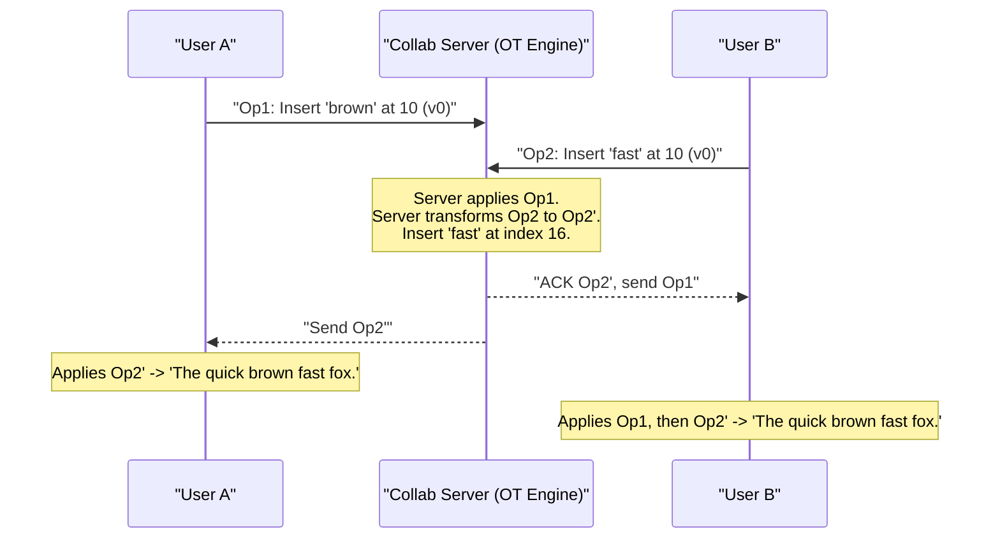

# Google Docs (Collaborative Editing)

## Introduction
Google Docs is a real-time collaborative word processor. The defining technical challenge of Google Docs is allowing multiple users to edit the exact same document simultaneously without locking the document, overwriting each other's changes, or forcing users to click "Sync."

## Problem Statement
Imagine User A and User B are editing the same sentence: `"The quick fox."`
- User A types `"brown "` before `"fox"`.
- At the exact same millisecond, User B types `"fast "` before `"fox"`.
If the server applies User A's change first, the string becomes `"The quick brown fox."` But User B's change was calculated based on the position of `"fox"` in the *original* string. If the server blindly applies User B's change at the original index, it will insert `"fast "` into the middle of `"brown"`. The document becomes corrupted: `"The quick brfast own fox."`

## Why this exists
To enable seamless, concurrent editing across multiple client instances, guaranteeing eventual consistency of document state without resorting to heavy pessimistic file locks.

## Real-world analogy
Imagine two people painting a mural on a wall. If painter A wants to paint a tree in the center, and painter B wants to paint a house in the center, they cannot just paint over each other. They must talk to a coordinator (the OT engine) who tells painter B: "Painter A is already painting the tree in the center. Please paint your house 5 feet to the right."

## Definition
A real-time collaborative word processor utilizing WebSockets for transport, sticky session load-balancers for stateful coordination, and Operational Transformation (OT) or CRDT algorithms for concurrent document convergence.

## Functional Requirements
1. Users can create, edit, and format text documents.
2. Multiple users can edit the same document concurrently in real-time.
3. Users can see where other users' cursors are located.
4. Documents are saved automatically (auto-save).
5. Offline editing support.

## Non-Functional Requirements
1. **Low Latency:** Keystrokes must propagate to collaborators in under 100ms.
2. **Strict Consistency:** All users must eventually see the exact same document state.
3. **Availability:** Reliable access to view and edit files.

## Capacity Estimation
- **Active Documents:** Millions of documents edited concurrently.
- **WebSocket Load:** Millions of open WebSocket connections, sending typing events continuously.

---

## Python/Java implementation

Below is a Java simulation of the Operational Transformation (OT) Engine.

### Java Implementation

#### Bad implementation
*Overwriting the entire document with the client's latest string copy on every save. This causes concurrent edits from other users to be silently lost.*

```java
import java.util.concurrent.ConcurrentHashMap;

// BAD: Complete state replacement.
// Causes massive data loss (lost updates) when multiple users edit concurrently.
public class MonolithicDocumentUploader {
    private final ConcurrentHashMap<String, String> documentDb = new ConcurrentHashMap<>();

    public void saveDocument(String docId, String fullTextContent) {
        // VULNERABILITY: Blindly overwriting the database text.
        // Whoever saves last completely erases all concurrent changes made by others.
        documentDb.put(docId, fullTextContent);
    }
}
```

#### Better implementation
*Sending text edits as simple index replacements, but failing to transform indices when edits arrive concurrently, leading to text corruption.*

```java
// BETTER: Position-based insertion.
// Works for sequential edits, but causes text corruption during concurrent insertions.
public class UntransformedInsertion {
    private String documentText = "The quick fox.";

    public synchronized void insertText(int index, String value) {
        // VULNERABILITY: If two users insert concurrently, the second insert uses an outdated index,
        // inserting text in the middle of the first user's word.
        if (index >= 0 && index <= documentText.length()) {
            documentText = documentText.substring(0, index) + value + documentText.substring(index);
        }
    }

    public String getText() { return documentText; }
}
```

#### Best implementation
*An Operational Transformation (OT) Engine. Operations are structured as `InsertOp` commands. If two operations are generated concurrently at the same index, the server transforms the second operation's index by adding the length of the first insertion, ensuring text converges identically on all clients.*

```java
import java.util.ArrayList;
import java.util.List;

// BEST: Operational Transformation (OT) Engine
public class OperationalTransformationEngine {
    private String documentText = "The quick fox.";
    private final List<TextOperation> operationHistory = new ArrayList<>();

    public static class TextOperation {
        public final String authorId;
        public final int index;
        public final String text;
        public final int baseVersion;

        public TextOperation(String authorId, int index, String text, int baseVersion) {
            this.authorId = authorId; this.index = index; this.text = text; this.baseVersion = baseVersion;
        }
    }

    public synchronized String getDocumentText() { return documentText; }

    public synchronized int getVersion() { return operationHistory.size(); }

    // High-Throughput Write Path (OT Engine resolver)
    public synchronized void applyOperation(TextOperation clientOp) {
        int targetIndex = clientOp.index;
        int currentVersion = getVersion();

        // 1. Transformation Phase: Check if client's base version is outdated
        if (clientOp.baseVersion < currentVersion) {
            System.out.println("OT Engine: Version mismatch! Transforming index for " + clientOp.authorId);
            
            // Loop through history and adjust index based on concurrent operations
            for (int i = clientOp.baseVersion; i < currentVersion; i++) {
                TextOperation historicOp = operationHistory.get(i);
                
                // If historic operation was inserted before or at the same index, shift current index
                if (historicOp.index <= targetIndex) {
                    targetIndex += historicOp.text.length();
                }
            }
        }

        // 2. Execution Phase: Apply the transformed operation
        if (targetIndex >= 0 && targetIndex <= documentText.length()) {
            documentText = documentText.substring(0, targetIndex) + clientOp.text + documentText.substring(targetIndex);
            
            // Log the transformed operation to history
            TextOperation appliedOp = new TextOperation(clientOp.authorId, targetIndex, clientOp.text, currentVersion);
            operationHistory.add(appliedOp);
            
            System.out.println("Applied: [" + clientOp.text + "] at index: " + targetIndex + " | Current Text: \"" + documentText + "\"");
        }
    }
}
```

---

## Core Architecture: OT vs CRDT
How do we solve the concurrent editing problem? Historically, there are two major algorithms:

### 1. Operational Transformation (OT)
- Instead of sending the *entire document state*, the client sends an *Operation* (e.g., `Insert "brown" at Index 10`).
- The Server acts as the single source of truth.
- When the server receives concurrent operations, it **transforms** the indices of subsequent operations based on the order they arrived.

### 2. Conflict-Free Replicated Data Types (CRDTs)
- CRDTs do not require a central server to calculate transformations.
- Every character in the document is given a globally unique, mathematically sortable fractional ID.
- Inserting a character simply means giving it an ID that falls between the IDs of the two adjacent characters.
- Because the IDs are absolute, operations can arrive in any order, and the document will converge identically on all clients.

## Internal working / Mermaid diagram (OT Model)



## System Architecture

### 1. Real-time Communication Layer
Because HTTP is too slow for keystroke syncing, clients maintain a persistent **WebSocket** connection to a Collaborative Server.

### 2. Collaborative Server (Stateful)
Unlike stateless REST APIs, the server handling a specific document must be **stateful**.
- It keeps the document state and history of recent operations in memory.
- The Load Balancer must route all users editing the same document to the same physical server using **Sticky Sessions** or a routing directory.

## Database Design
- **Document Metadata (Relational DB):** Stores document name, owner, permissions, and folder structure.
- **Document Content (NoSQL):** The text is stored as an ordered sequence of operations or snapshots in a database like Bigtable or DynamoDB.
- **Snapshots:** Every 1,000 operations, the server saves a snapshot of the document. When a new user opens the doc, they load the latest snapshot and apply the few subsequent operations, reducing load.

## Scaling Strategy
- **Sharding by Document ID:** A single document is handled by a single server. Documents are hashed across the server cluster using Consistent Hashing.
- **Read Replicas:** If a document goes viral (read-only for the masses), the master server streams updates to Read Replicas via Redis Pub/Sub, and users connect to the replicas.

## Pros
- Real-time collaborative editing without document locks.
- Low latency synchronization via WebSockets.
- Compact data transfers (only sending operation diffs).

## Cons
- Stateful servers make horizontal load balancing complex.
- Offline merge resolution is difficult to calculate in OT.

## Interview questions

### Beginner
- **Q: Why does Google Docs use WebSockets instead of standard HTTP requests?**
  - **A:** HTTP requests have high header overhead and are client-pull only. WebSockets establish a persistent, bidirectional connection with low latency, allowing keystrokes to be sent and received in real-time.
- **Q: What is a document snapshot, and why is it used?**
  - **A:** A snapshot is a saved copy of the complete document text at a specific point in time. It is used because replaying millions of individual keystrokes from history to load a document would be too slow. The client loads the snapshot and applies only the operations that occurred after it.

### Intermediate
- **Q: What is the "Concurrency Collision" problem in collaborative editing, and how does Operational Transformation (OT) solve it?**
  - **A:** A collision happens when two users insert text at the same index concurrently. If applied blindly, the second edit is inserted at the wrong index because the first edit shifted the text. OT solves this by having the server adjust (transform) the index of the second operation based on the length of the first insertion before applying it.
- **Q: Why must Google Docs collaboration servers be stateful?**
  - **A:** To resolve conflicts, the server must know the current version history and apply transformations in memory. This requires the server to maintain active session states and route all users editing the same document to the same physical server.

### Senior
- **Q: Compare Operational Transformation (OT) and Conflict-Free Replicated Data Types (CRDTs).**
  - **A:** 
    - **OT:** Requires a centralized, stateful server to transform operations based on arrival order. It has lower memory overhead per character but is difficult to scale in peer-to-peer networks.
    - **CRDTs:** Assign globally unique, sortable IDs to every character, allowing operations to be applied in any order without a central coordinator. This is ideal for decentralized or offline-first applications, but it has higher memory overhead due to the unique IDs stored with each character.

### Staff Engineer
- **Q: Design a client-side offline reconciliation engine for Google Docs that merges 2 hours of offline edits with concurrent online edits upon reconnection without corrupting the document.**
  - **A:** 
    1. **Local Operation Log:** The client caches all offline operations locally in a queue, assigning them sequential local version numbers.
    2. **Get Server Diff:** Upon reconnection, the client pulls the server's version history since it went offline.
    3. **Rebase Operations:** The client runs a local OT engine to transform (rebase) its local offline operations against the incoming server operations.
    4. **Push Resolved Ops:** The client applies the server's operations locally first, and then pushes its rebased offline operations back to the server, ensuring both converge to the same state.

## Common mistakes
- **Using a stateless REST API for keystroke synchronization:** Causing high database write load and network latency.
- **Acquiring database locks during user editing:** Preventing multiple users from editing the document concurrently.

## Best practices
- Route collaborative sessions to stateful servers using sticky routing.
- Save document snapshots periodically to optimize load times.
- Minimize payload sizes by sending only character edits (insert/delete diffs) instead of complete text strings.

## When NOT to use
- Do not build an OT engine if you are building a standard blogging platform or single-user text editor where concurrent collaboration is not required.

## Comparison with similar concepts
- **WebSockets vs HTTP Long Polling:** WebSockets establish a single TCP connection for low-latency bidirectional communication. Long Polling holds HTTP requests open until data is available, which has higher connection overhead and latency.

## Summary
Google Docs revolutionized web applications by proving complex stateful applications could run in the browser. It relies heavily on WebSockets for low-latency communication, Stateful servers for coordinating concurrent users, and the complex mathematics of Operational Transformation (or CRDTs) to ensure strict eventual consistency across all editors.

## Related topics
- WebSockets vs HTTP
- [Distributed Systems / Consensus](../distributed-systems/consensus)
