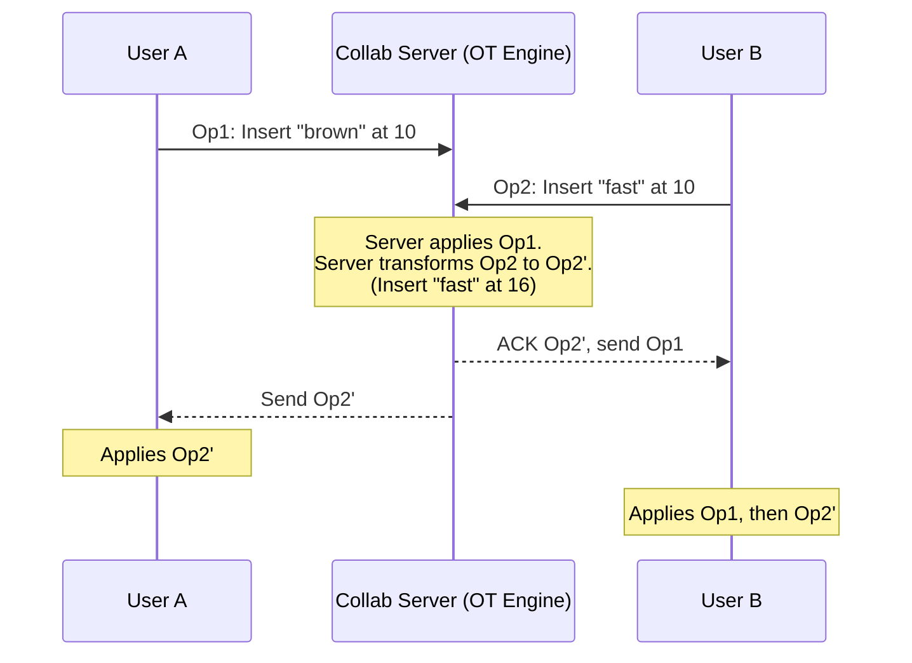

# Google Docs (Collaborative Editing)

## Introduction
Google Docs is a real-time collaborative word processor. The defining technical challenge of Google Docs is allowing multiple users to edit the exact same document simultaneously without locking the document, overwriting each other's changes, or forcing the users to click "Sync."

## Problem Statement
Imagine User A and User B are editing the same sentence: `"The quick fox."`
- User A types `"brown "` before `"fox"`.
- At the exact same millisecond, User B types `"fast "` before `"fox"`.
If the server applies User A's change first, the string is now `"The quick brown fox."` But User B's change was originally calculated based on the position of `"fox"` in the *original* string. If the server blindly applies User B's change at the original index, it will insert `"fast "` into the middle of `"brown"`. The document becomes corrupted: `"The quick brfast own fox."`

## Functional Requirements
1. Users can create, edit, and format text documents.
2. Multiple users can edit the same document concurrently in real-time.
3. Users can see where other users' cursors are located.
4. Documents are saved automatically (auto-save).
5. Offline editing support.

## Non-Functional Requirements
1. **Low Latency:** Keystrokes must appear instantly on the user's screen and propagate to collaborators within milliseconds.
2. **Strict Consistency:** Eventually, all users must see the exact same document state.
3. **High Availability:** The service must be reliably accessible.

## Core Architecture: OT vs CRDT

How do we solve the concurrent editing problem? Historically, there are two major algorithms:

### 1. Operational Transformation (OT)
This is the algorithm originally used by Google Docs.
- Instead of sending the *entire document state* to the server, the client sends an *Operation* (e.g., `Insert "brown" at Index 10`).
- The Server acts as the single source of truth.
- When the server receives concurrent operations from User A and User B, the server **transforms** the operations based on the order they arrived.
- Example: The server receives A's insert at Index 10. It then receives B's insert, which was originally intended for Index 10. The server calculates that A already shifted the string by 6 characters (`"brown "`), so it *transforms* B's operation to `Insert "fast" at Index 16`. 
- Both users eventually sync to `"The quick brown fast fox."`

### 2. Conflict-Free Replicated Data Types (CRDTs)
A modern alternative used by decentralized systems.
- CRDTs do not require a central server to calculate transformations. 
- Instead, every single character in the document is given a globally unique, mathematically sortable fractional ID.
- Inserting a character simply means giving it an ID that falls between the IDs of the two adjacent characters.
- Because the IDs are globally unique and absolute, operations can arrive in any order, and the document will always converge identically on all clients.

## Internal working / Mermaid diagram (OT Model)

## System Architecture

### 1. The Real-time Communication Layer
Because HTTP Request/Response is too slow for keystroke syncing, clients maintain a persistent **WebSocket** connection to a specific Collaborative Server.

### 2. The Collaborative Server (Stateful)
Unlike stateless REST APIs, the server handling a specific document must be **stateful**. 
- It keeps the entire document state and the history of recent operations in memory.
- If 10 users are editing Document X, the Load Balancer MUST route all 10 users' WebSockets to the exact same physical server using **Sticky Sessions** or a routing directory.

## Database Design
- **Document Metadata (Relational DB):** Stores document name, owner, permissions, and folder structure.
- **Document Content (Key-Value / NoSQL):** The actual text of the document isn't stored as a single massive string in a SQL row. It is stored as an ordered sequence of operations or snapshots in a database like Bigtable or DynamoDB.
- **Snapshots:** Every 1,000 operations, the server flattens the history and saves a "Snapshot" of the document. When a new user opens the doc, they load the latest Snapshot and only have to apply the handful of operations that occurred since the snapshot was taken, rather than replaying 5 years of keystrokes.

## Scaling Strategy
- **Sharding by Document ID:** A single document is handled by a single server to avoid race conditions. If Google has 10,000 servers, documents are hashed across them.
- **Read Replicas:** If a document goes viral (e.g., a public Reddit link), one server can't handle 50,000 concurrent WebSockets. In this case, the document becomes "Read-Only" for the masses. The master server streams updates to Read Replicas via Redis Pub/Sub, and the masses connect to the replicas.

## Bottlenecks & Trade-offs
- **High Memory Usage:** Because the OT server is stateful, it uses significant RAM. If the server crashes, all connected users lose their WebSockets, and the load balancer must spin up a new server, pull the latest snapshot from the DB, and have the clients reconnect. This causes a momentary freeze for the users.
- **Offline Editing:** OT is difficult to manage offline because the client's operations diverge significantly from the server. When the user reconnects, the OT engine has to perform complex, heavy transformations to merge days of offline work with online changes.

## Summary
Google Docs revolutionized web applications by proving complex stateful applications could run in the browser. It relies heavily on WebSockets for low-latency communication, Stateful servers for coordinating concurrent users, and the complex mathematics of Operational Transformation (or CRDTs) to ensure strict eventual consistency across all editors.

## Related topics
- [WebSockets vs HTTP](../../fundamentals/websockets)
- [Distributed Systems / Consensus](../../distributed-systems/consensus)
