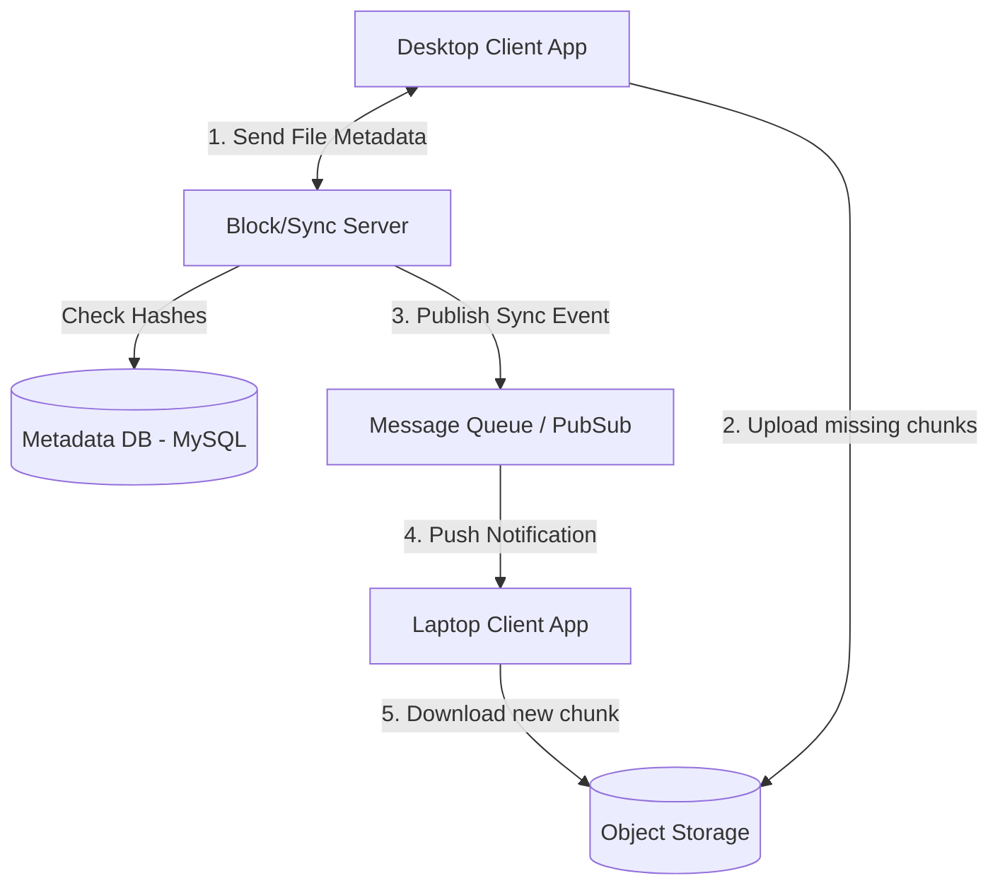

# Google Drive (Cloud File Storage)

## Introduction
Google Drive (similar to Dropbox or OneDrive) is a cloud file storage and synchronization service. It allows users to store files on the cloud, synchronize them across multiple devices, and share them with other users.

## Problem Statement
Storing a file in the cloud is simple. The complex problem is **Synchronization**. If a user has a 5 GB video file and edits 1 MB of metadata in the middle of the file, uploading the entire 5 GB file again to sync the change would consume massive bandwidth, take hours, and ruin the user experience.

## Functional Requirements
1. Users can upload, download, view, and delete files/folders.
2. Files must sync automatically across all the user's devices.
3. Users can share files with others and set permissions (read/write).
4. System must support offline editing; changes sync when the device comes back online.
5. System must support file versioning (undo changes).

## Non-Functional Requirements
1. **High Durability:** Files must never be lost.
2. **High Availability:** The service should always be accessible.
3. **Data Integrity:** The file downloaded must be exactly the file uploaded (ACID compliance for metadata).
4. **Bandwidth Optimization:** Syncing must use minimal network bandwidth.

## Capacity Estimation
- 1 Billion Users.
- Assuming average 10 GB storage per user.
- **Storage:** 1B * 10 GB = 10 Exabytes of raw storage.
- **I/O:** Billions of small sync operations per day.

## Core Architecture: Chunking & Syncing

How do we solve the 5 GB file sync problem? **File Chunking**.

1. When a user adds a file to their local Google Drive folder, the desktop client application splits the file into small, fixed-size chunks (e.g., 2 MB or 4 MB).
2. The client calculates the Hash (SHA-256) of each chunk.
3. The client asks the server: "Do you already have chunks with these hashes?"
4. The server checks its database. If a chunk hash already exists (maybe uploaded by someone else), it is skipped (**Data Deduplication**).
5. The client uploads only the unique, missing chunks to Object Storage.
6. The server updates the Metadata DB: `File A = [ChunkHash1, ChunkHash2, ChunkHash3]`.

**If the user modifies the file:**
Only the specific 2 MB chunk that changed will have a different hash. The client only uploads that single 2 MB chunk, vastly saving bandwidth and time.

## Internal working / Mermaid diagram

## System APIs
`POST /api/v1/files/upload` (Uploads chunks)
`GET /api/v1/files/{file_id}` (Downloads chunks and reconstructs)
`POST /api/v1/metadata/sync` (WebSockets/Long polling for receiving updates)

## Database Design
We have two entirely separate storage needs:

### 1. Object Storage (File Chunks)
Amazon S3 or Google Cloud Storage. It stores binary blobs. 
- Files are immutable. If a chunk changes, a completely new chunk is created.

### 2. Metadata Database (Relational)
Stores the folder structure, file names, permissions, and the mapping of files to chunks.
Because file structures are hierarchical and require strict ACID guarantees (you don't want two devices creating a folder with the same name simultaneously, or a file ending up orphaned), a Relational Database (MySQL / PostgreSQL) is highly recommended.
- **Table: User**
- **Table: Workspace/Folder**
- **Table: File** (`id`, `folder_id`, `name`, `version`)
- **Table: File_Chunks** (`file_id`, `chunk_order`, `chunk_hash`)

## Synchronization Mechanism
How does the user's laptop know that the user's phone uploaded a new file?
- We use **Long Polling** or **WebSockets** connected to a Notification Service.
- When the phone uploads a chunk and updates the Metadata DB, a message is dropped into a Message Queue (Kafka/PubSub).
- The Notification Service consumes this message and pushes an alert to the laptop: "File A has a new version."
- The laptop connects to the Block Server, fetches the new chunk hashes from the Metadata DB, and downloads the missing chunks directly from Object Storage.

## Scaling Strategy
- **Sharding the Metadata DB:** 10 Exabytes of files means hundreds of billions of metadata rows. The database must be sharded based on `user_id`. All files and folders for a specific user live on the same database shard, allowing for fast, localized ACID transactions.
- **Cold Storage:** Most files on Google Drive are uploaded once and rarely accessed. The system aggressively moves old chunks from expensive "Hot" storage to cheaper "Cold" storage (like Amazon Glacier) to save massive costs.

## Bottlenecks & Trade-offs
- **Offline Conflicts:** User edits a document offline on their laptop. Meanwhile, a collaborator edits the same document online. When the laptop connects, we have a conflict.
  - *Trade-off resolution:* The system usually saves both versions (e.g., `Document_v2` and `Document_v2_Conflicted_Copy`) and asks the user to manually resolve it, ensuring zero data loss.
- **Small Files:** If a user uploads 10,000 tiny 1KB text files, chunking them into 4MB blocks is inefficient and creates immense Metadata DB overhead. *Optimization:* Group small files together into a single chunk before uploading.

## Summary
Building a cloud drive is an exercise in bandwidth optimization and strict data integrity. By decoupling the heavy binary data (stored in chunks on scalable Object Storage) from the structural data (stored in a strictly consistent, sharded Relational DB), the system can instantly sync small deltas across millions of devices seamlessly.

## Related topics
- [Dropbox](./dropbox)
- [SQL vs NoSQL](../databases/nosql)
- WebSockets
