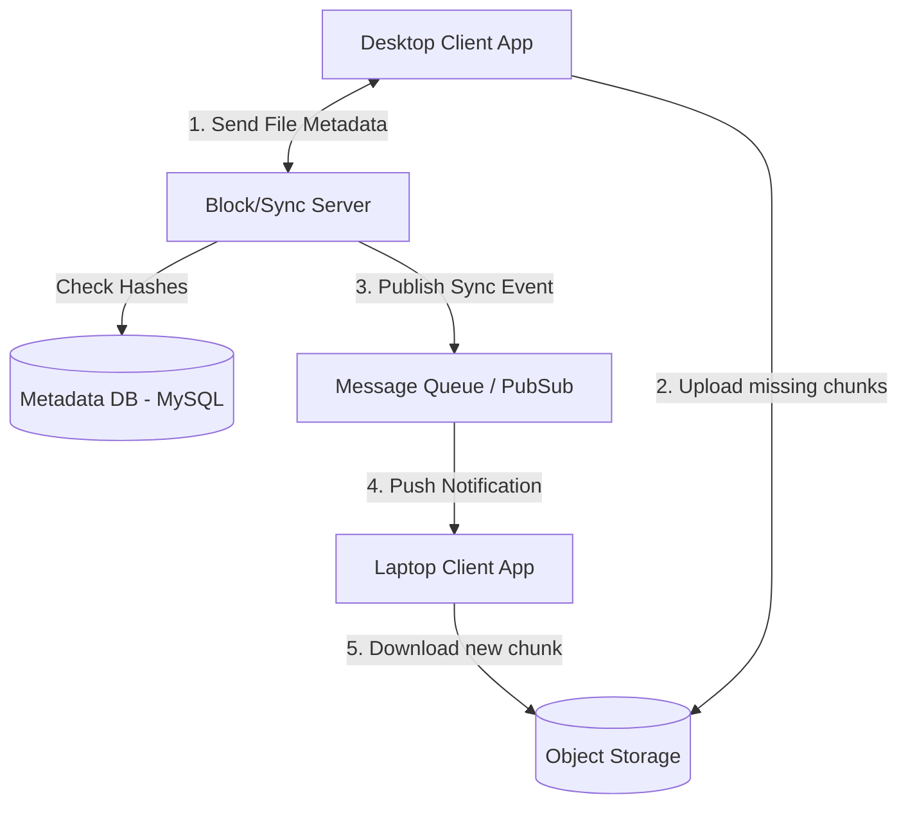

# Google Drive (Cloud File Storage)

## Introduction
Google Drive (similar to Dropbox or OneDrive) is a cloud file storage and synchronization service. It allows users to store files in the cloud, synchronize them across multiple devices, and share them with other users.

## Problem Statement
Storing a file in the cloud is simple. The complex problem is **Synchronization** and **Bandwidth Optimization**. If a user has a 5 GB video file and edits 1 MB of metadata in the middle of the file, uploading the entire 5 GB file again to sync the change would consume massive network bandwidth, take hours, and ruin the user experience.

## Why this exists
To enable secure, cost-effective, and low-bandwidth file sharing and synchronization across millions of user devices, optimizing storage footprint via deduplication.

## Real-world analogy
Imagine editing a massive physical binder containing a 500-page document. If you make a typo on page 250, you don't throw away the entire binder and print a new 500-page document. You simply print page 250, throw away the old page 250, and slip the new page into the binder. File chunking works the same way.

## Definition
A distributed cloud storage service that partitions logical files into fixed-size cryptographic chunks, allowing delta-syncs and data deduplication across shared storage networks.

## Functional Requirements
1. Users can upload, download, view, and delete files/folders.
2. Files must sync automatically across all the user's devices.
3. Users can share files with others and set permissions (read/write).
4. System must support offline editing; changes sync when the device comes back online.
5. System must support file versioning (undo changes).

## Non-Functional Requirements
1. **High Durability:** Files must never be lost (99.999999999% durability).
2. **High Availability:** Service must remain online for downloads.
3. **Data Integrity:** Strict ACID compliance for file metadata (folder mapping).
4. **Bandwidth Optimization:** Syncing must use minimal network bandwidth.

## Capacity Estimation
- **Users:** 1 Billion.
- **Storage:** If each user has 10 GB of storage: 1B * 10 GB = **10 Exabytes** of raw storage.
- **I/O:** Billions of small sync operations per day.

---

## Python/Java implementation

Below is a Java simulation of the File Chunking and Deduplication Engine.

### Java Implementation

#### Bad implementation
*Uploading the entire file to the cloud on every change. This wastes bandwidth and server disk space.*

```java
import java.util.HashMap;
import java.util.Map;

// BAD: Whole File Upload model.
// Re-uploads entire files for tiny edits, consuming massive bandwidth and duplicate storage.
public class MonolithicFileUploader {
    private final Map<String, byte[]> cloudStore = new HashMap<>();

    public void uploadFile(String fileId, byte[] rawFileBytes) {
        // VULNERABILITY: Storing raw file as a single monolithic block.
        // Editing 1 byte requires re-transmitting the entire byte array.
        cloudStore.put(fileId, rawFileBytes);
        System.out.println("Uploaded monolithic file: " + fileId + " | Size: " + rawFileBytes.length + " bytes");
    }
}
```

#### Better implementation
*Splitting the file into blocks and uploading them. However, it lack deduplication checks or delta-only transfers (it still uploads all blocks on every update).*

```java
import java.util.ArrayList;
import java.util.HashMap;
import java.util.List;
import java.util.Map;

// BETTER: Block Chunking without deduplication.
// Splits files into blocks, but uploads all blocks every time, ignoring existing blocks.
public class ChunkedUploader {
    private final Map<String, List<byte[]>> blockStorage = new HashMap<>();
    private static final int CHUNK_SIZE = 1024; // 1KB chunks for mock

    public void uploadFile(String fileId, byte[] rawFileBytes) {
        List<byte[]> chunks = new ArrayList<>();
        int offset = 0;
        
        while (offset < rawFileBytes.length) {
            int length = Math.min(CHUNK_SIZE, rawFileBytes.length - offset);
            byte[] chunk = new byte[length];
            System.arraycopy(rawFileBytes, offset, chunk, 0, length);
            chunks.add(chunk);
            offset += length;
        }

        // VULNERABILITY: Overwriting all chunks on every upload, regardless of changes.
        blockStorage.put(fileId, chunks);
    }
}
```

#### Best implementation
*A simulation of Google Drive's sync engine. The client splits files into blocks and hashes them (SHA-256). The block registry checks for duplicates (Data Deduplication). Only missing blocks are uploaded, and the Metadata DB updates the file-to-chunk map.*

```java
import java.nio.charset.StandardCharsets;
import java.security.MessageDigest;
import java.util.ArrayList;
import java.util.HashSet;
import java.util.List;
import java.util.Set;
import java.util.concurrent.ConcurrentHashMap;

// BEST: File Chunking & Block Deduplication Engine
public class CloudSyncEngine {
    private final ConcurrentHashMap<String, byte[]> blockStore = new ConcurrentHashMap<>(); // Mock S3
    private final ConcurrentHashMap<String, List<String>> metadataDb = new ConcurrentHashMap<>(); // File ID -> List of Chunk Hashes
    private static final int CHUNK_SIZE = 4096; // 4KB block size for mock

    // 1. Client-Side Chunking and Hash Generation
    public static class FilePayload {
        public final String filename;
        public final byte[] content;
        public FilePayload(String filename, byte[] content) {
            this.filename = filename; this.content = content;
        }
    }

    public static class Chunk {
        public final String hash;
        public final byte[] data;
        public Chunk(String hash, byte[] data) { this.hash = hash; this.data = data; }
    }

    public List<Chunk> chunkFile(byte[] content) throws Exception {
        List<Chunk> chunks = new ArrayList<>();
        MessageDigest digest = MessageDigest.getInstance("SHA-256");
        int offset = 0;

        while (offset < content.length) {
            int length = Math.min(CHUNK_SIZE, content.length - offset);
            byte[] blockData = new byte[length];
            System.arraycopy(content, offset, blockData, 0, length);

            byte[] hashBytes = digest.digest(blockData);
            StringBuilder hexString = new StringBuilder();
            for (byte b : hashBytes) {
                hexString.append(String.format("%02x", b));
            }
            String hash = hexString.toString();
            chunks.add(new Chunk(hash, blockData));
            offset += length;
        }
        return chunks;
    }

    // 2. Server-Side Data Deduplication Check
    public Set<String> getMissingBlocks(List<String> chunkHashes) {
        Set<String> missing = new HashSet<>();
        for (String hash : chunkHashes) {
            if (!blockStore.containsKey(hash)) {
                missing.add(hash); // Client must upload this block
            }
        }
        return missing;
    }

    // 3. Upload Missing Blocks & Commit Metadata
    public void commitFileUpload(String fileId, List<Chunk> allChunks, Set<String> uploadedHashes) {
        // A. Store the uploaded blocks in object storage
        for (Chunk chunk : allChunks) {
            if (uploadedHashes.contains(chunk.hash)) {
                blockStore.put(chunk.hash, chunk.data);
                System.out.println("Stored new block in S3: " + chunk.hash.substring(0, 8));
            } else {
                System.out.println("Deduplicated: Block already in S3 -> " + chunk.hash.substring(0, 8));
            }
        }

        // B. Update SQL Metadata table mappings
        List<String> fileMap = new ArrayList<>();
        for (Chunk chunk : allChunks) {
            fileMap.add(chunk.hash);
        }
        metadataDb.put(fileId, fileMap);
    }

    // 4. File Reconstruction on Download
    public byte[] downloadFile(String fileId) {
        List<String> hashes = metadataDb.get(fileId);
        if (hashes == null) return null;

        // Calculate total size first
        int totalSize = 0;
        for (String hash : hashes) {
            totalSize += blockStore.get(hash).length;
        }

        // Assemble chunks chronologically
        byte[] fileBytes = new byte[totalSize];
        int offset = 0;
        for (String hash : hashes) {
            byte[] block = blockStore.get(hash);
            System.arraycopy(block, 0, fileBytes, offset, block.length);
            offset += block.length;
        }
        return fileBytes;
    }
}
```

---

## Core Architecture: Chunking & Syncing
How do we solve the 5 GB file sync problem? **File Chunking**.

1. When a user adds a file to their local Google Drive folder, the desktop client application splits the file into small, fixed-size chunks (e.g., 4 MB).
2. The client calculates the SHA-256 hash of each chunk.
3. The client asks the server: "Do you already have chunks with these hashes?"
4. The server checks its database. If a chunk hash already exists (uploaded by another user), it is skipped (**Data Deduplication**).
5. The client uploads only the unique, missing chunks to Object Storage.
6. The server updates the Metadata DB: `File A = [ChunkHash1, ChunkHash2, ChunkHash3]`.

**If the user modifies the file:**
Only the specific chunk that changed will have a different hash. The client only uploads that single chunk, saving bandwidth.

## Internal working / Mermaid diagram



## System APIs
- `POST /api/v1/files/upload` (Uploads chunk binaries)
- `GET /api/v1/files/{file_id}` (Downloads the file-to-chunk manifest)
- `POST /api/v1/metadata/sync` (WebSocket sync coordination channel)

## Database Design
We split data into two storage layers:

### 1. Object Storage (File Chunks)
Stores the raw binary blobs (Amazon S3 or Google Cloud Storage). Chunks are immutable; any change produces a new hash and a new chunk.

### 2. Metadata Database (Relational)
Stores the folder structure, permissions, and file-to-chunk mappings. A Relational Database (MySQL/PostgreSQL) is recommended for strict ACID guarantees to prevent folder structure conflicts.

#### Table: File
- `file_id` (String, Primary Key)
- `folder_id` (String)
- `name` (String)
- `version` (Integer)

#### Table: File_Chunks
- `file_id` (String, ForeignKey)
- `chunk_hash` (String)
- `chunk_order` (Integer)

## Synchronization Mechanism
How does a user's laptop know that their phone uploaded a new file?
- We use **Long Polling** or **WebSockets** connected to a Notification Service.
- When the phone uploads a chunk and updates the Metadata DB, a message is dropped into a Message Queue (Kafka).
- The Notification Service consumes this message and pushes an alert to the laptop.
- The laptop connects to the Block Server, fetches the new chunk hashes, and downloads the missing chunks directly from Object Storage.

## Scaling Strategy
- **Metadata DB Sharding:** Shard the database by `user_id`. All files and folders for a specific user live on the same database shard, allowing for fast, localized ACID transactions.
- **Cold Storage:** Move old, unaccessed chunks from hot S3 storage to cheaper cold storage (like Glacier) to reduce costs.

## Bottlenecks & Trade-offs
- **Offline Conflicts:** If a user edits a file offline while a collaborator edits it online, conflicts occur. The system saves both versions (e.g., `File_v2` and `File_v2_Conflicted_Copy`) to prevent data loss.
- **Small Files:** Group tiny files (e.g. 1KB text files) together into a single chunk before uploading to avoid metadata database overhead.

## Pros
- Delta sync saves bandwidth and time.
- Deduplication reduces storage costs on shared files.
- Decoupling binary storage from metadata scaling.

## Cons
- File assembly on download introduces CPU overhead.
- Relational sharding by user ID makes cross-user folder sharing complex.

## Interview questions

### Beginner
- **Q: How does Google Drive save bandwidth when you edit a small part of a large file?**
  - **A:** It splits files into smaller pieces (chunks). When a file is edited, the client hashes the chunks and only uploads the specific chunk that changed.
- **Q: What is data deduplication?**
  - **A:** It is a technique to eliminate duplicate copies of repeating data. If multiple users upload the same file (e.g., a popular book), the server only stores the file once in object storage and maps it to all users' metadata.

### Intermediate
- **Q: Why is a relational database (SQL) preferred over NoSQL for Google Drive metadata?**
  - **A:** Google Drive uses a hierarchical folder structure that requires strict ACID compliance. For example, if two devices move a folder simultaneously, a SQL database ensures consistency and prevents orphaned files via ACID transactions.
- **Q: What is the purpose of the Notification Service in Google Drive?**
  - **A:** It maintains persistent connections (via WebSockets or Long Polling) to all active devices. When a file is updated on one device, the server notifies other devices to trigger an automatic sync.

### Senior
- **Q: How would you handle file synchronization conflicts if two users edit the same chunk offline and then sync simultaneously?**
  - **A:** The system uses optimistic concurrency control (version numbers). When a client uploads changes, it sends the base version number it edited. If the server's database shows a higher version has already been committed, a conflict is detected. The server accepts the write but creates a separate "conflicted copy" file, letting the user resolve it.

### Staff Engineer
- **Q: Design a block-level rolling checksum algorithm (like rsync) that detects edits in a file without fixed-size chunk boundaries, explaining why fixed-size chunking fails when bytes are inserted at the beginning of a file.**
  - **A:** 
    1. **Fixed-Size Chunking Failure:** If we split a file at fixed 4MB boundaries, inserting 1 byte at the beginning of the file shifts all subsequent bytes by 1. This changes the hash of every single chunk, forcing the client to re-upload the entire file.
    2. **Rabin Fingerprints (Rolling Hash):** We use a sliding window (e.g., 48 bytes) that moves byte-by-byte through the file, calculating a rolling hash (Rabin Fingerprint).
    3. **Dynamic Boundaries:** When the hash modulo a value equals zero (`hash % 4MB == 0`), we declare a chunk boundary.
    4. **Deltas:** If a byte is inserted, only the local chunk's boundary shifts, keeping other chunk hashes identical. Only the modified chunk is re-uploaded.

## Common mistakes
- **Uploading raw files directly to S3 on every save:** Saturation of network bandwidth.
- **Using client-side timestamps for version control:** Client clocks drift, which leads to overwriting newer files with older ones.

## Best practices
- Perform deduplication on block hashes.
- Use WebSockets for real-time notification syncs.
- Compress chunks before uploading.

## When NOT to use
- Do not build a chunking sync engine if building a simple file hosting service with no editing or multi-device sync requirements.

## Comparison with similar concepts
- **Metadata DB vs Object Storage:** The Metadata DB stores references, paths, and hashes. Object Storage stores the raw, encrypted binary blocks.

## Summary
Building a cloud drive is an exercise in bandwidth optimization and strict data integrity. By decoupling the heavy binary data (stored in chunks on scalable Object Storage) from the structural data (stored in a strictly consistent, sharded Relational DB), the system can instantly sync small deltas across millions of devices seamlessly.

## Related topics
- [Dropbox](./dropbox)
- [SQL vs NoSQL](../databases/nosql)
- WebSockets
