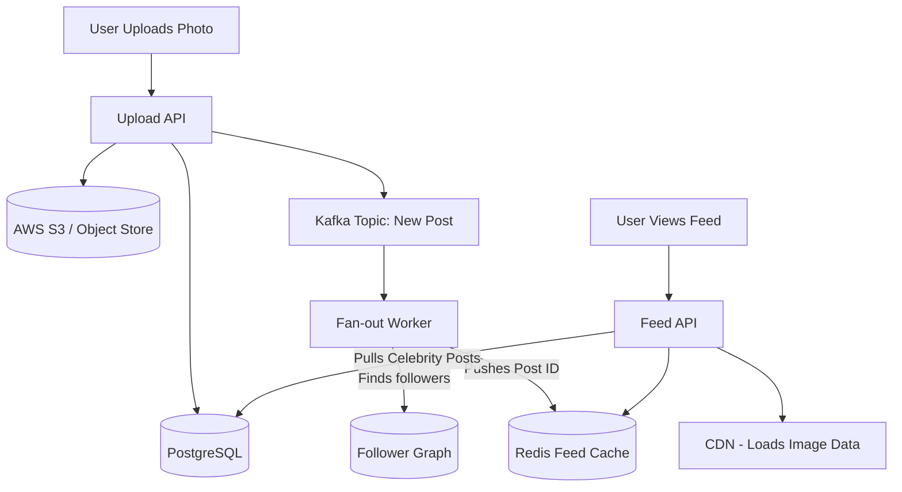

# Instagram (Photo Sharing App)

## Introduction
Instagram is a photo and video sharing social networking service. Designing Instagram involves handling massive amounts of media storage, generating personalized news feeds, and managing the complex follower/following graph structure at extreme scale.

## Problem Statement
When a user opens the app, they expect to see a chronological feed of photos from everyone they follow. If a user follows 1,000 people, querying the database to find the latest photos from all 1,000 users, sorting them, and rendering them in under 200 milliseconds is computationally impossible if done on the fly at scale.

## Why this exists
To enable instant feed generation, media delivery, and social interactions for billions of concurrent users, optimizing resource distribution between active writers and passive readers.

## Real-world analogy
Imagine a newspaper delivery service. If the delivery person had to print custom papers for every household on demand (Pull Model), they would fail. Instead, the printing press prints the standard pages overnight and delivers them to the mailbox beforehand (Push Model), so they are ready when you wake up.

## Definition
A high-performance media publishing and graph-driven social platform featuring low-latency, personalized timeline generation via hybrid push/pull architectures.

## Functional Requirements
1. Users can upload photos and videos.
2. Users can follow other users.
3. Users can view a News Feed consisting of top photos from people they follow.
4. Users can like and comment on photos.

## Non-Functional Requirements
1. **High Availability:** The feed must always load, even if slightly stale.
2. **Low Latency:** The News Feed must render in under 200ms.
3. **Durability:** Uploaded photos must never be lost.
4. **Scalability:** Must support 1 Billion+ active users, handling high read-to-write ratios (e.g., 100:1).

## Capacity Estimation
- **Users:** 1 Billion DAU.
- **Uploads:** 100 Million photos uploaded per day.
- **Media Size:** Average photo size is 2 MB.
- **Storage:** 100M * 2MB = **200 TB** of new media storage per day.

---

## Python/Java implementation

Below is a Java simulation of the Hybrid News Feed Generation and Fan-out Engine.

### Java Implementation

#### Bad implementation
*Querying the database on the fly for all followees' posts, sorting them in memory. This is highly stateful, slow, and crashes database clusters under concurrent reader loads.*

```java
import java.util.ArrayList;
import java.util.Collections;
import java.util.List;

// BAD: Fan-out on Load (Pull model) for all queries.
// Hammers the database with cross-joins and index scans on every single home screen refresh.
public class NaiveFeedGenerator {
    private final DatabaseMock db = new DatabaseMock();

    public List<Post> generateFeed(String userId) {
        List<String> followees = db.getFollowees(userId);
        List<Post> feed = new ArrayList<>();

        // VULNERABILITY: N SQL lookups + sorting in memory. 
        // As followee count increases, latency spikes exponentially.
        for (String followeeId : followees) {
            List<Post> posts = db.getLatestPosts(followeeId);
            feed.addAll(posts);
        }

        feed.sort((p1, p2) -> Long.compare(p2.timestamp, p1.timestamp)); // Descending sort
        return feed.subList(0, Math.min(feed.size(), 20));
    }

    static class Post {
        String postId;
        String authorId;
        long timestamp;
    }

    static class DatabaseMock {
        public List<String> getFollowees(String userId) { return new ArrayList<>(); }
        public List<Post> getLatestPosts(String authorId) { return new ArrayList<>(); }
    }
}
```

#### Better implementation
*Using a push-only timeline cache (fan-out on write). This works for regular users but crashes the system when a celebrity with millions of followers posts (The Celebrity Problem).*

```java
import java.util.ArrayList;
import java.util.HashMap;
import java.util.List;
import java.util.Map;

// BETTER: Push-only (Fan-out on Write) timeline caching.
// Solves read latency by maintaining a pre-computed cache for every user.
// Drawback: If Cristiano Ronaldo (600M followers) posts, updating 600M caches locks the system.
public class PushOnlyFeedService {
    private final Map<String, List<String>> userTimelines = new HashMap<>();
    private final FollowerGraphMock graph = new FollowerGraphMock();

    public void onNewPost(String authorId, String postId) {
        List<String> followers = graph.getFollowers(authorId);
        
        // VULNERABILITY: Massive loop execution.
        // Causes memory exhaustion and lock contention if follower count is high.
        for (String followerId : followers) {
            userTimelines.computeIfAbsent(followerId, k -> new ArrayList<>()).add(0, postId);
        }
    }

    public List<String> getFeed(String userId) {
        return userTimelines.getOrDefault(userId, new ArrayList<>());
    }

    static class FollowerGraphMock {
        public List<String> getFollowers(String userId) { return new ArrayList<>(); }
    }
}
```

#### Best implementation
*A hybrid feed generation simulation. It uses a mock Snowflake ID generator (time-sortable 64-bit IDs). It pushes posts to followers' timelines for normal users, but flags celebrity posts to be pulled dynamically at read-time, merging both sources chronologically.*

```java
import java.util.ArrayList;
import java.util.Collections;
import java.util.HashMap;
import java.util.List;
import java.util.Map;
import java.util.concurrent.ConcurrentHashMap;
import java.util.concurrent.atomic.AtomicLong;

// BEST: Hybrid Push/Pull Feed Engine with Time-Sortable IDs
public class HybridFeedEngine {
    private static final int CELEBRITY_THRESHOLD = 10000;
    
    // In-memory representation of Redis Timeline Cache
    private final ConcurrentHashMap<String, List<Long>> userTimelineCaches = new ConcurrentHashMap<>();
    private final ConcurrentHashMap<String, List<Post>> celebrityPostDb = new ConcurrentHashMap<>();
    private final FollowGraph followGraph = new FollowGraph();
    private final SnowflakeIdGenerator idGenerator = new SnowflakeIdGenerator(1);

    static class Post implements Comparable<Post> {
        final long postId; // Time-sortable Snowflake ID
        final String authorId;
        final String mediaUrl;

        public Post(long postId, String authorId, String mediaUrl) {
            this.postId = postId; this.authorId = authorId; this.mediaUrl = mediaUrl;
        }

        @Override
        public int compareTo(Post o) {
            return Long.compare(o.postId, this.postId); // Descending (Newest first)
        }
    }

    // 1. Write Path: Handle new post
    public void publishPost(String authorId, String mediaUrl) {
        long postId = idGenerator.nextId();
        Post post = new Post(postId, authorId, mediaUrl);

        int followerCount = followGraph.getFollowerCount(authorId);

        if (followerCount >= CELEBRITY_THRESHOLD) {
            // Celebrity: Pull Model. Store in separate DB partition, do not fan-out.
            celebrityPostDb.computeIfAbsent(authorId, k -> new ArrayList<>()).add(post);
            System.out.println("Celebrity [" + authorId + "] posted. Buffered for Pull model.");
        } else {
            // Regular User: Push Model. Fan-out to all active followers.
            List<String> followers = followGraph.getFollowers(authorId);
            for (String followerId : followers) {
                userTimelineCaches.computeIfAbsent(followerId, k -> new ArrayList<>()).add(0, postId);
            }
            System.out.println("Regular User [" + authorId + "] posted. Fanned out to " + followers.size() + " feeds.");
        }
    }

    // 2. Read Path: Generate Feed via Merge
    public List<Post> getHomeFeed(String userId) {
        List<Post> mergedFeed = new ArrayList<>();

        // Step A: Pull from User's pre-computed regular timeline cache
        List<Long> regularPostIds = userTimelineCaches.getOrDefault(userId, new ArrayList<>());
        for (long pid : regularPostIds) {
            mergedFeed.add(new Post(pid, "friend", "media_url")); // Mock instantiation
        }

        // Step B: Pull from Celebrities this user follows
        List<String> followedUsers = followGraph.getFollowing(userId);
        for (String followeeId : followedUsers) {
            if (followGraph.getFollowerCount(followeeId) >= CELEBRITY_THRESHOLD) {
                List<Post> celPosts = celebrityPostDb.getOrDefault(followeeId, new ArrayList<>());
                mergedFeed.addAll(celPosts);
            }
        }

        // Step C: Merge and Sort
        Collections.sort(mergedFeed);
        return mergedFeed.subList(0, Math.min(mergedFeed.size(), 20));
    }

    // Mock Follower Graph
    static class FollowGraph {
        public List<String> getFollowers(String userId) { return new ArrayList<>(); }
        public List<String> getFollowing(String userId) { return new ArrayList<>(); }
        public int getFollowerCount(String userId) { return 500; }
    }

    // Mock 64-bit Snowflake ID Generator (Time-Sortable)
    static class SnowflakeIdGenerator {
        private final long workerId;
        private final AtomicLong sequence = new AtomicLong(0);
        private static final long EPOCH = 1609459200000L; // Custom epoch

        public SnowflakeIdGenerator(long workerId) { this.workerId = workerId; }

        public synchronized long nextId() {
            long timestamp = System.currentTimeMillis() - EPOCH;
            return (timestamp << 22) | (workerId << 12) | (sequence.getAndIncrement() % 4096);
        }
    }
}
```

---

## Database & Storage Design
1. **Object Storage (AWS S3):** Used to store the actual binary image/video files. S3 is endlessly scalable and highly durable.
2. **CDN (Cloudflare/CloudFront):** Caches the images geographically close to the users. When a user requests an image, it is served from the CDN edge node, not our core servers.
3. **Relational DB (PostgreSQL / MySQL):** Stores User profiles, Follower relations, and Post metadata. Because of the scale, this database must be heavily sharded.

### Table: FollowRelation
- `follower_id` (String)
- `followee_id` (String)
- `created_at` (Timestamp)

### Table: Post
- `post_id` (Long, Primary Key, Time-sortable Snowflake ID)
- `user_id` (String, Indexed)
- `media_url` (String)
- `caption` (Text)
- `created_at` (Timestamp)

## The News Feed Generation (The Core Algorithm)
How do we generate the feed quickly?

- **Regular Users:** Use the **Push Model**. Fan-out on write to keep read latency at zero.
- **Celebrities:** Do NOT push to followers' caches.
- **At Read Time:** When User A opens the app, the server grabs their pre-computed cache (from regular friends) AND performs a **Pull Model** query just for the celebrities they follow. It merges them in memory.

## Internal working / Mermaid diagram



## Scaling Strategy
- **Database Sharding:** The Post database grows massively. Shard it by `user_id`. All posts for a user live on the same shard.
- **ID Generation:** Since we are sharding, we cannot use a central DB auto-increment ID for `post_id`. We must use a distributed ID generator (like Twitter Snowflake) that guarantees unique, time-sortable 64-bit integers across thousands of servers.

## Bottlenecks & Trade-offs
- **Eventual Consistency:** When a user uploads a photo, it might take a few seconds for the Fan-out workers to update all followers' caches. This is perfectly acceptable for social media.
- **Cache Eviction:** We don't store a user's entire history in Redis. We cap the pre-computed feed cache at ~500 posts. If the user scrolls past 500, we fall back to database queries.

## Failure Handling
- **S3 Durability:** S3 provides 99.999999999% durability. Data loss of images is effectively impossible.
- **Redis Crash:** If a Redis node holding timelines crashes, we don't lose data (the source of truth is PostgreSQL). The system experiences a temporary latency spike as it rebuilds the timelines for those users from the database using the Pull Model.

## Pros
- Under 200ms read latency (timeline reads are mostly fast Redis lookups).
- Decouples expensive write loops from celebrity posts.
- CDN offloading reduces traffic costs and latency.

## Cons
- Complex hybrid logic (handling separate pipelines for celebrities vs normal users).
- Eventual consistency means feeds can be slightly out of sync.

## Interview questions

### Beginner
- **Q: Why does Instagram use a CDN (Content Delivery Network)?**
  - **A:** Images and videos are large files. Serving them from a central database is slow. A CDN caches these files at edge servers located closer to users worldwide, reducing download times.
- **Q: What is the difference between a Pull and a Push model in feed generation?**
  - **A:** In a Pull model, the server compiles the feed when the user opens the app by searching the database for friends' posts. In a Push model, when a friend uploads a post, the server immediately writes the post ID into the feeds of all their followers.

### Intermediate
- **Q: What is the "Celebrity Problem" (or Justin Bieber effect) in system design, and how does a hybrid approach solve it?**
  - **A:** In a push-only system, if a celebrity with 100 million followers uploads a photo, the server must write that post ID to 100 million individual caches, causing write lockouts and latency. A hybrid approach resolves this by using push only for regular users and pull (dynamic retrieval at read time) for celebrities.
- **Q: Why can't we use standard database auto-incrementing IDs in a sharded database?**
  - **A:** Each database shard runs independently. If two shards increment their IDs locally, they will generate duplicate IDs. We must use a distributed ID generation service (like Snowflake) to ensure globally unique IDs.

### Senior
- **Q: How does a Snowflake ID generator ensure both uniqueness and time-sortability without a central coordinator?**
  - **A:** Snowflake IDs are 64-bit integers split into parts:
    - 41 bits for timestamp (milliseconds since a custom epoch, ensuring chronological order).
    - 10 bits for worker/node ID (ensuring uniqueness across machines).
    - 12 bits for sequence number (allowing 4096 IDs per millisecond per node).
    Because the most significant bits represent time, sorting by ID sorts by creation time automatically.

### Staff Engineer
- **Q: Design an algorithmic news feed ranking service that personalizes feeds based on user affinity scores, post age, and engagement, scaling to 1 billion DAU.**
  - **A:** 
    1. **Two-Stage Retrieval:**
       - **Stage 1 (Candidate Generation):** Fetch the candidate post IDs from the hybrid cache/database (up to 500-1000 posts).
       - **Stage 2 (Heavy Ranking):** Pass these candidates to a ML Ranking service.
    2. **Scoring Pipeline:** Apply a scoring function: $Score = Affinity(User, Author) \times EngagementProbability(Like, Comment) \times TimeDecay(Age)$.
    3. **Affinity Matrix:** Compute user affinity offline in a graph processing pipeline (e.g. Spark/PageRank) and cache it in Redis.
    4. **In-Memory Predictor:** Query a fast, model-inference service (like TensorFlow Serving) at the edge to score and sort the top 20 posts in under 50ms, caching the ranked output.

## Common mistakes
- **Pushing celebrity posts to all followers' caches:** Causing massive system latency during write surges.
- **Storing binary images in PostgreSQL:** Relational databases are not designed for large binary objects (BLOBs); use object storage (S3).

## Best practices
- Enforce CDN caching for media files.
- Cap pre-computed timeline caches.
- Use time-sortable distributed IDs.

## When NOT to use
- Do not use a hybrid fan-out architecture if building an internal team portal with few updates and users; a standard SQL pull query is sufficient.

## Comparison with similar concepts
- **S3 vs CDN:** S3 is the persistent origin storage for the raw files. A CDN is the caching layer that sits between the user and S3 to speed up delivery.

## Summary
Designing Instagram requires a relentless focus on Read latency. By separating media storage (S3/CDN) from metadata, sharding the relational database, and utilizing a Hybrid Fan-out model to pre-compute news feeds in Redis, the system can instantly deliver fresh content to over a billion users.

## Related topics
- [CDN](../caching/cdn)
- [Redis](../caching/redis)
- [Sharding](../databases/sharding)
