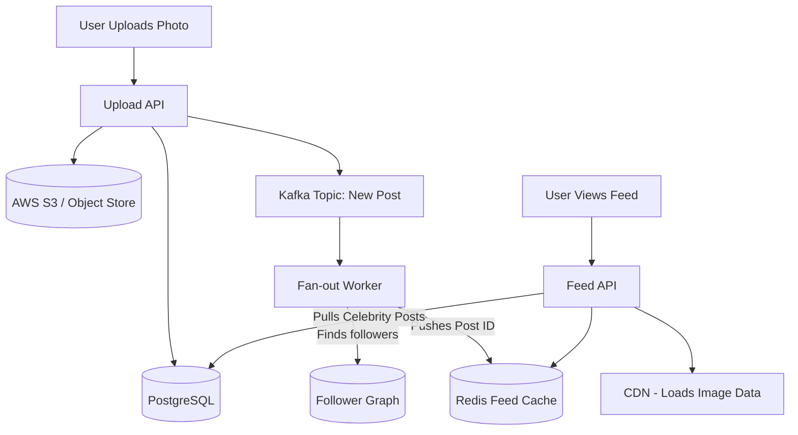

# Instagram (Photo Sharing App)

## Introduction
Instagram is a photo and video sharing social networking service. Designing Instagram involves handling massive amounts of media storage, generating personalized news feeds, and managing the complex follower/following graph structure at extreme scale.

## Problem Statement
When a user opens the app, they expect to see a chronological (or algorithmically sorted) feed of photos from everyone they follow. If a user follows 1,000 people, querying the database to find the latest photos from all 1,000 users, sorting them, and rendering them in under 200 milliseconds is computationally impossible if done on the fly.

## Functional Requirements
1. Users can upload photos and videos.
2. Users can follow other users.
3. Users can view a News Feed consisting of top photos from people they follow.
4. Users can like and comment on photos.

## Non-Functional Requirements
1. **High Availability:** The system should never go down. Showing a slightly stale news feed is better than showing an error page.
2. **Low Latency:** The News Feed must load in under 200ms.
3. **Durability:** Uploaded photos must never be lost.
4. **Scalability:** Read heavy. The read-to-write ratio is incredibly high (e.g., 100:1).

## Capacity Estimation
- 1 Billion DAU.
- 100 Million photos uploaded per day.
- Average photo size: 2 MB.
- **Storage:** 100M * 2MB = 200 TB of new media storage per day.
- **Reads:** Billions of feed views per day.

## System APIs
`POST /api/v1/media` (Upload photo, returns Media ID)
`POST /api/v1/posts` (Create post with Media ID and caption)
`POST /api/v1/follow/{user_id}`
`GET /api/v1/feed` (Returns list of posts for the home screen)

## Database & Storage Design
1. **Object Storage (AWS S3):** Used to store the actual binary image/video files. S3 is endlessly scalable and highly durable.
2. **CDN (Cloudflare/CloudFront):** Caches the images geographically close to the users. When a user requests an image, it is served from the CDN edge node, not our core servers.
3. **Relational DB (PostgreSQL / MySQL):** Stores User profiles, Follower relations, and Post metadata. Because of the scale, this database must be heavily sharded.

### Table: FollowRelation
- `follower_id`
- `followee_id`
- `created_at`

### Table: Post
- `post_id` (Primary Key, Time-sortable like Twitter's Snowflake ID)
- `user_id` (Indexed)
- `media_url`
- `caption`
- `created_at`

## The News Feed Generation (The Core Algorithm)

How do we generate the feed quickly?

### Approach 1: Pull Model (Fan-out on Load)
When User A opens the app, the server finds the 1,000 people User A follows. It queries the Post table for the latest 5 posts from each of those 1,000 people. It merges and sorts the 5,000 posts in memory and returns the top 20.
- *Problem:* Too slow. High latency on every single app open. Database gets crushed.

### Approach 2: Push Model (Fan-out on Write)
We use a **Pre-computed Home Timeline Cache** (often stored in Redis) for every active user. 
When User B uploads a photo, a background worker fetches all of User B's followers. It then *pushes* the new `post_id` directly into the Redis timeline cache of every single follower.
When User A opens the app, the server just reads User A's Redis cache (which already contains a sorted list of `post_ids`) and fetches the data. Lightning fast.
- *Problem:* What if Cristiano Ronaldo (600M followers) posts a photo? Fanning out to 600 Million Redis caches will take minutes/hours and cause massive resource spikes. This is known as the **Celebrity Problem** (or Justin Bieber effect).

### Approach 3: Hybrid Model (The Solution)
- For regular users (e.g., < 10,000 followers): Use the **Push Model**. Fan-out on write to keep read latency at zero.
- For celebrities (e.g., > 10,000 followers): Do NOT push to followers' caches. 
- When User A opens the app, the server grabs their pre-computed cache (from regular friends) AND performs a **Pull Model** query just for the celebrities they follow. It merges them in memory.

## Internal working / Mermaid diagram

## Scaling Strategy
- **Database Sharding:** The Post database grows massively. Shard it by `user_id`. All posts for a user live on the same shard.
- **ID Generation:** Since we are sharding, we cannot use a central DB auto-increment ID for `post_id`. We must use a distributed ID generator (like Twitter Snowflake) that guarantees unique, time-sortable 64-bit integers across thousands of servers.

## Bottlenecks & Trade-offs
- **Eventual Consistency:** When a user uploads a photo, it might take a few seconds for the Fan-out workers to update all followers' caches. This means for a few seconds, some users see the post and others don't. This is perfectly acceptable for social media.
- **Cache Eviction:** We don't store a user's entire history in Redis. We cap the pre-computed feed cache at ~500 posts. If the user scrolls past 500, we fall back to database queries.

## Failure Handling
- **S3 Durability:** S3 provides 99.999999999% durability. Data loss of images is effectively impossible.
- **Redis Crash:** If a Redis node holding timelines crashes, we don't lose data (the source of truth is PostgreSQL). The system experiences a temporary latency spike as it rebuilds the timelines for those users from the database using the Pull Model.

## Summary
Designing Instagram requires a relentless focus on Read latency. By separating media storage (S3/CDN) from metadata, sharding the relational database, and utilizing a Hybrid Fan-out model to pre-compute news feeds in Redis, the system can instantly deliver fresh content to over a billion users.

## Related topics
- [CDN](../caching/cdn)
- [Redis](../caching/redis)
- [Sharding](../databases/sharding)
