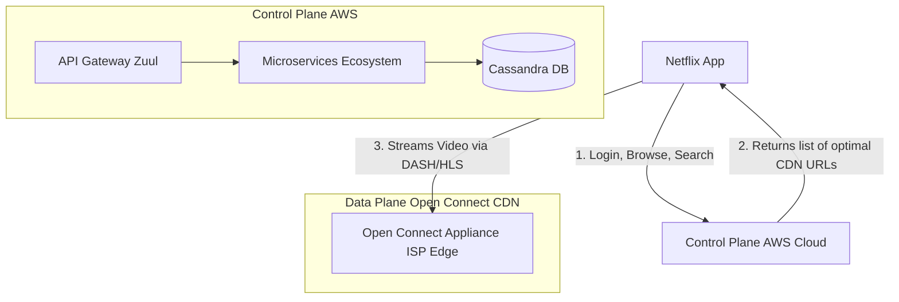

# Netflix (Subscription Streaming Service)

## Introduction
Netflix is a global streaming service that accounts for a massive percentage of total global internet traffic. While similar to YouTube in streaming mechanics, Netflix has a fundamentally different architecture because it is a "read-heavy, controlled-write" system. Netflix encodes its own professional content rather than dealing with millions of unpredictable user uploads.

## Problem Statement
Netflix must serve ultra-high-quality (4K Dolby Vision) video to 200+ million subscribers simultaneously without buffering. If AWS goes down in one region, the system must failover to another region seamlessly.

## Why this exists
To optimize video delivery costs, bypass global internet congestion, and ensure high availability through localized CDN nodes and active-active cloud failover.

## Real-world analogy
Imagine a global chain of brick-and-mortar grocery stores. Instead of shipping every single apple from a single massive farm in California directly to customers' homes globally (which would take days and cause fruit to rot), the company builds local distribution centers in every major city. They stock these centers overnight so that when a local customer buys an apple, it is delivered from down the street in minutes.

## Definition
A subscription video-on-demand service utilizing a resilient cloud Control Plane for user metadata/recommendations, and a proprietary, ISP-embedded CDN (Open Connect) for low-latency media delivery.

## Functional Requirements
1. Users can create profiles and manage subscriptions.
2. Users can browse personalized recommendations.
3. Users can stream videos seamlessly across different devices (TV, Mobile, Web).
4. System must save playback state (resume watching bookmark).

## Non-Functional Requirements
1. **Zero Downtime:** High availability is the top priority (Active-Active multi-region).
2. **Low Latency Streaming:** Zero startup delay and no buffering.
3. **High Security:** DRM (Digital Rights Management) to protect copyrighted content.

## Core Architecture: The Three Main Components
Netflix's architecture is divided into three distinct parts:
1. **Client (App/TV):** The device playing the video.
2. **Control Plane (Backend):** Runs on AWS. Handles login, billing, recommendations, search, and telling the client *where* to get the video.
3. **Data Plane (Open Connect):** Netflix's proprietary CDN. Handles the actual heavy lifting of streaming the video files.

---

## Python/Java implementation

Below is a Java simulation of the CDN Router.

### Java Implementation

#### Bad implementation
*Directly hardcoding a single global server URL for all video requests. If that server is overloaded, slow, or offline, streaming fails for all users.*

```java
// BAD: Monolithic Single-Endpoint Routing.
// No geo-proximity checks, no health monitoring, and no failover logic.
public class StaticCdnRouter {

    public String getVideoStreamingUrl(String videoId, String userIp) {
        // VULNERABILITY: Hardcoding a single origin server location
        // Ignores user geography, causing massive latency, and represents a single point of failure.
        return "https://origin-primary.netflix.com/videos/" + videoId + "/master.m3u8";
    }
}
```

#### Better implementation
*Evaluating a list of servers to find a healthy node, but failing to match user proximity (routing a UK user to an Asian server) or simulate adaptive bitrate changes.*

```java
import java.util.ArrayList;
import java.util.List;

// BETTER: Dynamic Health-Aware Router.
// Filters out offline servers, but lacks geographic network routing (ISP/IP matching).
public class HealthAwareRouter {
    private final List<CdnNode> cdnNodes = new ArrayList<>();

    public String getHealthyNode(String videoId) {
        for (CdnNode node : cdnNodes) {
            if (node.isHealthy) {
                return "https://" + node.ipAddress + "/stream/" + videoId;
            }
        }
        throw new RuntimeException("No healthy CDN nodes available");
    }

    static class CdnNode {
        String ipAddress;
        boolean isHealthy;
    }
}
```

#### Best implementation
*A simulation of Netflix's Open Connect router. It maps users to the closest healthy Open Connect Appliance (OCA) based on IP/ISP prefixes, monitors OCA health, handles automatic failover to alternative nodes, and simulates Adaptive Bitrate (ABR) adjustments based on client latency.*

```java
import java.util.ArrayList;
import java.util.List;
import java.util.concurrent.CopyOnWriteArrayList;

// BEST: Open Connect Proximity Router & Adaptive Bitrate Failover Simulator
public class OpenConnectRoutingEngine {
    private final List<OpenConnectAppliance> ocaCluster = new CopyOnWriteArrayList<>();

    // 1. Open Connect Appliance (OCA) representation
    public static class OpenConnectAppliance {
        public final String id;
        public final String ispName;
        public final String ipPrefix; // Simulating simple subnet prefix (e.g. "192.168")
        public boolean isHealthy = true;

        public OpenConnectAppliance(String id, String ispName, String ipPrefix) {
            this.id = id; this.ispName = ispName; this.ipPrefix = ipPrefix;
        }
    }

    public void registerOca(OpenConnectAppliance oca) {
        ocaCluster.add(oca);
    }

    // 2. Proximity Router (re-evaluates healthy nodes in real-time)
    public List<OpenConnectAppliance> routeClientToOcas(String clientIp, String clientIsp) {
        List<OpenConnectAppliance> matches = new ArrayList<>();
        String clientSubnet = clientIp.substring(0, Math.min(clientIp.length(), 7)); // Mock subnet prefix check

        // Step A: Attempt to find healthy OCAs inside client's ISP & subnet
        for (OpenConnectAppliance oca : ocaCluster) {
            if (oca.isHealthy && oca.ispName.equalsIgnoreCase(clientIsp) && oca.ipPrefix.startsWith(clientSubnet)) {
                matches.add(oca);
            }
        }

        // Step B: Fallback to any healthy OCA inside same ISP
        if (matches.isEmpty()) {
            for (OpenConnectAppliance oca : ocaCluster) {
                if (oca.isHealthy && oca.ispName.equalsIgnoreCase(clientIsp)) {
                    matches.add(oca);
                }
            }
        }

        // Step C: Fallback to global backup OCA
        if (matches.isEmpty()) {
            for (OpenConnectAppliance oca : ocaCluster) {
                if (oca.isHealthy) matches.add(oca);
            }
        }

        return matches;
    }

    // 3. Client Playback & Adaptive Bitrate (ABR) Simulator
    public static class AdaptivePlaybackSession {
        private final List<OpenConnectAppliance> allocatedOcas;
        private int currentOcaIndex = 0;

        public AdaptivePlaybackSession(List<OpenConnectAppliance> allocatedOcas) {
            this.allocatedOcas = allocatedOcas;
        }

        // Dynamically request next video segment based on network latency (ABR logic)
        public String requestSegment(double networkLatencyMs) {
            if (allocatedOcas.isEmpty()) {
                return "FAIL: No nodes allocated";
            }

            OpenConnectAppliance activeOca = allocatedOcas.get(currentOcaIndex);

            // Failover check
            if (!activeOca.isHealthy) {
                System.out.println("Active node [" + activeOca.id + "] is dead! Initiating failover.");
                currentOcaIndex = (currentOcaIndex + 1) % allocatedOcas.size();
                activeOca = allocatedOcas.get(currentOcaIndex);
                if (!activeOca.isHealthy) return "FAIL: All allocated nodes offline";
            }

            // ABR Quality Selection Rules
            String quality;
            if (networkLatencyMs < 50) {
                quality = "4K_DolbyVision";
            } else if (networkLatencyMs < 150) {
                quality = "1080p_HD";
            } else if (networkLatencyMs < 300) {
                quality = "720p";
            } else {
                quality = "360p_SD"; // Degrade quality to prevent buffering
            }

            return "Streaming from node [" + activeOca.id + "] | Quality: " + quality;
        }
    }
}
```

---

## Internal working / Mermaid diagram



## Step-by-step Playback Flow
1. **Metadata Retrieval:** The client logs in and fetches recommended title metadata from the AWS-hosted Control Plane.
2. **Play Request:** The user clicks "Play". The client sends a request to the Playback Service on AWS.
3. **Geo-Routing Resolution:** The Playback Service evaluates the client's IP and ISP. It queries the Open Connect routing database and returns a prioritized list of Open Connect Appliances (OCAs) containing the requested video.
4. **Direct Streaming:** The client disconnects from AWS and initiates direct connection handles with the local OCA located inside their own ISP.
5. **ABR loop:** The client's video player requests video segments sequentially, monitoring network speeds and adjusting resolutions dynamically.

## Open Connect (The Secret Weapon)
Why doesn't Netflix use standard CDNs? 
Because standard CDNs charge per gigabyte. Given Netflix's volume, standard CDN costs would be unsustainable.

Instead, Netflix built **Open Connect**. They manufacture custom, high-density storage servers (Open Connect Appliances) and ship them for free to ISPs globally. The ISP installs the OCA server inside their local network.
- *Result:* When you watch Netflix, the video data travels from a box sitting in your local ISP directly to your home, bypassing the main internet backbone. This saves the ISP money on bandwidth and guarantees high speeds for the user.

## Database Design (Cassandra)
Netflix uses **Apache Cassandra** for its Control Plane because it requires high availability, cross-region replication, and zero single points of failure.

### Handling Playback State (Bookmarks):
- When a user watches a movie, the app sends a heartbeat every 5 seconds to AWS: "User 123 is at minute 42."
- Cassandra handles this high write load easily.
- If the user switches devices, the new device queries Cassandra, gets "minute 42", and resumes playback instantly.

## Scaling Strategy & Resilience
- **Chaos Engineering (Chaos Monkey):** Netflix intentionally shuts down production servers, kills databases, and cuts network links during business hours to ensure their systems heal and failover automatically.
- **Multi-Region Active-Active:** The AWS backend runs simultaneously in multiple AWS regions. If a region goes down, DNS routing instantly redirects all traffic to surviving regions.

## Bottlenecks & Trade-offs
- **Storage vs Network:** Netflix encodes a single movie into dozens of different formats and bitrates, generating terabytes of files for one movie. They push *all* these files to the OCAs overnight when internet traffic is low. Trade-off: Massive redundant storage costs at the edge, but it entirely eliminates network congestion during prime-time viewing hours.

## Failure Handling
- **OCA Offline:** If a local OCA server crashes during streaming, the client app immediately switches to a backup OCA IP address from the routing list, preventing playback interruption.

## Pros
- Extremely low bandwidth costs due to proprietary edge boxes (Open Connect).
- Resilient to major cloud outages via active-active multi-region deployments.
- Consistent user experience via low-latency local ISP networks.

## Cons
- High capital expenditure to build, ship, and maintain physical hardware (OCAs) globally.
- Inflexible to instant catalog updates (requires pushing new video files overnight).

## Interview questions

### Beginner
- **Q: What are the three main components of Netflix's architecture?**
  - **A:** The Client (App/TV), the Control Plane (AWS backend for login, search, recommendations), and the Data Plane (Open Connect CDN for video streaming).
- **Q: Why does Netflix save your playback state every 5 seconds?**
  - **A:** To support multi-device resume. If you stop watching on your TV, you can open the app on your phone and resume from the exact same second.

### Intermediate
- **Q: Why did Netflix build its own CDN (Open Connect) instead of using AWS CloudFront?**
  - **A:** Cost and performance. Standard CDNs charge per gigabyte, which would be extremely expensive at Netflix's scale. By building their own appliances and putting them inside ISPs for free, Netflix streams traffic locally, avoiding transit costs and backbone congestion.
- **Q: Why is Apache Cassandra used instead of MySQL for user bookmarks?**
  - **A:** Bookmark updates happen every 5 seconds for millions of active streams, generating massive write traffic. Cassandra is optimized for high write throughput and supports multi-region active-active replication, ensuring bookmarks are synchronized globally.

### Senior
- **Q: Explain how active-active multi-region routing works in Netflix's Control Plane.**
  - **A:** Instead of using one active region and a passive backup, Netflix deploys its microservices globally across multiple AWS regions in an active-active configuration. User requests are routed to the nearest region via Route53 DNS. Cassandra databases replicate data bidirectionally. If a region fails, traffic is redirected to another region, which handles the load because databases are already synchronized.

### Staff Engineer
- **Q: Describe the architecture of Netflix Zuul and how it implements dynamic routing, security filters, and resilience at the edge.**
  - **A:** Zuul is Netflix's edge API gateway.
    1. **Dynamic Routing:** Zuul uses pre-routing, routing, and post-routing filters to inspect incoming HTTP requests, validate JWT tokens, and forward requests to internal microservices.
    2. **Resilience (Hystrix integration):** It wraps backend calls in circuit breakers. If a backend service fails or exhibits high latency, Zuul returns cached fallback data instead of letting the gateway thread block.
    3. **Filter Loading:** Zuul filters are written as separate Groovy scripts that are dynamically compiled and loaded into the running JVM without restarting the gateway, allowing real-time changes to routing rules.

## Common mistakes
- **Treating Open Connect like a standard pull CDN:** Attempting to pull movies dynamically on demand from AWS to the OCA when a user hits play. OCAs are pre-loaded overnight.
- **Using transactional databases for stateless bookmark streams:** Causing database deadlocks under high-frequency writes.

## Best practices
- Pre-position content during off-peak hours.
- Design systems to be region-evacuation ready.
- Leverage chaos testing in production to verify resilience.

## When NOT to use
- Do not build a custom ISP-embedded CDN if your streaming volume is small; use public CDNs (CloudFront, Akamai).

## Comparison with similar concepts
- **Netflix Open Connect vs Standard CDN:** Standard CDNs are multi-tenant and fetch content from origin servers on cache misses (pull model). Open Connect is single-tenant (Netflix only), sitting inside local ISPs with pre-positioned content (push model).

## Summary
Netflix is the gold standard of cloud architecture and edge delivery. By utilizing a highly resilient AWS microservices backend for the Control Plane, and inventing a proprietary, ISP-embedded CDN (Open Connect) for the Data Plane, Netflix achieves unparalleled streaming quality and reliability.

## Related topics
- [YouTube](./youtube)
- [CDN](../caching/cdn)
- [Cassandra/NoSQL](../databases/nosql)
