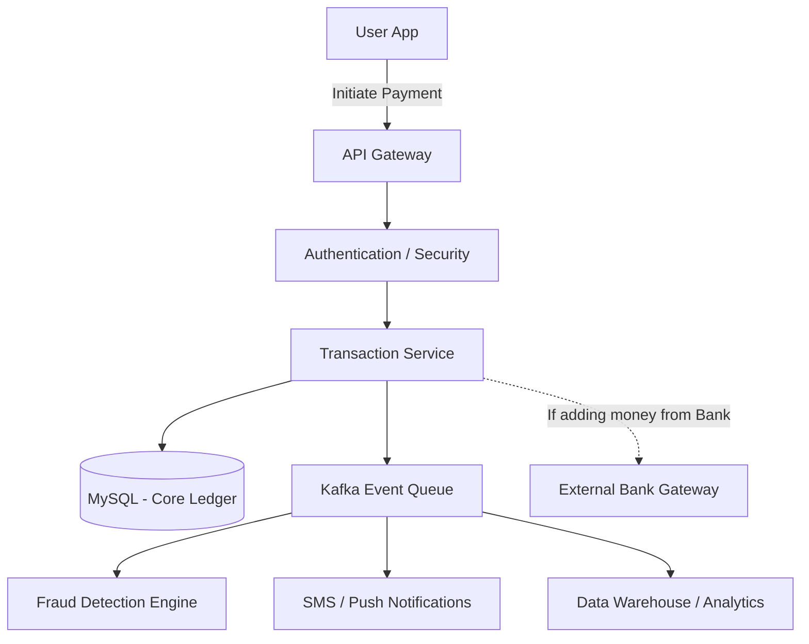

# Paytm (Digital Wallet & Payment Gateway)

## Introduction
Paytm is a digital payments and financial services platform. It functions as a digital wallet, a UPI platform, and a merchant gateway. Designing a financial system requires absolute zero tolerance for data loss, inconsistency, or double charging.

## Problem Statement
In a social network, if a "Like" count is temporarily out of sync, the system functions fine. In a digital wallet, if User A sends $100 to User B, and the server crashes midway, either User A loses $100 for nothing, or User B gets $100 out of thin air. The system must guarantee that money is transferred reliably, exactly once, even during network timeouts, server crashes, and database failures.

## Why this exists
To maintain transactional consistency across distributed systems, prevent duplicate charges on network retries, and ensure absolute financial auditability.

## Real-world analogy
Imagine a physical ledger book at a bank. If Alice wants to give Bob $50, the teller doesn't just write Bob's new balance on a scrap of paper. First, they check Alice's drawer, verify she has the money, write a line deducting $50 from Alice, write a line adding $50 to Bob, and sign the book. If the pen runs out of ink midway, they scratch out the entries (Rollback) and start over.

## Definition
A strictly consistent financial transaction ledger utilizing idempotency key checks, sharded relational databases, and distributed consensus/coordination protocols (like 2PC).

## Functional Requirements
1. Users can add money to their digital wallet from a bank account.
2. Users can transfer money from their wallet to another user's wallet.
3. Users can pay merchants via QR codes.
4. Users can view their transaction history.

## Non-Functional Requirements
1. **Absolute ACID Consistency:** No money can be created or destroyed.
2. **Idempotency:** If a user clicks "Pay" twice due to network lag, they must not be charged twice.
3. **High Security:** Compliance with financial regulations (PCI-DSS) and data encryption.
4. **Availability:** Highly reliable payment gateway uptime.

## Capacity Estimation
- **Users:** 300 Million active users.
- **Transactions:** 50 Million transactions per day.
- **Throughput:** Must handle peak loads of thousands of transactions per second.

---

## Python/Java implementation

Below is a Java simulation of the Distributed Transaction Ledger with 2PC.

### Java Implementation

#### Bad implementation
*Directly transferring money without checking for duplicate requests (idempotency keys) or ensuring transactional safety across network boundaries. This is highly vulnerable to double-spending and lost updates.*

```java
import java.util.HashMap;
import java.util.Map;

// BAD: Insecure transfer without transaction limits, idempotency checks, or rollback logic.
// Highly vulnerable to duplicate payments and account balance discrepancies during crashes.
public class InsecureWalletService {
    private final Map<String, Double> balances = new HashMap<>();

    public boolean transfer(String fromUser, String toUser, double amount) {
        double fromBalance = balances.getOrDefault(fromUser, 0.0);
        
        // VULNERABILITY: Non-atomic checks and no idempotency verification
        if (fromBalance >= amount) {
            balances.put(fromUser, fromBalance - amount);
            
            // CRITICAL BUG: If the server crashes here, fromUser loses money but toUser never receives it!
            double toBalance = balances.getOrDefault(toUser, 0.0);
            balances.put(toUser, toBalance + amount);
            return true;
        }
        return false;
    }
}
```

#### Better implementation
*Using database transactions on a single node. This works for a single database, but fails to handle transactions across sharded databases or prevent double submissions.*

```java
import java.util.HashSet;
import java.util.Set;

// BETTER: Synchronized single-node transaction.
// Prevents local concurrency errors, but does not scale to sharded environments or prevent double charging.
public class SingleShardWalletService {
    private final Map<String, Double> balances = new HashMap<>();
    private final Set<String> processedRequestIds = new HashSet<>();

    public synchronized boolean transfer(String requestId, String fromUser, String toUser, double amount) {
        // Prevent duplicate processing
        if (processedRequestIds.contains(requestId)) {
            return false; 
        }

        double fromBalance = balances.getOrDefault(fromUser, 0.0);
        if (fromBalance >= amount) {
            balances.put(fromUser, fromBalance - amount);
            balances.put(toUser, balances.getOrDefault(toUser, 0.0) + amount);
            processedRequestIds.add(requestId);
            return true;
        }
        return false;
    }
}
```

#### Best implementation
*A simulation of Paytm's sharded ledger. It uses an Idempotency Registry to block duplicate requests and implements a Two-Phase Commit (2PC) protocol to coordinate transfers across separate database shards (representing different database nodes), ensuring atomic execution or rollback.*

```java
import java.util.HashMap;
import java.util.Map;
import java.util.concurrent.ConcurrentHashMap;

// BEST: Sharded Ledger Coordinator with 2-Phase Commit & Idempotency Constraints
public class DistributedLedgerSystem {
    private final ConcurrentHashMap<String, String> idempotencyRegistry = new ConcurrentHashMap<>();
    private final DatabaseShard shardA = new DatabaseShard("Shard-A");
    private final DatabaseShard shardB = new DatabaseShard("Shard-B");

    public static class DatabaseShard {
        public final String name;
        private final Map<String, Double> accounts = new HashMap<>();
        private final Map<String, Double> preparationLocks = new HashMap<>(); // Temp locks

        public DatabaseShard(String name) { this.name = name; }

        public void setBalance(String accId, double val) { accounts.put(accId, val); }
        public double getBalance(String accId) { return accounts.getOrDefault(accId, 0.0); }

        // Phase 1: Prepare (Vote check)
        public synchronized boolean prepareDebit(String txId, String accId, double amount) {
            double current = accounts.getOrDefault(accId, 0.0);
            if (current >= amount && !preparationLocks.containsKey(accId)) {
                // Reserve funds in lock state
                preparationLocks.put(accId, amount);
                accounts.put(accId, current - amount);
                System.out.println("[" + name + "] Prepared: Reserved ₹" + amount + " from " + accId);
                return true;
            }
            return false; // Vote NO
        }

        public synchronized boolean prepareCredit(String txId, String accId, double amount) {
            // Credits are always prepared unless account is disabled
            System.out.println("[" + name + "] Prepared: Ready to credit ₹" + amount + " to " + accId);
            return true; // Vote YES
        }

        // Phase 2: Commit or Abort
        public synchronized void commitDebit(String txId, String accId) {
            preparationLocks.remove(accId);
            System.out.println("[" + name + "] Committed: Debit finalized on " + accId);
        }

        public synchronized void rollbackDebit(String txId, String accId) {
            Double lockedAmount = preparationLocks.remove(accId);
            if (lockedAmount != null) {
                // Return reserved funds
                accounts.put(accId, accounts.get(accId) + lockedAmount);
                System.out.println("[" + name + "] Rolled back: Refunded ₹" + lockedAmount + " to " + accId);
            }
        }

        public synchronized void commitCredit(String txId, String accId, double amount) {
            accounts.put(accId, accounts.getOrDefault(accId, 0.0) + amount);
            System.out.println("[" + name + "] Committed: Credit finalized on " + accId);
        }
    }

    // 2PC Coordinator Logic
    public boolean executeTransfer(String idempotencyKey, String fromUser, String toUser, double amount) {
        // 1. Idempotency Check
        String existingStatus = idempotencyRegistry.putIfAbsent(idempotencyKey, "PENDING");
        if (existingStatus != null) {
            System.out.println("Coordinator: Duplicate request ignored for key: " + idempotencyKey);
            return existingStatus.equals("SUCCESS");
        }

        String txId = "TX_" + System.currentTimeMillis();
        DatabaseShard sourceShard = getShardForUser(fromUser);
        DatabaseShard destShard = getShardForUser(toUser);

        System.out.println("Coordinator: Initiating 2PC for " + txId);

        // PHASE 1: PREPARE
        boolean prepareSource = sourceShard.prepareDebit(txId, fromUser, amount);
        boolean prepareDest = destShard.prepareCredit(txId, toUser, amount);

        // PHASE 2: COMMIT OR ABORT
        if (prepareSource && prepareDest) {
            // Commit on both shards
            sourceShard.commitDebit(txId, fromUser);
            destShard.commitCredit(txId, toUser, amount);
            idempotencyRegistry.put(idempotencyKey, "SUCCESS");
            System.out.println("Coordinator: 2PC Successful. Transaction Committed.");
            return true;
        } else {
            // Abort and Rollback
            System.out.println("Coordinator: Phase 1 failed! Aborting transaction.");
            sourceShard.rollbackDebit(txId, fromUser);
            // Dest shard requires no rollback if credit didn't execute
            idempotencyRegistry.put(idempotencyKey, "FAILED");
            return false;
        }
    }

    private DatabaseShard getShardForUser(String userId) {
        // Simple hash-based partitioning
        return (Math.abs(userId.hashCode()) % 2 == 0) ? shardA : shardB;
    }
}
```

---

## Core Architecture: The Transaction

The heart of the system is the **Wallet Ledger Database**.

### ACID Transactions (Relational Database)
You cannot build the core wallet ledger on an eventually consistent NoSQL database (like Cassandra) because eventual consistency allows temporary windows where balances are inaccurate.
- You must use a **Relational Database** (MySQL, PostgreSQL) with strict **Serializable Isolation Levels**.

Alice transfers ₹500 to Bob inside a single database transaction block:
```sql
BEGIN TRANSACTION;
SELECT balance FROM wallets WHERE user_id = 'Alice' FOR UPDATE;
UPDATE wallets SET balance = balance - 500 WHERE user_id = 'Alice';
UPDATE wallets SET balance = balance + 500 WHERE user_id = 'Bob';
INSERT INTO transactions (id, from, to, amount, status) VALUES ('Tx123', 'Alice', 'Bob', 500, 'SUCCESS');
COMMIT;
```
If the database server crashes before the `COMMIT`, the database rolls back to the initial state automatically.

## Internal working / Mermaid diagram



## Idempotency (Preventing Double Charges)
If a user clicks "Pay", the payment is processed, but the internet drops before the response reaches the phone, the user may click "Pay" again.
- **Solution: Idempotency Keys.**
- The mobile app generates a unique UUID (Idempotency Key) for the payment attempt and sends it with the request.
- The server checks an `Idempotency_Keys` table (or Redis cache).
- If the key is not found, the server processes the payment and registers the key.
- If the key is found, the server skips processing and returns the cached result, preventing duplicate charges.

## Distributed Transactions (Saga Pattern)
When adding money from a Bank to the Paytm Wallet, Paytm does not control the Bank's database.
- Paytm sends a debit request to the Bank Gateway.
- The request goes into a `PENDING` state.
- If the Bank replies `SUCCESS`, Paytm updates the wallet balance.
- If a timeout occurs, Paytm initiates a **Reconciliation Job** to query the Bank API and resolve the pending status.

## Scaling Strategy
- **Sharding the Ledger:** Shard the database by `user_id`. Alice's wallet is on Shard 1, Bob's is on Shard 2.
- **Cross-Shard Transactions:** If Alice (Shard 1) pays Bob (Shard 2), we use the **Two-Phase Commit (2PC)** protocol or the **Saga Pattern** to ensure money leaves Shard 1 and safely arrives in Shard 2.

## Pros
- Guarantees zero financial inconsistencies (strict consistency).
- Prevents double-spending via idempotency checks.
- Scalable database writes through sharding.

## Cons
- Two-Phase Commit blocks database resources during the voting phase, reducing throughput.
- Reconciliation logic adds operational complexity.

## Interview questions

### Beginner
- **Q: What is Idempotency, and why is it important in payment applications?**
  - **A:** Idempotency guarantees that an API call can be repeated multiple times without changing the result beyond the initial call. It is important in payments because if a user submits a payment request twice due to a network timeout, they must not be charged twice.
- **Q: Why can't we use a NoSQL database like Cassandra for the core wallet ledger?**
  - **A:** Cassandra is eventually consistent, meaning there is a delay before updates propagate to all nodes. In payments, this could allow a user to spend the same money twice (double-spending) before nodes synchronize. Financial ledgers require strict ACID compliance.

### Intermediate
- **Q: How does the Two-Phase Commit (2PC) protocol ensure consistency across database shards?**
  - **A:** 2PC executes in two phases:
    1. **Prepare Phase:** The coordinator asks all shards if they are ready to commit. Shards verify resources (e.g. check balances, lock rows) and vote YES or NO.
    2. **Commit Phase:** If all shards vote YES, the coordinator sends a COMMIT command. If any shard votes NO or fails to respond, the coordinator sends an ABORT command, rolling back all changes.

### Senior
- **Q: What is the difference between 2PC and the Saga Pattern, and when would you use each?**
  - **A:** 2PC is a synchronous, blocking protocol that guarantees ACID properties across databases but suffers from latency and single-point-of-failure bottlenecks. The Saga Pattern is asynchronous, non-blocking, and coordinates local transactions via message queues, relying on compensating transactions to roll back states. Use 2PC for internal sharded ledgers where ACID is mandatory, and Saga for external integrations (like bank gateways).

### Staff Engineer
- **Q: Design a high-performance transaction reconciliation engine that reconciles 50 million daily bank ledger records with Paytm's internal database in under 2 hours.**
  - **A:** 
    1. **MapReduce/Spark Processing:** Load the bank settlement files (CSV/Parquet) and internal ledger snapshots into an HDFS or S3 bucket.
    2. **Partitioning:** Use Apache Spark to partition data by transaction date and currency block.
    3. **Join Phase:** Execute a full outer join on the transaction ID: `SELECT * FROM internal_ledger FULL OUTER JOIN bank_ledger ON tx_id`.
    4. **Discrepancy Categorization:** Filter rows where transaction states mismatch (e.g. Success in bank, Pending in Paytm) and output them to a Kafka topic.
    5. **Automated Resolvers:** Downstream microservices consume discrepancy events, trigger auto-refunding or wallet adjustments, and log actions to an audit database.

## Common mistakes
- **Using client-side timestamps to prevent double spending:** Client clocks drift, bypassing validation checks.
- **Lacking compensation logic in distributed flows:** Failing to return debited funds if subsequent credit steps fail.

## Best practices
- Enforce unique idempotency keys for all transactions.
- Keep transaction isolation levels strict (Serializable).
- Use asynchronous workers for notifications and fraud check logging.

## When NOT to use
- Do not build a complex sharded multi-region ledger if you are building an internal company expense tracker; a single PostgreSQL database is sufficient.

## Comparison with similar concepts
- **2PC vs 3PC:** 3-Phase Commit (3PC) splits the commit phase into pre-commit and commit, adding timeout handling to prevent locking bottlenecks if the coordinator crashes during 2PC, though it adds message overhead.

## Summary
A Digital Wallet like Paytm prioritizes ACID consistency and Idempotency above all else. By utilizing strict Relational Databases for the core ledger, handling cross-shard complexity via distributed transaction patterns, and enforcing idempotency keys at the edge, the system ensures total financial accuracy at massive scale.

## Related topics
- [UPI System](./upi)
- [SQL Databases (ACID)](../databases/sql)
- [Distributed Systems / Saga Pattern](../microservices/saga-pattern)
