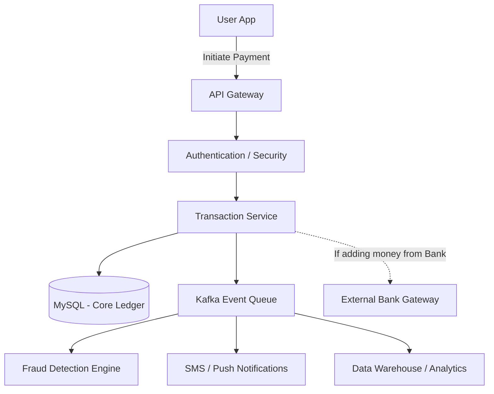

# Paytm (Digital Wallet & Payment Gateway)

## Introduction
Paytm is India's leading digital payments and financial services app. It functions as a digital wallet, a UPI (Unified Payments Interface) platform, and a payment gateway for merchants. Designing a financial system requires absolute zero tolerance for data loss or inconsistency.

## Problem Statement
In a social network, if a "Like" is lost due to a database glitch, nobody cares. In a digital wallet, if User A sends $100 to User B, and the server crashes midway, either User A loses $100 for nothing, or User B gets $100 out of thin air. The system must guarantee that money is transferred reliably, exactly once, even in the face of network timeouts, server crashes, and database failures.

## Functional Requirements
1. Users can add money to their digital wallet from a bank account.
2. Users can transfer money from their wallet to another user's wallet.
3. Users can pay merchants via QR codes or online gateways.
4. Users can view their transaction history (passbook).

## Non-Functional Requirements
1. **Absolute ACID Consistency:** No money can be created or destroyed by system errors.
2. **High Availability:** Payment systems must be highly reliable.
3. **Idempotency:** If a user clicks "Pay" twice due to network lag, they must not be charged twice.
4. **Security & Compliance:** Encryption of sensitive data and adherence to financial regulations (PCI-DSS).

## Capacity Estimation
- 300 Million active users.
- 50 Million transactions per day.
- Peak loads during festivals (Diwali) or massive flash sales.

## Core Architecture: The Transaction

The heart of the system is the **Wallet Ledger Database**.

### ACID Transactions (Relational Database)
You cannot build the core wallet ledger on an eventually consistent NoSQL database (like Cassandra) because eventual consistency allows temporary windows where balances might be inaccurate.
- You must use a **Relational Database** (MySQL, PostgreSQL, or specialized financial databases like Oracle) with strict **Serializable Isolation Levels**.

### The Transfer Flow
If Alice transfers ₹500 to Bob, the database executes a single transaction block:
```sql
BEGIN TRANSACTION;

-- 1. Check Alice's balance (must be >= 500)
SELECT balance FROM wallets WHERE user_id = 'Alice' FOR UPDATE;

-- 2. Deduct from Alice
UPDATE wallets SET balance = balance - 500 WHERE user_id = 'Alice';

-- 3. Add to Bob
UPDATE wallets SET balance = balance + 500 WHERE user_id = 'Bob';

-- 4. Record the transaction in the ledger
INSERT INTO transactions (id, from, to, amount, status) VALUES ('Tx123', 'Alice', 'Bob', 500, 'SUCCESS');

COMMIT;
```
If the database server crashes at Step 3, the `COMMIT` is never reached, and the database rolls back to the initial state. The money is safe.

## Internal working / Mermaid diagram



## Idempotency (Preventing Double Charges)
A common issue on mobile networks is the user clicking "Pay", the request reaching the server, the server processing the payment, but the internet dropping before the response reaches the phone. The user assumes it failed and clicks "Pay" again.
- **Solution: Idempotency Keys.**
- The mobile app generates a unique ID (UUID) for the specific payment attempt (e.g., `Req-999`) and sends it with the request.
- The server checks an `Idempotency_Keys` table (or Redis cache). 
- If `Req-999` is not found, it processes the payment and saves `Req-999` as "SUCCESS".
- When the user clicks "Pay" again, the app sends the *same* `Req-999`. The server sees it already processed this exact request and simply returns the previous "SUCCESS" message without moving any money.

## Distributed Transactions (Saga Pattern)
When adding money from a Bank to the Paytm Wallet, Paytm does not control the Bank's database. This spans two distinct systems.
- Paytm initiates a request to the Bank Gateway.
- The request goes into a "PENDING" state.
- If the Bank replies "SUCCESS", Paytm adds money to the wallet.
- If the network times out, Paytm doesn't know if the bank deducted the money or not. 
- **Reconciliation:** Paytm must run background Cron jobs that poll the Bank API ("Hey, did Transaction Tx123 succeed?") to reconcile dangling PENDING transactions at the end of the day.

## Scaling Strategy
- **Sharding the Ledger:** A single MySQL instance cannot handle 5,000 transactions per second forever. The database must be sharded.
- **Sharding Strategy:** Shard by `user_id`. Alice's wallet is on Shard 1, Bob's is on Shard 2.
- **Cross-Shard Transactions:** If Alice (Shard 1) pays Bob (Shard 2), we can't use a simple SQL transaction. We must use the **Two-Phase Commit (2PC)** protocol or the **Saga Pattern** with distributed message queues to ensure money leaves Shard 1 and safely arrives in Shard 2.

## Bottlenecks & Trade-offs
- **Fraud Detection vs Latency:** Before a transaction is approved, it must be checked for fraud (e.g., is a user in India suddenly sending $10,000 to an account in Russia?). Running complex Machine Learning models synchronously adds latency. *Trade-off:* Run basic rule-based checks synchronously, and run heavy ML models asynchronously via Kafka. If fraud is detected *after* the fact, the account is frozen.
- **Read-Heavy Operations:** Viewing the transaction history (passbook) doesn't need to hit the core writable ledger. Transaction records are replicated asynchronously to an Elasticsearch or NoSQL cluster optimized for fast, paginated reads.

## Summary
A Digital Wallet like Paytm prioritizes ACID consistency and Idempotency above all else. By utilizing strict Relational Databases for the core ledger, handling cross-shard complexity via distributed transaction patterns, and enforcing idempotency keys at the edge, the system ensures total financial accuracy at massive scale.

## Related topics
- [UPI System](./upi)
- [SQL Databases (ACID)](../databases/sql)
- [Distributed Systems / Saga Pattern](../microservices/saga-pattern)
