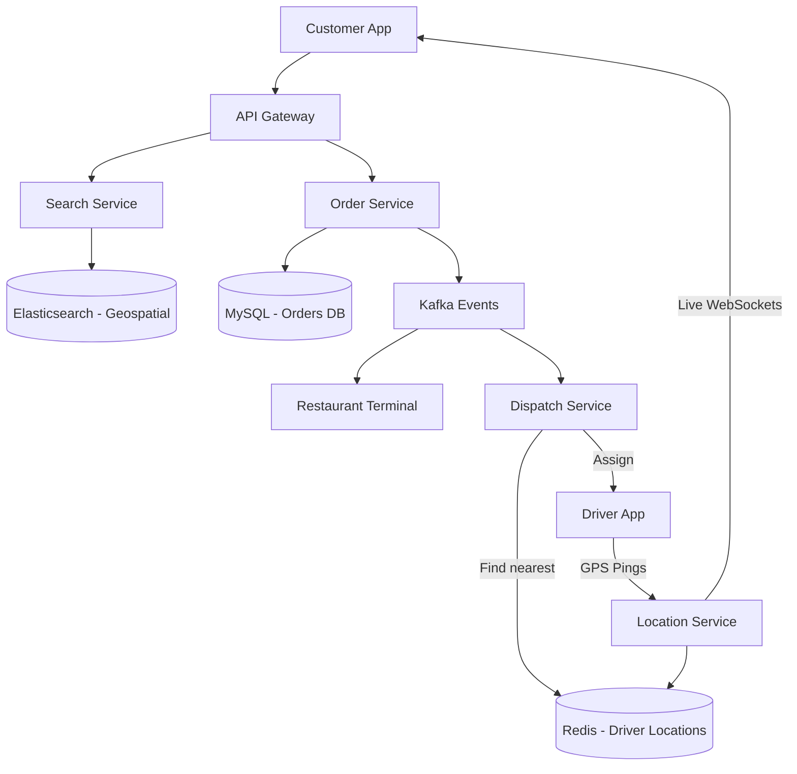

# Swiggy / DoorDash (Food Delivery)

## Introduction
Swiggy (similar to DoorDash, UberEats, or Zomato) is a hyper-local food delivery platform. It operates a complex three-sided marketplace connecting Customers, Restaurants, and Delivery Partners in real-time. 

## Problem Statement
The system must allow users to search for nearby restaurants, place complex orders, and track their delivery drivers on a map. Simultaneously, it must dispatch orders to restaurants and utilize sophisticated routing algorithms to match the optimal delivery partner to the order to ensure food stays hot.

## Functional Requirements
1. **Customers:** Search for restaurants, view menus, place orders, and track delivery on a live map.
2. **Restaurants:** Receive order notifications, accept/reject orders, and update preparation status.
3. **Delivery Partners:** Receive delivery requests, navigate to the restaurant, and drop off the food.

## Non-Functional Requirements
1. **Low Latency:** Live location tracking of the driver must update smoothly. Order dispatch must happen in seconds.
2. **High Availability:** The ordering system must remain available during peak meal hours (lunch/dinner rushes).
3. **Consistency:** Order states and payments must be transactionally secure.

## Capacity Estimation
- 20 Million Daily Active Users.
- 2 Million Orders per day.
- Massive traffic spikes between 12:00 PM - 2:00 PM and 7:00 PM - 9:00 PM.

## Core Architecture

A food delivery app combines the architectures of an **E-commerce Platform** (Catalog, Cart, Checkout) with a **Ride-Hailing Platform** (Live tracking, Driver Dispatch).

### 1. Catalog & Search (Read-Heavy)
- Users open the app and search for "Pizza". 
- We need geospatial search (only show restaurants within a 5-mile radius).
- **Solution:** All restaurant metadata, menus, and locations (Lat/Lon) are indexed in **Elasticsearch**. Elasticsearch has robust geospatial querying capabilities (`geo_distance` queries) allowing lightning-fast filtering of nearby, open restaurants.

### 2. Order Management (Transactional)
- Similar to Amazon, placing an order requires strict ACID consistency. We use a Relational DB (MySQL or PostgreSQL).
- State Machine: `CREATED` -> `ACCEPTED_BY_RESTAURANT` -> `PREPARING` -> `DRIVER_ASSIGNED` -> `PICKED_UP` -> `DELIVERED`.

### 3. Driver Dispatch & Live Tracking
- This uses the exact same architecture as Uber.
- Drivers send GPS coordinates every 5 seconds.
- These coordinates are ingested via Kafka and stored in a highly available, write-heavy cache like **Redis** (using Geospatial indexes or S2 Geometry).
- When matching a driver to an order, the system queries Redis for the 10 closest drivers to the restaurant, calculates ETA factoring in live traffic, and pings the optimal driver.

## Internal working / Mermaid diagram

## Caching Strategy
- Restaurant Menus are incredibly static. They are aggressively cached in Redis or a CDN. When a user opens a restaurant page, it almost never hits the main database.
- Caching is invalidated only when the restaurant updates prices or marks an item as "Out of Stock".

## Scaling Strategy
- **Geographical Sharding:** Food delivery is entirely hyper-local. A customer in New York cannot order from a restaurant in Los Angeles. Therefore, all databases, Redis clusters, and dispatch services are strictly sharded by City or Zone. If the Mumbai shard crashes, it has zero impact on the Delhi shard.
- **Asynchronous Processing:** Sending notifications (Push, SMS) and calculating complex analytics are completely offloaded to background workers reading from Kafka queues.

## Bottlenecks & Trade-offs
- **Driver Batching:** To maximize efficiency, if a driver is picking up food from Restaurant A for Customer X, and Customer Y (who lives next door to X) also orders from Restaurant A, the system should ideally batch these orders to the same driver. This requires complex graph-based routing algorithms running continuously in the background, analyzing order density and driver routes.
- **Menu Availability:** A restaurant might run out of chicken but forget to update the app. This results in order cancellations and bad UX. *Trade-off:* We can't guarantee 100% accurate physical inventory for third-party restaurants, so the system must have highly streamlined refund/cancellation workflows (Saga Pattern) to gracefully handle these inevitable failures.

## Summary
Swiggy/DoorDash sits at the intersection of e-commerce and logistics. By utilizing Elasticsearch for fast geospatial catalog searching, strict Relational Databases for financial order consistency, and Redis/Kafka for high-throughput live driver tracking, the architecture manages the chaos of real-time physical logistics.

## Related topics
- [Uber](./uber)
- [Amazon E-commerce](./amazon-ecommerce)
- [Elasticsearch / Indexing](../databases/indexing)
