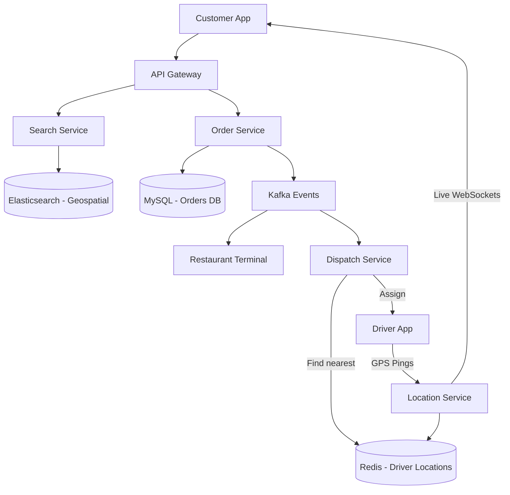

# Swiggy / DoorDash (Food Delivery)

## Introduction
Swiggy (similar to DoorDash, UberEats, or Zomato) is a hyper-local food delivery platform. It operates a complex three-sided marketplace connecting Customers, Restaurants, and Delivery Partners in real-time.

## Problem Statement
The system must allow users to search for nearby restaurants, place complex orders, and track their delivery drivers on a map. Simultaneously, it must dispatch orders to restaurants and utilize routing algorithms to match the optimal delivery partner to the order to ensure food is delivered hot.

## Why this exists
To coordinate logistics, dynamic route planning, and real-time physical dispatch across three concurrent market players (consumers, merchants, and couriers).

## Real-world analogy
Imagine a mail carrier delivering letters. If the post office sent a separate mail carrier to a neighborhood for every single letter (Isolated Dispatch), the system would be highly inefficient and expensive. Instead, the post office groups all letters for the same neighborhood together and assigns them to one mail carrier (Batching).

## Definition
A hyper-local marketplace architecture integrating geospatial search indexes, transactional order processing, and dynamic routing engines to optimize food delivery times.

## Functional Requirements
1. **Customers:** Search for restaurants, view menus, place orders, and track delivery on a live map.
2. **Restaurants:** Receive order notifications, accept/reject orders, and update preparation status.
3. **Delivery Partners:** Receive delivery requests, navigate to the restaurant, and drop off the food.

## Non-Functional Requirements
1. **Low Latency:** Live location tracking updates must be smooth. Order dispatch must complete in seconds.
2. **High Availability:** The ordering system must remain available during peak hours (lunch/dinner rushes).
3. **Consistency:** Order states and payments must be transactionally secure (ACID).

## Capacity Estimation
- **Users:** 20 Million Daily Active Users.
- **Orders:** 2 Million orders per day.
- **Seasonality:** Massive traffic spikes between 12:00 PM - 2:00 PM and 7:00 PM - 9:00 PM.

---

## Python/Java implementation

Below is a Java simulation of the Order Batching and Dispatch Optimizer.

### Java Implementation

#### Bad implementation
*Assigning drivers to orders one-by-one in isolation. This results in multiple drivers going to the same restaurant to deliver to next-door neighbors, doubling delivery costs and times.*

```java
import java.util.ArrayList;
import java.util.List;

// BAD: Isolated Order Dispatch.
// Assigns drivers to orders sequentially, ignoring batching opportunities.
public class IsolatedDispatcher {
    private final List<Driver> availableDrivers = new ArrayList<>();

    public void dispatchOrder(Order order) {
        Driver closestDriver = null;
        double minDistance = Double.MAX_VALUE;

        // VULNERABILITY: Non-batched driver matching
        for (Driver driver : availableDrivers) {
            if (driver.isAvailable) {
                double dist = calculateDistance(order.restaurantLat, order.restaurantLon, driver.lat, driver.lon);
                if (dist < minDistance) {
                    minDistance = dist;
                    closestDriver = driver;
                }
            }
        }

        if (closestDriver != null) {
            closestDriver.isAvailable = false;
            System.out.println("Assigned Driver [" + closestDriver.id + "] to Order [" + order.orderId + "]");
        }
    }

    private double calculateDistance(double lat1, double lon1, double lat2, double lon2) {
        return Math.sqrt(Math.pow(lat1 - lat2, 2) + Math.pow(lat1 - lat2, 2));
    }

    static class Order {
        String orderId;
        double restaurantLat;
        double restaurantLon;
        double customerLat;
        double customerLon;
    }

    static class Driver {
        String id;
        double lat;
        double lon;
        boolean isAvailable = true;
    }
}
```

#### Better implementation
*A queue-based dispatcher matching order locations, but lacking the logic to bundle/batch multiple orders from the same restaurant to nearby customers.*

```java
import java.util.concurrent.BlockingQueue;
import java.util.concurrent.LinkedBlockingQueue;

// BETTER: Queue-based matching
// Decouples request handling, but still dispatches orders one-by-one.
public class QueueDispatcher {
    private final BlockingQueue<Order> orderQueue = new LinkedBlockingQueue<>();
    private final IsolatedDispatcher dispatcher = new IsolatedDispatcher();

    public void queueOrder(Order order) {
        orderQueue.offer(order);
    }

    public void processNext() throws InterruptedException {
        Order order = orderQueue.take();
        dispatcher.dispatchOrder(order);
    }

    static class Order {
        String orderId;
        double restaurantLat;
        double restaurantLon;
    }
}
```

#### Best implementation
*An Order Batching and Dispatch Optimizer. It aggregates incoming orders over a short window, groups/batches orders originating from the same restaurant destined for nearby customers, and assigns the batch to the optimal driver.*

```java
import java.util.ArrayList;
import java.util.HashMap;
import java.util.List;
import java.util.Map;
import java.util.concurrent.ConcurrentHashMap;
import java.util.concurrent.CopyOnWriteArrayList;

// BEST: Order Batching & Dispatch Optimizer
public class FoodDeliveryOptimizer {
    private final List<ActiveOrder> orderBuffer = new CopyOnWriteArrayList<>();
    private final List<DeliveryDriver> activeDrivers = new CopyOnWriteArrayList<>();
    private static final double BATCH_MAX_DISTANCE = 0.5; // Max distance between customers in a batch

    public static class ActiveOrder {
        public final String orderId;
        public final String restaurantId;
        public final double restaurantLat;
        public final double restaurantLon;
        public final double customerLat;
        public final double customerLon;

        public ActiveOrder(String orderId, String restaurantId, double rLat, double rLon, double cLat, double cLon) {
            this.orderId = orderId; this.restaurantId = restaurantId;
            this.restaurantLat = rLat; this.restaurantLon = rLon;
            this.customerLat = cLat; this.customerLon = cLon;
        }
    }

    public static class DeliveryDriver {
        public final String id;
        public double lat;
        public double lon;
        public boolean isAvailable = true;

        public DeliveryDriver(String id, double lat, double lon) {
            this.id = id; this.lat = lat; this.lon = lon;
        }
    }

    public void addOrder(ActiveOrder order) {
        orderBuffer.add(order);
    }

    public void registerDriver(DeliveryDriver driver) {
        activeDrivers.add(driver);
    }

    // Optimization Routine (called periodically, e.g. every 30 seconds)
    public synchronized void optimizeAndDispatch() {
        if (orderBuffer.isEmpty()) return;

        // Step 1: Group orders by Restaurant ID
        Map<String, List<ActiveOrder>> restaurantGroups = new HashMap<>();
        for (ActiveOrder order : orderBuffer) {
            restaurantGroups.computeIfAbsent(order.restaurantId, k -> new ArrayList<>()).add(order);
        }

        // Step 2: Batch orders destined for nearby customers
        restaurantGroups.forEach((restaurantId, orders) -> {
            List<List<ActiveOrder>> batches = new ArrayList<>();
            for (ActiveOrder order : orders) {
                boolean placedInBatch = false;
                for (List<ActiveOrder> batch : batches) {
                    ActiveOrder first = batch.get(0);
                    double distance = calculateDistance(first.customerLat, first.customerLon, order.customerLat, order.customerLon);
                    if (distance <= BATCH_MAX_DISTANCE) {
                        batch.add(order);
                        placedInBatch = true;
                        break;
                    }
                }
                if (!placedInBatch) {
                    List<ActiveOrder> newBatch = new ArrayList<>();
                    newBatch.add(order);
                    batches.add(newBatch);
                }
            }

            // Step 3: Match each batch with the optimal driver
            for (List<ActiveOrder> batch : batches) {
                dispatchBatch(batch);
            }
        });
    }

    private void dispatchBatch(List<ActiveOrder> batch) {
        ActiveOrder pivot = batch.get(0);
        DeliveryDriver bestDriver = null;
        double minDistance = Double.MAX_VALUE;

        for (DeliveryDriver driver : activeDrivers) {
            if (driver.isAvailable) {
                double distance = calculateDistance(pivot.restaurantLat, pivot.restaurantLon, driver.lat, driver.lon);
                if (distance < minDistance) {
                    minDistance = distance;
                    bestDriver = driver;
                }
            }
        }

        if (bestDriver != null) {
            bestDriver.isAvailable = false;
            System.out.println("--- Dispatch Match Found ---");
            System.out.println("Assigned Driver [" + bestDriver.id + "] to deliver a batch of " + batch.size() + " orders:");
            for (ActiveOrder o : batch) {
                System.out.println("  - Order [" + o.orderId + "] from Restaurant [" + o.restaurantId + "]");
                orderBuffer.remove(o);
            }
        }
    }

    private double calculateDistance(double lat1, double lon1, double lat2, double lon2) {
        return Math.sqrt(Math.pow(lat1 - lat2, 2) + Math.pow(lon1 - lon2, 2));
    }
}
```

---

## Core Architecture

A food delivery application combines the architectures of an **E-commerce Platform** (Catalog, Cart, Checkout) with a **Ride-Hailing Platform** (Live tracking, Driver Dispatch).

### 1. Catalog & Search (Read-Heavy)
- Users open the app and search for nearby restaurants (e.g. within a 5-mile radius).
- **Solution:** All restaurant metadata and locations are indexed in **Elasticsearch**, which supports fast geospatial querying (`geo_distance` queries) to filter nearby restaurants.

### 2. Order Management (Transactional)
- Similar to e-commerce, placing an order requires strict ACID consistency. We use a Relational DB (MySQL or PostgreSQL).
- State Machine: `CREATED` -> `ACCEPTED` -> `PREPARING` -> `DISPATCHED` -> `DELIVERED`.

### 3. Driver Dispatch & Live Tracking
- Drivers send GPS coordinates every 5 seconds.
- These coordinates are ingested via Kafka and stored in a highly available, write-heavy cache like **Redis** (using Geospatial indexes).
- The system queries Redis for the 10 closest drivers to the restaurant, calculates ETA, and pings the optimal driver.

## Internal working / Mermaid diagram



## Caching Strategy
- Restaurant menus are static and are cached in Redis or a CDN, invalidating cache only when the restaurant updates prices or marks items as out-of-stock.

## Scaling Strategy
- **Geographical Sharding:** Food delivery is hyper-local (a customer in Delhi cannot order from a restaurant in Mumbai). All databases and dispatch services are sharded by City or Zone, ensuring that a database failure in one city does not affect others.

## Bottlenecks & Trade-offs
- **Driver Batching:** To maximize efficiency, if multiple orders are placed from the same restaurant to the same neighborhood, the system batches them to a single driver. This requires complex graph-based routing algorithms running in the background.

## Pros
- Fast geospatial filtering via Elasticsearch.
- Cost savings and efficiency via order batching.
- Fault isolation through geographical sharding.

## Cons
- Order batching can slightly increase delivery time for the first customer.
- Menu availability is difficult to sync in real-time.

## Interview questions

### Beginner
- **Q: How does Swiggy filter nearby restaurants when you open the app?**
  - **A:** It uses a geospatial database search. Restaurant locations (Lat/Lon) are indexed in Elasticsearch, which filters open restaurants within a specific radius (e.g. 5 miles) of the user's location in milliseconds.
- **Q: Why are order details stored in a relational SQL database instead of NoSQL?**
  - **A:** Order placement and payment transactions require strict ACID consistency to prevent duplicate charges or lost order records, which SQL databases handle natively.

### Intermediate
- **Q: What is the benefit of sharding databases geographically in food delivery systems?**
  - **A:** Food delivery is entirely hyper-local. Sharding databases by city (e.g., Delhi, Mumbai) isolates failures. If the Mumbai database shard goes down, it has zero impact on users in Delhi, improving fault tolerance.
- **Q: Why are push notifications and SMS updates decoupled from the main ordering flow?**
  - **A:** Sending notifications is slow and relies on third-party APIs. If done synchronously, a delay in the SMS gateway would slow down the user's checkout experience. Decoupling it using Kafka queues keeps checkout fast.

### Senior
- **Q: Explain how you would design an order batching algorithm for delivery partners.**
  - **A:** 
    1. **Order Aggregation:** Buffer incoming orders over a 20-30 second window.
    2. **Grouping:** Group orders originating from the same restaurant or adjacent restaurants.
    3. **Destination Check:** Calculate the distance between the customers' drop-off coordinates. If they are within a threshold (e.g. 1 km), batch the orders together.
    4. **Driver Matching:** Find an available driver near the restaurant whose route matches the delivery path, optimizing delivery times.

### Staff Engineer
- **Q: Design a real-time driver allocation and route optimization engine that handles 100k active orders during a heavy rainstorm, factoring in dynamically changing traffic patterns, flooded roads, and restaurant delays.**
  - **A:** 
    1. **Dynamic Routing Engine:** Use a graph database (like Neo4j) or a custom graph server (using contraction hierarchies) representing the city road network.
    2. **Real-time Edge Weighting:** Update graph edge weights continuously based on incoming telemetry from active drivers (speed drops indicate traffic or flooding).
    3. **Hungarian Algorithm for Matching:** Frame driver-to-order matching as a bipartite matching problem, optimizing globally across a city sector rather than greedily matching individual drivers.
    4. **Asynchronous Dispatch Pipeline:** Run matching cycles every 10 seconds, caching results in a distributed queue (Redis) to prevent database lock contention.

## Common mistakes
- ** Greedy matching:** Assigning the absolute closest driver to an order instantly, which can lead to inefficiencies across the broader city sector.
- **Using HTTP long-polling for live tracking:** Flooding servers with requests instead of using WebSockets.

## Best practices
- Shard databases by city.
- Group orders from the same restaurant to nearby customers.
- Buffer writes using Kafka.

## When NOT to use
- Do not build a complex dispatch engine if you are running a single restaurant with dedicated delivery staff; a simple order queue is sufficient.

## Comparison with similar concepts
- **Swiggy vs Uber:** Uber matches one rider to one driver for immediate transit (low batching opportunities). Swiggy matches orders to drivers with high opportunities to batch multiple orders from the same restaurant.

## Summary
Swiggy/DoorDash sits at the intersection of e-commerce and logistics. By utilizing Elasticsearch for fast geospatial catalog searching, strict Relational Databases for financial order consistency, and Redis/Kafka for high-throughput live driver tracking, the architecture manages the chaos of real-time physical logistics.

## Related topics
- [Uber](./uber)
- [Amazon E-commerce](./amazon-ecommerce)
- [Elasticsearch / Indexing](../databases/indexing)
