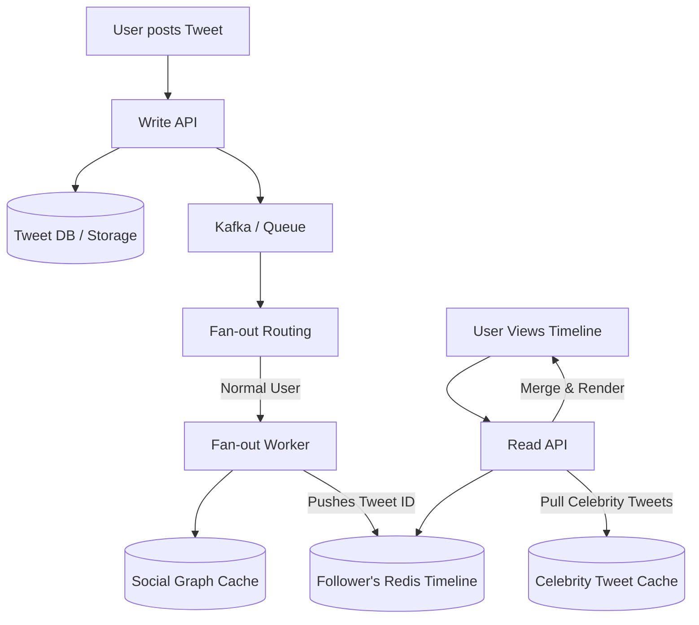

# Twitter / X (Microblogging Platform)

## Introduction
Twitter (now X) is a real-time microblogging and social networking service. It is defined by its asymmetric follower model (you can follow someone without them following you) and its emphasis on real-time public broadcasts.

## Problem Statement
The system must allow users to post short messages (tweets) and instantly distribute those messages to millions of followers. Generating a personalized home timeline for millions of active users in real-time is one of the most famous challenges in distributed systems.

## Why this exists
To enable low-latency, real-time public communication by optimizing asymmetric read/write flows, balancing computing overhead between popular creators and typical consumers.

## Real-world analogy
Imagine a celebrity giving a speech in a stadium. If the celebrity had to walk up to every single person in the audience and whisper the speech to them one by one (Push Model), they would run out of energy. Instead, they stand on a stage and speak into a microphone. The audience members listen to the speaker directly (Pull Model). For regular conversations, people talk to each other directly in small groups (Push Model).

## Definition
A microblogging platform featuring real-time, high-fanout distribution of text and media, relying on a hybrid push/pull timeline generation architecture.

## Functional Requirements
1. Users can post tweets (text, images, videos).
2. Users can follow other users.
3. Users have a Home Timeline displaying a stream of tweets from people they follow.
4. Users can search for tweets and view trending topics.

## Non-Functional Requirements
1. **High Availability:** The system must remain available, especially during major global events.
2. **Low Latency:** Timelines must load in under 200ms. Tweet delivery to followers should be near-instant.
3. **Scalability:** Read/Write ratio is roughly 1000:1 (read-biased).

## Capacity Estimation
- **DAU:** ~250 Million.
- **Tweets Posted:** ~500 Million per day (Average ~6,000 tweets/sec, peaking at much higher during events).
- **Timeline Reads:** ~300 Billion per day (Average ~3.5 Million reads/sec).

---

## Python/Java implementation

Below is a Java simulation of the Timeline Rebuild Engine and Snowflake generator.

### Java Implementation

#### Bad implementation
*Querying the relational database to fetch and join all tweets from followees on every request. This causes slow response times and database load.*

```java
import java.util.ArrayList;
import java.util.List;

// BAD: Relational Join on read path.
// Joins a large follow table with a massive tweet table, melting database clusters.
public class PullTimelineGenerator {
    private final DatabaseMock db = new DatabaseMock();

    public List<Tweet> getTimeline(String userId) {
        List<String> followees = db.getFollowees(userId);
        List<Tweet> timeline = new ArrayList<>();

        // VULNERABILITY: Fetching all tweets from the database for every followee on every read
        for (String followeeId : followees) {
            timeline.addAll(db.fetchTweets(followeeId));
        }

        // In-memory sorting of thousands of tweets
        timeline.sort((t1, t2) -> Long.compare(t2.timestamp, t1.timestamp));
        return timeline.subList(0, Math.min(timeline.size(), 20));
    }

    static class Tweet {
        String id;
        String authorId;
        long timestamp;
    }

    static class DatabaseMock {
        public List<String> getFollowees(String userId) { return new ArrayList<>(); }
        public List<Tweet> fetchTweets(String authorId) { return new ArrayList<>(); }
    }
}
```

#### Better implementation
*Pushing every tweet to all followers' timeline caches. While this makes reads fast, it locks the system when a celebrity with millions of followers tweets (The Justin Bieber Problem).*

```java
import java.util.ArrayList;
import java.util.HashMap;
import java.util.List;
import java.util.Map;

// BETTER: Push-only timeline cache.
// Keeps reads O(1) in Redis, but writes freeze the system for high-follower accounts.
public class PushTimelineService {
    private final Map<String, List<String>> userRedisCaches = new HashMap<>();
    private final FollowGraphMock graph = new FollowGraphMock();

    public void onTweet(String authorId, String tweetId) {
        List<String> followers = graph.getFollowers(authorId);
        
        // VULNERABILITY: Millions of writes executed synchronously for celebrity accounts
        for (String followerId : followers) {
            userRedisCaches.computeIfAbsent(followerId, k -> new ArrayList<>()).add(0, tweetId);
        }
    }

    static class FollowGraphMock {
        public List<String> getFollowers(String userId) { return new ArrayList<>(); }
    }
}
```

#### Best implementation
*A simulation of Twitter's timeline generation. It includes a 64-bit Snowflake ID Generator, a Timeline Garbage Collector that evicts inactive users to save RAM, and an On-Demand Rebuild Engine that reconstructs timelines when inactive users return.*

```java
import java.util.ArrayList;
import java.util.Collections;
import java.util.HashMap;
import java.util.List;
import java.util.Map;
import java.util.concurrent.ConcurrentHashMap;

// BEST: Snowflake ID Generator & Inactive Cache Rebuilder (Hybrid Model)
public class TwitterTimelineEngine {
    private final ConcurrentHashMap<String, List<Long>> redisTimelineCaches = new ConcurrentHashMap<>();
    private final ConcurrentHashMap<String, Long> userLastActive = new ConcurrentHashMap<>();
    private final DatabaseMock database = new DatabaseMock();
    private final SnowflakeGenerator idGenerator = new SnowflakeGenerator(1, 1);

    // 1. Snowflake ID Generator (Time-Sortable distributed IDs)
    public static class SnowflakeGenerator {
        private final long datacenterId;
        private final long machineId;
        private long sequence = 0L;
        private long lastTimestamp = -1L;
        private static final long EPOCH = 1609459200000L; // Custom Epoch

        public SnowflakeGenerator(long datacenterId, long machineId) {
            this.datacenterId = datacenterId;
            this.machineId = machineId;
        }

        public synchronized long nextId() {
            long timestamp = System.currentTimeMillis();
            if (timestamp == lastTimestamp) {
                sequence = (sequence + 1) & 4095;
                if (sequence == 0) {
                    timestamp = waitNextMillis(lastTimestamp);
                }
            } else {
                sequence = 0L;
            }
            lastTimestamp = timestamp;
            return ((timestamp - EPOCH) << 22) | (datacenterId << 17) | (machineId << 12) | sequence;
        }

        private long waitNextMillis(long lastTimestamp) {
            long timestamp = System.currentTimeMillis();
            while (timestamp <= lastTimestamp) {
                timestamp = System.currentTimeMillis();
            }
            return timestamp;
        }
    }

    // 2. Timeline Cache Garbage Collector (Saves RAM)
    public void evictInactiveTimelines() {
        long now = System.currentTimeMillis();
        long thirtyDaysAgo = now - (30L * 24 * 60 * 60 * 1000);
        
        userLastActive.forEach((userId, lastActive) -> {
            if (lastActive < thirtyDaysAgo) {
                redisTimelineCaches.remove(userId); // Evict from Redis memory
                System.out.println("Evicted inactive cache for User: " + userId);
            }
        });
    }

    // 3. Lazy/On-Demand Timeline Rebuilder
    public List<Long> getHomeTimeline(String userId) {
        userLastActive.put(userId, System.currentTimeMillis());
        List<Long> cachedTimeline = redisTimelineCaches.get(userId);

        if (cachedTimeline == null) {
            System.out.println("Cache Miss. Rebuilding timeline from DB for user: " + userId);
            cachedTimeline = rebuildTimelineFromDb(userId);
            redisTimelineCaches.put(userId, cachedTimeline);
        }

        return cachedTimeline;
    }

    private List<Long> rebuildTimelineFromDb(String userId) {
        List<Long> rebuiltList = new ArrayList<>();
        List<String> followees = database.getFollowees(userId);

        for (String followee : followees) {
            // Fetch latest tweets from DB
            List<Long> tweets = database.fetchTweetIdsFromDb(followee);
            rebuiltList.addAll(tweets);
        }

        Collections.sort(rebuiltList, Collections.reverseOrder()); // Sort chronologically using Snowflake IDs
        return rebuiltList.subList(0, Math.min(rebuiltList.size(), 800)); // Cap cache at 800
    }

    static class DatabaseMock {
        public List<String> getFollowees(String userId) { return new ArrayList<>(); }
        public List<Long> fetchTweetIdsFromDb(String authorId) { return new ArrayList<>(); }
    }
}
```

---

## Core Architecture: The Timeline Generation
Generating the Home Timeline is the core architectural challenge.

### Approach 1: Read-Time Fan-out (Pull Model)
When User A opens Twitter, the server queries the database:
1. Get all users User A follows.
2. Fetch the top 100 tweets from all those users.
3. Merge and sort them by time.
- *Problem:* Doing this 3.5 Million times a second requires joining massive tables. The database will melt.

### Approach 2: Write-Time Fan-out (Push Model)
We use a **Pre-computed Timeline Cache** (Redis) for every active user.
1. User B posts a tweet.
2. The backend looks up all of User B's followers.
3. A cluster of Fan-out workers *pushes* the New Tweet ID directly into the Redis Timeline Cache of every single follower.
4. When User A opens Twitter, they simply read their pre-sorted Redis cache. ($O(1)$ read time complexity).
- *Problem:* **The Celebrity Problem.** If someone with 100 Million followers tweets, the system must push that Tweet ID to 100 Million Redis lists. This massive write spike clogs the queue and delays delivery for normal users.

### Approach 3: Hybrid Fan-out (The Actual Solution)
Twitter uses a mix of Push and Pull.
- **Normal Users:** Pushed to followers' Redis caches at write time (Fan-out on Write).
- **Celebrities/Influencers (e.g., > 100k followers):** Do *not* fan-out on write.
- **Read Time:** When User A opens Twitter, the server grabs their pre-computed Redis timeline (normal friends) and *pulls* the latest tweets from the Celebrities they follow, merging them in memory before returning the HTTP response.

## Internal working / Mermaid diagram



## Database Design
1. **Tweet Storage (Key-Value / Wide-Column):** Stores the actual tweet text and media URLs. Twitter uses Manhattan (custom KV store) or Cassandra.
2. **Social Graph (Graph DB):** Specialized database (FlockDB) to store "Who follows whom" in memory for fast edge traversals.
3. **Timeline Cache (Redis):** In-memory lists for every active user, capped at ~800 tweets.

## Scaling Strategy
- **Tweet IDs (Snowflake):** Twitter invented **Snowflake**, a decentralized ID generator that creates 64-bit integers based on a Timestamp, Datacenter ID, Machine ID, and a Sequence number. This ensures IDs are globally unique and roughly chronologically sortable without a central coordinator.
- **Search (Earlybird):** Tweets are ingested into a custom Lucene-based search index in real-time, allowing searching globally within seconds of a tweet being posted.

## Bottlenecks & Trade-offs
- **Eventual Consistency:** The fan-out process means a tweet might take 2-5 seconds to reach all followers. This slight delay is a necessary trade-off to maintain system availability.
- **Active vs Inactive Users:** We do NOT keep Redis timeline caches for all registered users. If a user hasn't logged in for 30 days, their timeline cache is destroyed to save RAM. If they log in, it is rebuilt from the database on the fly.

## Pros
- Fast read paths ($O(1)$ from Redis).
- Avoids write bottlenecks for high-follower celebrity accounts.
- Memory efficient via inactive cache eviction.

## Cons
- Rebuilding caches for returning inactive users causes temporary latency spikes.
- Hybrid sorting is complex to maintain.

## Interview questions

### Beginner
- **Q: What is the difference between Fan-out on Write (Push) and Fan-out on Read (Pull)?**
  - **A:** Fan-out on Write computes the home timeline when a tweet is posted, pushing it to followers' caches. Fan-out on Read computes the timeline when a user opens the app, pulling posts from the database dynamically.
- **Q: Why does Twitter use a hybrid model instead of a simple push-only model?**
  - **A:** A push-only model fails during celebrity tweets. Pushing a tweet to 100 million followers requires 100 million database/cache writes, which overwhelms the system. A hybrid model pulls celebrity tweets at read-time instead.

### Intermediate
- **Q: How does Twitter save RAM in its timeline caching layer?**
  - **A:** The system only caches timelines for active users. If a user has not logged in for 30 days, their Redis cache is evicted. If they log in later, their timeline is rebuilt from the database on demand. Caches are also capped at ~800 tweets.
- **Q: Why is a relational database join not ideal for generating Twitter timelines?**
  - **A:** A home timeline query requires joining the `Followers` table with the `Tweets` table and sorting by time. At Twitter's scale (3.5 million reads/sec), executing millions of SQL joins every second would crash the database cluster.

### Senior
- **Q: Explain how Twitter's Snowflake ID generator works and why it is useful.**
  - **A:** Snowflake generates unique 64-bit integers:
    - 41 bits: Timestamp (ensuring time-sortability).
    - 10 bits: Machine/Datacenter ID (ensuring uniqueness across servers).
    - 12 bits: Sequence number (preventing collisions for IDs generated in the same millisecond).
    It is useful because it allows decentralized nodes to generate unique, chronologically sortable IDs without talking to a central database or coordinator.

### Staff Engineer
- **Q: Design a real-time trending topic system for Twitter that processes 100k tweets/second and detects trending hashtags within 5 minutes, handling manipulation attempts.**
  - **A:** 
    1. **Streaming Ingestion:** Route tweets into Kafka, splitting them into hashtag extraction topics.
    2. **Sliding Window Aggregator:** Use Apache Storm or Flink to count hashtag occurrences over a 5-minute sliding window with 10-second steps.
    3. **Trending Score (TF-IDF variation):** Calculate popularity velocity: $Velocity = CurrentCount / ExpectedBaseline$. The baseline is computed using historical averages to avoid flagging common words (e.g., `#new`).
    4. **Spam Mitigation:** Filter out duplicate hashtags from the same user or IP address using a HyperLogLog cardinality estimator to ensure trends reflect organic user diversity.

## Common mistakes
- **Treating all users the same:** Using a push-only model for celebrity accounts.
- **Running infinite loops on DB writes:** Checking for duplicates by querying the database during the write path.

## Best practices
- Evict inactive timelines from RAM.
- Use time-sortable distributed IDs.
- Run fan-out tasks asynchronously in the background.

## When NOT to use
- Do not use a hybrid fan-out model if building a low-traffic application (e.g., enterprise blogs); simple SQL queries are easier to maintain.

## Comparison with similar concepts
- **Snowflake vs UUID:** UUIDs are 128-bit strings that are not chronologically sortable, which index poorly in databases. Snowflake IDs are 64-bit integers that are smaller, faster to index, and sortable by time.

## Summary
Twitter's architecture is defined by its massive read-to-write ratio and the asymmetric social graph. By utilizing a Hybrid Fan-out model, caching timelines in Redis, and inventing specialized tools like Snowflake (for ID generation), Twitter efficiently transforms 6,000 writes a second into 3.5 million lightning-fast reads a second.

## Related topics
- [Instagram](./instagram)
- [Redis](../caching/redis)
- [NoSQL](../databases/nosql)
