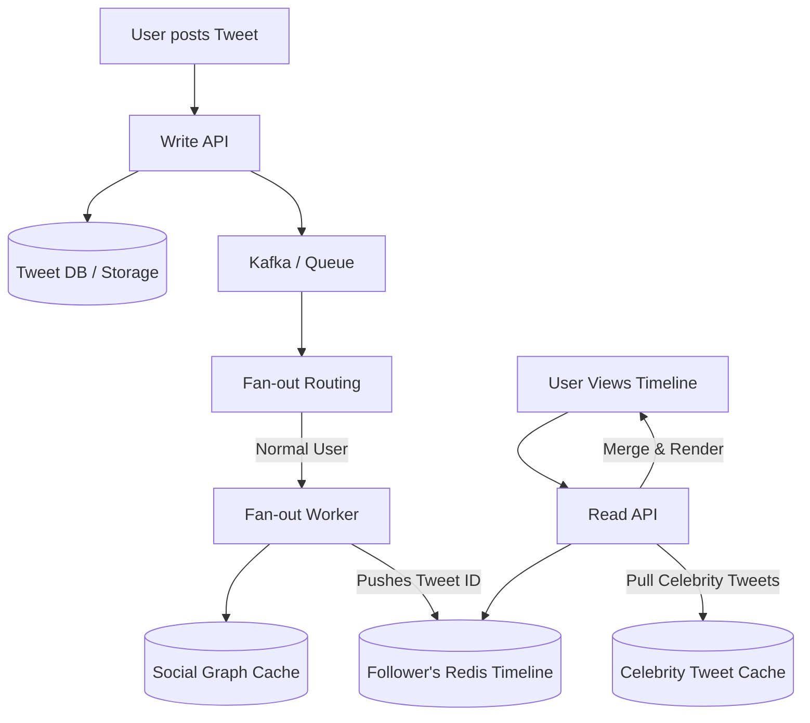

# Twitter / X (Microblogging Platform)

## Introduction
Twitter (now X) is a real-time microblogging and social networking service. It is defined by its asymmetric follower model (you can follow someone without them following you) and its emphasis on real-time public broadcasts.

## Problem Statement
The system must allow users to post short messages (tweets) and instantly distribute those messages to millions of followers. Generating a personalized home timeline for millions of active users in real-time is one of the most famous challenges in distributed systems.

## Functional Requirements
1. Users can post tweets (text, images, videos).
2. Users can follow other users.
3. Users have a Home Timeline displaying a stream of tweets from people they follow.
4. Users can search for tweets and view trending topics.

## Non-Functional Requirements
1. **High Availability:** The system must remain up, especially during major global events.
2. **Low Latency:** Timelines must load in under 200ms. Tweet delivery to followers should be near-instant.
3. **Scalability:** The system is heavily read-biased. Read/Write ratio is roughly 1000:1.

## Capacity Estimation
- **DAU:** ~250 Million.
- **Tweets Posted:** ~500 Million per day (Average ~6,000 tweets/sec, peaking at much higher during events).
- **Timeline Reads:** ~300 Billion per day (Average ~3.5 Million reads/sec).

## Core Architecture: The Timeline Generation

Generating the Home Timeline is the core architectural challenge.

### Approach 1: Read-Time Fan-out (Pull Model)
When User A opens Twitter, the server queries the database:
1. Get all users User A follows.
2. Fetch the top 100 tweets from all those users.
3. Merge and sort them by time.
- *Problem:* Doing this 3.5 Million times a second requires joining massive tables. The database will melt.

### Approach 2: Write-Time Fan-out (Push Model)
We use a **Pre-computed Timeline Cache** (Redis) for every active user.
1. User B posts a tweet.
2. The backend looks up all of User B's followers.
3. A cluster of Fan-out workers *pushes* the New Tweet ID directly into the Redis Timeline Cache of every single follower.
4. When User A opens Twitter, they simply read their pre-sorted Redis cache. (O(1) time complexity).
- *Problem:* **The Justin Bieber Problem.** If someone with 100 Million followers tweets, the system must push that Tweet ID to 100 Million Redis lists. This massive spike clogs the queue and delays delivery for normal users.

### Approach 3: Hybrid Fan-out (The Actual Solution)
Twitter uses a mix of Push and Pull.
- **Normal Users:** Pushed to followers' Redis caches at write time (Fan-out on Write).
- **Celebrities/Influencers (e.g., > 100k followers):** Do *not* fan-out on write.
- **Read Time:** When User A opens Twitter, the server grabs their pre-computed Redis timeline (normal friends) and *pulls* the latest tweets from the Celebrities they follow, merging them in memory before returning the HTTP response.

## Internal working / Mermaid diagram

## Database Design
1. **Tweet Storage (Key-Value / Wide-Column):** Historically MySQL, but migrated to distributed systems like Manhattan (Twitter's custom KV store) or Cassandra. Stores the actual tweet text and media URLs.
2. **Social Graph (Graph DB):** Specialized database (FlockDB) to store "Who follows whom" in memory for lightning-fast edge traversals.
3. **Timeline Cache (Redis):** In-memory lists for every active user, capped at ~800 tweets.

## Scaling Strategy
- **Tweet IDs (Snowflake):** Because tweets are generated across thousands of servers, using an auto-incrementing DB integer as a Primary Key fails. Twitter invented **Snowflake**, a decentralized ID generator that creates 64-bit integers based on a Timestamp, Datacenter ID, Machine ID, and a Sequence number. This ensures IDs are globally unique and roughly chronologically sortable without a central coordinator.
- **Search (Earlybird):** Tweets are ingested into a custom Lucene-based search engine (Earlybird) in real-time, scattering the index across thousands of shards to allow searching globally within seconds of a tweet being posted.

## Bottlenecks & Trade-offs
- **Eventual Consistency:** The fan-out process means a tweet might take 2-5 seconds to reach all followers. This slight delay (eventual consistency) is a necessary trade-off to maintain system availability and fast reads.
- **Active vs Inactive Users:** We do NOT keep Redis timeline caches for all 1+ Billion registered users. If a user hasn't logged in for 30 days, their timeline cache is destroyed to save RAM. If they log in, it is rebuilt from the database on the fly.

## Summary
Twitter's architecture is defined by its massive read-to-write ratio and the asymmetric social graph. By utilizing a Hybrid Fan-out model, caching timelines in Redis, and inventing specialized tools like Snowflake (for ID generation), Twitter efficiently transforms 6,000 writes a second into 3.5 million lightning-fast reads a second.

## Related topics
- [Instagram](../instagram)
- [Redis](../../caching/redis)
- [NoSQL](../../databases/nosql)
