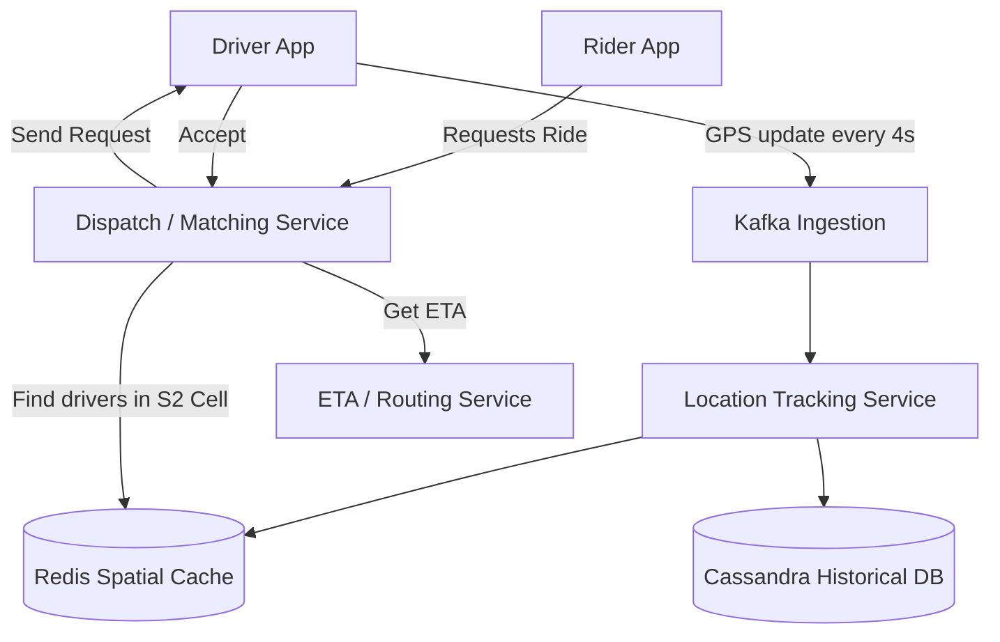

# Uber (Ride-Hailing System)

## Introduction
Uber is a complex real-time dispatch and geo-location service. It matches riders looking for a vehicle with drivers who are nearby. The system must process millions of real-time GPS updates per second, calculate ETA (Estimated Time of Arrival) based on live traffic, and handle complex pricing algorithms.

## Problem Statement
Connecting a rider and a driver requires highly efficient spatial searching. You cannot simply scan a traditional SQL database of 10 million drivers to find who is closest to a specific latitude/longitude every time someone requests a ride. The geospatial querying must be lightning-fast.

## Functional Requirements
1. **Drivers:** Can continuously report their location and accept/decline ride requests.
2. **Riders:** Can see nearby drivers on a map, request a ride, and track the driver's approach in real-time.
3. **Matching:** The system matches a rider with the nearest available driver based on ETA.
4. **Trip Management:** Track the trip from start to finish for billing and safety.

## Non-Functional Requirements
1. **Low Latency:** Matching must happen in seconds. Drivers and Riders must see GPS updates on their maps in near real-time.
2. **High Availability:** The dispatch system cannot go down.
3. **Consistency:** A driver cannot be assigned to two different riders simultaneously.

## Capacity Estimation
- **Users:** 100 Million Riders, 5 Million Drivers.
- **Active Trips:** 1 Million concurrent active drivers globally.
- **GPS Updates:** If 1M drivers send their location every 4 seconds -> 250,000 writes/second.
- **Matching Requests:** ~5,000 ride requests per second globally.

## Core Architecture & Geospatial Indexing
The heart of Uber is the **Location Tracking System**. 

How do we find the nearest drivers to a rider? We use **S2 Geometry** (or Geohash). 
S2 divides the Earth into a hierarchy of cells. A coordinate (Lat/Lon) is converted into a 64-bit integer representing an S2 cell.
- If two points have the same S2 cell ID prefix, they are geographically close to each other.
- This reduces a complex 2D geographical search into a highly optimized 1D string prefix match or integer range query.

## Internal working / Mermaid diagram

## Step-by-step Ride Flow
1. **Driver Tracking:** Drivers send their GPS coordinates to the Location Service every 4 seconds. The service converts the Lat/Lon to an S2 cell ID and updates an in-memory cache (Redis) mapping `Cell_ID -> [Driver_ID_1, Driver_ID_2]`.
2. **Rider Opens App:** The app sends the rider's location. The backend finds the rider's S2 cell, queries Redis for drivers in that cell (and neighboring cells), and streams their locations back to the rider's map via WebSockets.
3. **Ride Request:** The rider clicks "Confirm". The request goes to the Dispatch Service.
4. **Matching:** 
   - Dispatch queries Redis for the 10 closest drivers.
   - It sends these drivers to the ETA/Routing service (which factors in live traffic and road closures).
   - It sorts the drivers by lowest ETA.
5. **Notification:** Dispatch sends a notification to Driver #1 (via WebSocket or push notification). 
6. **Acceptance:** Driver #1 has 10 seconds to accept. If they ignore/decline, Dispatch tries Driver #2.
7. **Trip Started:** Once accepted, the trip is recorded in the Trips Database.

## System APIs
`POST /api/v1/locations/drivers` (For GPS updates)
`GET /api/v1/locations/nearby?lat=...&lon=...` (For rendering the rider's map)
`POST /api/v1/trips/request` (To initiate a ride)

## Database Design
1. **Location Cache (Redis/In-Memory):** Stores the *current* location of active drivers. It must handle 250k writes/sec. Using Redis with geospatial indexes (e.g., `GEOADD`, `GEORADIUS`) or a custom distributed hash table storing S2 cells.
2. **Trip Database (Cassandra/PostgreSQL):** Stores trip history, billing details, and driver/rider info. A relational DB is good for transactional billing, but Cassandra handles high-volume trip telemetry better.
3. **Kafka:** Used as a massive buffer for incoming GPS points to prevent the Location Cache from being overwhelmed during spikes.

## Handling Map and ETA (Routing)
Calculating the exact driving time between Point A and Point B is computationally heavy (Dijkstra's or A* algorithm on a massive graph of the road network). 
- Uber pre-computes travel times between major S2 cells and caches them.
- Live traffic data is fed into a specialized graph processing engine to adjust the edge weights of the road segments dynamically.

## Scaling Strategy
- **Geographical Sharding:** The system is naturally partitioned by geography. A server handling requests in New York doesn't need to know about drivers in London. Redis clusters and Dispatch services are sharded by City or S2 parent cells.
- **Decoupling:** Incoming GPS updates are thrown into Kafka topics. The Location Service consumes from Kafka at its own pace, protecting the database from traffic spikes.

## Bottlenecks & Trade-offs
- **High Write Throughput vs Consistency:** We don't need strict ACID compliance for driver locations. If we lose a GPS ping, we'll get another one in 4 seconds. We prioritize availability and write-speed (Redis) over strict durability for live tracking.
- **Concurrent Requests:** Two riders standing next to each other might request a ride simultaneously. The Dispatch Service must use a distributed lock (e.g., Redis Redlock) when "offering" a driver to Rider A, so Rider B's request doesn't ping the same driver at the exact same moment.

## Failure Handling
- **Redis Crash:** If the Location Cache node goes down, we lose live driver locations for that shard. Because drivers ping every 4 seconds, the replica or restarted node will automatically repopulate its data within seconds.
- **App Disconnect:** If a driver drives through a tunnel and loses cell service, the system holds their last known location and ETA. If they don't reconnect after a threshold, they are marked offline and removed from the dispatch pool.

## Summary
Uber's architecture is a masterclass in geospatial data management and high-throughput ingestion. By utilizing S2 Geometry to simplify spatial queries, heavily sharding by city, and utilizing Kafka and Redis to handle a relentless flood of GPS data, the system achieves real-time matching at global scale.

## Related topics
- [Kafka](../messaging/kafka)
- [Distributed Locking](../distributed-systems/distributed-locking)
- [Redis](../caching/redis)
