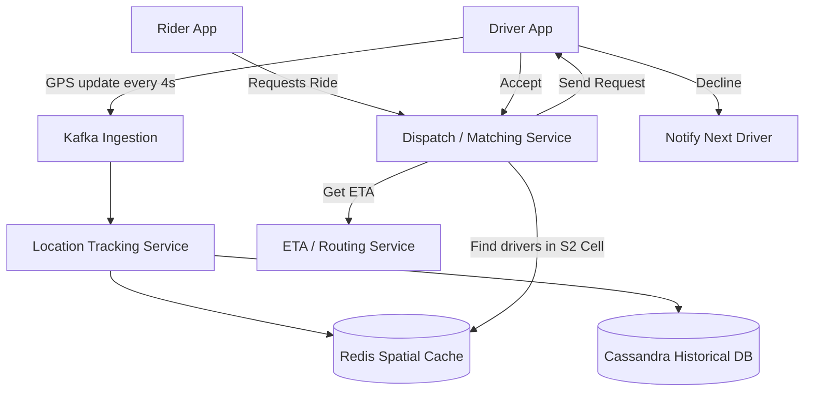

# Uber (Ride-Hailing System)

## Introduction
Uber is a complex real-time dispatch and geo-location service. It matches riders looking for a vehicle with drivers who are nearby. The system must process millions of real-time GPS updates per second, calculate ETA (Estimated Time of Arrival) based on live traffic, and handle complex matching algorithms.

## Problem Statement
Connecting a rider and a driver requires highly efficient spatial searching. You cannot simply scan a traditional database of 10 million active drivers to calculate distance via the Pythagorean theorem every time a rider requests a ride. The geospatial querying must be lightning-fast, and the system must handle a massive scale of write requests (GPS pings).

## Why this exists
To enable instant matching, route calculation, dynamic pricing (surge pricing), and safety tracking by maintaining a real-time, low-latency spatial index of thousands of moving entities.

## Real-world analogy
Imagine looking for a coffee shop in a city. If you had to check every building in the country one by one, you would never find it. Instead, you look at a grid map, find the coordinate cell you are in (e.g., Grid B-4), and only check the coffee shops inside that specific grid square and neighboring cells.

## Definition
A real-time geospatial dispatch platform that consumes high-volume location telemetry, indexes moving targets geographically, and executes low-latency matching queries based on routing distances and traffic.

## Functional Requirements
1. **Drivers:** Can continuously report their location and accept/decline ride requests.
2. **Riders:** Can see nearby drivers on a map, request a ride, and track the driver's approach in real-time.
3. **Matching:** The system matches a rider with the nearest available driver based on ETA.
4. **Trip Management:** Track the trip from start to finish for billing and safety.

## Non-Functional Requirements
1. **Low Latency:** Matching must happen in seconds. Drivers and Riders must see GPS updates on their maps in near real-time.
2. **High Availability:** The dispatch system must remain online during localized outages.
3. **Consistency:** A driver cannot be assigned to two different riders simultaneously (resolved via distributed locks).
4. **Scale:** Process 250,000+ GPS location writes per second and thousands of match queries.

## Capacity Estimation
- **Users:** 100 Million Riders, 5 Million Drivers.
- **Active Trips:** 1 Million concurrent active drivers globally.
- **GPS Updates:** If 1M drivers send their location every 4 seconds -> 250,000 writes/second.
- **Matching Requests:** ~5,000 ride requests per second globally.

---

## Python/Java implementation

Below is a Java simulation of the Geospatial Location Tracking and Matching Service.

### Java Implementation

#### Bad implementation
*Scanning the entire database of active drivers and calculating Euclidean distance for every request. This is $O(N)$ and completely crashes under high volumes of concurrent requests.*

```java
import java.util.ArrayList;
import java.util.List;

// BAD: Full table scan with mathematical calculations.
// The cost is O(N) where N is the total active drivers in the entire world.
public class NaiveSpatialMatcher {
    private final List<Driver> activeDrivers = new ArrayList<>();

    public Driver findNearestDriver(double riderLat, double riderLon) {
        Driver nearest = null;
        double minDistance = Double.MAX_VALUE;

        // VULNERABILITY: Scanning every single driver on earth for every single request
        for (Driver driver : activeDrivers) {
            if (driver.isAvailable) {
                double distance = calculateDistance(riderLat, riderLon, driver.lat, driver.lon);
                if (distance < minDistance) {
                    minDistance = distance;
                    nearest = driver;
                }
            }
        }
        return nearest;
    }

    private double calculateDistance(double lat1, double lon1, double lat2, double lon2) {
        // Naive flat-surface Euclidean calculation
        return Math.sqrt(Math.pow(lat1 - lat2, 2) + Math.pow(lon1 - lon2, 2));
    }

    static class Driver {
        String id;
        double lat;
        double lon;
        boolean isAvailable;
    }
}
```

#### Better implementation
*Partitioning drivers using basic Geohashes, but using a blocking, single-threaded lock that bottlenecks writes and lacks neighboring cell checks.*

```java
import java.util.ArrayList;
import java.util.HashMap;
import java.util.List;
import java.util.Map;

// BETTER: Spatial partitioning using simple Grid keys.
// Reduces search space to a local grid, but lacks fallback neighbor search and has thread-locking bottlenecks.
public class GridSpatialMatcher {
    private final Map<String, List<Driver>> gridIndex = new HashMap<>();

    public synchronized void updateLocation(String driverId, double lat, double lon) {
        String gridKey = getGridKey(lat, lon);
        
        // Remove from old grid, add to new grid (simplistic representation)
        gridIndex.computeIfAbsent(gridKey, k -> new ArrayList<>()).add(new Driver(driverId, lat, lon));
    }

    public synchronized List<Driver> findDriversInGrid(double lat, double lon) {
        String gridKey = getGridKey(lat, lon);
        // VULNERABILITY: If grid edge boundary exists, a closer driver in the adjacent grid cell is ignored!
        return gridIndex.getOrDefault(gridKey, new ArrayList<>());
    }

    private String getGridKey(double lat, double lon) {
        // Truncating coordinates to represent simple rectangular grids (e.g. 40.71, -74.00)
        return String.format("%.2f_%.2f", Math.floor(lat * 100) / 100, Math.floor(lon * 100) / 100);
    }

    static class Driver {
        String id;
        double lat;
        double lon;
        public Driver(String id, double lat, double lon) {
            this.id = id; this.lat = lat; this.lon = lon;
        }
    }
}
```

#### Best implementation
*A simulation of Uber's Location Tracking & Matching Engine. It uses a mock S2 Geometry cell index to map coordinates to cells, updates location maps concurrently, queries the target cell plus adjacent cells to prevent boundary misses, and ranks candidates using a mock traffic-adjusted routing score.*

```java
import java.util.ArrayList;
import java.util.List;
import java.util.concurrent.ConcurrentHashMap;
import java.util.concurrent.CopyOnWriteArrayList;

// BEST: Highly Concurrent Geospatial Matcher with Neighbor Cell Scanning & ETA Estimation
public class GeospatialDispatchEngine {
    private final ConcurrentHashMap<String, CopyOnWriteArrayList<ActiveDriver>> spatialIndex = new ConcurrentHashMap<>();
    private final ConcurrentHashMap<String, String> driverCellLookup = new ConcurrentHashMap<>();

    static class ActiveDriver {
        final String id;
        double lat;
        double lon;
        boolean isAvailable = true;

        public ActiveDriver(String id, double lat, double lon) {
            this.id = id; this.lat = lat; this.lon = lon;
        }
    }

    // 1. Convert Lat/Lon to an S2-like cell representation (e.g. "C_40_71_-74_00")
    public String getCellId(double lat, double lon) {
        int latKey = (int) Math.floor(lat * 10.0); // Resolution scale
        int lonKey = (int) Math.floor(lon * 10.0);
        return "C_" + latKey + "_" + lonKey;
    }

    // Get 8 surrounding neighbor cells to prevent boundary blind spots
    public List<String> getNeighborCells(double lat, double lon) {
        List<String> neighbors = new ArrayList<>();
        int latKey = (int) Math.floor(lat * 10.0);
        int lonKey = (int) Math.floor(lon * 10.0);

        for (int i = -1; i <= 1; i++) {
            for (int j = -1; j <= 1; j++) {
                neighbors.add("C_" + (latKey + i) + "_" + (lonKey + j));
            }
        }
        return neighbors;
    }

    // 2. High-Throughput Write Path (GPS Ping)
    public void updateDriverLocation(String driverId, double lat, double lon) {
        String newCellId = getCellId(lat, lon);
        String oldCellId = driverCellLookup.put(driverId, newCellId);

        ActiveDriver driver = new ActiveDriver(driverId, lat, lon);

        // Remove from old cell if changed
        if (oldCellId != null && !oldCellId.equals(newCellId)) {
            CopyOnWriteArrayList<ActiveDriver> oldList = spatialIndex.get(oldCellId);
            if (oldList != null) {
                oldList.removeIf(d -> d.id.equals(driverId));
            }
        }

        // Add to new cell
        spatialIndex.computeIfAbsent(newCellId, k -> new CopyOnWriteArrayList<>()).add(driver);
    }

    // 3. Low-Latency Read Path (Match Nearest Driver)
    public ActiveDriver findMatch(double riderLat, double riderLon) {
        List<String> searchCells = getNeighborCells(riderLat, riderLon);
        List<ActiveDriver> candidates = new ArrayList<>();

        // Aggregate candidates from local and adjacent cells
        for (String cellId : searchCells) {
            List<ActiveDriver> cellDrivers = spatialIndex.get(cellId);
            if (cellDrivers != null) {
                for (ActiveDriver d : cellDrivers) {
                    if (d.isAvailable) candidates.add(d);
                }
            }
        }

        // Rank by dynamic mock ETA (factors in routing distance + mock traffic factor)
        ActiveDriver bestDriver = null;
        double bestEta = Double.MAX_VALUE;

        for (ActiveDriver driver : candidates) {
            double eta = estimateEta(riderLat, riderLon, driver.lat, driver.lon);
            if (eta < bestEta) {
                bestEta = eta;
                bestDriver = driver;
            }
        }
        return bestDriver;
    }

    private double estimateEta(double lat1, double lon1, double lat2, double lon2) {
        double distance = Math.sqrt(Math.pow(lat1 - lat2, 2) + Math.pow(lon1 - lon2, 2));
        double trafficMultiplier = 1.0 + Math.random(); // Mock traffic variance
        return distance * 100 * trafficMultiplier; // ETA in arbitrary units/minutes
    }
}
```

---

## Core Architecture & Geospatial Indexing
The heart of Uber is the **Location Tracking System**. 

How do we find the nearest drivers to a rider? We use **S2 Geometry** (or Geohash). 
S2 divides the Earth into a hierarchy of cells. A coordinate (Lat/Lon) is converted into a 64-bit integer representing an S2 cell.
- If two points have the same S2 cell ID prefix, they are geographically close to each other.
- This reduces a complex 2D geographical search into a highly optimized 1D string prefix match or integer range query.

## Internal working / Mermaid diagram



## Step-by-step Ride Flow
1. **Driver Tracking:** Drivers send their GPS coordinates to the Location Service every 4 seconds. The service converts the Lat/Lon to an S2 cell ID and updates an in-memory cache (Redis) mapping `Cell_ID -> [Driver_ID_1, Driver_ID_2]`.
2. **Rider Opens App:** The app sends the rider's location. The backend finds the rider's S2 cell, queries Redis for drivers in that cell (and neighboring cells), and streams their locations back to the rider's map via WebSockets.
3. **Ride Request:** The rider clicks "Confirm". The request goes to the Dispatch Service.
4. **Matching:** 
   - Dispatch queries Redis for the 10 closest drivers.
   - It sends these drivers to the ETA/Routing service (which factors in live traffic and road closures).
   - It sorts the drivers by lowest ETA.
5. **Notification:** Dispatch sends a notification to Driver #1 (via WebSocket or push notification). 
6. **Acceptance:** Driver #1 has 10 seconds to accept. If they ignore/decline, Dispatch tries Driver #2.
7. **Trip Started:** Once accepted, the trip is recorded in the Trips Database.

## System APIs
- `POST /api/v1/locations/drivers` (For GPS updates)
- `GET /api/v1/locations/nearby?lat=...&lon=...` (For rendering the rider's map)
- `POST /api/v1/trips/request` (To initiate a ride match)

## Database Design
1. **Location Cache (Redis/In-Memory):** Stores the *current* location of active drivers. It must handle 250k writes/sec. Using Redis with geospatial indexes (e.g., `GEOADD`, `GEORADIUS`) or a custom distributed hash table storing S2 cells.
2. **Trip Database (Cassandra/PostgreSQL):** Stores trip history, billing details, and driver/rider info. A relational DB is good for transactional billing, but Cassandra handles high-volume trip telemetry better.
3. **Kafka:** Used as a massive buffer for incoming GPS points to prevent the Location Cache from being overwhelmed during spikes.

## Handling Map and ETA (Routing)
Calculating the exact driving time between Point A and Point B is computationally heavy (Dijkstra's or A* algorithm on a massive graph of the road network). 
- Uber pre-computes travel times between major S2 cells and caches them.
- Live traffic data is fed into a specialized graph processing engine to adjust the edge weights of the road segments dynamically.

## Scaling Strategy
- **Geographical Sharding:** The system is naturally partitioned by geography. A server handling requests in New York doesn't need to know about drivers in London. Redis clusters and Dispatch services are sharded by City or S2 parent cells.
- **Decoupling:** Incoming GPS updates are thrown into Kafka topics. The Location Service consumes from Kafka at its own pace, protecting the database from traffic spikes.

## Bottlenecks & Trade-offs
- **High Write Throughput vs Consistency:** We don't need strict ACID compliance for driver locations. If we lose a GPS ping, we'll get another one in 4 seconds. We prioritize availability and write-speed (Redis) over strict durability for live tracking.
- **Concurrent Requests:** Two riders standing next to each other might request a ride simultaneously. The Dispatch Service must use a distributed lock (e.g., Redis Redlock) when "offering" a driver to Rider A, so Rider B's request doesn't ping the same driver at the exact same moment.

## Failure Handling
- **Redis Crash:** If the Location Cache node goes down, we lose live driver locations for that shard. Because drivers ping every 4 seconds, the replica or restarted node will automatically repopulate its data within seconds.
- **App Disconnect:** If a driver drives through a tunnel and loses cell service, the system holds their last known location and ETA. If they don't reconnect after a threshold, they are marked offline and removed from the dispatch pool.

## Pros
- Fast geospatial searching ($O(1)$ cell key lookups).
- Horizontally partitionable (city-based sharding).
- Asynchronous location updates using Kafka.

## Cons
- ETA calculations are CPU-intensive and require complex graph solvers.
- Handling boundary edges requires checking multiple surrounding cells.

## Interview questions

### Beginner
- **Q: What is a Geohash, and how does it help in ride-sharing systems?**
  - **A:** A Geohash is a system that encodes a 2D latitude and longitude coordinate into a 1D alphanumeric string. Points that are geographically close share similar Geohash prefixes, allowing the system to find nearby drivers using simple string prefix matching instead of scanning the entire database.
- **Q: Why are GPS updates from drivers sent every few seconds rather than in real-time continuously?**
  - **A:** Sending updates continuously would exhaust device battery and flood the server network. A 4-second interval balances location accuracy with resource usage.

### Intermediate
- **Q: Why does checking only the rider's immediate Geohash/S2 grid cell fail, and how do we resolve it?**
  - **A:** If a rider is standing near the edge of a cell, the closest driver might be in the adjacent cell. If we only search the rider's cell, we miss that driver. We resolve this by querying the rider's cell *plus* all 8 surrounding neighbor cells.
- **Q: What is the role of Apache Kafka in Uber's architecture?**
  - **A:** Kafka acts as a high-throughput write buffer. When 1 million drivers send location updates every 4 seconds, direct database writes would overwhelm the system. Kafka consumes the spikes and lets the tracking service process them at a steady rate.

### Senior
- **Q: How does Uber partition its database to scale horizontally?**
  - **A:** The database is sharded geographically (by City or S2 cell prefixes). Since trips and location matching are localized (a NY rider matches only with NY drivers), NY data and London data can live on completely separate database shards without needing cross-shard queries.

### Staff Engineer
- **Q: Explain how you would prevent race conditions when two riders standing next to each other are matched with the same nearest driver at the exact same time.**
  - **A:** 
    1. **Distributed Lock:** When the Dispatch Service selects Driver A for Rider 1, it attempts to acquire a short-lived distributed lock (e.g., using Redis Redlock) on the key `lock:driver:DriverA` with a TTL of 10-15 seconds.
    2. **Try Next Candidate:** If Rider 2's request attempts to match Driver A, it fails to acquire the lock and immediately falls back to the next closest driver in the sorted queue.
    3. **State Transition:** If Driver A accepts Rider 1's request, the driver's availability state is updated to `Unavailable` in the location cache, and the lock is released. If the driver declines, the lock is released, and Driver A is re-added to the pool.

## Common mistakes
- **Using relational databases with SQL joins for live coordinates:** Attempting to query `SELECT * FROM drivers WHERE lat BETWEEN...` on a heavy write workload.
- **Ignoring neighbor cell checks:** Missing closer candidates just across cell boundaries.

## Best practices
- Shard databases geographically.
- Buffer telemetry writes using Kafka.
- Rank candidates using actual road network routing rather than straight-line distance.

## When NOT to use
- Do not build a complex cell index system if tracking static locations (like restaurant addresses); standard SQL indices (like PostgreSQL PostGIS) are sufficient.

## Comparison with similar concepts
- **S2 vs Geohash:** Geohash uses rectangular bounding boxes (which deform near the equator). S2 uses spherical projections onto a cube, dividing the Earth into cells with less shape distortion, making S2 better for global routing engines.

## Summary
Uber's architecture is a masterclass in geospatial data management and high-throughput ingestion. By utilizing S2 Geometry to simplify spatial queries, heavily sharding by city, and utilizing Kafka and Redis to handle a relentless flood of GPS data, the system achieves real-time matching at global scale.

## Related topics
- [Kafka](../messaging/kafka)
- [Distributed Locking](../distributed-systems/distributed-locking)
- [Redis](../caching/redis)
