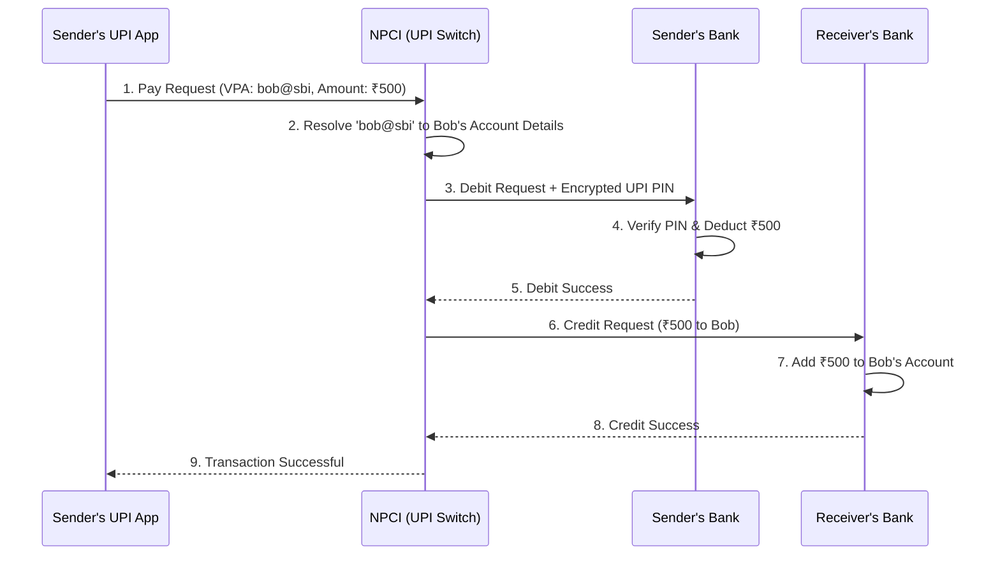

# UPI (Unified Payments Interface)

## Introduction
UPI (Unified Payments Interface) is an instant real-time payment system developed by the National Payments Corporation of India (NPCI). It facilitates inter-bank peer-to-peer (P2P) and person-to-merchant (P2M) transactions instantly, 24/7, using a mobile device.

## Problem Statement
Before UPI, transferring money between different banks required knowing complex account numbers, routing codes (IFSC), and waiting hours or days for settlement systems (NEFT/RTGS) to process batches. The problem was designing a system that sits *between* all banks, allowing instant, atomic, and secure transfers using only a simple virtual ID (e.g., `user@bank`).

## Why this exists
To enable secure, instant inter-bank money transfers, resolve virtual payment addresses (VPAs) to physical routing numbers, and guarantee transaction rollback if recipient systems fail.

## Real-world analogy
Imagine sending a physical package through two courier services. Courier A picks up the package from your house and drops it at a central hub (Debit). Courier B is supposed to pick it up from the hub and deliver it to your friend (Credit). If Courier B's truck crashes, they don't throw the package away. They notify the central hub, and Courier A returns the package to your house (Reversal/Refund).

## Definition
A centralized, stateless routing switch that coordinates inter-bank debit and credit APIs using virtual payment addresses and cryptographic PIN validations.

## Functional Requirements
1. Users can link multiple bank accounts to a single UPI application.
2. Users can instantly transfer money using a Virtual Payment Address (VPA) or Phone Number.
3. Users must authenticate transactions securely using a PIN.
4. Merchants can generate dynamic QR codes for payments.

## Non-Functional Requirements
1. **Absolute Consistency:** The system spans multiple banking databases. A transaction must be strictly ACID compliant across all of them (No double spending, no lost money).
2. **Low Latency:** Transactions must complete in 2-3 seconds.
3. **High Security:** End-to-end PIN encryption and strict regulatory compliance.
4. **Availability:** Highly available 24/7/365.

## Capacity Estimation
- **Users:** Over 300 Million active users.
- **Transactions:** 10 Billion transactions per month (approx. 4,000 TPS, peaking much higher).

---

## Python/Java implementation

Below is a Java simulation of the NPCI Central Switch Coordinator.

### Java Implementation

#### Bad implementation
*Calling both banks synchronously without error handling or reversal logic. If the credit step fails or times out, the sender's money is debited but never refunded.*

```java
// BAD: Naive synchronous execution without reversal logic.
// If the beneficiary bank fails, the sender is debited but the receiver never gets credited (money lost).
public class NaiveUpiCoordinator {
    private final BankMock bankA = new BankMock();
    private final BankMock bankB = new BankMock();

    public boolean transferMoney(String fromAcc, String toAcc, double amount) {
        // VULNERABILITY: No rollback if step 2 fails!
        boolean debitSuccess = bankA.debit(fromAcc, amount);
        if (debitSuccess) {
            boolean creditSuccess = bankB.credit(toAcc, amount);
            return creditSuccess; // If this is false, fromAcc loses money for nothing!
        }
        return false;
    }

    static class BankMock {
        public boolean debit(String acc, double amt) { return true; }
        public boolean credit(String acc, double amt) { return false; } // Mock fail
    }
}
```

#### Better implementation
*Using try-catch blocks to catch exceptions, but lacking automatic reversal triggers if the credit operation times out or returns an ambiguous state.*

```java
// BETTER: Basic exception handling.
// Handles known failures, but fails during network timeouts where the beneficiary state is ambiguous.
public class ExceptionUpiCoordinator {
    private final BankMock bankA = new BankMock();
    private final BankMock bankB = new BankMock();

    public boolean transferMoney(String fromAcc, String toAcc, double amount) {
        if (!bankA.debit(fromAcc, amount)) {
            return false;
        }

        try {
            boolean creditSuccess = bankB.credit(toAcc, amount);
            if (!creditSuccess) {
                // Try to reverse debit synchronously
                bankA.refund(fromAcc, amount);
                return false;
            }
            return true;
        } catch (Exception e) {
            // VULNERABILITY: If this catch is hit due to a timeout, we don't know if the credit succeeded or failed.
            // A blind refund here could cause double-crediting!
            System.out.println("Timeout occurred. Transaction state is ambiguous.");
            return false;
        }
    }

    static class BankMock {
        public boolean debit(String acc, double amt) { return true; }
        public boolean credit(String acc, double amt) throws Exception { throw new Exception("Timeout"); }
        public void refund(String acc, double amt) {}
    }
}
```

#### Best implementation
*A simulation of the NPCI Central Switch Coordinator. It executes the distributed Saga pattern: debits the remitter, credits the beneficiary, and triggers an automatic refund/reversal if the credit fails or times out. In-flight transactions are recorded in an audit log for nightly reconciliation.*

```java
import java.util.UUID;
import java.util.concurrent.ConcurrentHashMap;

// BEST: NPCI Central Switch Coordinator (Saga Orchestration & Reversal Engine)
public class NpciUpiSwitch {
    private final ConcurrentHashMap<String, TransactionRecord> auditLedger = new ConcurrentHashMap<>();
    private final BankNode remitterBank = new BankNode("HDFC");
    private final BankNode beneficiaryBank = new BankNode("SBI");

    public static class TransactionRecord {
        public final String txId;
        public final String fromVpa;
        public final String toVpa;
        public final double amount;
        public TxState state;

        public TransactionRecord(String txId, String fromVpa, String toVpa, double amount) {
            this.txId = txId; this.fromVpa = fromVpa; this.toVpa = toVpa;
            this.amount = amount; this.state = TxState.INITIATED;
        }
    }

    public enum TxState { INITIATED, DEBIT_SUCCESS, SUCCESS, REVERSING, FAILED }

    public static class BankNode {
        public final String bankName;
        private final Map<String, Double> accounts = new HashMap<>();

        public BankNode(String bankName) { this.bankName = bankName; }

        public void setBalance(String vpa, double amt) { accounts.put(vpa, amt); }
        public double getBalance(String vpa) { return accounts.getOrDefault(vpa, 0.0); }

        public synchronized boolean debit(String vpa, double amount) {
            double bal = accounts.getOrDefault(vpa, 0.0);
            if (bal >= amount) {
                accounts.put(vpa, bal - amount);
                return true;
            }
            return false;
        }

        public synchronized boolean credit(String vpa, double amount) {
            // Simulating random network timeout
            if (Math.random() < 0.2) {
                throw new RuntimeException("Timeout: Beneficiary Bank connection lost");
            }
            accounts.put(vpa, accounts.getOrDefault(vpa, 0.0) + amount);
            return true;
        }

        public synchronized void refund(String vpa, double amount) {
            accounts.put(vpa, accounts.getOrDefault(vpa, 0.0) + amount);
        }
    }

    // 2. Saga Orchestration Flow
    public boolean processPayment(String fromVpa, String toVpa, double amount) {
        String txId = "UPI_" + UUID.randomUUID().toString().substring(0, 8);
        TransactionRecord record = new TransactionRecord(txId, fromVpa, toVpa, amount);
        auditLedger.put(txId, record);

        System.out.println("NPCI: Initiating Transaction [" + txId + "] for ₹" + amount);

        // Step 1: Request Debit from Remitter Bank
        boolean debitSuccess = remitterBank.debit(fromVpa, amount);
        if (!debitSuccess) {
            record.state = TxState.FAILED;
            System.out.println("NPCI: Debit failed. Insufficient funds.");
            return false;
        }
        record.state = TxState.DEBIT_SUCCESS;
        System.out.println("NPCI: Debit Successful on " + remitterBank.bankName);

        // Step 2: Request Credit from Beneficiary Bank
        boolean creditSuccess = false;
        try {
            creditSuccess = beneficiaryBank.credit(toVpa, amount);
        } catch (Exception e) {
            System.out.println("NPCI: Credit Failed due to: " + e.getMessage());
        }

        if (creditSuccess) {
            record.state = TxState.SUCCESS;
            System.out.println("NPCI: Credit Successful on " + beneficiaryBank.bankName + ". Transaction Complete.");
            return true;
        } else {
            // Step 3: Trigger Reversal (Compensating Transaction)
            record.state = TxState.REVERSING;
            System.out.println("NPCI: Credit failed. Triggering compensating Reversal on " + remitterBank.bankName);
            remitterBank.refund(fromVpa, amount);
            record.state = TxState.FAILED;
            System.out.println("NPCI: Reversal Complete. Funds returned to sender.");
            return false;
        }
    }
}
```

---

## Core Architecture & The Entities

A UPI transaction is unique because it involves coordination between four distinct entities:
1. **PSP (Payment Service Provider):** The client application (e.g., Google Pay, PhonePe).
2. **NPCI (The Central Switch):** The clearing house that routes transaction messages.
3. **Remitter Bank:** The sender's bank.
4. **Beneficiary Bank:** The receiver's bank.

## Internal working / Mermaid diagram



## The Distributed Transaction Problem
What happens if Step 5 succeeds (money is deducted), but Step 6 fails (receiver's bank is offline)?
- The money must be returned to the sender to prevent inconsistency.

### The Saga Pattern & Reversals
UPI relies on asynchronous messaging and a Saga pattern managed by NPCI:
- If the Beneficiary Bank fails or times out during the credit step, NPCI immediately issues a **Reversal Request** to the Remitter Bank.
- The Remitter Bank adds the money back to the sender's account.
- **Reconciliation:** If a network link goes dead and the status is ambiguous, banks run nightly **Reconciliation Files** (matching transaction IDs) to find hanging states and settle them manually.

## Database Design & Security

### The NPCI Switch
- NPCI acts as a stateless router. It does *not* store balances.
- It uses a highly optimized, distributed in-memory database (like Redis) to quickly resolve VPAs (`alice@hdfc`) to actual bank routing details.
- It uses a relational database to log transaction states (`INITIATED`, `DEBIT_SUCCESS`, `SUCCESS`, `FAILED`) for auditing.

### UPI PIN Security
- The UPI PIN is **never** visible to the PSP app (GPay) or to NPCI.
- When the user enters their PIN, it is encrypted on the phone's hardware using a public key provided by the NPCI/Bank.
- The encrypted payload travels through NPCI and is decrypted inside the secure HSM (Hardware Security Module) of the Remitter Bank.

## Scaling Strategy
- **Stateless Switch:** Because NPCI doesn't hold ledger balances, its API servers are scaled horizontally behind load balancers.
- **Asynchronous Logging:** While payment routing is synchronous, writing audit logs and sending SMS alerts is pushed to Kafka queues.

## Bottlenecks & Trade-offs
- **The Weakest Link:** A distributed transaction is only as fast as its slowest component. If the receiver's bank has an outdated database, the transaction takes 10 seconds, making the PSP app appear slow.
  - *UPI Lite:* To solve the problem of banks crashing under the load of millions of small transactions (buying tea), UPI introduced "UPI Lite". This moves small balances to an on-device wallet, bypassing the Remitter Bank database entirely.

## Pros
- Seamless inter-bank transfers using virtual addresses.
- Strict consistency via automatic compensations (Saga).
- End-to-end security via hardware PIN encryption.

## Cons
- Latency is dependent on the slowest bank's API response time.
- Complex reconciliation processes are required for network timeouts.

## Interview questions

### Beginner
- **Q: Who are the four main entities involved in a UPI transaction?**
  - **A:** The Sender's App (PSP), the NPCI Central Switch, the Remitter Bank (Sender's Bank), and the Beneficiary Bank (Receiver's Bank).
- **Q: What is a VPA (Virtual Payment Address)?**
  - **A:** A VPA is a unique identifier (e.g., `name@bank`) that maps to a user's actual bank account details, allowing transfers without exposing account numbers.

### Intermediate
- **Q: What is a Compensating Transaction, and how is it used in UPI?**
  - **A:** A compensating transaction undoes the effects of a previous step in a distributed transaction. In UPI, if the remitter's bank is successfully debited, but the beneficiary's bank fails to credit the recipient, NPCI issues a compensating transaction (Reversal Request) to refund the remitter's account.
- **Q: How is the security of the UPI PIN guaranteed?**
  - **A:** The PIN is encrypted on the user's mobile device using a public key. It is transmitted encrypted through the PSP app and NPCI, and is decrypted only inside the Hardware Security Module (HSM) of the remitter's bank, ensuring no intermediate system can read the PIN.

### Senior
- **Q: What happens if a UPI transaction times out during the credit phase? How is it resolved?**
  - **A:** 
    1. **Ambiguous State:** The transaction is marked as `PENDING` because the switch does not know if the credit succeeded.
    2. **Polling:** The switch polls the beneficiary bank's API periodically to query the status of the transaction.
    3. **Reversal/Commit:** If the bank confirms it failed, a reversal is sent to refund the sender. If it succeeded, the transaction is marked complete.
    4. **Reconciliation:** If polling fails, the transaction is settled during nightly batch reconciliation runs between the banks' ledger files.

### Staff Engineer
- **Q: Design the high-throughput central routing switch for NPCI that processes 20,000 TPS, ensuring message integrity, zero-loss logging, and sub-100ms internal hop latencies.**
  - **A:** 
    1. **Stateless Gateway Routing:** Deploy the gateway using Netty or Go with non-blocking I/O to handle incoming HTTP/REST connections from PSPs.
    2. **In-Memory Directory:** Store VPA-to-bank routing maps in a distributed key-value store (like Redis Enterprise or Aerospike) with sub-millisecond read times.
    3. **Asynchronous Ledger Logging:** Write transaction logs to a clustered, distributed commit log (like Apache Kafka) partitioned by transaction ID.
    4. **Transaction State Machine:** Manage the state of active transactions in a high-speed, in-memory state engine. If a transaction times out, trigger compensating events via Kafka event listeners.

## Common mistakes
- **Executing bank API calls inside synchronous database transactions:** Locking database resources while waiting for slow third-party networks.
- **Lacking automated reconciliation pipelines:** Leaving timed-out transactions permanently unresolved.

## Best practices
- Encrypt sensitive data (like PINs) at the source.
- Scale out the routing switch horizontally.
- Implement circuit breakers to fail fast when a specific bank's server is down.

## When NOT to use
- Do not build a complex inter-bank switch system if you are building an internal company ledger or single-bank payment app.

## Comparison with similar concepts
- **UPI vs Credit Card Networks:** Credit cards use a two-step process (Authorization and Settlement, taking days). UPI is an instant settlement system where funds are transferred and settled between bank accounts in real-time.

## Summary
The UPI architecture is a masterclass in orchestrating synchronous, high-security distributed transactions across dozens of independent corporate and government networks. By centralizing the routing logic at NPCI while strictly maintaining the financial ledgers at the individual banks, it achieves unparalleled interoperability.

## Related topics
- [Paytm / Digital Wallets](./paytm)
- [Microservices / Saga Pattern](../microservices/saga-pattern)
