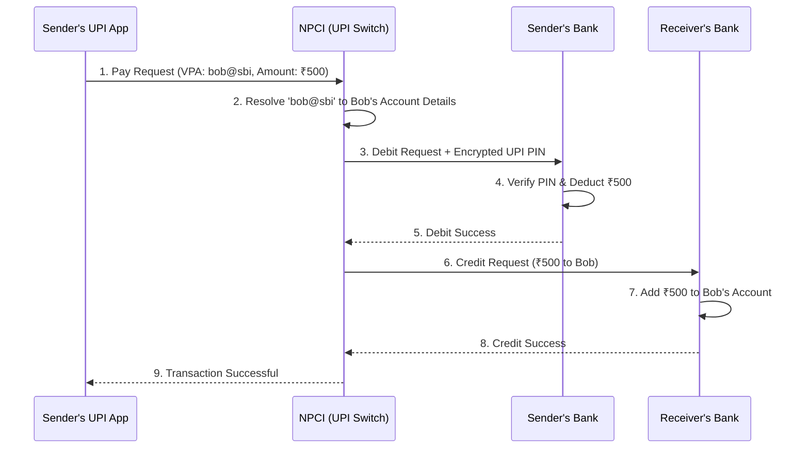

# UPI (Unified Payments Interface)

## Introduction
UPI (Unified Payments Interface) is an instant real-time payment system developed by the National Payments Corporation of India (NPCI). It facilitates inter-bank peer-to-peer (P2P) and person-to-merchant (P2M) transactions instantly, 24/7, using a mobile device.

## Problem Statement
Before UPI, transferring money between different banks required knowing complex account numbers, routing codes (IFSC), and waiting hours or days for settlement systems (like NEFT/RTGS) to process batches. The problem was designing a system that sits *between* all banks, allowing instant, atomic, and secure transfers using only a simple virtual ID (e.g., `user@bank`).

## Functional Requirements
1. Users can link multiple bank accounts to a single UPI app (PhonePe, GPay, Paytm).
2. Users can instantly transfer money using a Virtual Payment Address (VPA) or Phone Number.
3. Users must authenticate transactions securely using a PIN.
4. Merchants can generate dynamic QR codes for payments.

## Non-Functional Requirements
1. **Absolute Consistency:** The system spans multiple disparate banking databases. A transaction must be strictly ACID compliant across all of them (No double spending, no lost money).
2. **High Availability:** Must be available 24/7/365.
3. **High Security:** End-to-end encryption and strict regulatory compliance.
4. **Low Latency:** The end-user expects the transfer to happen in 2-3 seconds.

## Capacity Estimation
- Over 300 Million active users.
- Handling over 10 Billion transactions per month (approx. 4,000 TPS, peaking much higher).

## Core Architecture & The Entities

A UPI transaction is unique because it involves a complex choreography between at least four distinct entities:
1. **PSP (Payment Service Provider):** The app the user is holding (e.g., Google Pay).
2. **NPCI (The Central Switch):** The government-backed clearing house that routes the messages.
3. **Remitter Bank:** The sender's bank (e.g., HDFC).
4. **Beneficiary Bank:** The receiver's bank (e.g., SBI).

## Internal working / Mermaid diagram

## The Distributed Transaction Problem

The sequence above is a classic **Distributed Transaction**. What happens if Step 4 succeeds (money is deducted), but Step 6 fails (receiver's bank is down)?
- We cannot leave the system in an inconsistent state. The money must be returned to the sender.

### The Two-Phase Commit / Saga Pattern
UPI relies on asynchronous messaging and a Saga-like pattern managed by NPCI:
- If the Beneficiary Bank responds with a timeout or failure at Step 8, NPCI immediately issues a **Reversal Request** to the Remitter Bank.
- The Remitter Bank adds the money back to the sender's account.
- **Reconciliation:** If a network link goes completely dead and NPCI isn't sure what happened, banks run nightly Reconciliation files (matching millions of transaction IDs) to find hanging transactions and manually credit/debit them.

## Database Design & Security

### The NPCI Switch
- NPCI acts as a stateless router. It does *not* store the actual money or balances.
- It uses a highly optimized, distributed in-memory database (like Redis or Hazelcast) to quickly resolve VPAs (`alice@hdfc`) to actual bank routing details.
- It uses a relational database to log the transaction state (`INITIATED`, `DEBIT_SUCCESS`, `CREDIT_SUCCESS`, `FAILED`) for auditing.

### UPI PIN Security
- The UPI PIN is **never** known to the app (GPay) or to NPCI. 
- When the user types their PIN, it is encrypted locally on the phone's hardware using a public key provided by the NPCI/Bank. 
- The encrypted payload travels through the internet, through NPCI, and is only decrypted deep inside the highly secure HSM (Hardware Security Module) of the Remitter Bank.

## Scaling Strategy
- **Stateless Switch:** Because NPCI doesn't hold ledger balances, its API servers can be scaled horizontally infinitely behind load balancers.
- **Asynchronous Logging:** While the actual payment routing is synchronous (waiting for Bank A and Bank B), writing the audit logs and sending SMS notifications is pushed to Kafka queues to prevent slowing down the critical path.

## Bottlenecks & Trade-offs
- **The Weakest Link:** A distributed transaction is only as fast as its slowest component. If SBI (the receiver bank) has an outdated, slow legacy database, the entire UPI transaction takes 10 seconds, and Google Pay looks slow to the user.
- *Mitigation (UPI Lite):* To solve the problem of banks crashing under the load of millions of ₹10 transactions (buying tea), UPI introduced "UPI Lite". This moves the balance from the core bank database into a specialized, highly available "on-device" wallet. This bypasses the Remitter Bank entirely for small transactions, drastically reducing database load and failure rates.

## Summary
The UPI architecture is a masterclass in orchestrating synchronous, high-security distributed transactions across dozens of independent corporate and government networks. By centralizing the routing logic at NPCI while strictly maintaining the financial ledgers at the individual banks, it achieves unparalleled interoperability.

## Related topics
- [Paytm / Digital Wallets](../paytm)
- [Microservices / Saga Pattern](../../microservices/saga-pattern)
