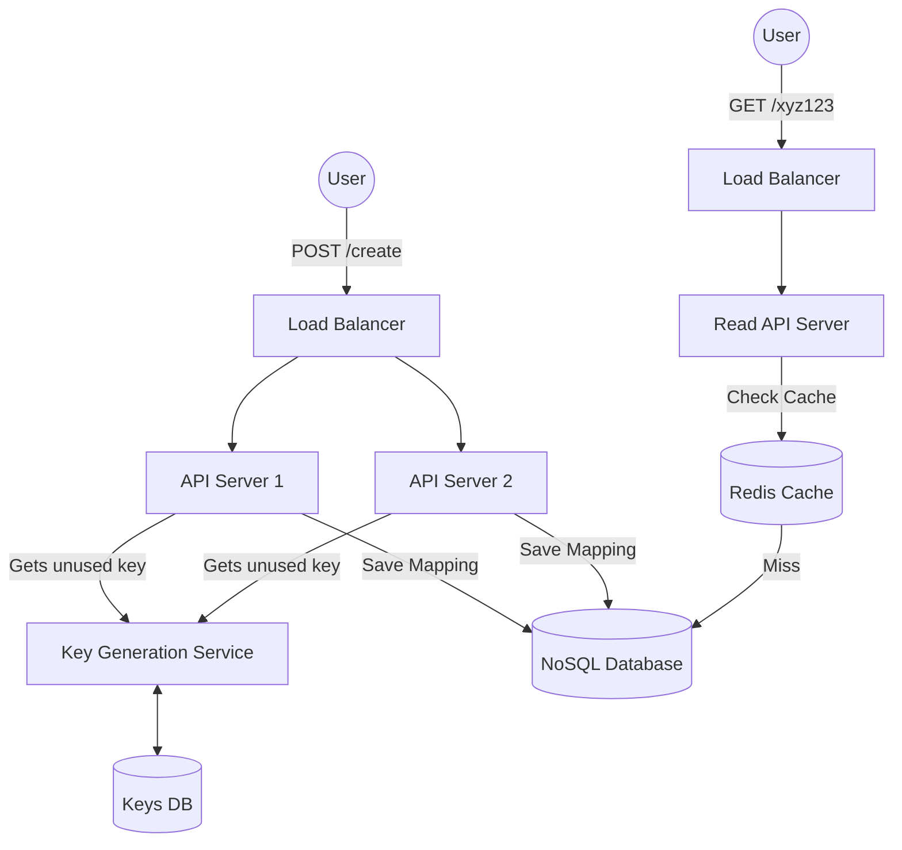

# URL Shortener (TinyURL)

## Introduction
A URL shortener is a service that creates a shorter alias for a long URL. When a user clicks the short link, they are automatically redirected to the original URL. Popular examples include TinyURL, bit.ly, and Google's discontinued goo.gl.

## Problem Statement
Long URLs are difficult to remember, take up too much space in text messages or tweets (which used to have a strict 140-character limit), and can break when wrapped to a new line in an email.

## Real-world analogy
A URL shortener is like a coat check at a restaurant. You hand them your heavy, bulky winter coat (the long URL). They hand you back a tiny plastic token with the number "42" (the short URL). When you leave, you hand them the token, and they give you back the exact coat. The token "maps" to the coat.

## Functional Requirements
1. Given a long URL, the system should generate a unique short URL.
2. Given a short URL, the system should redirect the user to the original long URL.
3. Users should optionally be able to pick a custom short link (e.g., `bit.ly/my-cool-link`).
4. Links should expire after a standard default timespan, but users should be able to specify a custom expiration time.

## Non-Functional Requirements
1. **High Availability:** The system must be highly available. If the service goes down, all short links across the internet stop working.
2. **Low Latency:** URL redirection should happen in real-time with minimal delay.
3. **Scalability:** The system must handle millions of links generated per day and billions of redirects per day. Read traffic will heavily outweigh Write traffic.
4. **Predictability:** Short links should not be easily guessable (to prevent scraping/discovery of private links).

## Capacity Estimation
*Assumption:* 100 Million new URLs generated per month.
*Read/Write Ratio:* 100:1 (10 Billion redirects per month).
- **Writes:** 100M / (30 days * 24h * 3600s) ≈ 40 writes/second.
- **Reads:** 10B / (30 days * 24h * 3600s) ≈ 4,000 reads/second.
- **Storage:** If we store URLs for 10 years: 100M * 12 months * 10 years = 12 Billion records. Assuming each record is 500 bytes: 12B * 500 bytes = **6 TB** of total storage.
- **Cache:** Caching 20% of daily read requests (80/20 rule): 0.2 * (10B / 30) * 500 bytes ≈ **33 GB** of memory needed for caching.

## System APIs

**1. Create Short URL**
`POST /api/v1/urls`
- Request: `{"original_url": "https://...", "custom_alias": "my-link", "expire_at": "2025-12-31"}`
- Response: `{"short_url": "https://short.ly/xyz123"}`

**2. Redirect**
`GET /{short_url_key}`
- Response: HTTP 301 (Permanent) or 302 (Temporary) redirect to the original URL.

## Database Design
We need to store billions of records. Since there are no complex relationships between records and we need massive horizontal scalability, a **NoSQL Database** (like DynamoDB, Cassandra, or MongoDB) is highly recommended. However, a heavily sharded Relational DB (MySQL) can also work.

**Table: URL_Mapping**
- `hash` (String, Primary Key) - e.g., "xyz123"
- `original_url` (String)
- `creation_date` (Timestamp)
- `expiration_date` (Timestamp)
- `user_id` (Integer, Indexed - optional if user accounts exist)

## Encoding Logic (The Core Algorithm)

How do we generate a unique short URL? We use **Base62 Encoding** (`A-Z`, `a-z`, `0-9`).
A 7-character Base62 string allows for $62^7$ = **~3.5 Trillion** unique URLs, which is plenty for our 12 billion estimated records.

### Approach 1: Hash the URL (MD5/SHA256)
Take the MD5 hash of the original URL, encode it in Base62, and take the first 7 characters.
- *Problem:* Two users submitting the *same* URL get the *same* short URL. If one deletes it, it breaks for the other. Collisions are also possible when truncating to 7 characters.

### Approach 2: Base62 Encode a Unique Counter (The Standard Approach)
We use a centralized database or Zookeeper to generate a globally unique, auto-incrementing integer (e.g., 100,000). We convert this Base10 integer into a Base62 string.
- *Problem:* Zookeeper/DB becomes a single point of failure and a bottleneck.

### Approach 3: Pre-generated Key Generation Service (KGS)
A standalone background service that constantly generates random 7-character Base62 strings and stores them in a highly available database table (`Unused_Keys`).
- When an API server needs to generate a short URL, it pulls a batch of 1000 keys from the DB into its memory and marks them as "Used" in the DB.
- When it receives a POST request, it simply pops one key from its fast in-memory cache and assigns it to the long URL.
- *Pros:* Lightning fast, no collisions, no single point of failure at runtime.

## Internal working / Mermaid diagram

## Caching Strategy
Since reads heavily outweigh writes, caching is critical. We use **Redis** or **Memcached**.
- When a `GET` request comes in, check the cache first.
- If it's a Cache Miss, fetch from the NoSQL DB and store it in the Cache.
- **Eviction Policy:** LRU (Least Recently Used), since a small percentage of popular links will drive the vast majority of traffic.

## Scaling Strategy
- **Web Servers:** Horizontally scale the API servers behind a Load Balancer. They are stateless.
- **Database:** Shard the NoSQL database using Consistent Hashing on the `hash` (short URL key) to ensure uniform data distribution across nodes.
- **Cache:** Deploy a Redis cluster to handle 4,000+ reads per second easily.

## Bottlenecks & Trade-offs
- **301 vs 302 Redirect:** 
  - `301 Permanent Redirect`: The browser caches the response. It reduces load on our servers, but we can't track analytics (click rates) because subsequent clicks don't hit our server.
  - `302 Temporary Redirect`: The browser hits our server *every time*. Higher load on our system, but allows for accurate click analytics. Usually, 302 is preferred by modern URL shorteners for analytics purposes.

## Failure Handling
- **Database Failure:** Use Master-Slave replication. If the master dies, promote a slave. Since reads dominate, having multiple read replicas is highly effective.
- **KGS Failure:** The Key Generation Service isn't in the critical path of the read flow. If it dies, API servers can still use the 1,000 keys they have cached in memory until it recovers.

## Monitoring & Metrics
- **Cache Hit Ratio:** Crucial for ensuring the Redis cluster is sized correctly. A dropping ratio means the DB will get hammered.
- **Redirection Latency:** Must remain under 100ms.
- **Key Exhaustion:** Monitor the KGS to ensure it always has a buffer of unused keys ready.

## Deployment Strategy
Containerize the API servers and KGS using Docker, and deploy them to a Kubernetes cluster across multiple Availability Zones to ensure high availability and automatic failover. Use a managed NoSQL database (like DynamoDB) to offload database maintenance.

## Summary
Building a URL shortener requires balancing high read throughput with low latency. By utilizing a Key Generation Service to pre-compute keys, a NoSQL database for horizontal scaling, and an aggressive LRU Redis caching layer, the system can reliably handle billions of daily redirects.

## Related topics
- [Redis](../../caching/redis)
- [NoSQL Databases](../../databases/nosql)
- [Load Balancing](../../fundamentals/load-balancing)
