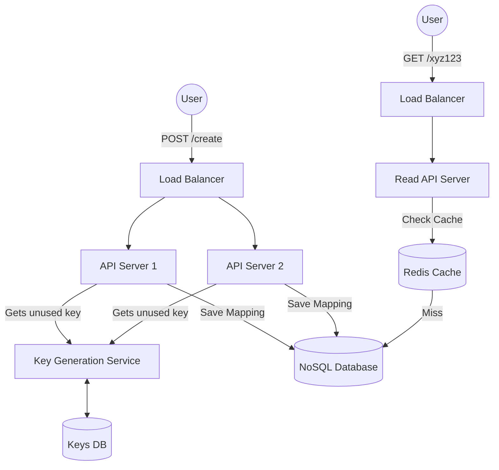

# URL Shortener (TinyURL)

## Introduction
A URL shortener is a service that creates a shorter alias for a long URL. When a user clicks the short link, they are automatically redirected to the original URL. Popular examples include TinyURL, bit.ly, and Google's discontinued goo.gl.

## Problem Statement
Long URLs are difficult to remember, take up too much space in text messages or tweets, and can break when wrapped to a new line in an email. In high-scale systems, redirecting billions of links daily requires minimal latency and horizontal database scaling.

## Why this exists
To improve readability, track link analytics (clicks, geolocations, referrers), and ensure that short aliases consume minimal character space in SMS or social media messages.

## Real-world analogy
A URL shortener is like a coat check at a restaurant. You hand them your heavy, bulky winter coat (the long URL). They hand you back a tiny plastic token with the number "42" (the short URL). When you leave, you hand them the token, and they give you back the exact coat. The token "maps" to the coat.

## Definition
A web service that maps arbitrary long URLs to short, unique keys and handles low-latency HTTP redirection to the original destination.

## Functional Requirements
1. Given a long URL, the system should generate a unique short URL.
2. Given a short URL, the system should redirect the user to the original long URL.
3. Users should optionally be able to pick a custom short link (e.g., `bit.ly/my-cool-link`).
4. Links should expire after a standard default timespan, but users should be able to specify a custom expiration time.

## Non-Functional Requirements
1. **High Availability:** If the redirection service goes down, all short links across the internet stop working.
2. **Low Latency:** URL redirection must happen in under 100ms.
3. **Scalability:** Must support millions of new links per day and billions of redirects. Read traffic will heavily outweigh write traffic (e.g., 100:1).
4. **Predictability:** Short links should not be easily guessable (to prevent attackers from scanning/discovering private short links).

## Capacity Estimation
- **Assumption:** 100 Million new URLs generated per month.
- **Read/Write Ratio:** 100:1 (10 Billion redirects per month).
- **Writes (TPS):** 100M / (30 days * 24h * 3600s) ≈ 40 writes/second.
- **Reads (TPS):** 10B / (30 days * 24h * 3600s) ≈ 4,000 reads/second.
- **Storage:** Storing URLs for 10 years requires: 100M * 12 months * 10 years = 12 Billion records. Assuming each record is 500 bytes: 12B * 500 bytes = **6 TB** of total database storage.
- **Cache Size:** Caching 20% of daily read requests (80/20 rule): 0.2 * (10B / 30) * 500 bytes ≈ **33 GB** of RAM needed for caching.

## System APIs

**1. Create Short URL**
`POST /api/v1/urls`
- Request Payload:
  ```json
  {
    "original_url": "https://extremely-long-domain.com/path/to/resource?param=value",
    "custom_alias": "my-shortcut",
    "expire_at": "2026-12-31"
  }
  ```
- Response Payload:
  ```json
  {
    "short_url": "https://short.ly/xyz123"
  }
  ```

**2. Redirect**
`GET /{short_url_key}`
- Response: HTTP `302 Found` (or `301 Moved Permanently`) with the `Location` header pointing to the original URL.

---

## Python/Java implementation

Below are implementations showing how to generate short keys.

### Java Implementation

#### Bad implementation
*Generating random strings and querying the database in a loop to verify uniqueness. This creates a massive bottleneck and race conditions under concurrent load.*

```java
import java.sql.Connection;
import java.sql.PreparedStatement;
import java.sql.ResultSet;
import java.util.Random;

// BAD: Random generation with sequential database lookups.
// Highly prone to race conditions, and database queries increase exponentially as database fills.
public class VulnerableShortener {
    private final Random random = new Random();
    private final String CHARS = "abcdefghijklmnopqrstuvwxyzABCDEFGHIJKLMNOPQRSTUVWXYZ0123456789";

    public String shortenUrl(String longUrl, Connection dbConn) throws Exception {
        String shortKey = "";
        boolean isUnique = false;
        
        while (!isUnique) {
            // Generate a random 6-character key
            StringBuilder sb = new StringBuilder();
            for (int i = 0; i < 6; i++) {
                sb.append(CHARS.charAt(random.nextInt(CHARS.length())));
            }
            shortKey = sb.toString();

            // VULNERABILITY: Blocking database read on every generation to verify uniqueness
            String query = "SELECT id FROM url_mappings WHERE short_key = ?";
            try (PreparedStatement ps = dbConn.prepareStatement(query)) {
                ps.setString(1, shortKey);
                try (ResultSet rs = ps.executeQuery()) {
                    if (!rs.next()) {
                        isUnique = true; // Key doesn't exist, we can use it
                    }
                }
            }
        }

        // Insert mapping into DB
        String insert = "INSERT INTO url_mappings (short_key, original_url) VALUES (?, ?)";
        try (PreparedStatement ps = dbConn.prepareStatement(insert)) {
            ps.setString(1, shortKey);
            ps.setString(2, longUrl);
            ps.executeUpdate();
        }
        return shortKey;
    }
}
```

#### Better implementation
*Encoding an auto-incrementing database ID using Base62. This prevents collisions entirely but exposes the counter to users (making it trivial to scrape all URLs sequentially).*

```java
import java.util.concurrent.atomic.AtomicLong;

// BETTER: Base62 encoding of an incremental ID.
// Guarantees no database read loops or collisions.
// Drawback: Short URLs are sequential and guessable (e.g., key 1000 -> "qi", key 1001 -> "qj"), facilitating scraping.
public class SequentialBase62Shortener {
    private static final String BASE62 = "0123456789abcdefghijklmnopqrstuvwxyzABCDEFGHIJKLMNOPQRSTUVWXYZ";
    private final AtomicLong dbCounter = new AtomicLong(1000000000L); // Mock DB auto-increment ID

    public String toBase62(long number) {
        StringBuilder sb = new StringBuilder();
        while (number > 0) {
            sb.append(BASE62.charAt((int) (number % 62)));
            number /= 62;
        }
        return sb.reverse().toString();
    }

    public String shortenUrl(String longUrl) {
        long id = dbCounter.incrementAndGet(); // Atomically get next database sequence ID
        return toBase62(id);
    }
}
```

#### Best implementation
*A Key Generation Service (KGS) simulation that allocates numeric ranges to stateless API servers. Each API server consumes values locally in memory, translating them to Base62 without database calls at write-time. Adding shuffling prevents guessable sequential keys.*

```java
import java.util.concurrent.ConcurrentLinkedQueue;
import java.util.concurrent.atomic.AtomicLong;

// BEST: Key Generation Range Allocator (KGS pattern)
public class KgsShortenerService {
    private final KeyRangeAllocator databaseCoordinator = new KeyRangeAllocator();
    private final ApiServerNode serverNode1 = new ApiServerNode("server-1", databaseCoordinator);

    // Mock central coordinator (representing ZooKeeper or SQL range reservation table)
    public static class KeyRangeAllocator {
        private final AtomicLong globalCounter = new AtomicLong(1000000000L);
        private static final int RANGE_SIZE = 10000; // Allocate 10k blocks at a time

        public synchronized Range reserveRange() {
            long start = globalCounter.getAndAdd(RANGE_SIZE);
            return new Range(start, start + RANGE_SIZE - 1);
        }
    }

    public static class Range {
        public final long start;
        public final long end;
        public Range(long start, long end) {
            this.start = start;
            this.end = end;
        }
    }

    // Stateless API Node that builds Base62 strings locally in-memory
    public static class ApiServerNode {
        private final String nodeId;
        private final KeyRangeAllocator allocator;
        private Range currentRange;
        private final AtomicLong localCounter = new AtomicLong(0);
        private static final String BASE62 = "L3K7v2w8x9y0z1A5B6C4D8E9F0G1H2I3J4M5N6O7P8Q9R0S1T2U3V4W5X6Y7Zabcdefghijklmnopqrstuvwxyz"; // Shuffled to prevent sequential predictability

        public ApiServerNode(String nodeId, KeyRangeAllocator allocator) {
            this.nodeId = nodeId;
            this.allocator = allocator;
            acquireNewRange();
        }

        private synchronized void acquireNewRange() {
            this.currentRange = allocator.reserveRange();
            this.localCounter.set(currentRange.start);
            System.out.println("[" + nodeId + "] Reserved range: [" + currentRange.start + " - " + currentRange.end + "]");
        }

        private String toBase62(long number) {
            StringBuilder sb = new StringBuilder();
            while (number > 0) {
                sb.append(BASE62.charAt((int) (number % 62)));
                number /= 62;
            }
            return sb.reverse().toString();
        }

        public String shortenUrl(String longUrl) {
            long id = localCounter.getAndIncrement();
            if (id > currentRange.end) {
                acquireNewRange();
                id = localCounter.getAndIncrement();
            }
            // Obfuscate ID using simple bit shuffling or custom base62 alphabet mapping
            long obfuscatedId = shuffleBits(id);
            return toBase62(obfuscatedId);
        }

        private long shuffleBits(long val) {
            // Simple deterministic bit manipulation to make consecutive IDs look random
            return ((val & 0x0000FFFFL) << 16) | ((val & 0xFFFF0000L) >> 16);
        }
    }
}
```

---

## Database Design
We need to store billions of records. Since there are no complex relationships between records and we need massive horizontal scalability, a **NoSQL Database** (like DynamoDB or Cassandra) is highly recommended. 

### Table: URL_Mapping
- `short_key` (String, Primary Key) - e.g., "xyz123"
- `original_url` (String)
- `creation_date` (Timestamp)
- `expiration_date` (Timestamp)
- `user_id` (Integer, Indexed)

## Encoding Logic (The Core Algorithm)
We use **Base62 Encoding** (`A-Z`, `a-z`, `0-9`).
A 7-character Base62 string allows for $62^7$ = **~3.5 Trillion** unique URLs, which easily covers our 12 billion estimated records.

### Key Generation Service (KGS)
Instead of calculating hashes at runtime or querying a sequence generator on every write:
- The KGS pre-computes unique keys and loads them into a fast database queue.
- API servers lease key ranges (e.g., 10,000 keys at a time) from the KGS and buffer them in memory.
- When a short URL request arrives, the API server pops a key from memory instantly. No SQL queries or hash calculations are in the write path.

## Internal working / Mermaid diagram



## Caching Strategy
Since reads heavily outweigh writes, caching is critical. We use **Redis** or **Memcached**.
- When a `GET` request comes in, check the cache first.
- If it's a Cache Miss, fetch from the NoSQL DB and store it in the Cache.
- **Eviction Policy:** LRU (Least Recently Used), since a small percentage of popular links will drive the vast majority of traffic.

## Scaling Strategy
- **Web Servers:** Horizontally scale the API servers behind a Load Balancer. They are stateless.
- **Database:** Shard the NoSQL database using Consistent Hashing on the `hash` (short URL key) to ensure uniform data distribution across nodes.
- **Cache:** Deploy a Redis cluster to handle 4,000+ reads per second easily.

## Bottlenecks & Trade-offs
- **301 vs 302 Redirect:** 
  - `301 Permanent Redirect`: The browser caches the response. It reduces load on our servers, but we can't track analytics (click rates) because subsequent clicks don't hit our server.
  - `302 Temporary Redirect`: The browser hits our server *every time*. Higher load on our system, but allows for accurate click analytics. Usually, 302 is preferred by modern URL shorteners for analytics purposes.

## Failure Handling
- **Database Failure:** Use Master-Slave replication. If the master dies, promote a slave. Since reads dominate, having multiple read replicas is highly effective.
- **KGS Failure:** The Key Generation Service isn't in the critical path of the read flow. If it dies, API servers can still use the 10,000 keys they have cached in memory until it recovers.

## Monitoring & Metrics
- **Cache Hit Ratio:** Crucial for ensuring the Redis cluster is sized correctly. A dropping ratio means the DB will get hammered.
- **Redirection Latency:** Must remain under 100ms.
- **Key Exhaustion:** Monitor the KGS to ensure it always has a buffer of unused keys ready.

## Deployment Strategy
Containerize the API servers and KGS using Docker, and deploy them to a Kubernetes cluster across multiple Availability Zones to ensure high availability and automatic failover. Use a managed NoSQL database (like DynamoDB) to offload database maintenance.

## Pros
- Extremely fast writes (in-memory range lookup).
- Zero hash collision handling needed when using KGS.
- Simple, stateless API servers.

## Cons
- Custom alias matching requires separate database queries, bypassing KGS.
- In-memory key ranges are lost if an API server crashes (tolerable since keys are cheap).

## Interview questions

### Beginner
- **Q: Which HTTP status code is used for URL redirection, and what is the difference between 301 and 302?**
  - **A:** Both redirections work, but `301 Moved Permanently` tells the client's browser to cache the redirect address. `302 Found` (Temporary Redirect) forces the browser to hit the shortener API on every single click, enabling analytics tracking.
- **Q: Why is a SQL database not ideal for storing billions of URL mappings?**
  - **A:** URL mappings do not require relational joins. A SQL database can struggle with high horizontal write scaling and high partition sizing, whereas NoSQL (like DynamoDB) handles massive key-value writes natively.

### Intermediate
- **Q: Why does standard Base62 hashing (e.g., MD5 truncated to 6 chars) cause collisions, and how do we resolve it?**
  - **A:** Truncating a hash (e.g., taking the first 6 base62 characters of MD5) reduces the key space, causing collisions. Resolving it by appending a counter or user ID before hashing is possible, but it requires database checks. A Key Generation Service (KGS) avoids this by pre-allocating unique numeric ranges.

### Senior
- **Q: How would you prevent scrapers from extracting all original URLs in a sequence-based shortener?**
  - **A:** Instead of encoding sequential numbers directly (1000, 1001, 1002), we can apply a bit-shuffling function or format the sequence through a lightweight encryption cipher (like Skip32) before Base62 encoding. This randomizes the output keys while maintaining uniqueness.

### Staff Engineer
- **Q: Design a globally distributed URL shortener where short links are routed to the nearest regional database partition, ensuring low latency in Tokyo, London, and New York.**
  - **A:** 
    1. **DNS Routing:** Route requests to the nearest edge API server via GeoDNS.
    2. **Multi-Region Database:** Deploy a globally distributed database (e.g., Amazon DynamoDB Global Tables) with multi-region active-active replication.
    3. **Key Range Partitioning:** Assign different KGS ranges to different regions (e.g., Tokyo uses range 1T-2T, London 2T-3T, NY 3T-4T) to avoid write conflicts.
    4. **Local CDN/Redis Caching:** Maintain regional Redis caches. A Tokyo user hitting Tokyo's edge proxy gets redirected using Tokyo's local Redis/DB replica.

## Common mistakes
- **Trusting the MD5 hash blindly without truncation:** A full MD5 is 32 characters, defeating the purpose of a *short* URL.
- **Querying DB inside loops:** Querying the database to check if a random key exists before writing.

## Best practices
- Shuffle key sequences to prevent guessability.
- Scale reads using a multi-region cache cluster.
- Monitor KGS key depletion thresholds.

## When NOT to use
- Do not build a custom shortener if you only need occasional links; use SaaS integrations (e.g., Bitly API).

## Comparison with similar concepts
- **Base62 vs Base64:** Base62 uses only alphanumeric characters (`[A-Za-z0-9]`). Base64 includes `+` and `/`, which are special characters in URL query paths and require URL encoding, making Base62 better for URLs.

## Summary
Building a URL shortener requires balancing high read throughput with low latency. By utilizing a Key Generation Service to pre-compute keys, a NoSQL database for horizontal scaling, and an aggressive LRU Redis caching layer, the system can reliably handle billions of daily redirects.

## Related topics
- [Redis](../caching/redis)
- [NoSQL Databases](../databases/nosql)
- [Load Balancing](../fundamentals/load-balancing)
