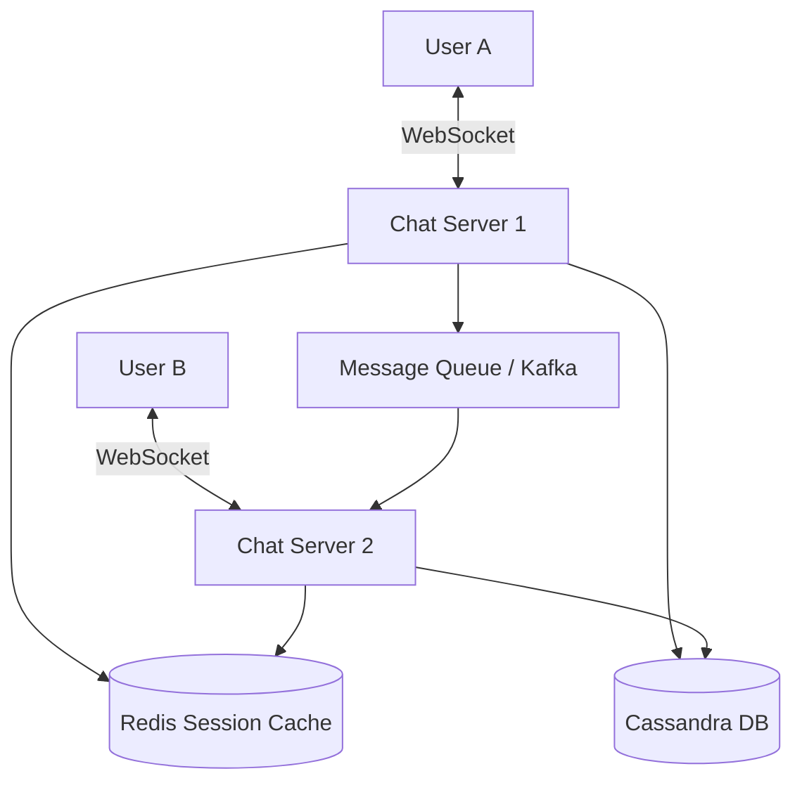

# WhatsApp (Chat Application)

## Introduction
WhatsApp is a real-time messaging application used by billions of users worldwide. Designing a chat application at this scale involves handling millions of concurrent persistent connections, guaranteeing message delivery states, managing online presence, and ensuring low latency.

## Problem Statement
Traditional HTTP follows a request-response model where the client must constantly "pull" data from the server. For a chat app, users expect messages to be "pushed" to their device the millisecond they are sent by a friend. Polling the server every second for new messages would instantly crash the infrastructure under the weight of billions of empty HTTP requests.

## Why this exists
To enable instantaneous, bidirectional, real-world communications between users, minimizing network latency, overhead headers, and server execution cost.

## Real-world analogy
Traditional HTTP request-response is like sending letters back and forth via post mail; you write a letter, mail it, and wait for a reply. WebSockets is like establishing an open phone call. Once the connection is established, either party can speak instantly without dialing again.

## Definition
A real-time messaging system leveraging persistent, bidirectional transport layers (like WebSockets) to deliver text and media between concurrent users at scale.

## Functional Requirements
1. Support 1-on-1 private messaging in real-time.
2. Support group chats (up to 256 or more users).
3. Display online/offline presence status.
4. Support message states: Sent, Delivered, Read (single, double, and blue ticks).
5. Store chat history so it can be viewed across devices.

## Non-Functional Requirements
1. **Low Latency:** Messages must be delivered in under 200ms.
2. **High Availability:** System must stay online, although temporary message delivery delays are preferred over message loss.
3. **Scalability:** Must support 2 Billion+ active users and 1.2 Million messages/second.
4. **Ordering:** Messages must appear in the exact chronological order they were sent.

## Capacity Estimation
- **Users:** 2 Billion DAU (Daily Active Users).
- **Concurrent Connections:** If 10% of DAU are online concurrently, we must maintain 200 Million concurrent open connections.
- **Message Rate:** 100 Billion messages / day ≈ 1.2 Million messages / second.
- **Storage:** Assuming average message size is 100 bytes: 100B msgs * 100 bytes = **10 TB** of new text data per day.

---

## Python/Java implementation

Below is a Java simulation of WebSocket session routing.

### Java Implementation

#### Bad implementation
*Using HTTP polling to check for new messages. This hammers the database with empty queries and wastes network resources.*

```java
import java.util.ArrayList;
import java.util.List;

// BAD: HTTP Polling pattern.
// Every client polls the server every 1 second. Database is hit constantly, causing CPU spikes.
public class PollingChatController {
    private final DatabaseMock db = new DatabaseMock();

    public List<Message> pollForNewMessages(String userId, long lastSeenTimestamp) {
        // VULNERABILITY: Every client calls this in a loop.
        // Causes O(N) database reads per second, where N is the total active user count.
        return db.fetchMessagesSince(userId, lastSeenTimestamp);
    }

    static class Message {
        String fromUser;
        String content;
    }

    static class DatabaseMock {
        public List<Message> fetchMessagesSince(String userId, long timestamp) {
            // Mock SQL query execution...
            return new ArrayList<>();
        }
    }
}
```

#### Better implementation
*Using WebSockets but storing active connection sockets in a local, single-node map. This fails to scale horizontally across multiple chat servers.*

```java
import java.util.concurrent.ConcurrentHashMap;

// BETTER: Local WebSocket connection map.
// Sockets are kept open for fast bidirectional push, but connections are isolated to one server.
// If User A is on Server 1 and User B is on Server 2, Server 1 cannot route messages directly.
public class LocalWebSocketRegistry {
    private final ConcurrentHashMap<String, MockSocket> localConnections = new ConcurrentHashMap<>();

    public void registerConnection(String userId, MockSocket socket) {
        localConnections.put(userId, socket);
    }

    public void sendMessage(String fromUserId, String toUserId, String message) {
        MockSocket targetSocket = localConnections.get(toUserId);
        if (targetSocket != null) {
            targetSocket.send(message); // Works ONLY if target is on the same machine!
        } else {
            System.out.println("User is offline or on another server node.");
        }
    }

    interface MockSocket {
        void send(String payload);
    }
}
```

#### Best implementation
*A horizontally scalable WebSocket Session Dispatcher. A central session cache (mocking Redis) tracks user-to-server mappings, routing messages across different servers via simulated RPCs, and coordinating group chat fan-outs.*

```java
import java.util.HashMap;
import java.util.List;
import java.util.Map;
import java.util.concurrent.ConcurrentHashMap;
import java.util.concurrent.CopyOnWriteArrayList;

// BEST: Distributed Session Dispatcher with Cross-Node Routing & Group Fan-out
public class DistributedChatSystem {

    // 1. Shared Session Cache (representing a Redis cluster)
    public static class SessionCache {
        private final Map<String, String> userToServerMap = new HashMap<>();

        public synchronized void registerSession(String userId, String serverId) {
            userToServerMap.put(userId, serverId);
        }

        public synchronized void removeSession(String userId) {
            userToServerMap.remove(userId);
        }

        public synchronized String getServer(String userId) {
            return userToServerMap.get(userId);
        }
    }

    // 2. Chat Server Node
    public static class ChatServer {
        public final String serverId;
        private final SessionCache sessionCache;
        private final ConcurrentHashMap<String, ClientConnection> activeSockets = new ConcurrentHashMap<>();
        private final Map<String, ChatServer> clusterNodes;

        public ChatServer(String serverId, SessionCache sessionCache, Map<String, ChatServer> clusterNodes) {
            this.serverId = serverId;
            this.sessionCache = sessionCache;
            this.clusterNodes = clusterNodes;
        }

        public void onConnect(String userId, ClientConnection connection) {
            activeSockets.put(userId, connection);
            sessionCache.registerSession(userId, serverId);
            System.out.println("User [" + userId + "] connected to Server [" + serverId + "]");
        }

        public void onDisconnect(String userId) {
            activeSockets.remove(userId);
            sessionCache.removeSession(userId);
            System.out.println("User [" + userId + "] disconnected from Server [" + serverId + "]");
        }

        // 3. Routing Engine
        public void routeMessage(String fromUserId, String toUserId, String payload) {
            // Check local connection first
            ClientConnection localSocket = activeSockets.get(toUserId);
            if (localSocket != null) {
                localSocket.send("From " + fromUserId + ": " + payload);
                return;
            }

            // Lookup remote server in Redis Cache
            String targetServerId = sessionCache.getServer(toUserId);
            if (targetServerId != null) {
                ChatServer targetServer = clusterNodes.get(targetServerId);
                if (targetServer != null) {
                    System.out.println("[" + serverId + "] Routing message to [" + targetServerId + "] via RPC");
                    targetServer.receiveRpcMessage(fromUserId, toUserId, payload);
                }
            } else {
                System.out.println("User [" + toUserId + "] is Offline. Message buffered in database.");
            }
        }

        // Handle incoming RPC from another chat server node
        public void receiveRpcMessage(String fromUserId, String toUserId, String payload) {
            ClientConnection socket = activeSockets.get(toUserId);
            if (socket != null) {
                socket.send("From " + fromUserId + ": " + payload);
            }
        }

        // Group Messaging Fan-out
        public void broadcastGroupMessage(String fromUserId, List<String> groupMemberIds, String payload) {
            System.out.println("[" + serverId + "] Executing Group Fan-out for " + groupMemberIds.size() + " members");
            for (String memberId : groupMemberIds) {
                if (!memberId.equals(fromUserId)) {
                    routeMessage(fromUserId, memberId, payload);
                }
            }
        }
    }

    interface ClientConnection {
        void send(String data);
    }
}
```

---

## Core Architecture (WebSockets)
To maintain 200 Million concurrent connections, standard API servers that allocate a thread per connection will crash. 
We must use non-blocking I/O (epoll/kqueue) and highly concurrent runtime engines (Erlang/Elixir or Go) to support hundreds of thousands of open connections on a single machine.

## Internal working / Mermaid diagram



## Step-by-step Message Flow (1-on-1)
1. **Connection:** User A connects to Chat Server 1. User B connects to Chat Server 2. Both channels are kept open via WebSockets.
2. **Send:** User A sends a message to Chat Server 1.
3. **Receipt:** Chat Server 1 replies with "Sent" (single tick) to User A and writes the message to the **Cassandra DB**.
4. **Lookup:** Chat Server 1 queries the **Redis Session Cache** for User B's server location.
5. **Route:** The cache returns "Server 2". Chat Server 1 forwards the message to Server 2 over an RPC channel.
6. **Push:** Server 2 pushes the message to User B via the open WebSocket.
7. **ACK & Double Tick:** User B's client sends an ACK back to Server 2. This event travels backwards, notifying User A's client to render the "Delivered" double tick.

## Database Design
We use **Apache Cassandra** (Wide-Column NoSQL) to handle high write throughput.

### Table: Messages
- `chat_id` (Partition Key) - Group ID or sorted composite string of user IDs (e.g. `userA_userB`).
- `message_id` (Clustering Key) - TimeUUID to sort messages chronologically on disk.
- `sender_id` (String)
- `content` (Text)
- `status` (String) - e.g. "SENT", "DELIVERED", "READ"

By using `chat_id` as the partition key, retrieving a chat conversation becomes a single, fast sequential disk read.

## Presence & Online Status (Last Seen)
Presence updates are highly volatile. Writing every "Online" or "Offline" status change to a disk database for 2 billion users would overwhelm the system.
- We utilize **Redis Pub/Sub** for ephemeral presence tracking.
- When User A logs in, their server publishes an "Online" event to User A's status channel.
- Only friends of User A who are *currently active and viewing* User A's chat window subscribe to this channel, receiving updates in real-time. If no one is watching, the events are dropped safely.

## Scaling Strategy
- **Consistent Hashing Load Balancer:** Distribute connection weight across chat servers. If a server goes down, only a fraction of the total connections are dropped.
- **Queue Buffering:** Use Kafka to buffer database writes from Chat Servers, protecting the Cassandra cluster during high-volume surges.

## Failure Handling
- **Missing ACKs:** If a message is sent but no ACK is received within a timeout (e.g. user entered a tunnel), the server flags the message as undelivered in the database. When the user reconnects, the server pulls undelivered messages and pushes them.
- **Heartbeats (Pings):** To detect dead connections quickly, clients send periodic light-weight ping frames. The server closes the socket if a ping is missed.

## Pros
- Extremely low latency (WebSockets bypass HTTP handshakes).
- Minimal message loss due to write-ahead persistence in Cassandra.
- Scale-out ready via decoupled Redis session lookups.

## Cons
- Heavy memory overhead to maintain millions of idle sockets.
- Group chat fan-out becomes a bottleneck for extremely large groups.

## Interview questions

### Beginner
- **Q: Why are standard REST HTTP requests not used for sending chat messages?**
  - **A:** HTTP is client-pull only. To receive a message immediately, the client would have to poll the server constantly, which wastes bandwidth and server resources. WebSockets provide a persistent, bidirectional connection where the server can push messages instantly.
- **Q: What is the purpose of the single, double, and blue ticks in chat systems?**
  - **A:** They represent message states: Single tick = Sent to server. Double tick = Delivered to the recipient's device. Blue ticks = Read by the recipient.

### Intermediate
- **Q: How does the system deliver messages to offline users?**
  - **A:** When the session cache indicates that the recipient is offline, the sending server stores the message in the database marked as "undelivered". When the recipient connects, their local node queries the database for undelivered messages and pushes them.
- **Q: Why is Cassandra preferred over MySQL for storing chat messages?**
  - **A:** Chat applications require extremely high write speeds. Cassandra's LSM-Tree storage engine writes sequentially to memory and disk, which is faster than MySQL's B+ Tree updates. Cassandra also shards data natively across nodes based on a partition key (e.g., `chat_id`).

### Senior
- **Q: How would you handle group message fan-out for a group chat with 10,000 members without overloading the network?**
  - **A:** For large groups, instead of sending 10,000 separate network requests:
    1. Group the members by their active Chat Server.
    2. Send a single batch RPC containing the message to each unique target Chat Server (e.g., if 500 members are on Server A, send 1 RPC to Server A).
    3. The target Chat Server then duplicates and distributes the message locally to those 500 WebSocket connections in memory, reducing inter-server network hops.

### Staff Engineer
- **Q: Design a multi-device synchronization engine for chat where messages are synced securely and in order across a user's phone, laptop, and tablet.**
  - **A:** 
    1. **Vector Clocks / Sequence Numbers:** Every device tracks a local sequence number or vector clock for the user's message stream.
    2. **Centralized Message Log:** The server assigns a monotonically increasing sequence ID (`seq_id`) to every message inside a user's inbox queue.
    3. **Sync Loop:** When a device connects, it sends its last received `seq_id` to the server. The server streams all messages where `seq_id > device_seq_id`.
    4. **End-to-End Encryption (Signal Protocol):** The server stores messages encrypted with device-specific public keys. Each message is encrypted separately for each active device linked to the user's account, ensuring the server cannot read the content.

## Common mistakes
- **Keeping connections open on blocking threads:** Spawning one thread per socket on a standard JVM server. This crashes the server at around 10k connections due to memory exhaustion.
- **Updating presence in the database:** Writing every "Online" update to a database table instead of using in-memory Redis keys.

## Best practices
- Implement WebSocket keep-alive pings to clean up zombie connections.
- Secure message payloads using end-to-end encryption.
- Use a distributed ID generator for messages to avoid ID collisions.

## When NOT to use
- Do not use WebSockets if building a simple, asynchronous comment system or email client where HTTP polling/webhooks are sufficient.

## Comparison with similar concepts
- **WebSockets vs Server-Sent Events (SSE):** SSE is unidirectional (server can push to client, but client cannot push back). WebSockets are fully bidirectional, making them better for real-time chat.

## Summary
Building WhatsApp requires shifting away from standard HTTP to persistent WebSockets to achieve true real-time push capabilities. By leveraging highly concurrent servers, a fast Session Cache to locate users, and a heavy-write NoSQL database like Cassandra, the architecture can support the immense throughput of global communication.

## Related topics
- WebSockets vs HTTP/Long Polling
- [NoSQL / Wide-Column Databases](../databases/nosql)
- [Kafka](../messaging/kafka)
