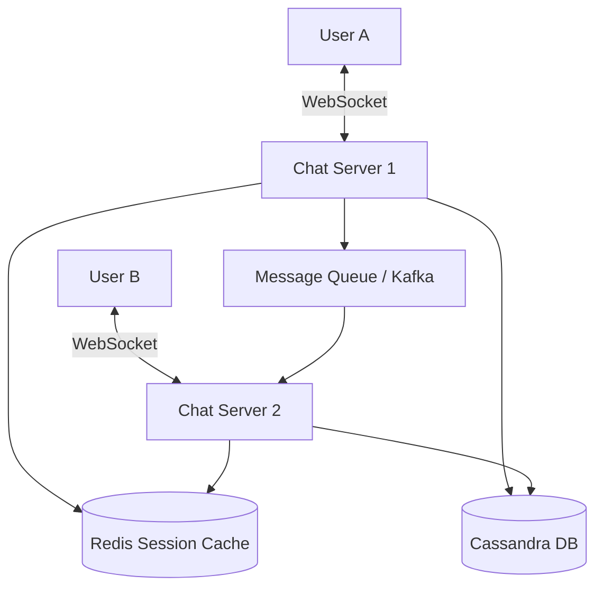

# WhatsApp (Chat Application)

## Introduction
WhatsApp is a real-time messaging application used by billions of users worldwide. Designing a chat application at this scale involves handling persistent connections, guaranteeing message delivery, managing read receipts, and ensuring ultra-low latency across global networks.

## Problem Statement
Traditional HTTP follows a request-response model where the client must constantly "pull" data from the server. For a chat app, users expect messages to be "pushed" to their device the millisecond they are sent by a friend. Polling the server every second for new messages would instantly crash the infrastructure under the weight of billions of empty HTTP requests.

## Functional Requirements
1. Support 1-on-1 private messaging in real-time.
2. Support group chats (up to 256 or more users).
3. Display online/offline status.
4. Support message states: Sent, Delivered, Read (the famous single, double, and blue ticks).
5. Store chat history so it can be viewed across devices (Note: WhatsApp historically only stored messages until delivered, but modern versions support multi-device history via encrypted sync).

## Non-Functional Requirements
1. **Low Latency:** Messages must be delivered in real-time.
2. **High Availability:** The system cannot go down, though slight delays in message delivery during extreme spikes are tolerable (eventual consistency).
3. **Scalability:** Must support 2 Billion+ active users and 100 Billion+ messages per day.
4. **Ordering:** Messages must appear in the exact order they were sent.

## Capacity Estimation
- **Users:** 2 Billion DAU (Daily Active Users).
- **Connections:** If 10% are online concurrently, we need to handle 200 Million concurrent open connections.
- **Message Rate:** 100 Billion messages / day ≈ 1.2 Million messages / second.
- **Storage:** If an average message is 100 bytes, 100B msgs * 100 bytes = 10 TB of new text data *per day*.

## System APIs
We use **WebSockets** for real-time bidirectional communication rather than standard HTTP.

However, standard HTTP APIs are used for initial login and media uploads:
`POST /api/v1/auth/login`
`POST /api/v1/media/upload` (Returns a media URL to be sent via WebSocket).

## Core Architecture (WebSockets)
To maintain 200 Million concurrent connections, standard API servers (like Tomcat or Node.js instances) will fail because they assign a heavy thread per connection. 
We must use highly concurrent languages (Erlang/Elixir, Go) and non-blocking I/O (epoll/kqueue) to maintain hundreds of thousands of open WebSocket connections per server. WhatsApp famously uses **Erlang** to handle millions of connections on a single machine.

### The Chat Servers
When User A opens the app, they establish a persistent WebSocket connection to a specific Chat Server (e.g., Server #42). The connection stays open indefinitely.

## Internal working / Mermaid diagram

## Step-by-step Message Flow (1-on-1)
1. User A is connected to Chat Server 1. User B is connected to Chat Server 2.
2. User A sends "Hello" via WebSocket to Chat Server 1.
3. Chat Server 1 receives the message and immediately responds with a "Sent" tick to User A.
4. Chat Server 1 saves the message to the Database (Cassandra) to ensure it isn't lost.
5. Chat Server 1 queries the **Session Cache** (Redis) to find out which server User B is currently connected to.
6. The Cache replies: "User B is on Chat Server 2."
7. Chat Server 1 forwards the message to Chat Server 2 (often via a Message Queue or direct internal RPC).
8. Chat Server 2 pushes the message down the open WebSocket to User B.
9. User B's device acknowledges receipt. Chat Server 2 sends an ack back to Chat Server 1, which pushes a "Delivered" (double tick) to User A.

### What if User B is Offline?
At Step 6, the Session Cache replies: "User B is Offline."
Chat Server 1 simply saves the message to the database and stops. When User B eventually comes online and connects to a Chat Server, that server queries the database: "Give me all unread messages for User B," and pushes them down the socket.

## Database Design
We need a database that can handle an incredibly high write throughput (1.2M writes/sec) and fast sequential reads.
**Apache Cassandra** or **HBase** (Wide-Column NoSQL) is the standard choice.

**Table: Messages**
- `chat_id` (Partition Key) - Identifies the 1-on-1 chat or Group.
- `message_id` (Clustering Key) - A TimeUUID to ensure chronological sorting.
- `sender_id`
- `content`
- `status` (Sent, Delivered, Read)

By partitioning by `chat_id` and clustering by time, retrieving the last 50 messages of a conversation is a single, lightning-fast sequential disk read.

## Handling Group Chats
If User A sends a message to a group of 100 people:
1. The message goes to Chat Server 1.
2. A **Group Message Handler** service looks up the 100 members of the group.
3. It fans out the message to all Chat Servers currently hosting those 100 members.
4. *Trade-off:* For a group of 100,000 people, this fan-out creates a massive spike in internal network traffic. (This is why WhatsApp limits group sizes, while Telegram uses a different pub/sub architecture to handle massive channels).

## Online Status (Last Seen)
Updating "User is typing..." or "Online" status to the database for 2 billion users would destroy the database.
Instead, presence indicators are ephemeral. 
- When User A opens the app, their Chat Server pushes an "Online" event to a Redis Pub/Sub channel.
- Only the friends who are *currently looking at User A's profile* are subscribed to that specific channel to receive the update.
- If no one is looking, the event is simply dropped.

## Scaling Strategy
- **Connection Management:** Put a WebSocket Load Balancer at the edge. When a user connects, the LB hashes their User ID to route them to a specific Chat Server, or simply assigns them to the server with the lowest connection count.
- **Message Queues:** Use Kafka to decouple the Chat Servers from the Database, ensuring spikes in message volume don't overwhelm the Cassandra cluster.

## Failure Handling
- **Server Crash:** If Chat Server 1 dies, 500,000 users drop offline simultaneously. Their apps automatically attempt to reconnect. The Load Balancer routes them to surviving servers.
- **Message Reliability:** Every message must be acknowledged (ACK) by the client. If the server doesn't receive an ACK, it assumes the message was dropped and resends it upon the next successful connection.

## Summary
Building WhatsApp requires shifting away from standard HTTP to persistent WebSockets to achieve true real-time push capabilities. By leveraging highly concurrent servers, a fast Session Cache to locate users, and a heavy-write NoSQL database like Cassandra, the architecture can support the immense throughput of global communication.

## Related topics
- WebSockets vs HTTP/Long Polling
- [NoSQL / Wide-Column Databases](../databases/nosql)
- [Kafka](../messaging/kafka)
