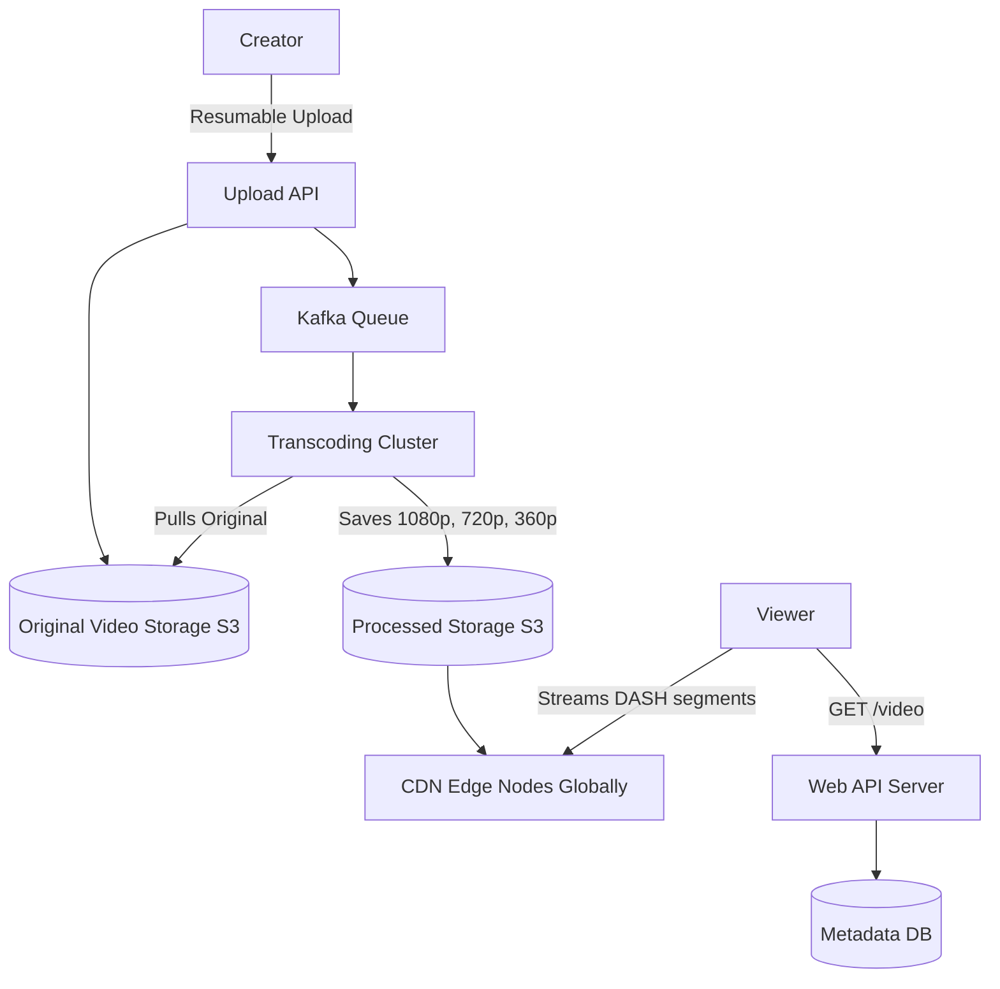

# YouTube (Video Streaming Platform)

## Introduction
YouTube is the world's largest video-sharing platform. Designing it requires solving two massive challenges simultaneously: accepting gigabytes of video uploads continuously, and streaming terabytes of video globally to millions of concurrent users without buffering.

## Problem Statement
A single raw 4K video upload can be dozens of gigabytes. If a user tries to stream that raw file directly from a server in California to a mobile phone in India over a 3G network, it will fail or buffer infinitely. The system must process the video into multiple resolutions and formats, and geographically distribute those files close to the end users.

## Why this exists
To enable high-throughput video ingestion, CPU-heavy transcode pipelines, and low-latency global delivery of media assets to highly diverse client devices under varying network bandwidths.

## Real-world analogy
Imagine a book publisher. The author writes a single manuscript in one language. If the publisher printed only one massive copy and forced everyone in the world to travel to a single library to read it, it would fail. Instead, the publisher translates the book into different languages, formats it as hardcover, paperback, and e-book, and prints millions of copies to stock local bookstores globally.

## Definition
A video streaming and hosting platform that utilizes chunked ingestion, asynchronous transcode workers, and adaptive bitrate delivery via Content Delivery Networks (CDNs).

## Functional Requirements
1. Users can upload videos.
2. Users can view videos.
3. Users can search for videos.
4. Users can like, dislike, and comment on videos.
5. System must record view counts.

## Non-Functional Requirements
1. **High Availability:** Streaming must rarely fail.
2. **Low Latency:** Videos must start playing in under 1 second.
3. **No Buffering:** Smooth playback across varying internet speeds (Adaptive Bitrate).
4. **Scalability:** Handle 500+ hours of video uploaded every minute and billions of daily views.

## Capacity Estimation
- **DAU:** 2 Billion users.
- **Uploads:** 500 hours/minute = 30,000 hours/hour.
- **Storage:** If 1 hour of processed video (across 5 resolutions) takes 10 GB: 30,000 * 10 GB = **300 TB** of new storage required *per hour*.

---

## Python/Java implementation

Below is a Java simulation of the View Count Aggregator.

### Java Implementation

#### Bad implementation
*Directly updating the database with a SQL query on every single video view. Under high concurrent traffic (such as a viral video), this locks database rows and crashes the cluster.*

```java
import java.sql.Connection;
import java.sql.PreparedStatement;

// BAD: Direct Database Write on every event.
// Row-locking bottlenecks on hot videos immediately crash the database cluster.
public class DirectViewIncrementer {

    public void recordView(String videoId, Connection dbConn) throws Exception {
        // VULNERABILITY: Every client hit directly executes an update query.
        // Causes intense database row-locking locks on viral videos.
        String query = "UPDATE videos SET views = views + 1 WHERE video_id = ?";
        try (PreparedStatement ps = dbConn.prepareStatement(query)) {
            ps.setString(1, videoId);
            ps.executeUpdate();
        }
    }
}
```

#### Better implementation
*Using an in-memory queue to decouple the request thread from database writes, processing view increments sequentially. This removes the request block but still floods the database with single update queries.*

```java
import java.util.concurrent.BlockingQueue;
import java.util.concurrent.LinkedBlockingQueue;

// BETTER: Queue-based asynchronous worker.
// Decouples write latency from the request thread, but still executes individual writes.
public class QueueViewIncrementer {
    private final BlockingQueue<String> viewQueue = new LinkedBlockingQueue<>();
    private final DatabaseMock db = new DatabaseMock();

    public QueueViewIncrementer() {
        // Background daemon thread executing queue events
        Thread worker = new Thread(() -> {
            while (true) {
                try {
                    String videoId = viewQueue.take();
                    db.incrementView(videoId); // VULNERABILITY: Floods DB with individual updates
                } catch (InterruptedException e) {
                    Thread.currentThread().interrupt();
                    break;
                }
            }
        });
        worker.setDaemon(true);
        worker.start();
    }

    public void recordView(String videoId) {
        viewQueue.offer(videoId);
    }

    static class DatabaseMock {
        public void incrementView(String id) {
            // SQL Update execution...
        }
    }
}
```

#### Best implementation
*A thread-safe View Count Batch Aggregator. Views are cached in-memory inside a concurrent map and aggregated over a rolling window. A background thread flushes the consolidated increments to the database in batches using single transactional updates.*

```java
import java.util.HashMap;
import java.util.Map;
import java.util.concurrent.ConcurrentHashMap;
import java.util.concurrent.Executors;
import java.util.concurrent.ScheduledExecutorService;
import java.util.concurrent.TimeUnit;
import java.util.concurrent.atomic.LongAdder;

// BEST: In-Memory Aggregating Batch Flusher
public class BatchViewCountAggregator {
    // Concurrent map using LongAdder for lock-free counters
    private final ConcurrentHashMap<String, LongAdder> viewCounterMap = new ConcurrentHashMap<>();
    private final DatabaseWriter dbWriter = new DatabaseWriter();
    private final ScheduledExecutorService scheduler = Executors.newSingleThreadScheduledExecutor();

    public BatchViewCountAggregator() {
        // Flush in-memory aggregations to the DB every 5 seconds
        scheduler.scheduleAtFixedRate(this::flushToDatabase, 5, 5, TimeUnit.SECONDS);
    }

    // High-Throughput Ingestion (called by API threads)
    public void recordView(String videoId) {
        viewCounterMap.computeIfAbsent(videoId, k -> new LongAdder()).increment();
    }

    // Aggregated Batch Flush Execution
    private synchronized void flushToDatabase() {
        if (viewCounterMap.isEmpty()) return;

        // Snapshot current aggregations and clear maps
        Map<String, Integer> batchSnapshot = new HashMap<>();
        viewCounterMap.forEach((videoId, adder) -> {
            long count = adder.sumThenReset();
            if (count > 0) {
                batchSnapshot.put(videoId, (int) count);
            }
        });

        // Perform single batch SQL transaction
        if (!batchSnapshot.isEmpty()) {
            dbWriter.writeBatch(batchSnapshot);
        }
    }

    public void shutdown() {
        scheduler.shutdown();
        flushToDatabase(); // Final flush
    }

    static class DatabaseWriter {
        public void writeBatch(Map<String, Integer> batch) {
            System.out.println("--- DB Batch Update Write ---");
            batch.forEach((videoId, viewsAdded) -> {
                // Prepares consolidated SQL statements: 
                // e.g. "UPDATE videos SET views = views + ? WHERE video_id = ?"
                System.out.println("DB -> Video [" + videoId + "] + " + viewsAdded + " views");
            });
        }
    }
}
```

---

## Core Architecture (The Video Pipeline)

### 1. Upload Flow
Uploading massive files via standard HTTP is fragile. If the connection drops at 99%, restarting is painful.
- Clients use **Chunked Resumable Uploads**. The video is split into 10 MB chunks and sent sequentially. If chunk 4 fails, only chunk 4 is retried.
- Uploads hit the **Original Storage** (AWS S3 or Google Cloud Storage).
- A message is published to a Message Queue (Kafka): "New video uploaded. Needs processing."

### 2. Processing (Transcoding) Flow
- A cluster of **Transcoding Workers** picks up the message from Kafka.
- They download the original video and encode it into multiple formats (MP4, WebM) and multiple resolutions (144p, 360p, 720p, 1080p, 4K).
- They also extract thumbnails and generate closed captions.
- The transcoded chunks are saved to the **Processed Storage**.

### 3. Streaming Flow
We do NOT stream video via standard HTTP file downloads. We use adaptive streaming protocols like **DASH (Dynamic Adaptive Streaming over HTTP)** or **HLS (HTTP Live Streaming)**.
- The transcoded video is divided into 5-second segments.
- The video player requests segments one by one.
- *Adaptive Bitrate:* If the user's internet is fast, the player requests the 1080p segment. If they drive into a tunnel and internet drops, the player seamlessly requests the next segment in 144p.

## Internal working / Mermaid diagram



## System APIs
- `POST /api/v1/videos/upload` (Returns upload session ID for chunked transfers)
- `GET /api/v1/videos/{video_id}` (Returns metadata and the DASH/HLS manifest URL)
- `POST /api/v1/videos/{video_id}/views` (Ingests view event asynchronously)

## Database Design
1. **Video Storage (Blob):** Google Cloud Storage or S3 for binary data.
2. **Metadata DB (Relational/NoSQL):** PostgreSQL or MySQL for user data, video title, description, and tags. This must be heavily sharded by `video_id`.
3. **Graph DB / Wide-Column:** For managing the social graph (Subscribers) and recommendations.

## Caching Strategy
- **Video Segments Caching:** Processed segments are cached at Edge PoPs (CDNs) around the world.
- **Cache Eviction:** Popular videos (top 20%) are held in hot caches. Unpopular videos (long tail) are evicted to cold storage (HDD arrays) and fetched only on demand.

## Scaling Strategy
- **Global CDNs:** Offload 99% of read traffic from origin servers by caching segments locally at edge nodes.
- **Asynchronous Transcode Workers:** Auto-scale workers based on queue length. Long videos are split into segments, transcoded in parallel across different machines, and reassembled.

## Bottlenecks & Trade-offs
- **Storage Cost vs Compute Cost:** Saving a video in 10 different formats takes massive storage. The trade-off is higher storage cost in exchange for lower compute cost during streaming (no on-the-fly transcoding) and a vastly improved user experience.

## Failure Handling
- **Transcode Worker Crashes:** Tasks are managed via message queues (Kafka). If a worker crashes mid-task, the message is not acknowledged and is automatically re-queued for another worker.

## Pros
- Seamless user experience under varying bandwidths via Adaptive Bitrate (ABR).
- High availability via decentralized CDN endpoints.
- Low write contention on views via stream aggregation.

## Cons
- High storage redundancy due to multiple output formats and resolutions.
- High compute overhead for 4K video transcoding.

## Interview questions

### Beginner
- **Q: Why does YouTube divide video files into 5-second segments instead of streaming a single file?**
  - **A:** It enables Adaptive Bitrate streaming. The player can dynamically request higher or lower resolution segments depending on the user's changing network speed without interrupting playback.
- **Q: What is a CDN, and why is it essential for YouTube?**
  - **A:** A CDN (Content Delivery Network) is a network of servers that cache content close to the user. It is essential because streaming 4K video from a central server to users worldwide would saturate the network and cause massive buffering.

### Intermediate
- **Q: How does YouTube handle view counts for viral videos without crashing the database?**
  - **A:** The system does not write to the database on every view. View events are sent to a queue (like Kafka) and aggregated in-memory over a rolling time window. The server then writes the combined updates (e.g., +10,000 views) to the database in a single batch, reducing write locks.
- **Q: Why are chunked uploads used for videos?**
  - **A:** Video files are huge. Sending them in a single HTTP request is risky; a network drop requires restarting the entire upload. Chunked uploads break the file into small pieces, allowing the client to resume from the last successful chunk.

### Senior
- **Q: How does the system transcode a 2-hour long video quickly?**
  - **A:** The original video is split into smaller segments (e.g., 5-minute segments) at keyframes. These segments are processed in parallel across a cluster of transcoding workers. Once all segments are finished, they are stitched back together to form the final video manifest.

### Staff Engineer
- **Q: How would you design a real-time recommendation feed for YouTube that serves personalized videos to 1 billion DAU under 100ms?**
  - **A:** 
    1. **Two-Tower Neural Network Model:** Use a candidate generation tower to retrieve hundreds of videos (based on history, search, and demographics) and a ranking tower to score them.
    2. **Candidate Generation (Retrieve):** Query a fast approximate nearest neighbor (ANN) search index (like Milvus or Faiss) using user embedding vectors to fetch candidates in under 10ms.
    3. **Ranking (Filter & Score):** Send candidate metadata to a distributed inference service (e.g. Triton Inference Server) to calculate scores, taking user feedback, age, and freshness into account.
    4. **Offline Processing:** Pre-compute base user embeddings using Spark/Flink pipelines and stream fresh updates to a Redis feature store.

## Common mistakes
- **Executing DB updates directly on every view event:** Causing row locks on database tables.
- **Performing on-the-fly transcoding during user playback:** Consuming massive CPU resources on read requests.

## Best practices
- Enforce segment caching on global CDNs.
- Partition databases by video ID to scale horizontally.
- Run transcoding pipelines asynchronously using queue workers.

## When NOT to use
- Do not build a complex transcoding pipeline if you are building an internal company portal with few, small videos; simple direct file hosting on S3 is sufficient.

## Comparison with similar concepts
- **HLS vs DASH:** Both are adaptive bitrate streaming protocols. HLS was created by Apple and is widely supported on iOS/macOS. DASH is an international open standard that works well on Android and web players.

## Summary
YouTube is essentially a massive data ingestion, CPU-heavy transcoding, and globally distributed CDN architecture. By utilizing adaptive bitrate streaming (DASH/HLS), chunked uploads, and aggressive edge caching, the system guarantees smooth playback for billions of users across highly variable network conditions.

## Related topics
- [CDN](../caching/cdn)
- [Kafka](../messaging/kafka)
- [Netflix](./netflix)
