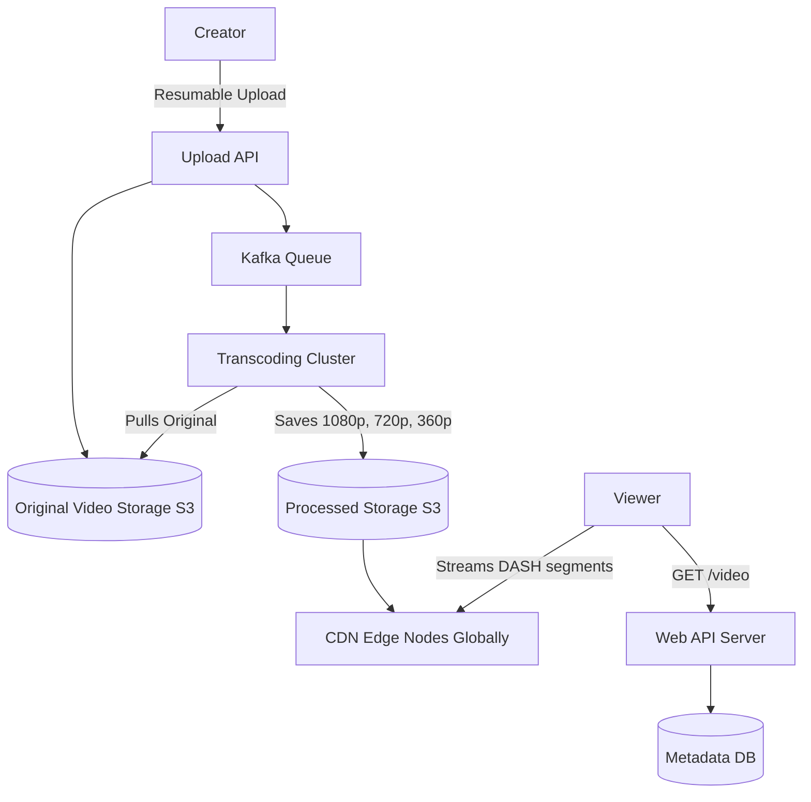

# YouTube (Video Streaming Platform)

## Introduction
YouTube is the world's largest video-sharing platform. Designing it requires solving two massive challenges simultaneously: accepting gigabytes of video uploads continuously, and streaming terabytes of video globally to millions of concurrent users without buffering.

## Problem Statement
A single raw 4K video upload can be dozens of gigabytes. If a user tries to stream that raw file directly from a server in California to a mobile phone in India over a 3G network, it will fail or buffer infinitely. The system must process the video into multiple resolutions and formats, and geographically distribute those files close to the end users.

## Functional Requirements
1. Users can upload videos.
2. Users can view videos.
3. Users can search for videos.
4. Users can like, dislike, and comment on videos.
5. System must record view counts.

## Non-Functional Requirements
1. **High Availability:** Streaming should rarely fail.
2. **Low Latency:** Videos must start playing almost instantly.
3. **No Buffering:** Smooth playback across varying internet speeds.
4. **Scalability:** Must handle 500+ hours of video uploaded *every minute*, and billions of views per day.

## Capacity Estimation
- **DAU:** 2 Billion users.
- **Uploads:** 500 hours/minute = 30,000 hours/hour.
- **Storage:** If 1 hour of processed video (across 5 resolutions) takes 10 GB: 30,000 * 10 GB = **300 TB** of new storage required *per hour*.

## Core Architecture (The Video Pipeline)

### 1. Upload Flow
Uploading a massive file via HTTP is fragile. If the connection drops at 99%, restarting is painful.
- Clients use **Chunked Resumable Uploads**. The 10 GB file is broken into 10 MB chunks and sent sequentially. If chunk 4 fails, only chunk 4 is retried.
- Uploads hit the **Original Storage** (AWS S3 or Google Cloud Storage).
- A message is published to a Message Queue (Kafka): "New video uploaded. Needs processing."

### 2. Processing (Transcoding) Flow
- A cluster of **Transcoding Workers** picks up the message.
- They download the original video and encode it into multiple formats (MP4, WebM) and multiple resolutions (144p, 360p, 720p, 1080p, 4K).
- They also extract thumbnails and generate closed captions.
- The transcoded chunks are saved to the **Processed Storage**.

### 3. Streaming Flow
We do NOT stream video via standard HTTP file downloads. We use adaptive streaming protocols like **DASH (Dynamic Adaptive Streaming over HTTP)** or **HLS (HTTP Live Streaming)**.
- The transcoded video is divided into 5-second segments.
- The video player requests segments one by one.
- *Adaptive Bitrate:* If the user's internet is fast, the player requests the 1080p segment. If they drive into a tunnel and internet drops, the player seamlessly requests the next segment in 144p.

## Internal working / Mermaid diagram

## System APIs
`POST /api/v1/videos/upload`
`GET /api/v1/videos/{video_id}` (Returns metadata and CDN URLs for the DASH manifest)
`POST /api/v1/videos/{video_id}/views`

## Database Design
1. **Video Storage (Blob):** Google Cloud Storage or S3 for binary data.
2. **Metadata DB (Relational/NoSQL):** PostgreSQL or MySQL for user data, video title, description, and tags. This must be heavily sharded by `video_id`.
3. **Graph DB / Wide-Column:** For managing the social graph (Subscribers) and recommendations.

## Handling View Counts
Updating a MySQL row `UPDATE video SET views = views + 1` a million times a second for a viral video will lock the database and crash it.
- **Solution:** Batching.
- Every time a user views a video, an event is sent to Kafka.
- A Stream Processor (like Apache Flink or Spark) aggregates the views over a 10-second window.
- It writes the aggregated result (`+50,000 views`) to the Database once every 10 seconds.

## Scaling Strategy
- **Content Delivery Network (CDN):** The entire streaming architecture relies on CDNs. The processed video segments are pushed to PoPs (Points of Presence) around the world. A user in Tokyo downloads the video from a server in Tokyo, not California.
- **Transcoding Cluster:** Transcoding is intensely CPU-heavy. The cluster must auto-scale massively based on the length of the Kafka upload queue.

## Bottlenecks & Trade-offs
- **Storage Cost vs Compute Cost:** Saving a video in 10 different formats takes massive storage. The trade-off is higher storage cost in exchange for lower compute cost during streaming (no on-the-fly transcoding) and a vastly improved user experience.
- **Popular vs Unpopular Content:** 20% of videos drive 80% of traffic. We aggressively cache viral videos on edge CDN nodes. A video with 10 views from 5 years ago is NOT cached on the CDN edge; it is retrieved directly from slow, cheap, deep-tier storage (like Amazon S3 Glacier or HDD arrays) when requested.

## Summary
YouTube is essentially a massive data ingestion, CPU-heavy transcoding, and globally distributed CDN architecture. By utilizing adaptive bitrate streaming (DASH/HLS), chunked uploads, and aggressive edge caching, the system guarantees smooth playback for billions of users across highly variable network conditions.

## Related topics
- [CDN](../caching/cdn)
- [Kafka](../messaging/kafka)
- [Netflix](./netflix)
