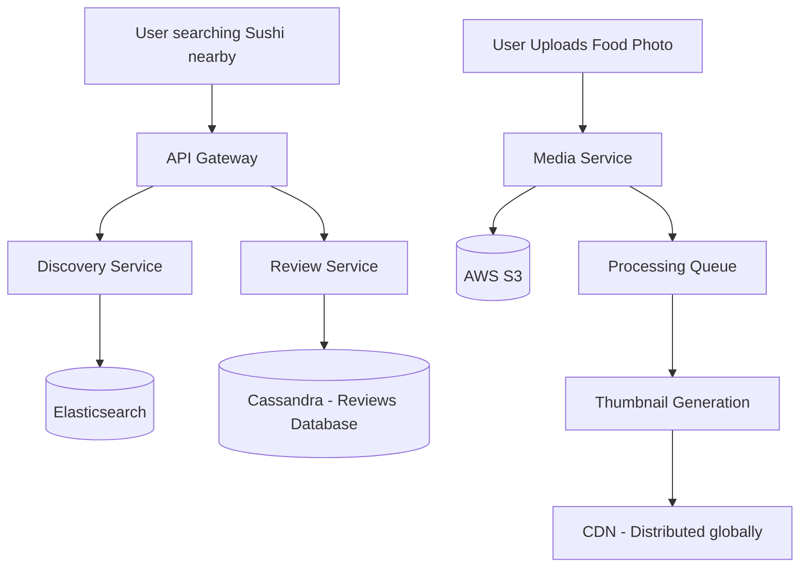

# Zomato (Restaurant Discovery & Review Platform)

## Introduction
Zomato is a restaurant discovery, review, and food delivery platform. While its delivery logistics mirror Swiggy/DoorDash, Zomato's core differentiator is its discovery search engine, which hosts millions of crowdsourced reviews, photos, ratings, and menus globally.

## Problem Statement
Serving millions of unstructured reviews, high-resolution food images, and search requests requires optimizing read performance. Querying database rows on the fly to calculate average ratings or fetch photos on every page load would crash database clusters under heavy traffic. Additionally, crowdsourced platforms must filter out fake review spam in real-time.

## Why this exists
To enable fast, personalized restaurant discovery, handle high-volume user-generated content (UGC), and maintain rating integrity without impacting client response times.

## Real-world analogy
Imagine a tour guide handbook for a city. If the writer of the handbook had to interview every traveler on the street to calculate a restaurant's average rating every time a tourist opened the book (Dynamic calculations), the process would fail. Instead, the author interviews travelers periodically, prints the pre-calculated score (e.g., 4.5 Stars) in the book, and prints copies to distribute locally (CDN/Cache).

## Definition
A hyper-local restaurant discovery and review system utilizing geo-distributed search indexes (Elasticsearch), pre-aggregated ratings, and asynchronous spam-filtering pipelines.

## Functional Requirements
1. Users can search for restaurants by name, cuisine, location, and features (e.g. outdoor seating).
2. Users can view restaurant details, photos, and menus.
3. Users can write reviews and rate restaurants (1 to 5 stars).
4. System must display pre-aggregated average ratings.

## Non-Functional Requirements
1. **Low Latency:** Restaurant search and profile pages must load in under 100ms.
2. **Eventual Consistency:** Ratings updates can take a few minutes to propagate.
3. **High Availability:** Browsing and searching must remain operational during write outages.
4. **Content Integrity:** Fake reviews and spam must be detected and filtered.

## Capacity Estimation
- **DAU:** 30 Million users.
- **Photos:** 5 Million photos uploaded per day.
- **Reviews:** 2 Million reviews submitted per day.
- **Reads:** 100 Million restaurant searches and page views per day.

---

## Python/Java implementation

Below is a Java simulation of the Review Aggregator and Spam Filter.

### Java Implementation

#### Bad implementation
*Calculating average ratings dynamically using SQL query runs on every read request. This causes high CPU load and table scans.*

```java
import java.sql.Connection;
import java.sql.PreparedStatement;
import java.sql.ResultSet;

// BAD: Dynamic database rating aggregation on every read.
// Causes high CPU load and table scans on popular restaurants.
public class NaiveRatingCalculator {

    public double getAverageRating(String restaurantId, Connection dbConn) throws Exception {
        // VULNERABILITY: Scanning all review rows for a restaurant on every profile page hit.
        String query = "SELECT AVG(rating) FROM reviews WHERE restaurant_id = ?";
        try (PreparedStatement ps = dbConn.prepareStatement(query)) {
            ps.setString(1, restaurantId);
            try (ResultSet rs = ps.executeQuery()) {
                if (rs.next()) {
                    return rs.getDouble(1);
                }
            }
        }
        return 0.0;
    }
}
```

#### Better implementation
*Updating the average rating synchronously on the write path. This makes reads O(1), but blocks the review submission thread and causes write locks.*

```java
// BETTER: Synchronous pre-calculation on write.
// Reads are fast, but the user's thread is blocked waiting for database row locks to update the score.
public class SynchronousRatingService {
    private final Map<String, RestaurantStats> statsDb = new HashMap<>();

    public synchronized void submitReview(String restaurantId, int rating) {
        RestaurantStats stats = statsDb.getOrDefault(restaurantId, new RestaurantStats());
        
        // VULNERABILITY: Block-locks the entire write path for this restaurant
        stats.totalReviews++;
        stats.ratingSum += rating;
        stats.avgRating = (double) stats.ratingSum / stats.totalReviews;
        
        statsDb.put(restaurantId, stats);
    }

    static class RestaurantStats {
        int totalReviews = 0;
        int ratingSum = 0;
        double avgRating = 0.0;
    }
}
```

#### Best implementation
*A thread-safe Review Aggregator and Spam Filter. Reviews are ingested into a queue. A spam filter checks review velocity using a sliding window. Valid reviews update the aggregated statistics asynchronously in memory, notifying Elasticsearch listeners.*

```java
import java.util.ArrayList;
import java.util.List;
import java.util.concurrent.BlockingQueue;
import java.util.concurrent.ConcurrentHashMap;
import java.util.concurrent.LinkedBlockingQueue;
import java.util.concurrent.atomic.DoubleAccumulator;
import java.util.concurrent.atomic.LongAdder;

// BEST: Asynchronous Spam Filter & Pre-Aggregated Rating Engine
public class ZomatoReviewProcessor {
    private final BlockingQueue<ReviewEvent> ingestionQueue = new LinkedBlockingQueue<>();
    private final ConcurrentHashMap<String, RestaurantAggregation> ratingCache = new ConcurrentHashMap<>();
    private final ConcurrentHashMap<String, Long> userLastPostTime = new ConcurrentHashMap<>();
    private final List<SearchIndexListener> searchIndexListeners = new ArrayList<>();

    public static class ReviewEvent {
        public final String reviewId;
        public final String restaurantId;
        public final String userId;
        public final int rating;
        public final String text;
        public final long timestamp;

        public ReviewEvent(String rId, String restId, String uId, int rating, String text) {
            this.reviewId = rId; this.restaurantId = restId; this.userId = uId;
            this.rating = rating; this.text = text; this.timestamp = System.currentTimeMillis();
        }
    }

    public static class RestaurantAggregation {
        public final LongAdder totalReviews = new LongAdder();
        public final LongAdder ratingSum = new LongAdder();
        public double cachedAverage = 0.0;

        public synchronized void addRating(int rating) {
            totalReviews.increment();
            ratingSum.add(rating);
            cachedAverage = (double) ratingSum.sum() / totalReviews.sum();
        }
    }

    public interface SearchIndexListener {
        void onRatingUpdate(String restaurantId, double newAverage);
    }

    public ZomatoReviewProcessor() {
        // Start background worker thread to process reviews asynchronously
        Thread processorThread = new Thread(this::processQueue);
        processorThread.setDaemon(true);
        processorThread.start();
    }

    public void registerListener(SearchIndexListener listener) {
        searchIndexListeners.add(listener);
    }

    public void submitReview(ReviewEvent event) {
        ingestionQueue.offer(event); // Instantly return success to client
    }

    private void processQueue() {
        while (true) {
            try {
                ReviewEvent event = ingestionQueue.take();
                
                // 1. Spam Filtering: Rate limiting check (e.g. 1 review per 5 seconds per user)
                Long lastPost = userLastPostTime.get(event.userId);
                if (lastPost != null && (event.timestamp - lastPost < 5000)) {
                    System.out.println("Spam Filter: Rejected review from User [" + event.userId + "] due to velocity limits.");
                    continue; // Skip processing
                }
                userLastPostTime.put(event.userId, event.timestamp);

                // 2. Aggregate Rating in Cache
                RestaurantAggregation agg = ratingCache.computeIfAbsent(event.restaurantId, k -> new RestaurantAggregation());
                agg.addRating(event.rating);
                System.out.println("Aggregated: [" + event.restaurantId + "] Avg Rating -> " + agg.cachedAverage);

                // 3. Notify Search Index Listener (Elasticsearch)
                for (SearchIndexListener listener : searchIndexListeners) {
                    listener.onRatingUpdate(event.restaurantId, agg.cachedAverage);
                }

            } catch (InterruptedException e) {
                Thread.currentThread().interrupt();
                break;
            }
        }
    }
}
```

---

## Core Discovery & Storage Architecture

### 1. Elasticsearch Discovery Engine
Unlike delivery apps, Zomato's primary value proposition is search discovery ("Where should I eat tonight?").
- **Complex Querying:** Users search by location, cuisine, cost, ratings, specific dishes, or attributes ("Pet friendly").
- **Search Boosting:** Elasticsearch boosts search scores dynamically based on user preferences (e.g., boosting vegetarian options if the user is vegetarian).

### 2. User Generated Content (UGC Photos)
- **Object Storage:** Original photos are stored in AWS S3.
- **Image Processing:** A background worker compress photos, generates thumbnails, and applies watermarks.
- **CDN Distribution:** Media files are served via a CDN. Because photos are read-heavy and immutable, CDN cache hit ratios are high.

### 3. Review Database
Reviews and comments are unstructured, massive, and continuously growing.
- We use a NoSQL database like **Cassandra** or **MongoDB**.
- Data is partitioned by `restaurant_id`. Fetching reviews for a restaurant only requires querying a single database partition.

## Internal working / Mermaid diagram



## Step-by-step Review Submission
1. **Submission:** A user writes a review and selects a rating. The request is sent to the Review Service.
2. **Event Queue:** The service publishes a "Review Posted" event to a Kafka topic and immediately returns a success status to the user.
3. **Spam Filtering:** A moderation worker consumes the event and checks for spam metrics (e.g., account age, post velocity, duplicate text).
4. **DB Write:** If approved, the review is written to the Cassandra database.
5. **Rating Aggregator:** An aggregation worker consumes the event, updates the pre-calculated rating in the main restaurant database, and pushes the new score to the Elasticsearch cluster.

## Pros
- Low-latency searches via flat Elasticsearch documents.
- Fast page loads using pre-aggregated ratings.
- Scalable media storage using S3 and CDN caching.

## Cons
- Eventually consistent ratings (takes a few seconds for new reviews to update scores).
- NoSQL reviews make complex transactional analysis difficult.

## Interview questions

### Beginner
- **Q: Why does Zomato use a CDN (Content Delivery Network) for restaurant photos?**
  - **A:** Restaurant photos are large and rarely change. Serving them from a central database is slow. A CDN caches images close to users, reducing download times and database load.
- **Q: What is the benefit of pre-calculating average ratings?**
  - **A:** Calculating average ratings dynamically requires reading all reviews for a restaurant, which is slow. Pre-calculating and storing the average rating allows the page to load instantly.

### Intermediate
- **Q: Why is Elasticsearch preferred over a SQL database for restaurant discovery?**
  - **A:** Discovery queries are complex, involving multiple filters (e.g., location, price, cuisine, rating). Elasticsearch is optimized for full-text search, fuzzy matching, and multi-faceted filtering, returning results in milliseconds.
- **Q: How does Zomato handle review spam and fake reviews?**
  - **A:** Submitted reviews are placed in a queue (Kafka) and analyzed by an asynchronous moderation pipeline. The pipeline checks for anomalies like account creation age, review velocity spikes, and duplicate text before publishing the review.

### Senior
- **Q: How would you shard a review database containing billions of entries?**
  - **A:** Shard the database by `restaurant_id`. Since reviews are almost always queried in the context of a specific restaurant (e.g., "Show reviews for Restaurant A"), grouping all reviews for a restaurant on the same partition avoids cross-shard queries and speeds up reads.

### Staff Engineer
- **Q: Design a real-time recommendation feed for Zomato that ranks nearby restaurants based on current location, past orders, active food trends, and friends' reviews, scaling to 30M DAU.**
  - **A:** 
    1. **Geospatial Filtering:** Query Elasticsearch to retrieve nearby restaurants (within a 5-mile radius).
    2. **Feature Store:** Query a fast cache (Redis) to fetch user features (cuisines ordered, budget tier) and contextual features (time of day, weather).
    3. **Ranking Pipeline:** Send restaurant candidates and features to a machine learning ranking service (e.g. running XGBoost or deep learning models).
    4. **Social Signals:** Query a graph database (FlockDB) to fetch friends' ratings for candidates, boosting their ranking scores. Keep calculations under 100ms using asynchronous parallel RPC calls.

## Common mistakes
- **Executing SQL `AVG()` queries on page load:** Causing slow page loads and database crashes on popular restaurants.
- **Running spam detection synchronously:** Blocking the user's review submission thread.

## Best practices
- Pre-aggregate ratings and update search indexes asynchronously.
- Offload image delivery to CDNs.
- Shard review databases by restaurant ID.

## When NOT to use
- Do not build a complex discovery engine if building a simple website for a single restaurant; a basic SQL database is sufficient.

## Comparison with similar concepts
- **Discovery DB vs Transactional DB:** Zomato's discovery DB (Elasticsearch) is optimized for read queries and complex filtering (eventually consistent). Zomato's transaction DB (MySQL) is optimized for write consistency during checkout.

## Summary
While its delivery infrastructure mirrors Swiggy/DoorDash, Zomato's discovery engine relies on a robust Elasticsearch cluster for complex, personalized geospatial searching, aggressive CDN caching for millions of user-uploaded photos, and asynchronous processing to maintain aggregate ratings and filter spam without impacting the user's browsing experience.

## Related topics
- [Swiggy / DoorDash](./swiggy)
- [Elasticsearch / Indexing](../databases/indexing)
- [CDN](../caching/cdn)
