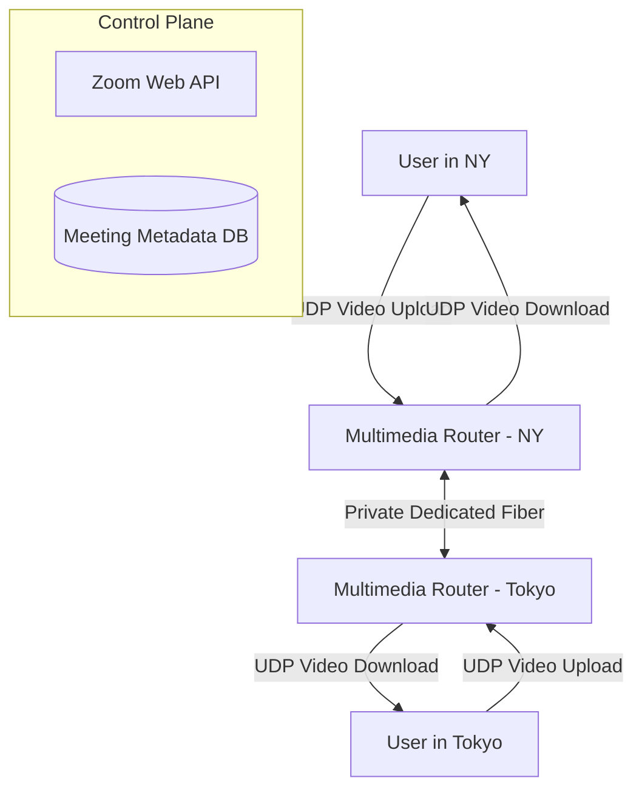

# Zoom (Video Conferencing)

## Introduction
*Note: The audio/video routing architecture of Zoom is heavily related to [Discord](../discord). Both rely on SFUs (Selective Forwarding Units) to handle group calls.*

Zoom is an enterprise-grade video conferencing platform. During the 2020 pandemic, Zoom scaled from 10 million daily meeting participants to over 300 million in a matter of weeks, proving the extreme elasticity of its architecture.

## Problem Statement
Video conferencing requires massive bandwidth and incredibly low latency. A delay of more than 150ms makes human conversation awkward. The system must route high-definition video from 50+ participants to each other in real-time, across disparate global networks, firewalls, and corporate proxies.

## Key Differences from Consumer Chat Apps

### 1. WebRTC vs Proprietary Protocols
Unlike Discord or Google Meet which rely heavily on standard browser WebRTC, Zoom built its own proprietary multimedia routing protocol optimized for video. 
- *Why?* WebRTC is peer-to-peer focused and historically struggled with varying network conditions across different devices. Zoom's custom protocol (which runs over UDP with TCP fallbacks) allows them tight control over packet loss recovery, variable bitrates, and firewall traversal.

### 2. Global Multimedia Routing (The Zoom Cloud)
When you start a Zoom meeting in New York, and someone joins from Tokyo:
- Zoom does not route the video packets over the unpredictable public internet backbone.
- Zoom maintains a massive private global network of **Multimedia Routers (MMRs)**.
- The user in Tokyo connects to an MMR in Tokyo. The user in NY connects to an MMR in NY.
- The two MMRs communicate over dedicated, highly optimized, private fiber-optic lines. This guarantees QoS (Quality of Service) and minimizes latency.

## Internal working / Mermaid diagram

## Scalability and the Cloud Model
Zoom separates its architecture into two distinct planes:

1. **Control Plane (Web / Metadata):**
   Handles user login, meeting scheduling, billing, and generating meeting links. This runs on traditional cloud providers like AWS and Oracle Cloud. It is a standard RESTful, stateless microservice architecture that auto-scales easily.

2. **Data Plane (Multimedia Routers):**
   Handles the actual raw video/audio packets. This requires massive raw bandwidth. Zoom runs its own data centers globally, but during the pandemic, they rapidly spilled over into AWS and Oracle Cloud, spinning up thousands of EC2 instances to act as temporary MMRs.

## The SFU (Selective Forwarding Unit)
Like Discord, Zoom uses an SFU architecture.
- When 100 people are in a Zoom call, the server does not stitch 100 videos into a single 4K stream (MCU architecture).
- Instead, the server receives 100 separate video streams and forwards them to the clients.
- **Adaptive Bitrate:** The magic of Zoom is that your client uploads multiple versions of your video (e.g., 1080p, 720p, 360p) simultaneously. 
- The Zoom Server monitors the bandwidth of everyone in the meeting. If User B is on a bad 3G connection on a mobile phone, the Zoom server intelligently only forwards the 360p version to User B, while forwarding the 1080p version to User C who is on fiber internet.

## Security (End-to-End Encryption)
Historically, Zoom decrypted the video streams at the MMR servers to perform the adaptive bitrate selection and routing (Client-to-Server encryption).
- Under pressure for enterprise security, Zoom implemented true **E2EE (End-to-End Encryption)**.
- In true E2EE, the video is encrypted on the sender's laptop and can only be decrypted on the receiver's laptop. The Zoom servers are blind; they just route encrypted blobs.
- *Trade-off:* True E2EE means the server cannot process the video (e.g., it cannot provide cloud recording, and adaptive server-side bitrate manipulation becomes much harder).

## Summary
Zoom's unprecedented success comes from its obsessive focus on the Data Plane. By building a proprietary video protocol over UDP, utilizing adaptive bitrate SFUs, and maintaining a dedicated global network of Multimedia Routers, Zoom ensures enterprise-grade video quality regardless of the user's location or internet connection.

## Related topics
- [Discord (Voice & SFUs)](../discord)
- [WebSockets & UDP](../../fundamentals/websockets)
