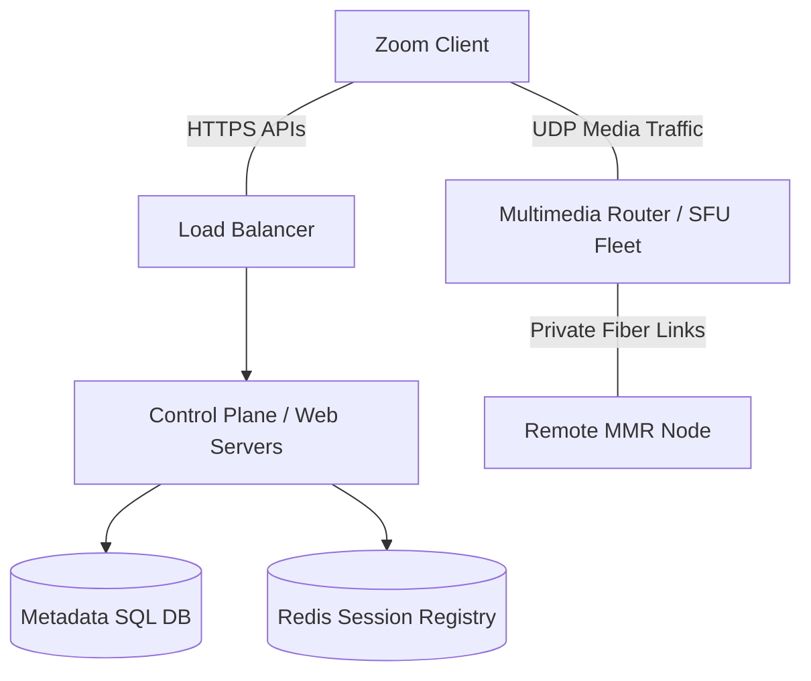
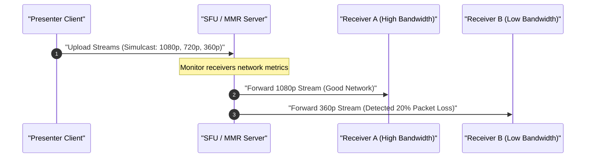

# Zoom (Video Conferencing)

## Introduction
Zoom is an enterprise-grade video conferencing platform designed to host meetings with up to 1,000 interactive video participants and 10,000 view-only attendees. Scaling real-time video streaming requires routing high-definition audio and video streams across unpredictable public networks, firewalls, and corporate proxies while maintaining a sub-150ms round-trip latency.

## Problem Statement
Scale a global real-time video conferencing system to support:
- **Massive elastic demand spikes** (e.g., scaling from 10M to 300M daily participants).
- **Graceful degradation** of video quality during poor network conditions.
- **Low latency media delivery** (under 150ms) across continents.
- **Firewall traversal** to ensure enterprise corporate environments can join calls securely.

## Why this exists
Standard browser WebRTC works well for small groups but gets expensive for large meetings due to CPU and bandwidth limits on client devices in peer-to-peer (P2P) mesh setups. Mixing video streams on the server (MCU) scales client bandwidth but is too CPU-heavy for the server and limits client layout control. A custom Selective Forwarding Unit (SFU) combined with adaptive bitrate streaming is required to scale large video calls efficiently.

## Real-world analogy
Think of Zoom's system like a **smart logistics distribution center**. Instead of every supplier driving packages directly to every customer's home individually (Mesh/P2P), or a factory combining all products into a single pre-packaged gift basket (MCU), suppliers send their goods in different sizes (1080p, 720p, 360p) to the distribution center (SFU). The distribution center looks at the size of each customer's driveway (bandwidth capacity) and sends the largest package that fits.

## Definition
Zoom is a **distributed video conferencing system** that uses a proprietary UDP-based media routing protocol, global Multimedia Routers (MMRs), Selective Forwarding Units (SFUs), and server-guided adaptive bitrate adaptation to provide real-time audio and video communications.

## Key concepts
- **Multimedia Router (MMR):** Geographically distributed data-plane servers that route and forward audio/video packets.
- **Selective Forwarding Unit (SFU):** A router that receives video streams of different qualities from a sender and forwards the appropriate stream to each receiver based on their bandwidth.
- **Simulcast:** A technique where a client uploads the same video stream at multiple resolutions (e.g., high, medium, low) simultaneously to the server.
- **Quality of Service (QoS):** Network mechanisms that manage packet loss, jitter, and bandwidth to prioritize critical audio and video packets.
- **ICE/STUN/TURN:** Protocols used to discover public IP addresses and traverse firewalls during connection setup.

## Requirements

### Functional Requirements
1. Users can create, schedule, join, and leave video meetings via links.
2. Users can share screen, video, and audio in real-time.
3. System supports gallery view, speaker view, and screen share overlays.
4. Users can chat via text and record meetings (local and cloud).

### Non-Functional Requirements
1. **Ultra-Low Latency:** End-to-end video delay must be under 150ms.
2. **Quality Adaptation:** Smoothly degrade to audio-only if network quality drops, avoiding disconnected calls.
3. **High Scalability:** Support up to 1,000 active video streams in a single meeting room.
4. **Elasticity:** Dynamically scale MMR nodes in public clouds (AWS, Oracle Cloud) to handle traffic surges.

## Capacity Estimation

Let's estimate the bandwidth and compute scale:
- **Daily Active Users:** 300 Million.
- **Average Meeting Size:** 10 participants.
- **Concurrent Meetings:** Assume 3 Million meetings running simultaneously at peak.
- **Bandwidth Consumption per Client:**
  - Sending: 1 Video Stream (720p at 1.5 Mbps) + 1 Audio Stream (64 Kbps) $\approx 1.6 \text{ Mbps}$.
  - Receiving: 9 streams in Gallery View (each at 360p at 500 Kbps) $\approx 4.5 \text{ Mbps}$.
  - Total Bandwidth per average client: $\approx 6.1 \text{ Mbps}$.
- **Global Data Plane Bandwidth:**
  $$\text{Total Peak Bandwidth} = 30 \text{ Million concurrent users} \times 6.1 \text{ Mbps} \approx 183 \text{ Terabits per second (Tbps)}$$
- **Server CPU Requirements:**
  - An SFU node with a 10 Gbps network interface card can route packet streams for roughly 1,500 active users.
  $$\text{Total SFUs required globally} \approx \frac{30,000,000}{1,500} = 20,000 \text{ active SFU servers}$$

## System APIs

### 1. Create Meeting (Control Plane)
```http
POST /v2/users/{userId}/meetings
Authorization: Bearer <JWT_TOKEN>
Content-Type: application/json

{
  "topic": "Weekly Standup",
  "type": 2,
  "settings": {
    "host_video": true,
    "participant_video": true,
    "join_before_host": false
  }
}
```
**Response:**
```json
{
  "id": 98765432101,
  "join_url": "https://zoom.us/j/98765432101",
  "start_url": "https://zoom.us/s/98765432101",
  "password": "hashed_passcode"
}
```

### 2. Join Meeting Handshake
```http
POST /v2/meetings/{meetingId}/join
Authorization: Bearer <JWT_TOKEN>
```
**Response:**
```json
{
  "meeting_token": "mt_xyz12345",
  "assigned_mmr_nodes": [
    { "ip": "198.51.100.12", "region": "us-east-1", "port": 5000 },
    { "ip": "198.51.100.15", "region": "us-east-1", "port": 5000 }
  ]
}
```

## Database Design

### 1. Control Plane Metadata (PostgreSQL / MySQL with Read Replicas)
Tracks user records, billing details, and scheduled meeting configurations.

- **Table:** `meetings`
  - `meeting_id` (BIGINT, PK)
  - `host_id` (VARCHAR)
  - `topic` (VARCHAR)
  - `passcode` (VARCHAR)
  - `created_at` (TIMESTAMP)

### 2. Live Session Registry (Redis Cluster)
Tracks active meetings, active participants, and assigned MMR server IPs.

- **Key:** `meeting:session:{meeting_id}`
- **Value (Hash):**
  - `status`: `ACTIVE` | `ENDED`
  - `mmr_ip`: `198.51.100.12`
  - `participant_count`: `24`
  - `start_time`: `1719092400`

## Caching Strategy
- **Meeting Room Lookup Cache:** Live meeting allocations are cached in Redis to route incoming participants to the correct MMR immediately.
- **Token Verification Cache:** Host and participant credentials are cached near the edge to speed up connection handshakes.

## Scaling Strategy



1. **Split Control and Data Planes:**
   - **Control Plane:** Runs in public clouds (AWS/Oracle) using scalable Kubernetes clusters. If meeting traffic spikes, these servers auto-scale to handle log-ins and scheduling.
   - **Data Plane (MMRs):** Distributed globally across bare-metal data centers and edge servers. Runs custom C++ routing engines optimized for raw network I/O.
2. **Dynamic MMR Spillover:**
   - During traffic peaks, Zoom spins up containerized MMR routers in public cloud nodes (AWS EC2) to handle excess capacity, routing local regions to the cloud nodes.
3. **Dedicated Private Network Paths:**
   - For cross-region calls (e.g., London to Tokyo), MMRs bypass public internet routing and send packets over private fiber-optic backbones, minimizing latency and jitter.

## Bottlenecks & Trade-offs
- **Simulcast Upload Overhead:** Senders must upload multiple video qualities (e.g., 1080p, 720p, 360p) simultaneously, consuming more upload bandwidth than a single stream.
  - *Trade-off:* If the sender's own upload bandwidth drops, the client automatically stops uploading the higher resolutions and only uploads the lower quality stream to keep the connection active.
- **Server Blindness with E2EE:** When end-to-end encryption is enabled, the SFU cannot inspect or adjust video frames.
  - *Trade-off:* Features like cloud recording, server-side layouts, and automated translations are disabled when E2EE is active.

## Failure Handling
- **MMR Server Failover:** If an MMR node crashes, clients detect the socket drop, query the Control Plane for a backup MMR assigned to the meeting, and reconnect to the new node within 1-2 seconds.
- **Adaptive Quality Rollbacks:** If a client's connection degrades, the SFU steps down the forwarded video stream resolution (1080p $\to$ 720p $\to$ 360p $\to$ Audio-only), preventing packet congestion from dropping the call.

## Monitoring & Metrics
- **Jitter & Packet Loss:** Track average and peak packet loss over UDP.
- **Frame Rate (FPS):** Monitor the sent and received video frame rate to measure performance.
- **Time to Join (TTJ):** Measure the duration from clicking a meeting link to receiving the first media packets.

## Deployment Strategy
- **Anycast IP Routing:** Directs clients to the geographically closest MMR entry point automatically.
- **Dynamic Port Allocation:** Allocates random UDP ports for streams to traverse corporate firewalls, falling back to HTTPS encapsulation over TCP port 443 if UDP is blocked.

## Potential Improvements
- **AV1 Codec Adoption:** Upgrading to the AV1 video codec to provide high-quality video at lower bitrates compared to H.264.
- **Edge Computing Integration:** Deploying mini-SFU routers directly on 5G network towers to lower latency for mobile participants.

## Internal working / Mermaid diagram



## Python/Java implementation

Below is a Java simulation showing a **Selective Forwarding Unit (SFU) with Network Congestion Adaptation**.

### Bad implementation
*A naive broadcast system that sends the highest resolution stream to all clients. This wastes bandwidth and causes severe lag or connection drops for clients on slower connections.*

```java
package bad;

import java.util.*;

class ClientConnection {
    String clientId;
    double maxDownloadBandwidthKbps; // e.g. 500.0 for mobile
    
    public ClientConnection(String clientId, double maxDownloadBandwidthKbps) {
        this.clientId = clientId;
        this.maxDownloadBandwidthKbps = maxDownloadBandwidthKbps;
    }
    
    public void receiveVideoPacket(String resolution, int sizeKb) {
        System.out.println("Forwarding " + resolution + " (" + sizeKb + "KB) to client: " + clientId);
    }
}

class NaiveSFU {
    private final List<ClientConnection> receivers = new ArrayList<>();

    public void addReceiver(ClientConnection client) {
        receivers.add(client);
    }

    // Naive broadcast: sends the highest quality (1080p) to everyone, regardless of client bandwidth
    public void routeStream(int packetSizeKb) {
        System.out.println("--- Starting Naive Stream Routing ---");
        for (ClientConnection receiver : receivers) {
            // Senders on slow connections will drop packets because they can't handle 1080p payloads!
            receiver.receiveVideoPacket("1080p", packetSizeKb);
        }
    }
}
```

### Better implementation
*A system that supports client-configured quality preferences. While this prevents sending high-definition streams to mobile devices, it fails to adapt dynamically to real-time network congestion or packet loss.*

```java
package better;

import java.util.*;

class ClientConnection {
    String clientId;
    String preferredResolution; // "1080p", "720p", "360p"
    
    public ClientConnection(String clientId, String preferredResolution) {
        this.clientId = clientId;
        this.preferredResolution = preferredResolution;
    }
    
    public void receiveVideoPacket(String resolution) {
        System.out.println("Forwarding " + resolution + " to client: " + clientId);
    }
}

class ConfigurableSFU {
    private final List<ClientConnection> receivers = new ArrayList<>();

    public void addReceiver(ClientConnection client) {
        receivers.add(client);
    }

    // Routes streams based on the client's static quality preference
    public void routeStream() {
        System.out.println("--- Routing Configured Quality Streams ---");
        for (ClientConnection receiver : receivers) {
            receiver.receiveVideoPacket(receiver.preferredResolution);
        }
    }
}
```

### Best implementation
*A production-grade, dynamic Adaptive Bitrate SFU. It features:*
1. **Simulcast Input Streams:** Accepts multiple quality feeds from the presenter.
2. **Dynamic Network Monitoring:** Regularly evaluates client health using telemetry (RTT, Packet Loss, available bandwidth).
3. **Automatic Resolution Switching:** Seamlessly adjusts the forwarded stream quality (1080p $\to$ 720p $\to$ 360p $\to$ Audio Only) based on network metrics.
4. **Fast Packet Forwarding Loop:** Runs non-blocking worker threads to forward streams concurrently.

```java
package best;

import java.util.*;
import java.util.concurrent.*;

enum VideoQuality {
    HD_1080P(1080, 2500), // resolution, min bandwidth required (Kbps)
    HD_720P(720, 1200),
    SD_360P(360, 400),
    AUDIO_ONLY(0, 64);

    final int resolutionLines;
    final int minBandwidthKbps;

    VideoQuality(int resolutionLines, int minBandwidthKbps) {
        this.resolutionLines = resolutionLines;
        this.minBandwidthKbps = minBandwidthKbps;
    }
}

class TelemetryData {
    double packetLossRate; // 0.0 to 1.0
    int rttMs;             // Round Trip Time in milliseconds
    double estimatedBandwidthKbps;

    public TelemetryData(double packetLossRate, int rttMs, double estimatedBandwidthKbps) {
        this.packetLossRate = packetLossRate;
        this.rttMs = rttMs;
        this.estimatedBandwidthKbps = estimatedBandwidthKbps;
    }
}

class ReceiverClient {
    private final String clientId;
    private TelemetryData telemetry;
    private VideoQuality currentForwardedQuality = VideoQuality.HD_1080P;

    public ReceiverClient(String clientId, TelemetryData initialTelemetry) {
        this.clientId = clientId;
        this.telemetry = initialTelemetry;
    }

    public String getClientId() { return clientId; }
    public VideoQuality getCurrentForwardedQuality() { return currentForwardedQuality; }

    public void updateTelemetry(TelemetryData newTelemetry) {
        this.telemetry = newTelemetry;
        adaptQuality();
    }

    // Dynamic quality adaptation engine based on network telemetry metrics
    private void adaptQuality() {
        if (telemetry.packetLossRate > 0.15 || telemetry.rttMs > 250 || telemetry.estimatedBandwidthKbps < VideoQuality.SD_360P.minBandwidthKbps) {
            currentForwardedQuality = VideoQuality.AUDIO_ONLY;
        } else if (telemetry.packetLossRate > 0.08 || telemetry.rttMs > 180 || telemetry.estimatedBandwidthKbps < VideoQuality.HD_720P.minBandwidthKbps) {
            currentForwardedQuality = VideoQuality.SD_360P;
        } else if (telemetry.packetLossRate > 0.03 || telemetry.rttMs > 100 || telemetry.estimatedBandwidthKbps < VideoQuality.HD_1080P.minBandwidthKbps) {
            currentForwardedQuality = VideoQuality.HD_720P;
        } else {
            currentForwardedQuality = VideoQuality.HD_1080P;
        }
    }

    public void deliverVideoFrame(byte[] data, VideoQuality quality) {
        // Forward the frame to the client over UDP
        System.out.printf("[Forwarder] Sent %s frame to client %s%n", quality, clientId);
    }
}

public class AdaptiveBitrateSFU {
    private final Map<String, ReceiverClient> connectedClients = new ConcurrentHashMap<>();
    private final ExecutorService forwardingWorkerPool = Executors.newVirtualThreadPerTaskExecutor();
    
    // Simulates the physical incoming simulcast streams from the presenter
    private final Map<VideoQuality, byte[]> incomingSimulcastFrames = new ConcurrentHashMap<>();

    public void registerClient(ReceiverClient client) {
        connectedClients.put(client.getClientId(), client);
    }

    public void unregisterClient(String clientId) {
        connectedClients.remove(clientId);
    }

    // Presenter uploads frames for different quality levels (Simulcast)
    public void ingestSimulcastFrame(VideoQuality quality, byte[] frameData) {
        incomingSimulcastFrames.put(quality, frameData);
    }

    // Routes the appropriate quality frame to each client based on their network status
    public void routeFrames() {
        connectedClients.forEach((clientId, client) -> {
            forwardingWorkerPool.submit(() -> {
                VideoQuality targetQuality = client.getCurrentForwardedQuality();
                byte[] frame = incomingSimulcastFrames.get(targetQuality);

                if (frame != null) {
                    client.deliverVideoFrame(frame, targetQuality);
                } else {
                    // Fall back to a lower available resolution if the target stream is missing
                    VideoQuality fallback = getAvailableFallback(targetQuality);
                    if (fallback != null) {
                        client.deliverVideoFrame(incomingSimulcastFrames.get(fallback), fallback);
                    }
                }
            });
        });
    }

    private VideoQuality getAvailableFallback(VideoQuality desired) {
        VideoQuality[] qualities = VideoQuality.values();
        for (VideoQuality q : qualities) {
            if (q.ordinal() > desired.ordinal() && incomingSimulcastFrames.containsKey(q)) {
                return q;
            }
        }
        return null;
    }

    public void updateClientNetwork(String clientId, TelemetryData telemetry) {
        ReceiverClient client = connectedClients.get(clientId);
        if (client != null) {
            client.updateTelemetry(telemetry);
        }
    }

    public void shutdown() {
        forwardingWorkerPool.shutdown();
    }
}
```

## Step-by-step explanation
1. **Presenter Ingestion (Simulcast):** The presenter uploads three versions of their video (1080p, 720p, and 360p) along with audio to the SFU over UDP/WebRTC.
2. **SFU Reception:** The SFU server buffers these incoming frame streams without merging or decoding them.
3. **Telemetry Evaluation:** Receiver clients periodically send RTCP feedback reports containing connection statistics (RTT, packet loss, and estimated bandwidth).
4. **Adaptive Quality Selection:** For each client, the SFU checks the feedback reports:
   - If packet loss is low (less than 3%) and bandwidth is high (greater than 2.5 Mbps), it selects the 1080p stream.
   - If packet loss rises or bandwidth drops, it switches the client to the 720p or 360p stream.
   - If the connection degrades severely, it drops video entirely and routes audio only to prevent disconnects.
5. **Frame Forwarding Loop:** The SFU forwards the matching video packets to each client's UDP port.

## Multiple real-world examples
1. **Zoom Meetings:** Dynamically adjusts grid layouts and video qualities based on participant bandwidth.
2. **Google Meet:** Uses WebRTC and server-side routing to adapt meeting quality dynamically.
3. **Twitch / YouTube Live Streaming:** Uses adaptive bitrate streaming (HLS/DASH) to adjust playback resolution for viewers.
4. **Cisco Webex:** Routes enterprise video calls over private network paths to ensure Quality of Service (QoS).

## Pros
- **Client Bandwidth Efficiency:** Senders upload once and receivers only download what their network can handle, saving bandwidth.
- **Low Server CPU Load:** The SFU routes packets without mixing or transcribing codecs, keeping CPU usage low.
- **High Elasticity:** Stateless routing makes it easy to spin up additional MMR nodes to handle traffic spikes.

## Cons
- **Simulcast Upload Costs:** Senders need more upload bandwidth to transmit multiple stream qualities simultaneously.
- **UDP Firewall Issues:** Corporate firewalls often block UDP traffic, requiring fallback routing over TCP/HTTPS port 443 which adds latency.
- **Global Network Latency:** Multi-region calls depend on private fiber backbones to keep latency low.

## Interview questions

### Beginner
- **Q:** What is the main difference between P2P (mesh) and SFU video routing?
- **A:** In P2P (mesh), every participant uploads their stream directly to every other participant, which consumes too much bandwidth and CPU for groups larger than 5. In an SFU setup, each participant uploads their stream only once to a central server, which forwards it to the others, saving client bandwidth.

### Intermediate
- **Q:** What is Simulcast, and how does it help in video conferences?
- **A:** Simulcast is a technique where a client uploads their video stream at multiple resolutions (e.g., 1080p, 720p, and 360p) to the server simultaneously. The SFU server can then forward the appropriate resolution to each participant based on their current download bandwidth.

### Senior
- **Q:** How does Zoom traverse corporate firewalls that block standard UDP video ports?
- **A:** Zoom uses **ICE** (Interactive Connectivity Establishment) alongside **STUN** and **TURN** servers. If direct UDP routing is blocked, the client falls back to tunneling UDP traffic over TCP port 443 or encapsulating media packets inside standard HTTPS requests, allowing the traffic to pass through corporate proxies.

### Staff Engineer
- **Q:** How would you design a global MMR routing network to keep latency under 150ms for cross-continental meetings?
- **A:** To keep global latency low:
  1. **Local Entry Points:** Use Anycast DNS to route participants to the nearest MMR node in their region.
  2. **Private Backbones:** Connect regional MMRs using leased fiber lines to bypass unpredictable public internet routing.
  3. **Distributed Coordination:** Use a central coordinator to assign MMR nodes for meetings, grouping local participants on the same node and routing cross-region feeds through a single inter-MMR connection.

## Common mistakes
- **Using TCP for Media Streams:** Using TCP/WebSockets for raw video transmission, which causes lagging due to packet retransmissions.
- **Server-Side Video Mixing (MCU) at Scale:** Attempting to decode and mix video streams on the server for large meetings, which quickly saturates server CPU resources.
- **Ignoring Client Upload Limits:** Forcing clients on poor connections to upload high-definition video, leading to packet loss and disconnected calls.

## Best practices
- **Use UDP by Default:** Run media streams over UDP, using TCP only as a fallback for strict firewalls.
- **Monitor Network Health (RTCP):** Collect regular telemetry from clients (RTT, packet loss) to adjust stream quality dynamically.
- **Prioritize Audio:** If bandwidth drops, prioritize audio streams over video to ensure participants can still communicate.

## When NOT to use
- **1-on-1 Calls:** For simple 1-on-1 calls, direct P2P connections are better because they avoid server routing costs and maintain low latency.
- **Low-Bandwidth text-only apps:** If the app only requires text and image sharing, a simple HTTP/WebSocket setup is sufficient.

## Comparison with similar concepts
- **Zoom vs Teams:**
  - **Zoom:** Built on a custom media routing protocol optimized for video performance across unpredictable networks.
  - **Teams:** Deeply integrated into the Microsoft 365 ecosystem, focusing on security, document sharing, and collaboration.

## Summary
Zoom scales real-time video meetings by splitting the architecture into a stateless Control Plane and a global, high-performance MMR Data Plane. It uses an SFU architecture combined with Simulcast and adaptive bitrate streaming to deliver high-quality video across varying network conditions.

## Related topics
- [Discord (Voice & SFUs)](./discord)
- [Load Balancing](../fundamentals/load-balancing)
- [CDN (Content Delivery Networks)](../caching/cdn)
