# Containers

## Introduction
Containers are a lightweight form of virtualization that allow you to run an application and its dependencies in a resource-isolated process. Unlike traditional Virtual Machines (VMs), containers share the host machine's Operating System (OS) kernel, making them significantly faster, more portable, and less resource-intensive.

## Problem Statement
"It works on my machine!" This is the classic developer excuse when code works locally but crashes in production. This happens because the production server has a different OS version, missing system libraries, conflicting Python/Node versions, or different environment variables than the developer's laptop.

## Why this exists
To package an application along with *everything* it needs to run (code, runtime, system tools, system libraries, and settings) into a single, standardized, executable unit. This guarantees the application will run identically regardless of the environment (laptop, testing server, or cloud).

## Real-world analogy
Before standard shipping containers, cargo ships carried loose barrels, sacks, and boxes. Loading and unloading took weeks because every item required different handling. Standardized shipping containers changed the world. Now, a crane doesn't care if a container holds televisions or apples; it just moves the box. 

Software containers do the same for code. The host server (the ship) doesn't care if the container holds a Node.js app or a Java app. It just runs the standardized container.

## Definition
A container is a standard unit of software that packages up code and all its dependencies so the application runs quickly and reliably from one computing environment to another.

## Key concepts
- **Namespaces:** A Linux kernel feature that isolates resources (like Process IDs, Network interfaces, Mount points) so a process in one container cannot see or affect processes in another.
- **cgroups (Control Groups):** A Linux kernel feature that limits, accounts for, and isolates the resource usage (CPU, memory, disk I/O) of a collection of processes.
- **Image:** A read-only template with instructions for creating a container. It contains the code and dependencies.
- **Container:** A runnable instance of an image.

## Internal working / Mermaid diagram

```mermaid
graph TD
    subgraph Virtual Machines
        HW1[Hardware] --> Hyp1[Hypervisor]
        Hyp1 --> VM1[VM 1]
        Hyp1 --> VM2[VM 2]
        
        VM1 --> OS1[Guest OS]
        OS1 --> Lib1[Bins/Libs]
        Lib1 --> App1[App A]
        
        VM2 --> OS2[Guest OS]
        OS2 --> Lib2[Bins/Libs]
        Lib2 --> App2[App B]
    end
    
    subgraph Containers
        HW2[Hardware] --> OS3[Host OS Kernel]
        OS3 --> Docker[Container Engine]
        
        Docker --> C1[Container 1]
        C1 --> L1[Bins/Libs]
        L1 --> A1[App A]
        
        Docker --> C2[Container 2]
        C2 --> L2[Bins/Libs]
        L2 --> A2[App B]
    end

    %% Styles
    classDef hw fill:#e2e3e5,stroke:#6c757d,stroke-width:2px,color:#383d41;
    classDef hyper fill:#fff3cd,stroke:#ffc107,stroke-width:2px,color:#856404;
    classDef vm fill:#f8d7da,stroke:#dc3545,stroke-width:2px,color:#721c24;
    classDef container fill:#d1ecf1,stroke:#17a2b8,stroke-width:2px,color:#0c5460;
    classDef app fill:#d4edda,stroke:#28a745,stroke-width:2px,color:#155724;

    class HW1,HW2 hw;
    class Hyp1 hyper;
    class VM1,VM2,OS1,OS2 vm;
    class OS3,Docker,C1,C2 container;
    class Lib1,Lib2,L1,L2,App1,App2,A1,A2 app;
```



## Python/Java implementation

Below is a Java simulation illustrating how container isolation and resource constraints are implemented conceptually.

### Bad implementation
*Running untrusted code directly on the host JVM. A memory leak or infinite loop in the user thread immediately consumes the host resources and crashes the entire application.*

```java
// BAD: No resource limits or process boundaries.
// An out-of-memory error or infinite loop in one task crashes the entire application host.
public class DirectHostExecution {

    public void executeUserTask(Runnable task) {
        // Running untrusted tasks directly on the host threads without resource boundaries
        Thread taskThread = new Thread(task);
        taskThread.setName("untrusted-user-task");
        taskThread.start();
    }
}
```

### Better implementation
*Spawning a separate OS process. This provides a separate memory address space and Process ID boundary, but lacks resource limits (CPU/Memory) and filesystem isolation.*

```java
import java.io.IOException;

// BETTER: Executing as a separate OS process.
// The process has a separate memory heap, but can still see host files and consume all host memory/CPU.
public class ProcessBoundaryExecution {

    public Process launchIsolatedProcess(String jarPath) throws IOException {
        ProcessBuilder pb = new ProcessBuilder("java", "-jar", jarPath);
        
        // Inherits host environment variables and has full access to the host file system!
        // No CPU or RAM throttling.
        return pb.start(); 
    }
}
```

### Best implementation
*A Java simulation of a Container Runtime, demonstrating how Namespaces (PID and Mount isolation) and Control Groups (CPU & Memory quotas) enforce hard limits and filesystem isolation.*

```java
import java.util.ArrayList;
import java.util.HashMap;
import java.util.List;
import java.util.Map;

// BEST: Mock Container Runtime showing Namespaces & cgroups isolation
public class MockContainerRuntime {

    // 1. Mock cgroups (Control Groups) resource allocator
    public static class ControlGroup {
        public final long memoryLimitBytes;
        public final double cpuPercentLimit;
        private long currentMemoryUsage = 0;

        public ControlGroup(long memoryLimitBytes, double cpuPercentLimit) {
            this.memoryLimitBytes = memoryLimitBytes;
            this.cpuPercentLimit = cpuPercentLimit;
        }

        public synchronized void allocateMemory(long bytes) throws OutOfMemoryError {
            if (currentMemoryUsage + bytes > memoryLimitBytes) {
                throw new OutOfMemoryError("OOM Killer: Memory limit exceeded in cgroup!");
            }
            currentMemoryUsage += bytes;
        }
    }

    // 2. Mock Namespaces (Process ID & Mount Isolation)
    public static class Namespace {
        private final String hostname;
        private final Map<Integer, String> pidTable = new HashMap<>(); // Localized PID mappings
        private final List<String> mountPoints = new ArrayList<>();

        public Namespace(String hostname) {
            this.hostname = hostname;
            this.mountPoints.add("/"); // Private isolated root fs (chroot mock)
        }

        public void registerProcess(int localPid, String commandName) {
            pidTable.put(localPid, commandName);
        }

        public void printRunningProcesses() {
            System.out.println("--- Container " + hostname + " Namespace PIDs ---");
            pidTable.forEach((pid, cmd) -> System.out.println("PID " + pid + " -> " + cmd));
        }
    }

    // 3. Mock Container
    public static class Container {
        private final String containerId;
        private final Namespace namespace;
        private final ControlGroup cgroup;

        public Container(String id, Namespace namespace, ControlGroup cgroup) {
            this.containerId = id;
            this.namespace = namespace;
            this.cgroup = cgroup;
        }

        public void runProcess(int localPid, String command, long initialRamAllocation) {
            try {
                // cgroup enforces resources
                cgroup.allocateMemory(initialRamAllocation);
                // namespace enforces process visibility
                namespace.registerProcess(localPid, command);
                System.out.println("Running " + command + " in Container " + containerId);
            } catch (OutOfMemoryError oom) {
                System.out.println("Failed to start " + command + " in container " + containerId + ": " + oom.getMessage());
            }
        }
    }
}
```

## Step-by-step explanation
1. **Developer defines Configuration:** A developer writes a configuration file (like a Dockerfile) listing the exact OS version, libraries, and steps needed to run the application.
2. **Build Image:** A build tool bundles this configuration and dependencies into an immutable "Image".
3. **Registry Storage:** The Image is pushed to a central registry (like Docker Hub or AWS ECR).
4. **Pull Image:** The deployment server pulls the Image.
5. **Launch Container:** A Container Engine (like Docker or containerd) runs the Image.
6. **OS Isolation (Linux Kernel):** 
   - **Namespaces:** The Linux kernel creates new namespaces for process IDs (PID), Network (net), Mounts (mnt), IPC, and UTS, ensuring the container cannot see or access host files/processes.
   - **cgroups:** The kernel configures cgroups for memory, CPU, and disk quotas, ensuring the container cannot exceed its resource allocation.

## Multiple real-world examples
1. **Microservices Architectures:** Packaging each service (e.g., User Service, Payment Service) in its own container so they can be scaled and deployed independently.
2. **CI/CD Build Runners:** Spinning up ephemeral containers to run automated tests inside a clean, reproducible environment, and then destroying them when finished.
3. **Local DB Provisioning:** Developers starting complex databases (like PostgreSQL, Redis, or Elasticsearch) locally via containers with a single command, without installing anything on their actual OS.
4. **Batch Processing:** Launching short-lived container instances to perform large ETL jobs on AWS Batch or Google Cloud Run.
5. **PaaS Hosting:** Cloud services (like Heroku or Vercel) deploying user applications inside sandboxed containers to isolate tenancies on shared infrastructure.

## Pros
- **Portability:** Write once, run anywhere. The environment travels with the code.
- **Speed:** Containers start in milliseconds (unlike VMs which take minutes to boot a whole OS).
- **Resource Efficiency:** Containers share the OS kernel, meaning you can pack thousands of containers onto a single server (vs. maybe dozens of VMs).
- **Isolation:** App A crashing won't bring down App B, and their dependencies won't conflict.

## Cons
- **Security:** Because containers share the host kernel, a kernel vulnerability can potentially allow a container to "escape" and compromise the host and all other containers. VMs offer stronger hardware-level isolation.
- **Complexity:** Moving from a monolithic application on a single server to a distributed microservices architecture using hundreds of containers requires complex orchestration (like Kubernetes).
- **Persistence:** Containers are ephemeral by default. If a container dies, data inside it is lost unless explicitly mounted to an external volume.

## Interview questions

### Beginner
- **Q: What is the main difference between a Container and a Virtual Machine (VM)?**
  - **A:** A VM virtualizes the *hardware* and requires a full Guest OS to be installed. A Container virtualizes the *OS*, sharing the host's kernel, making it much smaller, faster, and more efficient.
- **Q: What are the two main Linux kernel features that enable containerization?**
  - **A:** **Namespaces** (which provide process, network, and mount isolation) and **cgroups** (which limit CPU, memory, and disk utilization).

### Intermediate
- **Q: What is the difference between a Container Image and a Container?**
  - **A:** A Container Image is a read-only, static blueprint containing the application code, libraries, and settings. A Container is a running instance of that image, created dynamically by the container runtime.
- **Q: What happens to data stored in a container when the container is deleted? How do we fix this?**
  - **A:** The data is deleted permanently because containers have ephemeral filesystems. To persist data, we must mount external **volumes** (host directories or storage arrays) to the container.

### Senior
- **Q: If containers share the kernel, can I run a Windows container on a Linux host?**
  - **A:** No. A Linux container relies on Linux kernel system calls. A Windows container relies on Windows kernel system calls. To run a Windows container, you need a Windows host OS. (Tools like Docker Desktop on Mac/Windows actually run a hidden Linux VM in the background to host Linux containers).
- **Q: Explain how the copy-on-write filesystem (UnionFS) benefits container builds and startup times.**
  - **A:** UnionFS allows files and directories from separate layers to be overlaid and appear as a single filesystem. Since base layers (like the OS) are read-only and shared across containers, starting a new container only requires allocating a thin, empty read-write layer on top. This happens in milliseconds and uses almost zero storage space initially.

### Staff Engineer
- **Q: Explain container escape vulnerabilities and detail how you would secure a multi-tenant container runtime hosting untrusted user code.**
  - **A:** Container escapes happen when a process in a container gains root execution privileges on the host kernel (e.g., via kernel bugs like Dirty COW or misconfigured permissions like running in `--privileged` mode).
    1. **Use gVisor or Kata Containers:** Instead of sharing the host kernel directly, use Kata Containers (which wraps each container in a lightweight microVM) or gVisor (a user-space kernel that intercepts and filters all system calls).
    2. **Disable Privileged Mode:** Never allow `--privileged` flags in production.
    3. **Run as Non-Root:** Enforce User Namespaces to map container `root` (UID 0) to an unprivileged UID on the host.
    4. **Restrict System Calls:** Apply custom `seccomp` profiles to block unnecessary kernel system calls and drop Linux capabilities (e.g., `CAP_SYS_ADMIN`).
    5. **Read-Only Root Filesystem:** Set the container root directory to read-only, forcing changes to be written to isolated directories.

## Common mistakes
- **Treating containers like VMs:** SSH-ing into a container to manually install updates or fix bugs. Containers should be treated as immutable. If you need a change, rebuild the image and deploy a new container.
- **Storing data inside the container:** Because containers are ephemeral, databases or user uploads stored directly inside the container's filesystem will vanish when the container restarts. Always use mounted volumes.
- **Running as root:** Leaving the default user in the container image as `root`, which broadens the blast radius of security exploits.

## Best practices
- Run one application/process per container.
- Keep container images as small as possible (use minimal base images like Alpine Linux) to speed up deployments and reduce the security attack surface.
- Avoid running containers as the `root` user to minimize security risks.

## When NOT to use
- When you require strict regulatory or hardware-level security isolation (use VMs).
- When you have a massive legacy monolithic application that cannot easily be containerized or decoupled from specific hardware.

## Comparison with similar concepts
- **Containers vs Virtual Machines:** Containers share the OS kernel (fast, lightweight). VMs run entirely separate OS instances on a hypervisor (slow, heavy, secure).

## Summary
Containers have revolutionized modern software engineering by solving the "works on my machine" problem. By leveraging Linux kernel features to provide isolated, lightweight, and highly portable application environments, containers form the foundation of microservices and cloud-native architecture.

## Related topics
- [Docker](../docker)
- [Kubernetes](../kubernetes)
