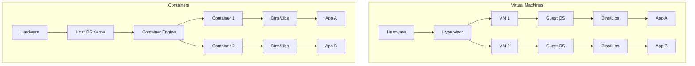

# Containers

## Introduction
Containers are a lightweight form of virtualization that allow you to run an application and its dependencies in a resource-isolated processes. Unlike traditional Virtual Machines (VMs), containers share the host machine's Operating System (OS) kernel, making them significantly faster, more portable, and less resource-intensive.

## Problem Statement
"It works on my machine!" This is the classic developer excuse when code works locally but crashes in production. This happens because the production server has a different OS version, missing system libraries, conflicting Python/Node versions, or different environment variables than the developer's laptop.

## Why this exists
To package an application along with *everything* it needs to run (code, runtime, system tools, system libraries, and settings) into a single, standardized, executable unit. This guarantees the application will run identically regardless of the environment (laptop, testing server, or cloud).

## Real-world analogy
Before standard shipping containers, cargo ships carried loose barrels, sacks, and boxes. Loading and unloading took weeks because every item required different handling. Standardized shipping containers changed the world. Now, a crane doesn't care if a container holds televisions or apples; it just moves the box. 

Software containers do the same for code. The host server (the ship) doesn't care if the container holds a Node.js app or a Java app. It just runs the standardized container.

## Definition
A container is a standard unit of software that packages up code and all its dependencies so the application runs quickly and reliably from one computing environment to another.

## Key concepts
- **Namespaces:** A Linux kernel feature that isolates resources (like Process IDs, Network interfaces, Mount points) so a process in one container cannot see or affect processes in another.
- **cgroups (Control Groups):** A Linux kernel feature that limits, accounts for, and isolates the resource usage (CPU, memory, disk I/O) of a collection of processes.
- **Image:** A read-only template with instructions for creating a container. It contains the code and dependencies.
- **Container:** A runnable instance of an image.

## Internal working / Mermaid diagram

## Step-by-step explanation
1. A developer writes an application and creates a configuration file (like a Dockerfile) listing the exact OS version, libraries, and steps needed to run it.
2. A tool builds this configuration into an immutable "Image".
3. The Image is pushed to a central registry (like Docker Hub or AWS ECR).
4. The production server pulls the Image.
5. A Container Engine (like Docker or containerd) runs the Image.
6. The Linux kernel uses namespaces and cgroups to ensure the running container is isolated from the host and other containers, giving it the illusion of being an independent machine.

## Multiple real-world examples
1. **Microservices:** Packaging each service (e.g., User Service, Order Service) in its own container so they can be scaled and deployed independently.
2. **CI/CD Pipelines:** Spinning up a container, running automated tests inside it to ensure a clean environment, and then destroying it.
3. **Local Development:** Developers can run complex databases (like PostgreSQL or Redis) locally via a container with a single command, without installing anything on their actual OS.

## Pros
- **Portability:** Write once, run anywhere. The environment travels with the code.
- **Speed:** Containers start in milliseconds (unlike VMs which take minutes to boot a whole OS).
- **Resource Efficiency:** Containers share the OS kernel, meaning you can pack thousands of containers onto a single server (vs. maybe dozens of VMs).
- **Isolation:** App A crashing won't bring down App B, and their dependencies won't conflict.

## Cons
- **Security:** Because containers share the host kernel, a kernel vulnerability can potentially allow a container to "escape" and compromise the host and all other containers. VMs offer stronger hardware-level isolation.
- **Complexity:** Moving from a monolithic application on a single server to a distributed microservices architecture using hundreds of containers requires complex orchestration (like Kubernetes).
- **Persistence:** Containers are ephemeral by default. If a container dies, data inside it is lost unless explicitly mounted to an external volume.

## Interview questions

### Beginner
- **Q: What is the main difference between a Container and a Virtual Machine (VM)?**
  - **A:** A VM virtualizes the *hardware* and requires a full Guest OS to be installed. A Container virtualizes the *OS*, sharing the host's kernel, making it much smaller, faster, and more efficient.

### Intermediate
- **Q: What fundamental Linux technologies make containers possible?**
  - **A:** Namespaces (which provide isolation for processes, networks, and mounts) and Control Groups or cgroups (which limit the CPU and Memory resources a container can use).

### Senior
- **Q: If containers share the kernel, can I run a Windows container on a Linux host?**
  - **A:** No. A Linux container relies on Linux kernel system calls. A Windows container relies on Windows kernel system calls. To run a Windows container, you need a Windows host OS. (Tools like Docker Desktop on Mac/Windows actually run a hidden Linux VM in the background to host Linux containers).

## Common mistakes
- **Treating containers like VMs:** SSH-ing into a container to manually install updates or fix bugs. Containers should be treated as immutable. If you need a change, rebuild the image and deploy a new container.
- **Storing data inside the container:** Because containers are ephemeral, databases or user uploads stored directly inside the container's filesystem will vanish when the container restarts. Always use mounted volumes.

## Best practices
- Run one application/process per container.
- Keep container images as small as possible (use minimal base images like Alpine Linux) to speed up deployments and reduce the security attack surface.
- Avoid running containers as the `root` user to minimize security risks.

## When NOT to use
- When you require strict regulatory or hardware-level security isolation (use VMs).
- When you have a massive legacy monolithic application that cannot easily be containerized or decoupled from specific hardware.

## Comparison with similar concepts
- **Containers vs Virtual Machines:** Containers share the OS kernel (fast, lightweight). VMs run entirely separate OS instances on a hypervisor (slow, heavy, secure).

## Summary
Containers have revolutionized modern software engineering by solving the "works on my machine" problem. By leveraging Linux kernel features to provide isolated, lightweight, and highly portable application environments, containers form the foundation of microservices and cloud-native architecture.

## Related topics
- [Docker](../docker)
- [Kubernetes](../kubernetes)
