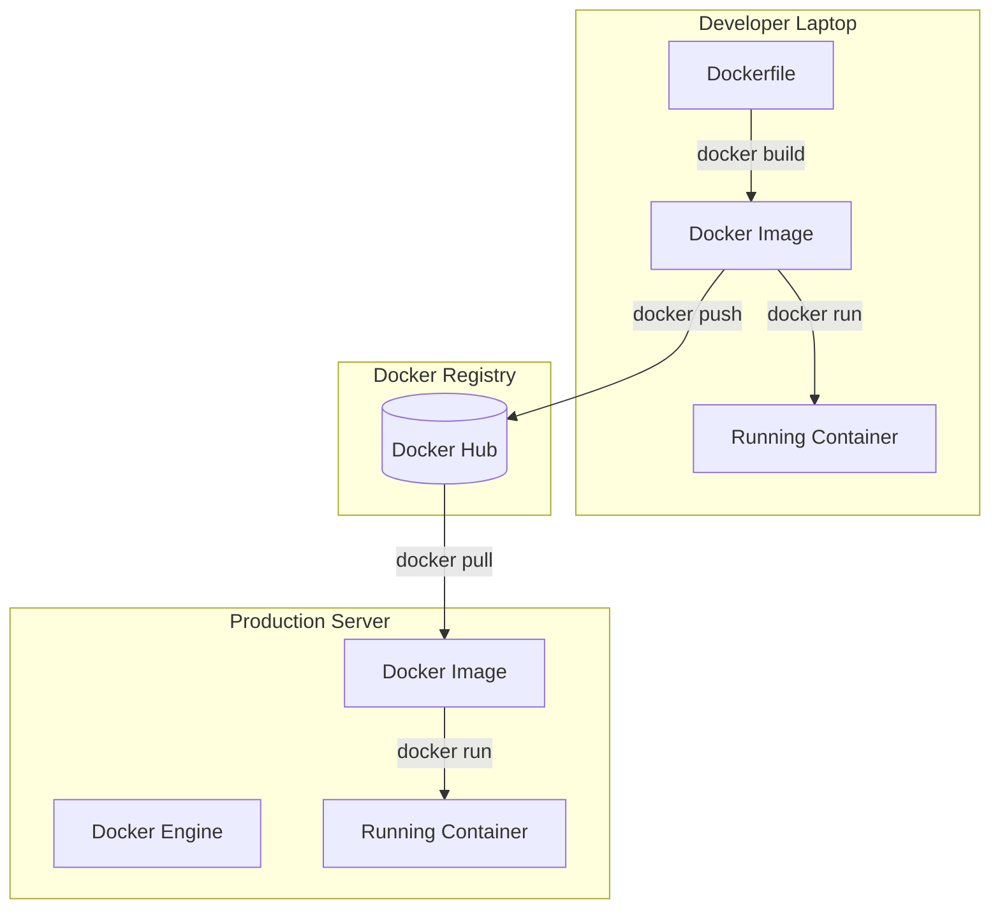

# Docker

## Introduction
Docker is an open-source platform that automates the deployment, scaling, and management of applications inside lightweight, portable environments called containers. While container technology existed before Docker (e.g., LXC), Docker democratized it by making it incredibly easy for developers to build, share, and run container images.

## Problem Statement
Building and distributing containers using raw Linux kernel features (namespaces and cgroups) was highly complex and strictly for Linux experts. Developers needed a simple, standardized way to define their environment as code, build it into a package, and share it with teammates or deployment servers.

## Why this exists
To provide a standard API and a set of easy-to-use CLI tools to build, run, and distribute containerized applications across any environment.

## Real-world analogy
If a Container is the standard steel shipping container, Docker is the entire ecosystem that makes it work: the crane that lifts it, the standard locking mechanisms that hold it, the truck that drives it, and the factory that builds the container based on a blueprint.

## Definition
Docker is a Platform-as-a-Service (PaaS) product that uses OS-level virtualization to deliver software in packages called containers.

## Key concepts
- **Dockerfile:** A text file containing a sequence of commands needed to build a Docker Image (e.g., `FROM node:14`, `COPY . .`, `RUN npm install`).
- **Docker Image:** A read-only, layered template built from the Dockerfile. It contains the code, libraries, and runtime.
- **Docker Container:** The running instance of a Docker Image.
- **Docker Engine:** The core background service (daemon) that creates and manages images and containers.
- **Docker Registry (Docker Hub):** A repository for storing and sharing Docker Images, similar to how GitHub stores code.

## Internal working / Mermaid diagram



## Python/Java implementation

### Example: Dockerizing a Python Flask App

**1. The Python App (`app.py`)**
```python
from flask import Flask
app = Flask(__name__)

@app.route('/')
def hello():
    return "Hello from Docker!"

if __name__ == '__main__':
    app.run(host='0.0.0.0', port=5000)
```

**2. The Dockerfile (`Dockerfile`)**
```dockerfile
# Step 1: Use an official Python runtime as a parent image
FROM python:3.9-slim

# Step 2: Set the working directory in the container
WORKDIR /app

# Step 3: Copy requirements and install
COPY requirements.txt .
RUN pip install -r requirements.txt

# Step 4: Copy the rest of the application code
COPY . .

# Step 5: Expose the port the app runs on
EXPOSE 5000

# Step 6: Define the command to run the app
CMD ["python", "app.py"]
```

**3. Terminal Commands**
```bash
# Build the image and tag it as 'my-flask-app'
docker build -t my-flask-app .

# Run the container, mapping port 5000 on host to 5000 in container
docker run -p 5000:5000 my-flask-app
```

## Step-by-step explanation
1. You write a `Dockerfile` specifying your base OS, dependencies, and application code.
2. You run `docker build`. The Docker Engine executes the steps, creating a cached layer for each command, resulting in a final Image.
3. You run `docker push` to upload the image to a registry.
4. On your production server, you run `docker pull` to download the image.
5. You run `docker run`. The Docker Engine creates a writable layer on top of the read-only image, sets up the networking and isolation, and starts the container process.

## Multiple real-world examples
1. **Local Database:** Running `docker run -d -p 5432:5432 postgres` gives you a fully functional PostgreSQL database locally in seconds without installing anything on your Mac/Windows system.
2. **Docker Compose:** Defining multi-container applications (e.g., a React frontend, a Node backend, and a Mongo database) in a `docker-compose.yml` file and spinning them all up together with a single command.
3. **CI/CD:** Jenkins building a Docker image on every git commit, pushing it to an AWS registry, and triggering a server to run the new image.

## Pros
- **Consistency:** Eliminates the "Works on my machine" problem.
- **Layered File System:** Docker caches each step of the Dockerfile. If you only change your source code, Docker reuses the base OS and library installation layers, making builds extremely fast.
- **Massive Ecosystem:** Docker Hub contains pre-built images for almost every open-source software in existence.

## Cons
- **Not a full orchestrator:** Docker is great for running a few containers. But if you have 500 containers across 50 servers, and you need to handle load balancing, self-healing, and rolling updates, raw Docker is not enough (you need Kubernetes).
- **Disk Space:** Unused images, stopped containers, and orphaned volumes can quickly consume gigabytes of disk space if not pruned regularly.

## Interview questions

### Beginner
- **Q: What is the difference between an Image and a Container?**
  - **A:** An Image is the recipe (the read-only blueprint containing the code and dependencies). A Container is the cake (the running, executing instance of that image).

### Intermediate
- **Q: How does Docker's layered file system work, and why does order matter in a Dockerfile?**
  - **A:** Every instruction in a Dockerfile creates a read-only layer. Docker caches these layers. If a layer hasn't changed, Docker reuses it from the cache. Therefore, you should put commands that change frequently (like copying source code) at the *bottom* of the Dockerfile, and commands that rarely change (like installing OS packages or `npm install`) at the *top*, to maximize cache utilization and speed up builds.

### Senior
- **Q: What is a Docker Volume and why is it necessary?**
  - **A:** Containers are ephemeral. When a container is deleted, its writable layer is destroyed, and all data generated during its lifetime is lost. A Docker Volume bypasses the container's file system and stores data directly on the host machine. This is necessary for databases or any application that requires persistent state.

## Common mistakes
- **Storing sensitive secrets in the Dockerfile:** Committing passwords or API keys in the Dockerfile means anyone who pulls the image can extract the secrets. Use environment variables or secret managers.
- **Running containers as Root:** By default, Docker runs processes as root inside the container. If a vulnerability allows container escape, the attacker has root access to the host. Always create a non-root user in the Dockerfile.

## Best practices
- Use multi-stage builds to compile code in one container and copy only the compiled binaries into a smaller, final production container.
- Add a `.dockerignore` file to prevent large, unnecessary files (like `node_modules` or `.git`) from being sent to the Docker daemon during build.

## When NOT to use
- If you are building a GUI-heavy desktop application, containers are generally designed for headless server/backend processes.

## Comparison with similar concepts
- **Docker vs Kubernetes:** Docker is the engine that builds and runs individual containers. Kubernetes is the orchestrator that manages thousands of Docker containers across a cluster of machines.

## Summary
Docker standardized the way the industry packages, ships, and runs software. By providing an elegant API over complex Linux kernel features, Docker made containerization accessible to every developer, paving the way for the microservices revolution.

## Related topics
- [Containers](../containers)
- [Kubernetes](../kubernetes)
