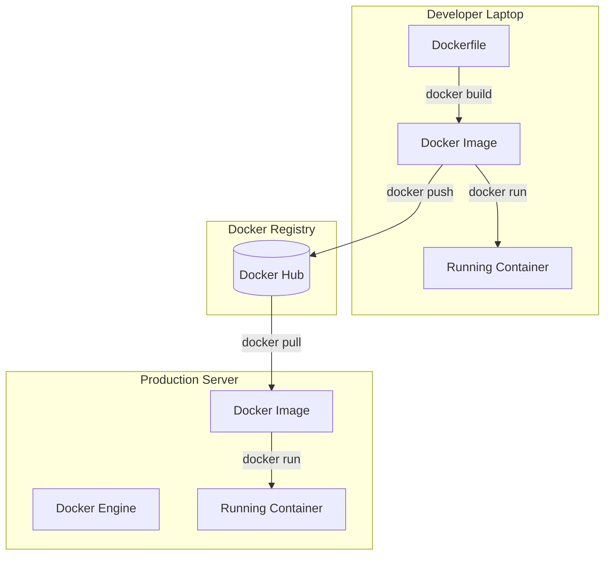

# Docker

## Introduction
Docker is an open-source platform that automates the deployment, scaling, and management of applications inside lightweight, portable environments called containers. While container technology existed before Docker (e.g., LXC), Docker democratized it by making it incredibly easy for developers to build, share, and run container images.

## Problem Statement
Building and distributing containers using raw Linux kernel features (namespaces and cgroups) was highly complex and strictly for Linux experts. Developers needed a simple, standardized way to define their environment as code, build it into a package, and share it with teammates or deployment servers.

## Why this exists
To provide a standard API and a set of easy-to-use CLI tools to build, run, and distribute containerized applications across any environment.

## Real-world analogy
If a Container is the standard steel shipping container, Docker is the entire ecosystem that makes it work: the crane that lifts it, the standard locking mechanisms that hold it, the truck that drives it, and the factory that builds the container based on a blueprint.

## Definition
Docker is a Platform-as-a-Service (PaaS) product that uses OS-level virtualization to deliver software in packages called containers.

## Key concepts
- **Dockerfile:** A text file containing a sequence of commands needed to build a Docker Image (e.g., `FROM node:14`, `COPY . .`, `RUN npm install`).
- **Docker Image:** A read-only, layered template built from the Dockerfile. It contains the code, libraries, and runtime.
- **Docker Container:** The running instance of a Docker Image.
- **Docker Engine:** The core background service (daemon) that creates and manages images and containers.
- **Docker Registry (Docker Hub):** A repository for storing and sharing Docker Images, similar to how GitHub stores code.

## Internal working / Mermaid diagram



## Python/Java implementation

Below is a Python Flask App example along with a Java simulator detailing Docker Engine's layered filesystem and cache mechanics.

### Python Example: Dockerizing a Python Flask App

**1. The Python App (`app.py`)**
```python
from flask import Flask
app = Flask(__name__)

@app.route('/')
def hello():
    return "Hello from Docker!"

if __name__ == '__main__':
    app.run(host='0.0.0.0', port=5000)
```

**2. The Dockerfile (`Dockerfile`)**
```dockerfile
# Step 1: Use an official Python runtime as a parent image
FROM python:3.9-slim

# Step 2: Set the working directory in the container
WORKDIR /app

# Step 3: Copy requirements and install
COPY requirements.txt .
RUN pip install -r requirements.txt

# Step 4: Copy the rest of the application code
COPY . .

# Step 5: Expose the port the app runs on
EXPOSE 5000

# Step 6: Define the command to run the app
CMD ["python", "app.py"]
```

**3. Terminal Commands**
```bash
# Build the image and tag it as 'my-flask-app'
docker build -t my-flask-app .

# Run the container, mapping port 5000 on host to 5000 in container
docker run -p 5000:5000 my-flask-app
```

---

### Java Simulation

#### Bad implementation
*A monolithic deployment script copying all files into a single directory. It lacks incremental layering, build caching, and isolated runtime layers.*

```java
import java.util.HashMap;
import java.util.Map;

// BAD: Monolithic environment copier. 
// No layer reuse, no build caching, any code change forces a complete build from scratch.
public class MonolithicDeployer {
    private final Map<String, String> deployDir = new HashMap<>();

    public void deploy(Map<String, String> sourceCode, Map<String, String> osLibs) {
        System.out.println("Starting clean build...");
        
        // 1. Copy OS Libraries from scratch
        deployDir.putAll(osLibs);
        
        // 2. Copy Source Code
        deployDir.putAll(sourceCode);
        
        System.out.println("Monolithic deployment complete. Files count: " + deployDir.size());
    }
}
```

#### Better implementation
*Basic command chaining that organizes file copy execution, but still lacks proper UnionFS / Copy-On-Write layer management and cache hit detection.*

```java
import java.util.ArrayList;
import java.util.HashMap;
import java.util.List;
import java.util.Map;

// BETTER: Command layer sequencing
public class SimpleLayerBuilder {
    private final List<Map<String, String>> layers = new ArrayList<>();

    public void addLayer(Map<String, String> layerFiles) {
        layers.add(new HashMap<>(layerFiles));
    }

    public Map<String, String> compileFilesystem() {
        Map<String, String> activeFs = new HashMap<>();
        // Iterate through layers and flatten them. No copy-on-write logic or deletion masking.
        for (Map<String, String> layer : layers) {
            activeFs.putAll(layer);
        }
        return activeFs;
    }
}
```

#### Best implementation
*A simulation of a Docker Engine daemon implementing a UnionFS (layered, read-only image layers) with build cache checks and a writable Container layer utilizing Copy-On-Write.*

```java
import java.security.MessageDigest;
import java.util.ArrayList;
import java.util.HashMap;
import java.util.List;
import java.util.Map;

// BEST: Docker Engine simulation with UnionFS, Build Cache, and Copy-On-Write Container Layer
public class MockDockerEngine {

    // Represents a single, immutable, content-hashed Image Layer
    public static class ImageLayer {
        public final String layerId;
        public final Map<String, String> files = new HashMap<>();

        public ImageLayer(String layerId, Map<String, String> layerFiles) {
            this.layerId = layerId;
            this.files.putAll(layerFiles);
        }
    }

    // Docker Build Cache
    private final Map<String, ImageLayer> buildCache = new HashMap<>();

    // 1. Mock "docker build" executing cache detection
    public List<ImageLayer> buildImage(List<String> dockerfileInstructions, List<Map<String, String>> payloadData) {
        List<ImageLayer> imageLayers = new ArrayList<>();
        String currentCacheKey = "";

        System.out.println("--- Starting docker build ---");
        for (int i = 0; i < dockerfileInstructions.size(); i++) {
            String step = dockerfileInstructions.get(i);
            Map<String, String> stepFiles = payloadData.get(i);
            
            // Build cache key based on instruction + previous layer key
            currentCacheKey = md5(currentCacheKey + "|" + step);

            if (buildCache.containsKey(currentCacheKey)) {
                System.out.println("Step " + (i + 1) + ": " + step + " -> Using Cache (Layer: " + buildCache.get(currentCacheKey).layerId + ")");
                imageLayers.add(buildCache.get(currentCacheKey));
            } else {
                String layerId = "sha256:" + currentCacheKey.substring(0, 12);
                System.out.println("Step " + (i + 1) + ": " + step + " -> Cache Miss. Building Layer: " + layerId);
                
                ImageLayer newLayer = new ImageLayer(layerId, stepFiles);
                buildCache.put(currentCacheKey, newLayer);
                imageLayers.add(newLayer);
            }
        }
        return imageLayers;
    }

    // 2. Mock "docker run" initiating a Container with UnionFS + Copy-on-Write Layer
    public static class MockContainer {
        private final List<ImageLayer> readOnlyLayers;
        private final Map<String, String> writableLayer = new HashMap<>();

        public MockContainer(List<ImageLayer> layers) {
            this.readOnlyLayers = layers;
        }

        // UnionFS: Read merges all layers bottom-up, finishing at the writable layer
        public String readFile(String filepath) {
            // Check writable layer first (CoW check)
            if (writableLayer.containsKey(filepath)) {
                return writableLayer.get(filepath);
            }
            
            // Search read-only image layers from top to bottom
            for (int i = readOnlyLayers.size() - 1; i >= 0; i--) {
                if (readOnlyLayers.get(i).files.containsKey(filepath)) {
                    return readOnlyLayers.get(i).files.get(filepath);
                }
            }
            return null; // Not found
        }

        // Copy-On-Write: Modifying a file copies it to the writable layer first
        public void writeFile(String filepath, String content) {
            System.out.println("[CoW] Writing to file: " + filepath + " (Copied to container writable layer)");
            writableLayer.put(filepath, content);
        }
    }

    private static String md5(String input) {
        try {
            MessageDigest md = MessageDigest.getInstance("MD5");
            byte[] array = md.digest(input.getBytes());
            StringBuilder sb = new StringBuilder();
            for (byte b : array) {
                sb.append(Integer.toHexString((b & 0xFF) | 0x100), 1, 3);
            }
            return sb.toString();
        } catch (Exception e) {
            return String.valueOf(input.hashCode());
        }
    }
}
```

## Step-by-step explanation
1. **Developer writes Dockerfile:** Commands like `FROM`, `WORKDIR`, `RUN`, and `COPY` instruct how to construct the runtime environment.
2. **Build Request to Daemon:** Running `docker build` communicates with the Docker daemon, sending the build context.
3. **Instruction Evaluation & Caching:** The daemon evaluates instructions sequentially. For each command, the daemon computes a hash. If a matching hash exists in the **Build Cache**, it skips building and pulls the layer; otherwise, it executes the command and saves a new layer.
4. **UnionFS layering:** The output is an Image consisting of a series of read-only filesystem layers. 
5. **Container Lifecycle (docker run):** 
   - A thin, **writable layer** is mounted on top of the stack.
   - If a process modifies a read-only file, it is dynamically copied up into the writable layer (**Copy-on-Write**).
   - Local isolation is achieved using namespacing and cgroups.

## Multiple real-world examples
1. **Multi-Stage Builds:** Building a Go application in a bloated image containing compilers, then copying only the final binary into a scratch, minimal image (Alpine), shrinking the final image from 800MB to 15MB.
2. **Docker Compose Orchestration:** Managing local microservices (e.g., Spring Boot backend + PostgreSQL + Redis) using a single `docker-compose.yml` to spin up dependencies in a unified local network.
3. **Self-contained CI Build Agents:** Setting up ephemeral GitLab CI runners inside Docker containers, ensuring clean compiler chains for every build.
4. **Offline Database Mocking:** Developers launching localized MySQL databases with predefined schemas pre-loaded in customized Docker Hub images.
5. **Cloud Run / AWS Fargate Deployments:** Deploying serverless APIs by uploading a Docker image to Amazon ECR, letting Fargate provision the underlying OS automatically.

## Pros
- **Consistency:** Eliminates the "Works on my machine" problem.
- **Layered File System:** Docker caches each step of the Dockerfile. If you only change your source code, Docker reuses the base OS and library installation layers, making builds extremely fast.
- **Massive Ecosystem:** Docker Hub contains pre-built images for almost every open-source software in existence.

## Cons
- **Not a full orchestrator:** Docker is great for running a few containers. But if you have 500 containers across 50 servers, and you need to handle load balancing, self-healing, and rolling updates, raw Docker is not enough (you need Kubernetes).
- **Disk Space:** Unused images, stopped containers, and orphaned volumes can quickly consume gigabytes of disk space if not pruned regularly.
- **Slight network overhead:** Running inside bridged networks adds a small latency penalty compared to running processes natively on host sockets.

## Interview questions

### Beginner
- **Q: What is the difference between a Dockerfile, an Image, and a Container?**
  - **A:** A Dockerfile is the recipe text file. An Image is the compiled blueprint (read-only package). A Container is a running instance of that image (a process executing in isolation).
- **Q: What is Docker Hub?**
  - **A:** It is a cloud-based registry service that allows developers to host, search, and distribute Docker images.

### Intermediate
- **Q: How does Docker's layered file system work, and why does order matter in a Dockerfile?**
  - **A:** Every instruction in a Dockerfile creates a read-only layer. Docker caches these layers. If a layer hasn't changed, Docker reuses it from the cache. Therefore, you should put commands that change frequently (like copying source code) at the *bottom* of the Dockerfile, and commands that rarely change (like installing OS packages or `npm install`) at the *top*, to maximize cache utilization and speed up builds.
- **Q: What is the difference between CMD and ENTRYPOINT in a Dockerfile?**
  - **A:** `ENTRYPOINT` defines the executable that is run when the container starts (it is not overridden by command-line arguments). `CMD` defines the default arguments passed to the entrypoint, which can be overridden easily by providing arguments at the end of the `docker run` command.

### Senior
- **Q: What is a Docker Volume and why is it necessary?**
  - **A:** Containers are ephemeral. When a container is deleted, its writable layer is destroyed, and all data generated during its lifetime is lost. A Docker Volume bypasses the container's file system and stores data directly on the host machine. This is necessary for databases or any application that requires persistent state.
- **Q: Explain how Docker Desktop works on macOS/Windows compared to native Linux.**
  - **A:** Docker relies on Linux kernel namespaces and cgroups, which do not exist natively in macOS or Windows. Docker Desktop runs a tiny, highly-optimized Linux VM (using Hyper-V on Windows or Virtualization.framework on macOS) in the background. The Docker CLI on the host macOS/Windows communicates with the Docker daemon running inside that Linux VM.

### Staff Engineer
- **Q: Describe the architecture of Docker Engine. How do docker-cli, dockerd, containerd, and runc interact to launch a container?**
  - **A:** 
    1. **docker-cli:** The client parses the command (e.g., `docker run`) and sends a REST request to `dockerd` over a Unix socket.
    2. **dockerd:** The Docker daemon manages images, network interfaces, and volumes, but delegates container execution. It sends a gRPC request to `containerd`.
    3. **containerd:** A CNCF project acting as a high-level container runtime. It manages container lifecycles, pulls images, and monitors resources. It supervises `containerd-shim` which launches `runc`.
    4. **runc:** The low-level runtime complying with OCI (Open Container Initiative) specs. It directly calls the Linux kernel to create namespaces, set up cgroups, configure the rootfs, launch the process, and then immediately exits.

## Common mistakes
- **Storing sensitive secrets in the Dockerfile:** Committing passwords or API keys in the Dockerfile means anyone who pulls the image can extract the secrets. Use environment variables or secret managers.
- **Running containers as Root:** By default, Docker runs processes as root inside the container. If a vulnerability allows container escape, the attacker has root access to the host. Always create a non-root user in the Dockerfile.
- **Leaving orphan resources:** Accumulating unused volumes and images, filling the disk. Regularly run `docker system prune -a --volumes`.

## Best practices
- Use multi-stage builds to compile code in one container and copy only the compiled binaries into a smaller, final production container.
- Add a `.dockerignore` file to prevent large, unnecessary files (like `node_modules` or `.git`) from being sent to the Docker daemon during build.
- Keep images minimal (e.g., use alpine/distroless base images).

## When NOT to use
- If you are building a GUI-heavy desktop application, containers are generally designed for headless server/backend processes.

## Comparison with similar concepts
- **Docker vs Kubernetes:** Docker is the engine that builds and runs individual containers. Kubernetes is the orchestrator that manages thousands of Docker containers across a cluster of machines.

## Summary
Docker standardized the way the industry packages, ships, and runs software. By providing an elegant API over complex Linux kernel features, Docker made containerization accessible to every developer, paving the way for the microservices revolution.

## Related topics
- [Containers](../containers)
- [Kubernetes](../kubernetes)
