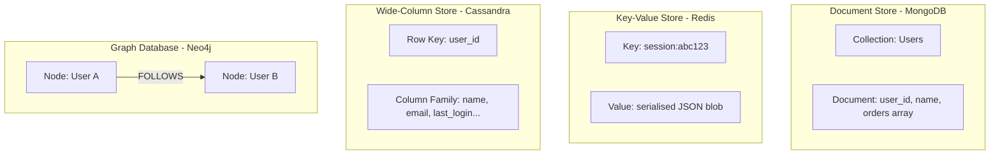
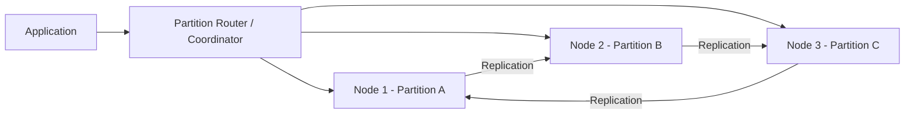

# NoSQL Databases

## Introduction
NoSQL (Not Only SQL) refers to a broad category of non-relational databases designed for flexible schemas, horizontal scalability, and specific access patterns. Unlike relational databases that enforce rigid table structures, NoSQL databases embrace diverse data models — documents, key-value pairs, wide columns, and graphs — each optimised for different use cases.

## Problem Statement
Relational databases struggle with three challenges at scale: (1) rigid schemas that slow down rapid development, (2) difficulty scaling writes horizontally, and (3) poor performance for data that does not naturally fit into tables (nested objects, graphs, time-series). NoSQL databases address these limitations by trading some ACID guarantees for flexibility and scale.

## Why this exists
The rise of web-scale applications (Google, Amazon, Facebook) in the 2000s exposed the limitations of traditional RDBMS. Google's Bigtable (2006), Amazon's Dynamo (2007), and Facebook's Cassandra (2008) were all built because existing SQL databases could not handle their data volumes and access patterns. The term "NoSQL" emerged to describe this new generation of databases.

## Real-world analogy
If a relational database is a well-organised filing cabinet with rigid folder structures, NoSQL databases are more like different storage systems for different needs:
- **Document store (MongoDB):** A flexible notebook where each page can have different content and structure.
- **Key-value store (Redis):** A simple dictionary or phone book — look up a key, get a value instantly.
- **Wide-column store (Cassandra):** A massive spreadsheet where each row can have different columns.
- **Graph database (Neo4j):** A relationship web where connections between items are as important as the items themselves.

## Definition
**NoSQL databases** store data in non-tabular formats, offering schema flexibility, horizontal scalability, and optimised performance for specific access patterns. They generally favour availability and partition tolerance (AP) over strict consistency.

### The Four Types of NoSQL Databases

| Type | Data Model | Best For | Examples |
|------|-----------|----------|----------|
| **Document** | JSON/BSON documents | Variable schemas, content management | MongoDB, CouchDB, Firestore |
| **Key-Value** | Simple key-value pairs | Caching, sessions, real-time data | Redis, DynamoDB, Memcached |
| **Wide-Column** | Column families with row keys | Time-series, IoT, high write throughput | Cassandra, HBase, ScyllaDB |
| **Graph** | Nodes, edges, properties | Social networks, recommendations, fraud | Neo4j, Amazon Neptune, JanusGraph |

## Key concepts
- **Schema flexibility:** No predefined schema; each document/record can have different fields.
- **Denormalisation:** Data is stored in the format it is read, reducing the need for JOINs.
- **Horizontal scaling:** Data is distributed across nodes using sharding/partitioning.
- **Eventual consistency:** Most NoSQL databases default to eventual consistency for better availability.
- **Data modelling by access pattern:** Unlike SQL (model by entities), NoSQL models data by how it will be queried.
- **CAP theorem trade-offs:** Most NoSQL databases choose AP (Availability + Partition tolerance) over CP.
- **Tunable consistency:** Databases like Cassandra and DynamoDB allow per-query consistency settings.

## Internal working

### NoSQL Architecture Comparison



### Data Distribution in NoSQL



## Python implementation

### Bad implementation
A rigid data model that rejects any document not matching a fixed schema.

```python
class RigidStore:
    """Forces a fixed schema — defeats the purpose of NoSQL."""

    def __init__(self):
        self.store: dict[str, dict] = {}

    def insert(self, key: str, record: dict) -> None:
        required = {"id", "name", "email"}
        if set(record.keys()) != required:
            raise ValueError(f"Schema must have exactly: {required}")
        self.store[key] = record
```

### Better implementation
A schema-less document store with secondary indexing.

```python
from collections import defaultdict
from typing import Any, Optional


class DocumentStore:
    """Schema-less document store with optional secondary indexes."""

    def __init__(self):
        self.documents: dict[str, dict] = {}
        self.indexes: dict[str, dict[Any, list[str]]] = {}

    def create_index(self, field: str) -> None:
        index: dict[Any, list[str]] = defaultdict(list)
        for doc_id, doc in self.documents.items():
            if field in doc:
                index[doc[field]].append(doc_id)
        self.indexes[field] = index

    def insert(self, doc_id: str, document: dict) -> None:
        self.documents[doc_id] = document
        for field, index in self.indexes.items():
            if field in document:
                index[document[field]].append(doc_id)

    def find_by_id(self, doc_id: str) -> Optional[dict]:
        return self.documents.get(doc_id)

    def find_by_field(self, field: str, value: Any) -> list[dict]:
        if field in self.indexes:
            doc_ids = self.indexes[field].get(value, [])
            return [self.documents[did] for did in doc_ids if did in self.documents]
        # Fallback to full scan
        return [doc for doc in self.documents.values() if doc.get(field) == value]
```

### Best implementation
A NoSQL-style database with multiple data model support, TTL, and access pattern optimisation.

```python
import time
import hashlib
from dataclasses import dataclass, field
from typing import Any, Optional
from collections import defaultdict


@dataclass
class Document:
    data: dict[str, Any]
    created_at: float = field(default_factory=time.time)
    ttl: Optional[float] = None  # Time-to-live in seconds

    @property
    def is_expired(self) -> bool:
        if self.ttl is None:
            return False
        return time.time() - self.created_at > self.ttl


class NoSQLDatabase:
    """
    Multi-model NoSQL database supporting:
    - Document storage (schema-less)
    - Key-value access (O(1) lookup)
    - Secondary indexes (field-based queries)
    - TTL expiration (auto-cleanup)
    - Partitioning (hash-based)
    """

    def __init__(self, num_partitions: int = 4):
        self.partitions: list[dict[str, Document]] = [
            {} for _ in range(num_partitions)
        ]
        self.num_partitions = num_partitions
        self.indexes: dict[str, dict[Any, set[str]]] = {}

    def _get_partition(self, key: str) -> dict[str, Document]:
        hash_val = int(hashlib.md5(key.encode()).hexdigest(), 16)
        return self.partitions[hash_val % self.num_partitions]

    def put(self, key: str, data: dict[str, Any], ttl: Optional[float] = None) -> None:
        partition = self._get_partition(key)
        doc = Document(data=data, ttl=ttl)
        partition[key] = doc
        # Update indexes
        for field_name, index in self.indexes.items():
            if field_name in data:
                index[data[field_name]].add(key)

    def get(self, key: str) -> Optional[dict[str, Any]]:
        partition = self._get_partition(key)
        doc = partition.get(key)
        if doc is None:
            return None
        if doc.is_expired:
            del partition[key]
            return None
        return doc.data

    def delete(self, key: str) -> bool:
        partition = self._get_partition(key)
        if key in partition:
            del partition[key]
            return True
        return False

    def create_index(self, field_name: str) -> None:
        index: dict[Any, set[str]] = defaultdict(set)
        for partition in self.partitions:
            for key, doc in partition.items():
                if not doc.is_expired and field_name in doc.data:
                    index[doc.data[field_name]].add(key)
        self.indexes[field_name] = index

    def query(self, field_name: str, value: Any) -> list[dict[str, Any]]:
        if field_name in self.indexes:
            keys = self.indexes[field_name].get(value, set())
            results = []
            for key in keys:
                data = self.get(key)
                if data is not None:
                    results.append(data)
            return results
        # Full scan fallback
        results = []
        for partition in self.partitions:
            for key, doc in partition.items():
                if not doc.is_expired and doc.data.get(field_name) == value:
                    results.append(doc.data)
        return results

    def stats(self) -> dict[str, Any]:
        total = sum(len(p) for p in self.partitions)
        return {
            "total_documents": total,
            "partitions": self.num_partitions,
            "indexes": list(self.indexes.keys()),
            "docs_per_partition": [len(p) for p in self.partitions],
        }
```

## Java implementation

```java
import java.util.*;
import java.util.concurrent.*;
import java.util.stream.*;

class Document {
    final Map<String, Object> data;
    final long createdAt;
    final long ttlMs; // 0 = no expiry

    Document(Map<String, Object> data, long ttlMs) {
        this.data = data;
        this.createdAt = System.currentTimeMillis();
        this.ttlMs = ttlMs;
    }

    boolean isExpired() {
        return ttlMs > 0 && System.currentTimeMillis() - createdAt > ttlMs;
    }
}

class NoSQLDatabase {
    private final List<Map<String, Document>> partitions;
    private final int numPartitions;
    private final Map<String, Map<Object, Set<String>>> indexes = new ConcurrentHashMap<>();

    NoSQLDatabase(int numPartitions) {
        this.numPartitions = numPartitions;
        this.partitions = new ArrayList<>();
        for (int i = 0; i < numPartitions; i++) {
            partitions.add(new ConcurrentHashMap<>());
        }
    }

    private Map<String, Document> getPartition(String key) {
        int hash = Math.abs(key.hashCode());
        return partitions.get(hash % numPartitions);
    }

    void put(String key, Map<String, Object> data, long ttlMs) {
        Document doc = new Document(data, ttlMs);
        getPartition(key).put(key, doc);
        // Update indexes
        for (var entry : indexes.entrySet()) {
            String field = entry.getKey();
            if (data.containsKey(field)) {
                entry.getValue()
                    .computeIfAbsent(data.get(field), k -> ConcurrentHashMap.newKeySet())
                    .add(key);
            }
        }
    }

    Optional<Map<String, Object>> get(String key) {
        Document doc = getPartition(key).get(key);
        if (doc == null) return Optional.empty();
        if (doc.isExpired()) {
            getPartition(key).remove(key);
            return Optional.empty();
        }
        return Optional.of(doc.data);
    }

    void createIndex(String fieldName) {
        Map<Object, Set<String>> index = new ConcurrentHashMap<>();
        for (var partition : partitions) {
            for (var entry : partition.entrySet()) {
                Document doc = entry.getValue();
                if (!doc.isExpired() && doc.data.containsKey(fieldName)) {
                    index.computeIfAbsent(doc.data.get(fieldName),
                        k -> ConcurrentHashMap.newKeySet()).add(entry.getKey());
                }
            }
        }
        indexes.put(fieldName, index);
    }

    List<Map<String, Object>> query(String fieldName, Object value) {
        if (indexes.containsKey(fieldName)) {
            Set<String> keys = indexes.get(fieldName).getOrDefault(value, Set.of());
            return keys.stream()
                .map(this::get)
                .filter(Optional::isPresent)
                .map(Optional::get)
                .collect(Collectors.toList());
        }
        // Full scan
        return partitions.stream()
            .flatMap(p -> p.values().stream())
            .filter(d -> !d.isExpired() && value.equals(d.data.get(fieldName)))
            .map(d -> d.data)
            .collect(Collectors.toList());
    }
}
```

## Step-by-step explanation
1. The **bad example** forces a fixed schema on documents, negating the core advantage of NoSQL — schema flexibility.
2. The **better example** allows any document structure and supports secondary indexes for field-based queries.
3. The **best example** adds hash-based partitioning (for horizontal scaling), TTL expiration (for cache-like behaviour), and statistics tracking — modelling a production-grade NoSQL database.

## Multiple real-world examples
1. **MongoDB (Document):** Stores flexible JSON-like documents. Used by eBay, Forbes, and EA Games. Supports aggregation pipelines, change streams, and multi-document ACID transactions (since v4.0).
2. **Redis (Key-Value):** In-memory data store with sub-millisecond latency. Used by Twitter (timelines), GitHub (job queues), and Snapchat (rate limiting). Supports data structures: strings, lists, sets, sorted sets, hashes, streams.
3. **Apache Cassandra (Wide-Column):** Designed for write-heavy workloads across globally distributed clusters. Used by Netflix (viewing history), Apple (10 PB+ cluster), and Instagram (fraud detection). Linear scalability with no single point of failure.
4. **Neo4j (Graph):** Stores nodes and relationships natively. Used by NASA, Airbnb (knowledge graph), and fraud detection systems. Traversal queries are orders of magnitude faster than SQL JOINs for connected data.
5. **Amazon DynamoDB (Key-Value / Document):** Fully managed, serverless, single-digit millisecond performance at any scale. Used by Amazon.com (shopping cart), Lyft, and Capital One. Supports auto-scaling, DAX caching, and DynamoDB Streams.

## Pros
- **Schema flexibility** — evolve data models without migrations.
- **Horizontal scalability** — distribute data across many nodes with automatic sharding.
- **High performance** — optimised for specific access patterns (key lookup, time-series writes).
- **Developer productivity** — JSON-native APIs reduce impedance mismatch with application code.
- **Cost-effective at scale** — runs on commodity hardware, auto-scales based on demand.

## Cons
- **Weaker consistency** — most NoSQL databases default to eventual consistency.
- **No JOINs** — relationships must be handled through denormalisation or application-level joins.
- **Limited querying** — complex queries (aggregations, ad-hoc analytics) are harder than SQL.
- **Data duplication** — denormalisation means updating data in multiple places.
- **Vendor lock-in** — each NoSQL database has its own query language and data model.

## Interview questions

### Beginner
- **Q: What is NoSQL, and how does it differ from SQL?**
  - **A:** NoSQL databases use non-tabular data models (documents, key-value, wide-column, graph). They offer schema flexibility and horizontal scalability, while SQL databases use tables with fixed schemas and provide strong ACID transactions.

- **Q: Name the four types of NoSQL databases.**
  - **A:** Document (MongoDB), Key-Value (Redis), Wide-Column (Cassandra), and Graph (Neo4j).

### Intermediate
- **Q: When would you choose a document store over a relational database?**
  - **A:** When data shapes vary frequently (e.g., product catalogs with different attributes per category), when you need fast schema evolution, or when the data naturally nests (e.g., user profiles with embedded addresses and preferences).

- **Q: How do NoSQL systems handle relationships between entities?**
  - **A:** They typically denormalise data (embed related data within the document), use reference IDs with application-level joins, or use a graph database for relationship-heavy data. The choice depends on access patterns and consistency requirements.

### Senior
- **Q: How do you model data in DynamoDB for a social media feed?**
  - **A:** Partition key = `user_id`, sort key = `timestamp`. Each item contains the post content, author info, and denormalised engagement counts. Use a GSI (Global Secondary Index) with `author_id` as partition key for "posts by user" queries. Fan-out on write: when a user posts, write the post to each follower's feed partition.

- **Q: Explain the trade-offs of denormalisation in NoSQL.**
  - **A:** Denormalisation improves read performance by co-locating related data, but increases write complexity (updates must be applied to all copies), storage costs (data duplication), and risk of data inconsistency (stale copies). It works well for read-heavy workloads where the query patterns are well-known.

### Staff Engineer
- **Q: Design a polyglot persistence strategy for an e-commerce platform.**
  - **A:** Use PostgreSQL for orders and payments (ACID required). DynamoDB for product catalog (schema flexibility, high read throughput). Redis for sessions, shopping carts, and rate limiting (sub-ms latency). Elasticsearch for product search (full-text, faceted). Neo4j for "customers who bought X also bought Y" recommendations. Kafka for event streaming between services. Define clear data ownership per service and use eventual consistency with idempotent consumers.

## Common mistakes
- Treating NoSQL as a replacement for every database problem — SQL is still better for many use cases.
- Over-normalising data in a schema-less store — defeats the purpose of NoSQL.
- Ignoring eventual consistency implications — stale reads can cause bugs.
- Not modelling data by access patterns — a NoSQL data model designed like SQL performs terribly.
- Using MongoDB for workloads that need strong multi-document transactions (before v4.0).

## Best practices
- **Model data around access patterns**, not entity relationships. Ask "how will this data be queried?" first.
- **Denormalise intentionally** — store data in the format it will be read.
- **Select the right NoSQL type** based on workload: key-value for simple lookups, document for flexible schemas, wide-column for time-series/IoT, graph for connected data.
- **Use tunable consistency** — strong consistency for critical reads, eventual for best performance.
- **Plan for capacity** — NoSQL auto-scales, but you still need to design partition keys that distribute load evenly.

## When NOT to use
- Highly relational transactional systems requiring complex JOINs and ACID across multiple entities.
- Ad-hoc analytical queries — SQL databases and data warehouses are better for this.
- Small datasets that fit on a single server — the complexity of NoSQL adds no benefit.
- Workloads where strong consistency is non-negotiable (e.g., financial ledgers).

## Comparison with similar concepts
- **SQL / RDBMS:** Structured schemas, strong transactions, powerful JOINs. Better for relational data with ACID requirements.
- **NewSQL (CockroachDB, Spanner):** Combines SQL interface with NoSQL-like horizontal scaling. Best of both worlds, but more expensive.
- **Data Lakes (S3, HDFS):** Store raw, unstructured data at massive scale. NoSQL stores structured/semi-structured data for operational workloads.
- **Search Engines (Elasticsearch):** Specialised for full-text search and analytics. Often used alongside NoSQL for search use cases.

## Summary
NoSQL databases are essential tools in the modern data architecture toolkit. They excel at schema flexibility, horizontal scalability, and workload-specific optimisation. The four types — document, key-value, wide-column, and graph — each serve different use cases. Understanding when to use NoSQL versus SQL, and how to model data by access patterns rather than entity relationships, is critical for system design interviews and production architecture.

## Related topics
- [SQL](../sql)
- [Sharding](../sharding)
- [Partitioning](../partitioning)
- [Indexing](../indexing)
- [CAP Theorem](../../fundamentals/cap-theorem)
